# Arduino

## Keyes Uno Plus 开发板

### 第1小节 简单介绍Keyes Uno Plus 开发板

我们先看一下它的特写：

在我们进行DIY电子产品实验时，我们经常会用到arduino系列单片机在Arduino IDE开发环境上编程设置。Keyes Uno Plus 开发板是一款完全兼容Arduino IDE开发环境的控制板。它包含官网的 UNO R3板的所有功能，并且在 UNO R3板的基础上，我们做了一些改进，使它的功能更加强大。具体改进如下图。为了方便接线，我们还配了1根长度为1米的type-c接口的USB线。

我们再通过下面的图来了解一下这个开发板的各个接口和主要元器件。

规格参数

微控制器：ATMEGA328P-AU

USB转串口芯片：CP2102

工作电压：DC 5V

外接电源: DC 6-15V（建议9V）

数字I/O引脚: 14 (D0-D13)

PWM通道：6 (D3 D5 D6 D9 D10 D11)

模拟输入通道（ADC）: 8(A0-A7)

每个I/O直流输出能力: 20 mA

3.3V端口输出能力: 50 mA

Flash Memory: 32 KB（其中引导程序使用0.5 KB）

SRAM:2 KB (ATMEGA328P-AU)

EEPROM: 1 KB (ATMEGA328P-AU)

时钟速度:16MHz

板载LED引脚:D13

### 第2小节 arduino IDE下载方法

我们先到arduino
官方的网站<https://www.arduino.cc/>下载最新版本的arduino开发软件,进入网站之后点击界面上的SOFTWARE,选择DOWNLOADS进入下载页面，如下图：

Arduino 软件有很多版本，有wodows,mac linux系统的（如下图），而且还有过去老的版本，你只需要下载一个适合系统的版本。

这里我们以WINDOWS系统的为例给大家介绍一下下载和安装的步骤。

WINDOWS系统的也有两个版本，一个版本是安装版的，一个是下载版的不用安装，直接下载文件到电脑，解压缩就可以用了。

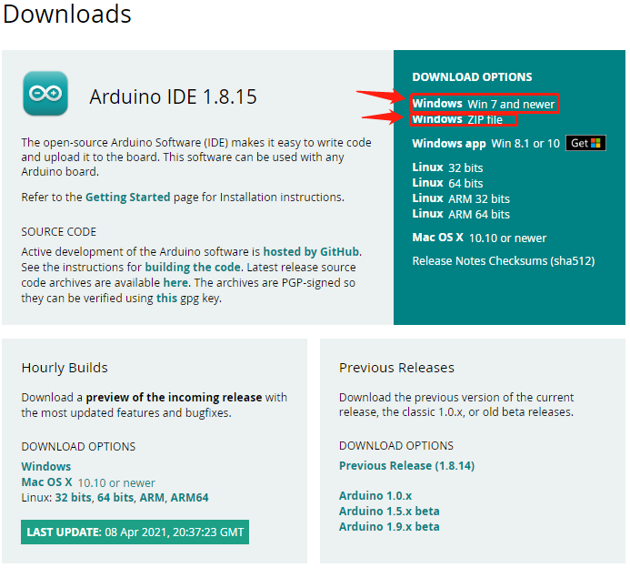

两个版本都可以正常使用，看你自己的喜好了。选择一个版本，然后将Arduino
开发软件下载到我们的电脑。

一般情况下，我们点击JUST DOWNLOAD就可以下载了，当然如果你愿意，你可以选择小小的赞助，以帮助伟大的ARDUINO
开源事业。

### 第3小节 驱动的安装方法（注意：可以先跳过，后续如果不能识别主板或者上传失败再回来安装驱动）

接下来是开发板驱动的安装，这次我们安装的是Keyes Uno Plus
开发板的驱动，这个开发板的USB转串口芯片是CP2102。在ARDUINO
开发软件1.8以上的版本里就已经包含了这个芯片的驱动程序，这样我们使用起来会非常方便。一般插上USB，电脑就会识别到硬件，WINDOWS就会自动安装CP2102的驱动。

如果驱动安装不成功，或者你想手动安装驱动，请打开电脑的设备管理器

显示CP2102的驱动没有安装成功，有一个黄色的感叹号。我们双击硬件更新驱动

浏览计算机查找驱动程序，先找到我们安装或者下载的ARDUINO开发软件，

里面有个DIRVERS文件夹，打开文件夹就能看到CP210X系列芯片的驱动，

我们选择这个文件夹，然后点击确定，驱动安装成功。

这个时候再打开设备管理器，我就可以看到CP2102的驱动程序已经安装成功了，刚刚的那个黄色的感叹号不见了。

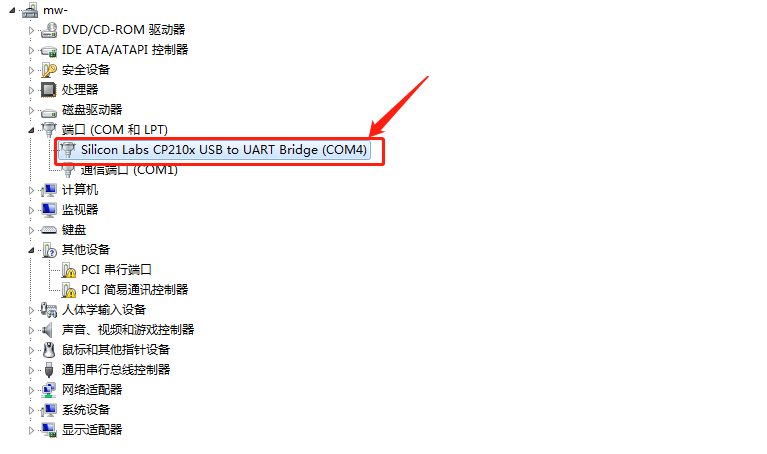

### 第4小节 Keyes brick shield 传感器扩展板

1.概述

当我们在做DIY实验时，我们经常会利用UNO R3控制板和其他传感器/模块搭配使用。为了方便接线，我们的最新一版传感器/模块使用了间距为2.54mm防反接口。为了兼容最新一版传感器/模块接口，我们特别设计了这一款扩展板。使用时，我们只需要将扩展板堆叠在UNO R3控制板上，利用一个特定接线连接传感器/模块。接线简单方便，由于是防反接口，线序固定，将不会再出现控制板连接传感器/模块时，因线序接反，导致烧坏传感器/模块现象。

为方便接线，扩展板上接口都带有丝印。3pin接口丝印一般为G V S，其中扩展板上所有的G代表GND，V代表VCC（5V）接口，S代表接口上方的数字口/模拟口。4pin/5pin接口左面都有对应接口丝印。扩展板上两边还自带间距为2.54mm的排母接口，接线顺序和UNO Plus板的排母接口的线序一致。同时扩展板上自带一个复位按键，1个电源指示灯PWR。

为了方便将扩展板固定在其他设备，扩展板自带3个直径为3mm的定位孔大小。

2.接口说明

3.使用方法

堆叠在Keyes Uno Plus 开发板上即可使用，如下图

### 第5小节 Arduino IDE设置和工具栏介绍

装好了开发板的驱动，我们下面要了解Arduino开发软件的使用了，首先我们点击电脑桌面上的图标，打开Arduino IDE。

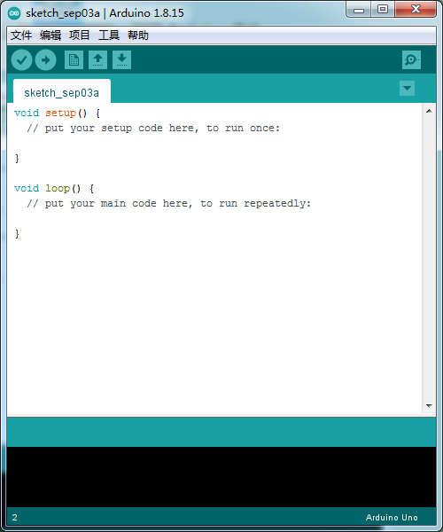

为了避免在将程序上载到板上时出现任何错误，必须选择正确的Arduino板名称，该名称与连接到计算机的电路板相匹配。转到工具→开发板，然后选择你的板。

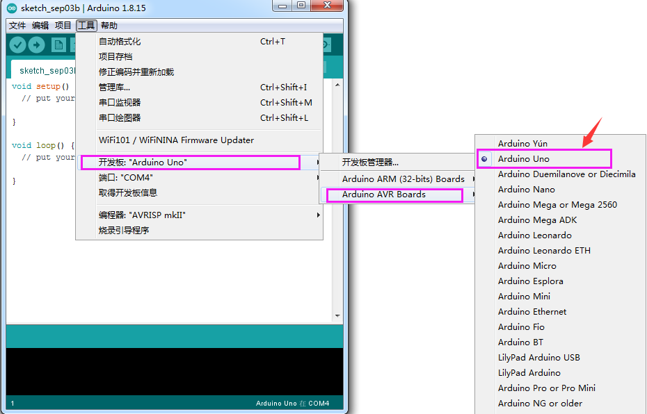

然后再选择正确的COM口（安装驱动成功后可看到对应COM口）。

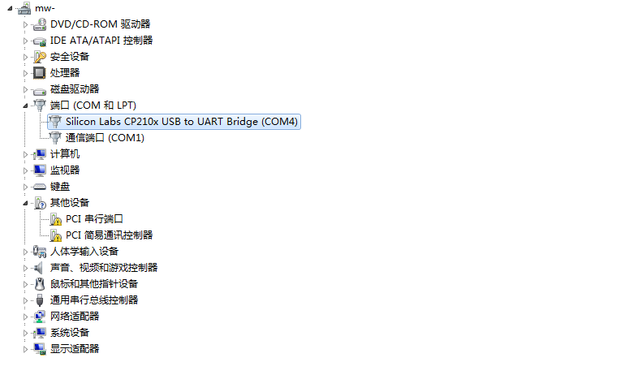

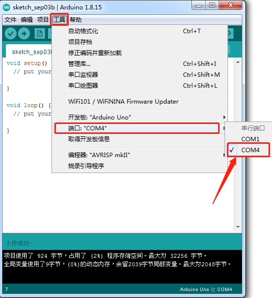

我们的程序上传到板之前，我们必须演示Arduino IDE工具栏中出现的每个符号的功能。

A - 用于检查是否存在任何编译错误。

B - 用于将程序上传到Arduino板。

C - 用于创建新草图的快捷方式。

D - 用于直接打开示例草图之一。

E - 用于保存草图。

F - 用于从板接收串行数据并将串行数据发送到板的串行监视器。

启动你的第一个程序

上面我们学习了怎么下载软件和安装开发板的驱动，那下面我们就开始正式开始第一个程序，打开文件选择例子，选择第一个文件BASIC里面的BLINK程序

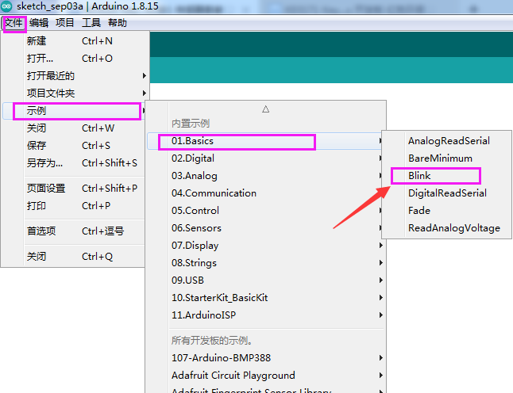

按照前面方法设置板和COM口，IDE右下角显示对应板和COM口。

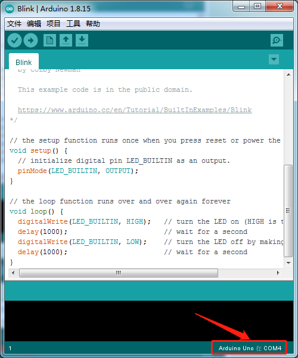

点击图标开始编译程序，检查错误，检查无误。

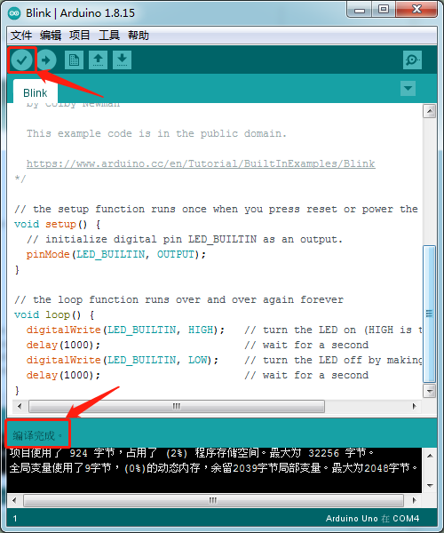

点击点击图标开始上传程序，上传成功。

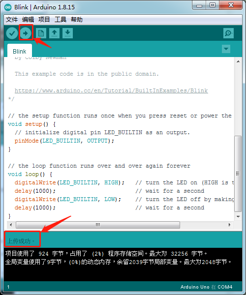

程序上传成功，板载的LED灯亮一秒钟，灭一秒钟，恭喜你的第一个程序完成了！

### 第6小节 库文件的添加

首先找到arduino库文件夹：

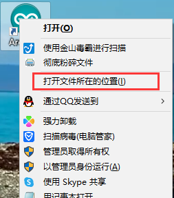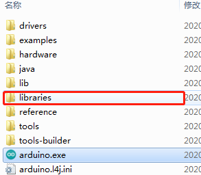

然后把所要用到的库文件复制在这个文件夹下就行了。

## 单个传感器/模块实验课程

拿到套件后，我们可以看到套件中有37款传感器/模块，有对应的Keyes Uno Plus
开发板、传感器扩展板和连接线。这里，我们将37款传感器/模块利用自带连接线，单独连接在Keyes Uno Plus
开发板和传感器扩展板。然后上传对应的测试代码，单独测试各个传感器/模块的功能。我们下面的课程是先从简单到复杂学习单个模块/传感器的原理，后面再学习一些模块/传感器的扩展应用以巩固加深我们对该套件的理解。

特别注意：实验时，模块/传感器连接线材时，必须按照资料里的接线方法及位置，电源与信息脚不能错接，否则可能会损坏模块/传感器。

### 实验一 点亮LED

实验说明

在这个套件中，我们有一个Keyes DIY电子积木
白色LED模块。它的控制方法非常简单，要想点亮LED，只要让它两端有一定的电压就可以。

实验中，我们通过编程控制信号端S的高低电平，从而控制LED的亮灭。我们提供两个测试代码，分别控制LED模块上实现点亮和闪烁的效果。

实验原理

下面附了两个电路原理图，左边我们直接把LED串联一个电阻，负极接地，正极接到单片机的IO口，理论上来说当我们把信号端S输出高电平(5V)，LED两端就会有电压，LED就会被点亮，那么我们为什么说这么接不合理呢？原因就是我们单片机IO口输出电流的能力有限(最大20mA)，虽然输出了高电平，但是可能达不到控制LED的电流，此时LED可能比较暗。

右边的接法：控制时，GND和VCC上电后，如果信号端S为高电平，那么三极管Q1就会导通，则LED有电流流过，LED即会亮起(注意：此时电流是由VCC电源端流经LED和电阻R3到GND，而不是直接从单片机IO口输出，此时输出电流的能力就比较强)，S端为低电平时三极管Q1截止，那么就没有电流流过LED，那么LED就会熄灭。也就是说，我们这里的三极管Q1相当于一个开关作用，而电阻R1,R3都是一个限流电阻，顾名思义就是限制电流的大小，以免烧坏电子元器件。

实验器材

||||||
|-|-|-|-|-|
|Keyes Uno Plus 开发板*1|传感器扩展板*1|Keyes DIY电子积木 白色LED模块*1|3P XH-2.54mm 黑红蓝硅胶线*1|USB线*1|

接线图

测试代码

代码1：

/\*

Keyes Arduino DIY电子积木 37合1 传感器套装

课程 1.1

点亮LED

http://www.keyes-robot.com

\*/

void setup() {

pinMode(3, OUTPUT);//设置模式为输出

}

void loop() {

digitalWrite(3, HIGH); //输出高电平，点亮

}

代码2：

/\*

Keyes Arduino DIY电子积木 37合1 传感器套装

课程 1.2

LED闪烁

http://www.keyes-robot.com

\*/

int ledPin = 3; //定义LED管脚接D3

void setup() {

pinMode(ledPin, OUTPUT);//设置模式为输出

}

void loop() {

digitalWrite(ledPin, HIGH); //输出高电平，点亮

delay(1000);//延迟1000毫秒

digitalWrite(ledPin, LOW); //输出低电平，熄灭

delay(1000);

}

代码说明

代码1说明：

1.  int ledPin = 3;int是变量类型范围为-32,768 ~
    32,767，这条代码语句意思是取个ledpin的变量名然后赋值为3，后面我们需要用到这个引脚时就直接使用ledpin而不用“3”，当我们接的传感器模块多了，引脚多了我们就需要这样设置一个简单易记的变量名方便我们使用。

2.  pinMode(pin,mode)；pin是用于设置模式的Arduino引脚号；mode为模式，可选：输入模式INPUT，输出模式OUTPUT或输入上拉INPUT_PULLUP，在这里我们设置了管脚3为输出模式。

3.  digitalWrite(pin,     value)；pin是单片机数字管脚，在这里我们定义了管脚3；value是你将要输出的数字电平（HIGH/LOW）；如果使用pinMode()将引脚配置为OUTPUT，则其电压将设置为相应的值：5V（在3.3V板上为3.3V）为HIGH，低电平为0V（接地）。如果没有把pinMode()设置为OUTPUT，而是将LED连接到引脚，则在调用digitalWrite（HIGH）时，LED可能会变暗。因为此时digitalWrite()将启用内部上拉电阻，其作用类似于一个大限流电阻。

代码2说明：

1.  setup()中代码是只执行一次，而loop()函数里面的代码是一直循环执行。delay(ms)；延时函数，ms为暂停的毫秒数，数据类型：unsigned     long（范围 0~ 4,294,967,295 (2^32 - 1)）。

2.  通过整合前面知识。我们再来看代码就清楚明了了，代码中第一条我们把模块信号端接到ledpin也就是数字口D3，设置为高电平，就是点亮模块上LED；第二条延迟1000毫秒，就是让模块上LED点亮1秒。同样第三条第四条代码表示让模块上LED熄灭1秒。代码默认循环，也就是控制模块上LED，循环亮1秒，灭1秒，实现闪烁效果。通过代码设置，我们可以更改模块上LED亮灭的延迟时间，从而使模块上LED实现不同的闪烁效果。

3.  更多arduino语法解释与详情请了解官网https://www.arduino.cc/reference/en/

测试结果

代码一：上传测试代码一成功后，上电，模块上白色LED点亮

代码二：上传测试代码二成功后，上电，白色LED亮1秒灭一秒，循环交替闪烁。

### 实验二 交通灯模块

实验说明

我想大家都看见过交通灯，就是马路上十字路口的红绿灯。如果您开过车，我想您一定仔细观察过交通灯，如果您还没有驾驶过车，您是否仔细观察过交通灯呢？在我们这个套件中，就包含一个交通灯模块。我们经常会用红绿黄3个LED外接电路来模拟路边的红绿黄灯闪烁。因此我们特别设计了这款模块，模块上自带了红黄绿3个LED灯，我们这个实验就做一个模拟交通灯。

实验原理

前面第一课我们就学习了如何控制一个LED，由原理图容易得知，控制这个模块就好比分别控制3个独立的LED灯(我们这个灯可直接由单片机IO口驱动)，给对应颜色灯高电平就亮起对应的颜色。比如，我们给信号“R”输出高电平，也就是5V，则红色LED点亮。

实验器材

||||||
|-|-|-|-|-|
|Keyes Uno Plus 开发板*1|传感器扩展板*1|Keyes DIY电子积木 交通灯模块*1|5P XH-2.54mm 黑红蓝黄绿硅胶线*1|USB线*1|

接线图

测试代码

/\*

Keyes Arduino DIY电子积木 37合1 传感器套装

课程 2

交通灯模块

http://www.keyes-robot.com

\*/

int greenPin = 4; //绿色LED接数字口D4

int yellowPin = 3; //黄色LED接数字口D3

int redPin = 2; //红色LED接数字口D2

void setup() {

//LED接口都设置为输出模式

pinMode(greenPin, OUTPUT);

pinMode(yellowPin, OUTPUT);

pinMode(redPin, OUTPUT);

}

void loop() {

digitalWrite(greenPin, HIGH); //点亮绿色LED

delay(5000); //延时5秒

digitalWrite(greenPin, LOW); //关闭绿色LED

for (int i = 1; i \<= 3; i = i + 1) { //运行三次

digitalWrite(yellowPin, HIGH); //点亮黄色LED

delay(500); //延时0.5秒

digitalWrite(yellowPin, LOW); //关闭黄色LED

delay(500); //延时0.5秒

}

digitalWrite(redPin, HIGH); //点亮红色LED

delay(5000); //延时5s

digitalWrite(redPin, LOW); //关闭红色LED

}

代码说明

1.  定义管脚接口，设置引脚模式，延时函数，输出高低电平参考实验一说明，这里就不多说了。

2.  这里我们还用到了for()循环：最简单形式为for( ; ;
    )，我们在此实验中用到for (int i = 1; i \<= 3; i = i +
    1)；表示变量i从1到3，每次自加1，知道不满足 i \<=
    3这个判断表达式，否则一直执行大括号里的代码，即一共执行3次大括号里的代码；同理：如果是for     (int i = 255; i \>= 0; i = i - 1)；i每次自减1，当不满足i\>=
    0时，跳出该for()循环，一共执行256次。

测试结果

上传测试代码成功，上电后，模块上绿色LED亮5秒然后熄灭，黄色LED闪烁3秒然后熄灭，再然后红色LED亮5秒，然后熄灭，模块上3个LED自动模拟交通灯循环运行。

### 实验三 激光头传感器模块发出激光

实验说明

我们都应该经常又听说激光，激光与常见的光不同。

一方面是由于它的来源。当原子被激发，从而电子从低能级跃迁到高能级，再从高能级回落到低能级的时候，能量以特定频率的电磁波向外辐射。由于电子的能级是特定的，因而辐射出的电磁波频率是一致的。由此，一束激光只有一种特定频率的电磁波（光）。这使得激光比起普通光源，激光的单色性好。另一方面，激光发射器内部特定的结构，使得激光能够被聚集成单束光，朝着同一方向射出，亮度高，方向性好。

正是由于这些特性，激光被广泛用于对特定材料进行切割、焊接、表面处理等等。激光的能量非常高，玩具激光笔照射人眼可能导致眩光，长时间可能导致视网膜损害，我国也禁止用激光照射航行的飞机。因此，请注意不要用激光发射器对准人眼。

实验原理

激光头传感器模块主要由激光头组成，激光头由发光管芯、聚光透镜、铜可调套筒三部分组成。我们可以看到此模块电路原理图，可知该模块的控制方法与我们前面学习过的LED非常相似，都是用三极管驱动，在信号端直接输入一个高电平数字信号，传感器开始工作，输入低电平时停止工作。

实验器材

||||||
|-|-|-|-|-|
|Keyes Uno Plus 开发板*1|传感器扩展板*1|Keyes DIY电子积木 激光模块*1|3P XH-2.54mm 黑红蓝硅胶线*1|USB线*1|

接线图

测试代码

/\*

Keyes Arduino DIY电子积木 37合1 传感器套装

课程 3

激光模块

http://www.keyes-robot.com

\*/

int laserPin = 2; //定义激光引脚为D2

void setup() {

pinMode(laserPin, OUTPUT);//定义激光引脚为输出模式

}

void loop() {

digitalWrite(laserPin, HIGH); //打开激光

delay(2000); //延时2秒

digitalWrite(laserPin, LOW); //关闭激光

delay(2000); //延时2秒

}

代码说明

代码设置即说明请参考前面实验一。

测试结果

上传测试代码成功，上电后，模块上激光管发射红色激光信号2秒，停止发射红色激光信号2秒，循环交替。

### 实验四 按键传感器检测实验

实验说明

在这个套件中，有一个Keyes DIY电子积木
单路按键模块，它主要采用1个轻触开关，自带1个黄色按键帽。前面我们学习了怎么让我们单片机的引脚输出一个高电平或者低电平，这节实验我们就来学习怎么读取引脚是高电平（5V）还是低电平（0V）。

实验中，我们通过读取传感器上S端高低电平，判断传感器上按键是否按下；并且，我们在串口监视器上显示测试结果。

实验原理

附原理图，按键有四个引脚，其中1和3是相连的，2和4是相连的，在我们未按下按键时，13与24是断开的，信号端S读取的是被4.7K的上拉电阻R1所拉高的高电平，而当我们按下按键时，13和24连通。信号端S连接到了GND，此时读取到的电平为低电平，即按下按键，传感器信号端为低电平；松开按键时，信号端为高电平。

实验器材

||||||
|-|-|-|-|-|
|Keyes Uno Plus 开发板*1|传感器扩展板*1|Keyes DIY电子积木 单路按键模块*1|3P XH-2.54mm 黑红蓝硅胶线*1|USB线*1|

接线图

测试代码

/\*

Keyes Arduino DIY电子积木 37合1 传感器套装

课程 4

按键模块

http://www.keyes-robot.com

\*/

int val = 0; //用来存放按键值

int button = 2; //按键的管脚接数字口D2

void setup() {

Serial.begin(9600); //启动串口监视器并设置波特率为9600

pinMode(button, INPUT); //设置按键管脚为输入模式

}

void loop() {

val = digitalRead(button); //读取按键的值并赋给变量val

Serial.print(val); //串口上打印出来

if (val == 0) { //按下按键则读取到低电平，打印按下相关信息

Serial.print(" ");

Serial.println("Press the botton");

delay(100);

}

else { //打印松开按键相关信息

Serial.print(" ");

Serial.println("Loosen the botton");

delay(100);

}

}

代码说明

1.  pinMode(button, INPUT);
    由前面学过的知识我们知道，在这里我们定义按键管脚为数字口2，设置为输入模式。通过pinMode()配置为INPUT的Arduino（ATmega）引脚处于高阻抗状态。配置为INPUT的引脚对要采样的电路的要求极小，相当于该引脚前面的100MΩ串联电阻。这使它们对于读取传感器很有用。将引脚配置为INPUT，并且正在读取开关，则当开关处于断开状态时，输入引脚将处于“悬空状态”，从而导致不可预测的结果。为了确保开关断开时的读数正确，必须使用上拉或下拉电阻（我们的模块已经使用上拉电阻R1）。该电阻的目的是在开关断开时将引脚拉至已知状态。通常选择一个4.7K/10     K欧姆的电阻，因为它的阻值足够低，可以可靠地防止输入悬空，同时，该阻值也要足够高，以使开关闭合时不会消耗太多电流。如果使用下拉电阻，则当开关断开时，输入引脚将为低电平；当开关闭合时，输入引脚将为高电平。如果使用上拉电阻，则当开关断开时，输入引脚将为高电平；当开关闭合时，输入引脚将为低电平。

2\. Serial.begin(9600)；初始化串口通信，并设置波特率为9600.

3\. digitalRead(button)；读取按键的数字电平，高HIGH或者低LOW。如果该引脚未连接任何东西，则digitalRead()可以返回HIGH或LOW（并且可以随机更改）。UNO R3模拟输入引脚可以用作数字引脚：A0、A1、A2、A3、A4、A5，我们的plus开发板多出两个模拟引脚A6及A7。

4\. if..else..语句：当if后面（）的逻辑判断为真时，执行大括号里的代码；否则执行else后面{}里的代码。

5\.
代码逻辑是传感器感应到按键按下时，信号端为低电平，D2口为低电平，即val为

0。这时我们在串口监视器显示对应的数字值和字符；否则（传感器感应到按键松开时），val为1，窗口监视器显示1和另外的字符。

测试结果

上传测试代码成功，利用USB线上电后，打开串口监视器，设置波特率为9600。串口监视器显示对应数据和字符。实验中，当传感器按下按键时，val为0，串口监视器显示“Press the button”字符；松开按键时，val为1，串口监视器显示“Loosen the button”字符，如下图。

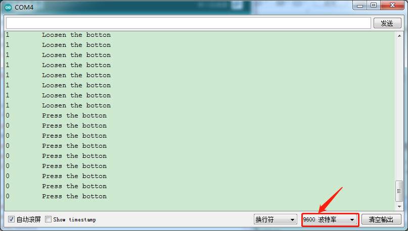

### 实验五 电容触摸传感器检测实验

实验说明

在这个套件中，有一个Keyes DIY电子积木
电容触摸模块，它主要采用1个TTP223-BA6芯片。它是触摸检测芯片，提供一个触摸按键，功能是用可变面积的按键取代传统按键。当我们上电之后，传感器需要约0.5秒的稳定时间，此时间段内不要对键进行触摸，此时所有功能都被禁止，始终进行自校准，校准周期约为4秒。

我们在串口监视器上显示测试结果。

实验原理

当我们用手指触摸模块时，信号端S输出高电平，板载红色LED点亮，我们通过读取传感器上S端高低电平，判断传感器上按键是否按下（上一实验学习的单路按键模块刚好相反，按下为低电平）。

实验器材

||||||
|-|-|-|-|-|
|Keyes Uno Plus 开发板*1|传感器扩展板*1|Keyes DIY电子积木 电容触摸模块*1|3P XH-2.54mm 黑红蓝硅胶线*1|USB线*1|

接线图

测试代码

/\*

Keyes Arduino DIY电子积木 37合1 传感器套装

课程 5

电容触摸传感器

http://www.keyes-robot.com

\*/

int val = 0;

int button = 3; //按键的PIN

void setup() {

Serial.begin(9600);//波特率为9600

pinMode(button, INPUT);//设置输入模式

}

void loop() {

val = digitalRead(button);//读取按键的值

Serial.print(val);//打印出来按键值

if (val == 1) {//按下为高电平

Serial.print(" ");

Serial.println("Press the button");

delay(100);

}

else {//松开为低电平

Serial.print(" ");

Serial.println("Loosen the button");

delay(100);

}

}

代码说明

与实验四不同的是：当我们触摸传感器时，单片机会读取到高电平，即val ==
1打印“Press the button”，否则打印“Loosen the button”。细节请参考实验四的代码说明。

测试结果

上传测试代码成功，利用USB线上电后，打开串口监视器，设置波特率为9600。串口监视器显示对应数据和字符。实验中，当传感器按下按键时，板载红色LED点亮，val为1，串口监视器显示“Press the button”字符；松开按键时，板载红色LED熄灭，val为0，串口监视器显示“Loosen the button”字符，如下图。

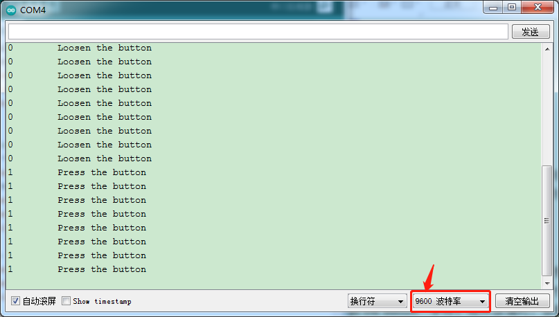

### 实验六 避障传感器检测障碍物

实验说明

在这个套件中，有一个Keyes DIY电子积木
避障传感器，它主要采用一对红外线发射与接收管元件。实验中，我们通过读取传感器上S端高低电平，判断是否存在障碍物；并且，我们在串口监视器上显示测试结果。

实验原理

原理就是NE555时基电路提供发射管TX发射出一定频率的红外信号，红外信号会随着传送距离的加大逐渐衰减，如果遇到障碍物，就会形成红外反射。当检测方向RX遇到反射回来的信号比较弱时，接收检测引脚输出高电平，说明障碍物比较远；当反射回来的信号比较强，接收检测引脚输出低电平，说明障碍物比较近了，接收检测引脚输出低电平，此时指示灯亮起。传感器上有两个电位器，一个用于调节发送功率，一个用于调节接收频率，通过调节2个电位器，我们可以调节它的有效距离。

实验器材

||||||
|-|-|-|-|-|
|Keyes Uno Plus 开发板*1|传感器扩展板*1|Keyes DIY电子积木 避障传感器*1|3P XH-2.54mm 黑红蓝硅胶线*1|USB线*1|

接线图

测试代码

/\*

Keyes Arduino DIY电子积木 37合1 传感器套装

课程 6

红外避障传感器

http://www.keyes-robot.com

\*/

int val = 0;

void setup() {

Serial.begin(9600);//设置波特率为9600

pinMode(3, INPUT);//设置引脚3为输入模式

}

void loop() {

val = digitalRead(3);//读取数字电平

Serial.print(val);//打印读取的电平信号

if (val == 0) {//检测到障碍物

Serial.print(" ");

Serial.println("There are obstacles");

delay(100);

}

else {//没检测到障碍物

Serial.print(" ");

Serial.println("All going well");

delay(100);

}

}

代码说明

我们这里使用一款传感器，所以没有定义管脚名称变量了，直接使用引脚“3”，其它设置方法和实验四类似，这里就不多做介绍了。

特别注意

烧录好测试代码，按照接线图连接好线，上电后，我们开始调节两个电位器调节感应距

离。

1.调节发射功率调节电位器，先将电位器顺时针到尽头，然后回调一些，使传感器上

P LED介于不亮与亮之间的零界点。

2.调节接收频率调节电位器，顺时针调节时，频率增大。调节使它产生38KHz频率的方波，调节时，也观察传感器上S LED，使它介于不亮与亮之间的零界点。

测试结果

上传测试代码成功，利用USB线上电后，打开串口监视器，设置波特率为9600。串口监视器显示对应数据和字符。实验中，当传感器检测到障碍物时，val为0，串口监视器显示“There are obstacles”字符；没有检测到障碍物时，val为1，串口监视器显示“All going well”字符，如下图。

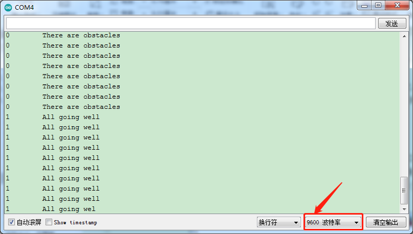

### 实验七 巡线传感器检测黑白线

实验说明

在这个套件中，有一个Keyes DIY电子积木
单路循线传感器，它主要采用1个TCRT5000 反射型 黑白线识别传感器元件。

实验中，我们通过读取模块上S端高低电平，判断传感器检测到的物体颜色（黑白）；并且，我们在串口监视器上显示测试结果。

实验原理

上个实验我们学习了避障传感器的原理，其实巡线传传感器的原理也是相同的。是利用红外线对颜色的反射率不一样，将反射信号的强弱转化成电流信号。上电时，发射二极管发射红外光，RP1
是一个电位器，我们通过调整电位器给 电压比较器LM393 的 2
脚提供一个阈值电压，这个电压值的大小可以根据实际情况来调试确定。而红外光敏二极管收到红外光的时候，会产生电流，并且随着红外光的从弱变强，电流会从小变大。当没有红外光或者说红外光很弱的时候，3
脚的电压就会接近 VCC，即信号R3电压接近VCC，如果 3 脚比 2
脚的电压高的话，通过 LM393
比较器后，接收检测引脚输出一个高电平。当随着光强变大，电流变大，3
脚的电压值等于 VCC-I\*R3，电压就会越来越小，当小到一定程度，比 2
脚的电压还小的时候，接收检测引脚就会变为低电平。当红外信号发送到黑色轨道时，黑色因为吸光能力比较强，红外信号发送出去后就会被吸收掉，反射部分很微弱。白色轨道就会把大部分红外信号反射回来。

也就是说检测到黑色或没检测到物体时，信号端为高电平；检测到白色物体时，信号端为低电平；它的检测高度为
0—3cm。我们可以通过旋转传感器上电位器，调节灵敏度，即调节检测高度。当旋转电位器，是传感器上红色
LED介于不亮与亮之间的临界点时，灵敏度最好。

实验器材

||||||
|-|-|-|-|-|
|Keyes Uno Plus 开发板*1|传感器扩展板*1|Keyes DIY电子积木 单路循线传感器*1|3P XH-2.54mm 黑红蓝硅胶线*1|USB线*1|

接线图

测试代码

/\*

Keyes Arduino DIY电子积木 37合1 传感器套装

课程 7

黑白巡线传感器

http://www.keyes-robot.com

\*/

int val = 0;

void setup() {

Serial.begin(9600);//设置波特率为9600

pinMode(3, INPUT);//设置传感器引脚为输入模式

}

void loop() {

val = digitalRead(3);//读取巡线传感器输出的数字电平

Serial.print(val);//串口打印值

if (val == 0) {//检测到白色val为0

Serial.print(" ");

Serial.println("White");

delay(100);

}

else {//检测到黑色val为1

Serial.print(" ");

Serial.println("Black");

delay(100);

}

}

代码说明

设置方法和实验六类似，这里就不多做介绍了，具体详细请看代码注释。

测试结果

上传测试代码成功，利用USB线上电后，打开串口监视器，设置波特率为9600。串口监视器显示对应数据和字符。实验中，当传感器没有检测到物体或者检测到黑色物体时，val为1，串口监视器显示“Black”字符；检测到白色物体（能够反光）时，val为0，串口监视器显示“White”字符，如下图。

### 实验八 光折断计数

实验说明

这个套件中包含一个Keyes DIY电子积木
光折断模块，它主要采用1个ITR-9608光电开关。它属于对射遮断式光电开关光学开关传感器。

在这里，我们不仅与前面的课程一样只打印信号端的电平信号，而是通过代码设置，模拟出流水线上利用类似传感器，对产品进行计数。

实验原理

如原理图：当用纸片挡住传感器凹槽后，C与VCC导通，传感器信号端S为高电平，自带红色
LED熄灭；否则传感器信号端为被R2拉低为低电平，自带红色LED亮起。

实验器材

||||||
|-|-|-|-|-|
|Keyes Uno Plus 开发板*1|传感器扩展板*1|Keyes DIY电子积木 光折断模块*1|3P XH-2.54mm 黑红蓝硅胶线*1|USB线*1|

接线图

测试代码

/\*

Keyes Arduino DIY电子积木 37合1 传感器套装

课程 8

光折断模块

http://www.keyes-robot.com

\*/

int PushCounter = 0; //计数变量赋初值0

int State = 0; //存放传感器输出当前的状态

int lastState = 0; //存放传感器上一次输出的状态

void setup() {

Serial.begin(9600);//设置波特率为9600

pinMode(3, INPUT);//设置光折断传感器管脚为输入模式

}

void loop() {

State = digitalRead(3);//读取当前状态

if (State != lastState) {//如果与上一次读取的状态不相同

if (State == 1) {//挡住光线

PushCounter = PushCounter + 1;//计数加1

Serial.println(PushCounter);//打印计数

}

}

lastState = State;//更新状态

}

代码说明

测试结果

上传测试代码成功，按照接线图接好线，利用USB上电后，打开串口监视器，设置波特率为9600；串口监视器显示PushCounter数据，每次物体穿过传感器凹槽，PushCounter数据不断加1，如下图。

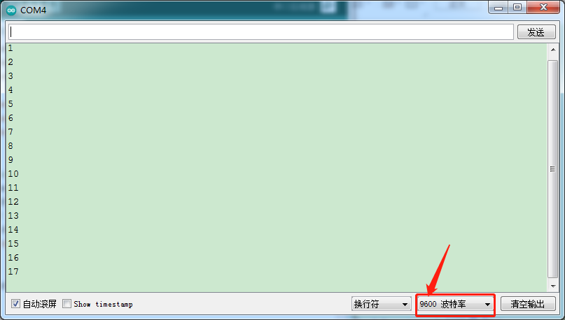

### 实验九 倾斜模块的原理

实验说明

在这个套件中，有一个Keyes DIY电子积木
倾斜传感器，倾斜开关可以依据模块是否倾斜而输出不同电平信号。其内部带有一颗滚珠，因此可以监测倾斜情况。当开关高于水平位置倾斜时开关导通，低于水平位置时开关断开。倾斜模块可用于倾斜检测、报警器制作或者其他检测。

实验中我们用串口监视器打印出信号端检测到的数字电平信号。

实验原理

它的原理非常简单，附原理图，主要是利用滚珠在开关内随不同倾斜角度的发化使滚珠开关P1的引脚1和2导通或者不导通，当1和2导通时，因为1教接GND，所以信号端S为低电平，此时红色LED形成回路，将会点亮；当1和2不导通时，引脚2被4.7K的上拉电阻R1拉高而使信号端S为高电平，模块上的LED将熄灭。

实验器材

||||||
|-|-|-|-|-|
|Keyes Uno Plus 开发板*1|传感器扩展板*1|Keyes DIY电子积木 倾斜传感器*1|3P XH-2.54mm 黑红蓝硅胶线*1|USB线*1|

接线图

测试代码

/\*

Keyes Arduino DIY电子积木 37合1 传感器套装

课程 9

倾斜传感器

http://www.keyes-robot.com

\*/

int val; //存放倾斜传感器输出的电平值

void setup() {

Serial.begin(9600);

pinMode(3, INPUT); //倾斜传感器管脚接数字口3，设置D3为输入模式

}

void loop() {

val = digitalRead(3); //读取模块的电平信号

Serial.println(val); //换行打印出来

delay(100); //延时100毫秒

}

代码说明

代码设置与实验四相同，详情请看代码注释与实验四代码说明。

测试结果

上传测试代码成功，利用USB线上电后，打开串口监视器，设置波特率为9600。将倾斜模块倾斜一边，
模块上的红色LED不亮，串口监视器打印数字电平信号“1”；将倾斜模块倾斜另一边，
模块上的红色LED点亮，串口监视器打印数字电平信号“0”。

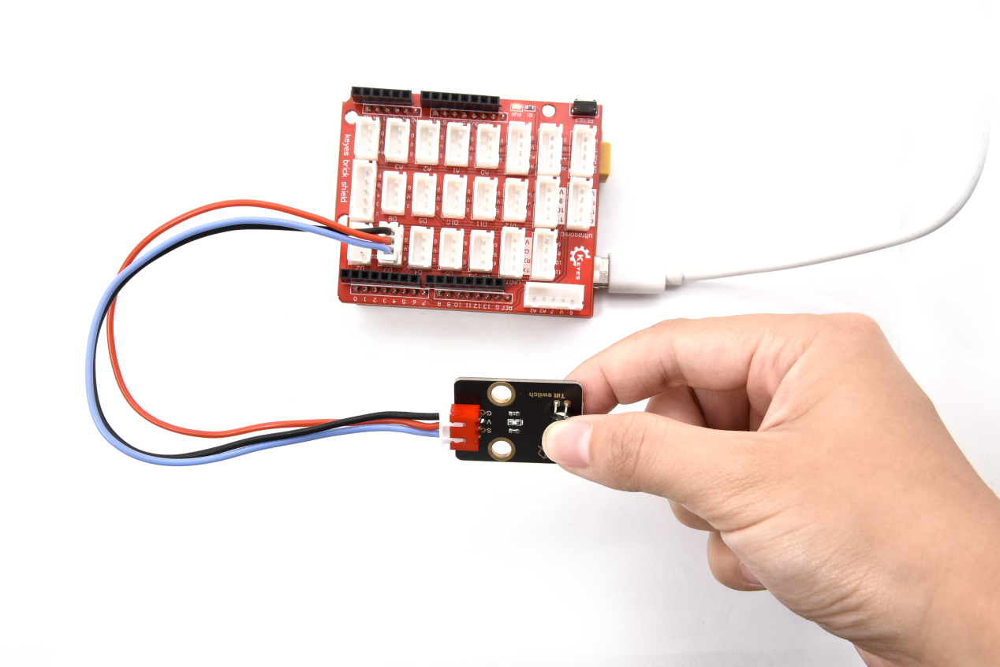

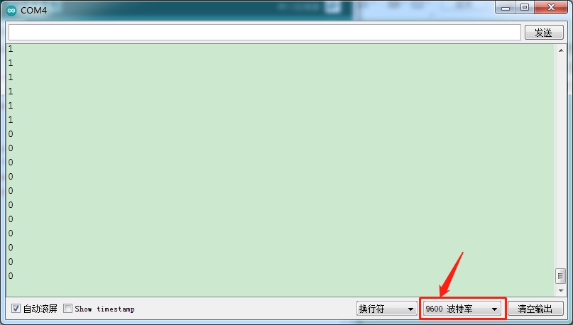

### 实验十 霍尔传感器检测南极磁场

实验说明

在这个套件中，有一个Keyes新款 DIY电子积木
霍尔传感器，它主要采用A3144线性霍尔元件。该元件P1是由电压调整器、霍尔电压发生器、差分放大器、史密特触发器，温度补偿电路和集电极开路的输出级组成的磁敏传感电路，其输入为磁感应强度，输出是一个数字电压讯号。它是单极开关型的霍尔传感器，只感应南极磁场。

实验中，我们利用霍尔传感器检测南极磁场，将测试结果在串口监视器上显示。

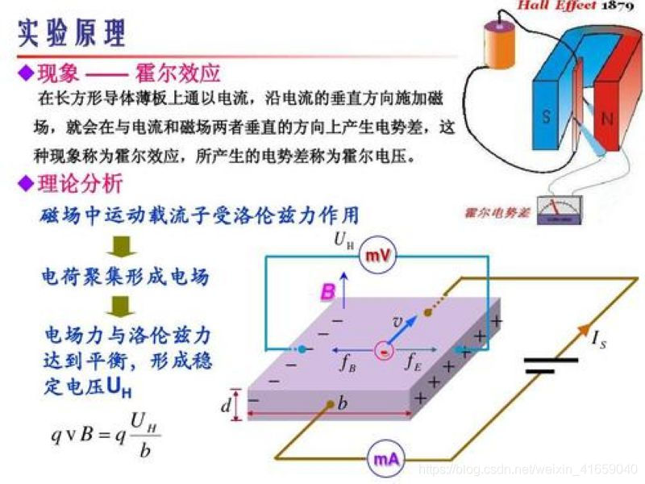

实验原理

传感器感应到无磁场或北极磁场时，信号端为高电平；感应到南极磁场时，信号端为低电平。当感应磁场强度越强时，感应距离越长。

实验器材

||||||
|-|-|-|-|-|
|Keyes Uno Plus 开发板*1|传感器扩展板*1|Keyes新款 DIY电子积木 霍尔传感器*1|3P XH-2.54mm 黑红蓝硅胶线*1|USB线*1|

接线图

测试代码

/\*

Keyes Arduino DIY电子积木 37合1 传感器套装

课程 10

霍尔传感器

http://www.keyes-robot.com

\*/

int val = 0;

int hallPin = 5; //霍尔传感器管脚接数字口5

void setup() {

Serial.begin(9600);//设置波特率为9600

pinMode(hallPin, INPUT);//设置管脚模式为输入模式

}

void loop() {

val = digitalRead(hallPin);//读取霍尔传感器的电平值

Serial.print(val);//打印val

if (val == 0) {//存在南极磁场

Serial.println(" The magnetic field at the South Pole!");

}

else {//否则

Serial.println(" Just be all normal!");

}

}

代码说明

设置方法和实验四类似，这里就不多做介绍了。

测试结果

上传测试代码成功，利用USB线上电后，打开串口监视器，设置波特率为9600。当传感器感应到无磁场或北极磁场时，串口监视器显示“1 Just be all normal!”，并且传感器上的LED处于熄灭状态，当传感器感应到南极磁场时，传感器监视器显示“0 The magnetic field at the South Pole!”，并且模块上的LED被点亮。

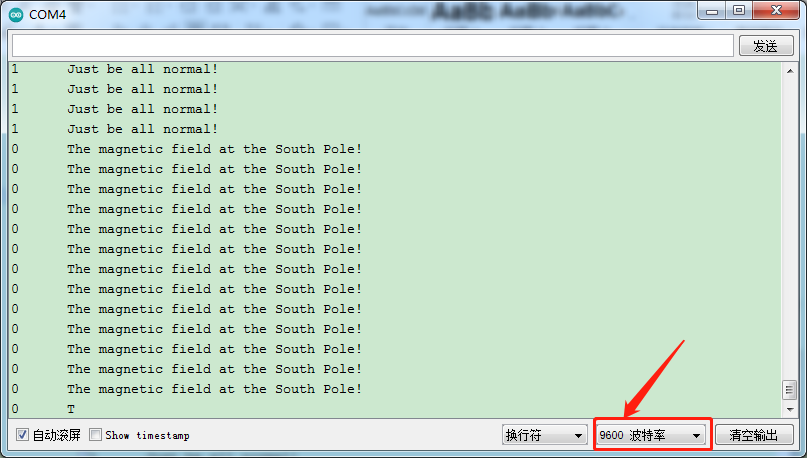

### 实验十一 干簧管检测附近磁场

实验说明

在这个套件中，有一个Keyes DIY电子积木 干簧管模块，它主要采用MKA10110
绿色磁簧元件元件。簧管是干式舌簧管的简称，是一种有触点的无源电子开关元件，具有结构简单，体积小便于控制等优点。它的外壳是一根密封的玻璃管，管中装有两个铁质的弹性簧片电板，还灌有一种惰性气体。与前面我们学习到霍尔传感器不同，霍尔传感器检测南极磁场，而干簧管传感器检测附近有无磁场。

实验中，我们通过读取模块上S端高低电平，判断模块附近是否存在磁场；并且，我们在串口监视器上显示测试结果。

实验原理

平时状态下，玻璃管中的两个由特殊材料制成的簧片是分开的，此时信号端S被R2拉为高电平，LED熄灭。当有磁性物质靠近玻璃管时，在磁场磁力线的作用下，管内的两个簧片被磁化而互相吸引接触，簧片就会吸合在一起，使结点所接的电路连通，即信号端S连通GND，此时LED点亮。外磁力消失后，两个簧片由于本身的弹性而分开，线路也就断开了。该传感器就是利用元件这一特性，搭建电路将磁场信号转换为高低电平变换信号。

实验器材

||||||
|-|-|-|-|-|
|Keyes Uno Plus 开发板*1|传感器扩展板*1|Keyes DIY电子积木 干簧管模块*1|3P XH-2.54mm 黑红蓝硅胶线*1|USB线*1|

接线图

测试代码

/\*

Keyes Arduino DIY电子积木 37合1 传感器套装

课程 11

干簧管模块

http://www.keyes-robot.com

\*/

int val = 0;

int reedPin = 5; //定义干簧管模块信号管脚接数字口D5

void setup() {

Serial.begin(9600);//设置波特率为9600

pinMode(reedPin, INPUT);//设置模式为输入

}

void loop() {

val = digitalRead(reedPin);//读取数字电平

Serial.print(val);//串口显示出来

if (val == 0) {//附近存在磁场

Serial.print(" ");

Serial.println("A magnetic field");

delay(100);

}

else {//无磁场

Serial.print(" ");

Serial.println("There is no magnetic field");

delay(100);

}

}

代码说明

设置方法和前面实验类似，需要区分的是，这里是检测磁场，前面实验是检测南极磁场。

测试结果

上传测试代码成功，利用USB线上电后，打开串口监视器，设置波特率为9600。串口监视器显示对应数据和字符。实验中，当传感器检测到磁场时，val为0且模块红色LED点亮，串口监视器显示“A magnetic field”字符；没有检测到磁场时，val为1，模块上LED熄灭，串口监视器显示“There is no magnetic field”字符，如下图。

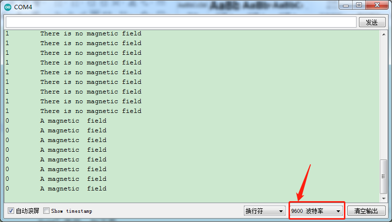

### 实验十二 附近有人吗

实验说明

在这个套件中，有一个Keyes DIY电子积木
人体红外热释传感器，它主要采用RE200B-P传感器元件。它是一款基于热释电效应的人体热释运动传感器，能检测到人体或动物身上发出的红外线，配合菲涅尔透镜能使传感器探测范围更远更广。

实验中，我们通过读取模块上S端高低电平，判断附近是否有人在运动；并且，我们在串口监视器上显示测试结果。

实验原理

这个原理图可能较前面的模块稍复杂，我们一个个来看。左上角那部分是电压转换，5V转3.3V，因为我们模块上用到的传感器工作电压为3.3V，不能直接用5V供电，所以需要一个电压转换电路。当传感器附近没有检测到人即没有接收到红外信号时，传感器1脚输出低电平，此时模块上LED两端有电压就会点亮，此时MOS管Q1导通，信号端S检测到低电平。当传感器附近检测到人即接收到红外信号时，传感器1脚输出高电平，此时模块上LED两端没有电压就会熄灭，此时MOS管Q1不导通，信号端S则检测到被10K上拉电阻R5拉高的高电平。

实验器材

||||||
|-|-|-|-|-|
|Keyes Uno Plus 开发板*1|传感器扩展板*1|Keyes DIY电子积木 人体红外热释传感器*1|3P XH-2.54mm 黑红蓝硅胶线*1|USB线*1|

接线图

测试代码

/\*

Keyes Arduino DIY电子积木 37合1 传感器套装

课程 12

人体红外热释传感器

http://www.keyes-robot.com

\*/

int val = 0;

int pirPin = 8; //定义人体红外传感器管脚为数字口8

void setup() {

Serial.begin(9600); //设置波特率为9600

pinMode(pirPin, INPUT); //设置传感器为输入模式

}

void loop() {

val = digitalRead(pirPin); //读取传感器的值

Serial.print(val);//打印val值

if (val == 1) {//附近有人运动,输出高电平

Serial.print(" ");

Serial.println("Some body is in this area!");

delay(100);

}

else {//没检测到人体运动，则输出低电平

Serial.print(" ");

Serial.println("No one!");

delay(100);

}

}

代码说明

设置方法和实验四类似，这里就不多做介绍了。

测试结果

上传测试代码成功，利用USB线上电后，打开串口监视器，设置波特率为9600。

串口监视器显示对应数据和字符。实验中，传感器检测到附近有人在运动时，val为1，模块上LED熄灭，串口监视器显示“Somebody is in this area!”字符；没有检测到人运动时，item为0，模块上LED点亮，串口监视器显示“No one!”字符，如下图。

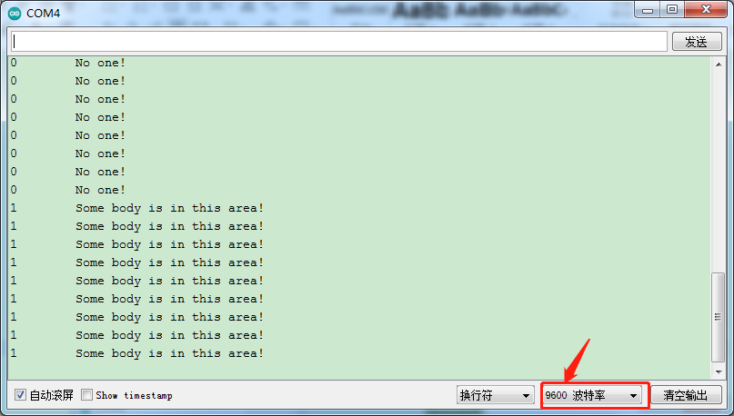

### 实验十三 有源蜂鸣器模块播放声音

实验说明

在这个套件中，包含一个有源蜂鸣器模块，一个无源蜂鸣器模块（功放模块）。这个实验中，我们控制有源蜂鸣器发出声音。有源蜂鸣器元件内部自带震荡电路，控制时，我们只需要给蜂鸣器元件足够的电压，蜂鸣器就自动响起。

实验中，我们只是控制这个模块上有源蜂鸣器的循环响起声音。

实验原理

从原理图中可以看出来在，蜂鸣器一端通过串联一个电阻R2连接到电压正极，另一端通过一个NPN三极管Q1连接到GND，所以只要导通这个三极管，让蜂鸣器一端连通GND，有缘蜂鸣器就会响起来。三极管控制端基极也就是连接到R1电阻一端为高电平，三极管Q1就导通了，三极管基极被下拉电阻R3拉低，所以常态为不导通，当我们用单片机IO口输出一个高电平到基极三极管就导通了。

即S信号端设置为高电平时，三极管导通，模块上蜂鸣器响起；设置为低电平时，三极管不导通，模块上蜂鸣器没有声音。

实验器材

||||||
|-|-|-|-|-|
|Keyes Uno Plus 开发板*1|传感器扩展板*1|Keyes DIY电子积木 有源蜂鸣器模块*1|3P XH-2.54mm 黑红蓝硅胶线*1|USB线*1|

接线图

测试代码

/\*

Keyes Arduino DIY电子积木 37合1 传感器套装

课程 13

有缘蜂鸣器

http://www.keyes-robot.com

\*/

int buzzer = 3; //定义蜂鸣器接管脚D3

void setup() {

pinMode(buzzer, OUTPUT);//设置输出模式

}

void loop() {

digitalWrite(buzzer, HIGH); //发声

delay(1000);

digitalWrite(buzzer, LOW); //停止发声

delay(1000);

}

代码说明

在实验中，我们把管脚设置为3，设置为高时，模块上有源蜂鸣器响起；设置为低时，模块上有源蜂鸣器关闭声音。

测试结果

上传测试代码成功，上电后，模块上有源蜂鸣器响起1秒，关闭1秒，循环交替。

### 实验十四 8002b功放 喇叭模块

实验说明

在这个套件中，有一个Keyes DIY电子积木 8002b功放
喇叭模块，这个模块主要的元件有一个可调电位器，一个喇叭，一个音频放大芯片；前面课程中我们介绍了套件中的有源蜂鸣器模块的使用方法。在这里我们介绍下套件中的8002b功放
喇叭模块，这个模块主要功能是：可以对输出的小音频信号进行放大，大概放大倍数为8.5倍，并且可以通过自带的小功率喇叭播放出来，也可以用来播放音乐，作为一些音乐播放设备的外接扩音设备。

实验中，我们利用8002b功放 喇叭模块上发出各种频率的声音。

实验原理

其实它就类似于于一个无源蜂鸣器，前面我们介绍过，有缘蜂鸣器自带振荡源，只要我们给它足够的电压就能响起来，而无源蜂鸣器元件内部不带震荡电路，控制时我们需要在元件正极输入不同频率的方波（电压5V），负极接地，从而控制蜂鸣器响起不同频率的声音。

实验器材

||||||
|-|-|-|-|-|
|Keyes Uno Plus 开发板*1|传感器扩展板*1|Keyes DIY电子积木 8002b功放 喇叭模块*1|3P XH-2.54mm 黑红蓝硅胶线*1|USB线*1|

接线图

测试代码

/\*

Keyes Arduino DIY电子积木 37合1 传感器套装

课程 14

功放喇叭模块

http://www.keyes-robot.com

\*/

int beeppin = 3; //定义喇叭引脚为D3

void setup() {

pinMode(beeppin, OUTPUT);//定义功放喇叭模块数字口为输出模式

}

void loop() {

tone(beeppin, 262);//DO播放1000ms

delay(1000);

tone(beeppin, 294);//Re播放750ms

delay(750);

tone(beeppin, 330);//Mi播放625ms

delay(625);

tone(beeppin, 349);//Fa播放500ms

delay(500);

tone(beeppin, 392);//So播放375ms

delay(375);

tone(beeppin, 440);//La播放250ms

delay(250);

tone(beeppin, 494);//Si播放125ms

delay(125);

noTone(beeppin);//停止播放一秒

delay(1000);

}

代码说明

在本实验中，我们用到了函数tone()。tone(pin, frequency)；pin为生成音调的arduino引脚,我们设置了3；frequency为音调频率，单位为Hz,数据类型为unsigned int（范围0 ~ 65,535 ((2^16) - 1))。

tone函数在引脚上生成指定频率（和50％占空比）的方波。
直到调用noTone()（停止生成音调）为止。该引脚可以连接到压电蜂鸣器或其他扬声器以播放音调。tone()一次只能产生一种音调。
如果某个音色已经在其他引脚上播放，则对tone()的调用将无效。

使用tone()函数将干扰引脚3和11（Mega以外的板上）上的PWM输出（我们会在后面的课程中讲到PWM）。同时tone()不能产生低于31Hz的音调。如果要在多个引脚上演奏不同的音高，则需要在一个引脚上调用noTone()，然后在下一个引脚上调用tone()。

测试结果

当我们上传测试代码成功，上电后，功放喇叭模块循环播放对应频率对应节拍的声音：DO一拍，Re0.75拍，Mi0.625拍，Fa半拍，So0.375拍，La四分之一拍，Si0.125拍。

### 实验十五 130电机模块

实验说明

在生活中，我们经常需要驱动一个风扇转动或者或者一个小水泵。为了方便接线，我们特别设计了这个130电机驱动模块。模块设计有两个定位孔，与伺服电机控制兼容。该模块效率高，风扇质量好。

该电机控制模块采用HR1124S电机控制芯片。HR1124S是应用于直流电机方案的单通道H桥驱动器芯片。HR1124S的H桥驱动部分采用低导通电阻的PMOS和NMOS功率管。低导通电阻保证芯片低的功率损耗，使得芯片安全工作更长时间。此外HR1124S拥有低待机电流，低静态工作电流，这些性能使HR1124S易用于玩具方案。

该模块兼容各种单片机控制板，如arduino系列单片机。模块上自带的防反插红色端子间距为2.54mm，实验中，我们可通过输出到两个信号端IN+和IN-的电压方向来控制电机的转动方向，让电机转动起来。

实验原理

芯片是助于驱动电机，电机所需电流较大，我们无法用三极管驱动更无法直接用IO口驱动，让电机转动起来很简单，给电机两端电压即可，不同电压方向电机转向也不相同，额度电压内，电压越大，电机转动得越快；反之电压越低，电机转动得越慢，甚至无法转动。所以我们可以用PWM口来控制电机的转速，我们这里还没有学到PWM，所以先用高低电平来控制电机。

实验器材

||||||
|-|-|-|-|-|
|Keyes Uno Plus 开发板*1|传感器扩展板*1|Keyes DIY电子积木 130电机模块*1|4P XH-2.54mm 黑红蓝黄硅胶线*1|USB线*1|

接线图

测试代码

/\*

Keyes Arduino DIY电子积木 37合1 传感器套装

课程 15

130电机模块

http://www.keyes-robot.com

\*/

//定义电机的两个管脚接口，分别为A0, A1

int INA = A0;

int INB = A1;

void setup() {

//设置电机引脚为输出

pinMode(INA, OUTPUT);

pinMode(INB, OUTPUT);

}

void loop() {

//逆时针转

digitalWrite(INA, HIGH);

digitalWrite(INB, LOW);

delay(2000);

//停止

digitalWrite(INA, LOW);

digitalWrite(INB, LOW);

delay(1000);

//顺时针转

digitalWrite(INA, LOW);

digitalWrite(INB, HIGH);

delay(2000);

//停止

digitalWrite(INA, LOW);

digitalWrite(INB, LOW);

delay(1000);

}

代码说明

将管脚设置为A0、A1，当A0输出为低电平即INA输入低电平，A1输出为高电平即INB输入高电平时（输入与输出是相对的，这个实验中对于我们单片机的引脚来说，单片机输出高低电平，自然模块就为输入了，即从单片机输出到模块；例如按键模块则相反，是模块输出到单片机），电机顺时针旋转；当A0输出为高电平，A1输出为低电平时，电机逆时针旋转；当两个管脚都设置为低电平时，电机停止转动。

测试结果

烧录好测试130电机代码，按照接线图连接好线；上电后，风扇顺时针转动2秒；停止1秒；逆时针转动2秒；停止1秒；循环交替。

### 实验十六 插件RGB模块调节LED颜色

实验说明

在这个套件中，有一个Keyes DIY电子积木
共阴RGB模块，它采用F10-全彩RGB雾状共阴LED元件。控制时，我们需要将模块R G B连接单片机PWM口，剩下那个管脚接GND（共阳RGB的话剩下那个管脚接VCC）。那么什么是PWM呢？PWM是使用数字手段来控制模拟输出的一种手段。使用数字控制产生占空比不同的方波（一个不停在高电平与低电平之间切换的信号)来控制模拟输出。一般来说端口的输入电压只有两个0V与5V，也就是低电平和高电平。如果想要改变灯的亮度怎么办呢个？有同学说串联电阻，对，这个方法是正确的。但是，如果想要得到不同的亮度，且在不同亮度之间来回变动怎么办呢？不可能不停地切换电阻吧。这种情况下就需要使用PWM了，那它是怎么控制的呢？

对于Arduino的数字端口电压输出只有LOW与HIGH两个，对应的就是0V与5V的电压输出，可以把LOW定义为0，HIGH定义为1，1秒内让Arduino输出500个0或者1的信号。如果这500个全部为1，那就是完整的5V，如果全部为0，那就是0V。如果010101010101这样输出，刚好一半，端口输出的平均电压就为2.5V了。这个和放映电影是一个道理，咱们所看的电影并不是完全连续的，它其实是每秒输出25张图片。在这种情况下，人的肉眼是分辨不出来的，看上去就是连续的了。PWM也是同样的道理，如果想要不同的电压，就控制0与1的输出比例控制就可以了。当然这和真实的连续输出还是有差别的，单位时间内输出的0,1信号越多，控制的就越精确。

实验中，我们通过测试代码，控制模块上RGB LED显示几个常用颜色。

实验原理

那么我们这个实验就是要通过调节3个PWM值，控制LED元件显示红光、绿光和蓝光的比例，从而控制RGB模块上LED显示不同颜色灯光。当设置的PWM值越大，对应显示的颜色比例越重。理论上来说，通过调节这3中颜色光的混合比例，可以模拟出所有颜色的灯光。

实验器材

||||||
|-|-|-|-|-|
|Keyes Uno Plus 开发板*1|传感器扩展板*1|Keyes DIY电子积木 共阴RGB模块*1|4P XH-2.54mm 黑红蓝黄硅胶线*1|USB线*1|

接线图

测试代码

代码1：

/\*

Keyes Arduino DIY电子积木 37合1 传感器套装

课程 16.1

RGB红绿蓝闪烁

http://www.keyes-robot.com

\*/

int redPin = 9; //定义红色接D9

int greenPin = 10; //定义绿色接D10

int bluePin = 11; //定义蓝色接D11

void setup(){

//输出口都设置为输出模式

pinMode(redPin, OUTPUT);

pinMode(greenPin, OUTPUT);

pinMode(bluePin, OUTPUT);

}

void loop(){

//红色

digitalWrite(redPin,HIGH);

digitalWrite(greenPin,LOW);

digitalWrite(bluePin,LOW);

delay(1000);

//绿色

digitalWrite(redPin,LOW);

digitalWrite(greenPin,HIGH);

digitalWrite(bluePin,LOW);

delay(1000);

//蓝色

digitalWrite(redPin,LOW);

digitalWrite(greenPin,LOW);

digitalWrite(bluePin,HIGH);

delay(1000);

}

代码2：

/\*

Keyes Arduino DIY电子积木 37合1 传感器套装

课程 16.2

RGB七彩灯闪烁

http://www.keyes-robot.com

\*/

int redPin = 9; //定义红色接D9

int greenPin = 10; //定义绿色接D10

int bluePin = 11; //定义蓝色接D11

void setup() {

pinMode(redPin, OUTPUT);

pinMode(greenPin, OUTPUT);

pinMode(bluePin, OUTPUT);

}

void loop() {

//红色(255, 0, 0)

analogWrite(9, 255);

analogWrite(10, 0);

analogWrite(11, 0);

delay(1000);

//橙色(255, 97, 0)

analogWrite(9, 255);

analogWrite(10, 97);

analogWrite(11, 0);

delay(1000);

//黄色(255, 255, 0)

analogWrite(9, 255);

analogWrite(10, 255);

analogWrite(11, 0);

delay(1000);

//绿色(0, 255, 0)

analogWrite(9, 0);

analogWrite(10, 255);

analogWrite(11, 0);

delay(1000);

//蓝色(0, 0, 255)

analogWrite(9, 0);

analogWrite(10, 0);

analogWrite(11, 255);

delay(1000);

//青色(0, 255, 255)

analogWrite(9, 0);

analogWrite(10, 255);

analogWrite(11, 255);

delay(1000);

//紫色(160, 32, 240)

analogWrite(9, 160);

analogWrite(10, 32);

analogWrite(11, 240);

delay(1000);

}

代码说明

代码1说明：

1.  代码1中，R G B代表控制模块上
    LED对应的红绿蓝3种颜色对应的端口，根据接线图我们接到了D9 D10     D11，设置为9 10 11，后面设置对应高低，设置GRB     LED中红绿蓝3个灯是否会亮，设置为高（对应数字口为高电平），对应的颜色就亮。

2.  现在观察代码，这个代码非常简单，只是简单的控制模块上RGB     LED显示红色1秒、

绿色1秒、蓝色1秒，循环交替。

代码2说明：

1.代码2中，我们使用到了PWM输出，根据接线图我们接到了D9 D10

D11，设置为9 10 11。后面设置数据代表设置模块上LED
红绿蓝颜色的比例，设置的

数据越大（对应的PWM值越大），设置该颜色的比例越大。

2.实验中我们通过设置对应数值，调节RGB LED上红绿蓝颜色比例，从而控制RGB LED显示对应颜色。所以理论上来说可以设置的颜色有256\*256\*256种（详细可参考下面常用RGB颜色表）。

常用RGB颜色表

| |R|G|B| |R|G|B| |R|G|B|
|-|-|-|-|-|-|-|-|-|-|-|-|
|黑色|0|0|0|黄色|255|255|0|浅灰蓝色|176|224|230|
|象牙黑|41|36|33|香蕉色|227|207|87|品蓝|65|105|225|
|灰色|192|192|192|镉黄|255|153|18|石板蓝|106|90|205|
|冷灰|128|138|135|dougello|235|137|85|天蓝|135|206|235|
|石板灰|112|128|105|forum gold|255|227|132|暖灰色|128|128|105|
|金黄色|255|215|0|青色|0|255|255|黄花色|218|165|105|
|绿土|56|94|15|白色|255|255|255|瓜色|227|168|105|
|靛青|8|46|84|古董白|250|235|215|橙色|255|97|0|
|碧绿色|127|255|212|天蓝色|240|255|255|镉橙|255|97|3|
|青绿色|64|224|208|白烟|245|245|245|胡萝卜色|237|145|33|
|绿色|0|255|0|白杏仁|255|235|205|桔黄|255|128|0|
|黄绿色|127|255|0|cornsilk|255|248|220|淡黄色|245|222|179|
|钴绿色|61|145|64|蛋壳色|252|230|201|翠绿色|0|201|87|
|花白|255|250|240|棕色|128|37|37|森林绿|34|139|34|
|gainsboro|220|220|220|米色|163|148|128|草地绿|124|252|0|
|ghostWhite|248|248|255|锻浓黄土色|138|54|15|酸橙绿|50|205|50|
|蜜露橙|240|255|240|锻棕土色|135|51|36|薄荷色|189|252|201|
|象牙白|250|255|240|巧克力色|210|105|30|草绿色|107|137|35|
|亚麻色|250|240|230|肉色|255|125|64|暗绿色|48|128|20|
|navajoWhite|255|222|173|黄褐色|240|230|140|海绿色|46|139|87|
|old lace|253|245|230|玫瑰红|188|143|143|嫩绿色|0|255|127|
|海贝壳色|255|245|238|肖贡土色|199|97|20|雪白|255|250|250|
|标土棕|115|74|18|紫色|160|32|240|乌贼墨棕|94|38|18|
|紫罗蓝色|138|43|226|红色|255|0|0|赫色|160|82|45|
|jasoa|160|102|211|砖红|156|102|31|马棕色|139|69|19|
|湖紫色|153|51|250|镉红|227|23|13|沙棕色|244|164|96|
|淡紫色|218|112|214|珊瑚色|255|127|80|棕褐色|210|180|140|
|梅红色|221|160|221|耐火砖红|178|34|34|印度红|176|23|31|
|蓝色|0|0|255|栗色|176|48|96|钴色|61|89|171|
|粉红|255|192|203|dodger blue|30|144|255|草莓色|135|38|87|
|jackie blue|11|23|70|橙红色|250|128|114|锰蓝|3|168|158|
|蕃茄红|255|99|71|深蓝色|25|25|112|桔红|255|69|0|
|孔雀蓝|51|161|201|深红色|255|0|255|土耳其玉色|0|199|140|

测试结果

上传测试代码1成功，上电后，模块上RGB LED循环显示红绿蓝3种颜色，间隔时间为1秒。上传测试代码2成功，上电后，模块上RGB LED显示红橙黄绿蓝青紫白7种颜色，循环不止，间隔时间为1秒。

### 实验十七 旋转电位器传感器读取模拟值

实验说明

前面我们学习过的传感器，都是数字传感器，在这个套件中，有一个Keyes DIY电子积木
旋转电位器传感器，它与我们前面学到的传感器不同，它是一个模拟传感器，意思是例如我们前面学习的按键模块，当按键没有按下去时，我们读取到高电平（5V），当按键按下去时，我们读取到低电平（0V），而在0~5V中间的电压值，我们数字IO口无法读取到，当然按键模块也只能输出高低电平。而模拟传感器就可以通过我们plus板上的模拟口（A0~A7）读取。

实验中，我们利用这个模块测试对应的模拟值；并且，我们在串口监视器上显示测试结果。

实验原理

我们学过滑动变阻器的就很好理解，随着滑动变阻器上的滑片移动，滑片上的电压随着改变。我们的旋转电位器原理也是如此，它主要采用一个10K可调电阻。通过旋转电位器，我们可以改变电阻大小，信号端S检测到电压变化（0~5V），而这个电压变化是一个连续变化的模拟量，也就是在0~5V内可以取任意值，我们必须先对这个模拟量进行ADC采集，来测量连续的这些模拟量，A/D
是模拟量到数字量的转换，依靠的是模数转换器(Analog to Digital Converter)，简称ADC。我们的plus开发板已经集成了ADC采集，我们直接使用就可以。

我们plus开发板与UNO开发板的ADC位数都是10位，一个 n 位的 ADC 表示这个 ADC
共有 2 的 n 次方个刻度。10 位的 ADC，输出的是从 0～1023 一共 1024
个数字量，也就是 2 的 10
次方个数据刻度，那么每个刻度就是5V/1024=0.0049V，这个也叫分辨率。

实验器材

||||||
|-|-|-|-|-|
|Keyes Uno Plus 开发板*1|传感器扩展板*1|Keyes DIY电子积木 旋转电位器传感器*1|3P XH-2.54mm 黑红蓝硅胶线*1|USB线*1|

接线图

测试代码

/\*

Keyes Arduino DIY电子积木 37合1 传感器套装

课程 17

旋转电位器

http://www.keyes-robot.com

\*/

int analogVal = 0;

int resPin = A0;

void setup() {

Serial.begin(9600);//设置波特率为9600

}

void loop() {

analogVal = analogRead(resPin);//读取电位器的值

Serial.println(analogVal);//打印模拟值

delay(100);//延时100毫秒

}

代码说明

1.  在实验中，我们定义管脚变量名为analogVal，意思就是模拟值，前面我们又是用到数字传感器，我们这个实验用到的旋转电位器，它输出的是模拟值（0~1023），所以我们把管脚设置为模拟口，这里我们接A0。

2.  实验四，我们讲到digitalRead()函数，我们这里讲讲analogRead()函数。analogRead(pin)这个函数从指定的模拟引脚pin读取值。
    Arduino 板包含一个多通道、10 位模数转换器。 这意味着它会将 0     和工作电压（5V 或 3.3V我们这里是5V）之间的输入电压映射为 0 和 1023     之间的整数值。例如，在 Arduino UNO     上，这会产生以下读数之间的分辨率：5 伏/1024 单位即每单位 0.0049 伏
    (4.9 mV)。在基于 ATmega     的板卡（UNO、Nano、Mini、Mega）上，读取模拟输入大约需要 100     微秒（0.0001 s），因此最大读取速率约为每秒 10,000 次。

3.  pin：要读取的模拟输入引脚的名称（大多数板上的A0到A5，我们plus板上的A0到A7，Mega2560上的A0到A15）。设置1个整数变量item，将所测结果赋值给item。函数返回值为引脚上的模拟读数。虽然它受限于模数转换器的分辨率（0-1023     为 10 位或 0-4095 为 12 位）。数据类型：int。

4.  串口监视器显示analogVal     的值，显示前需设置波特率（我们默认设置为9600，可更改）。

测试结果

上传测试代码成功，利用USB线上电后，打开串口监视器，设置波特率为9600。串口监视器显示对应模拟值。实验中，顺时针旋转电位器，模拟值增大，逆时针旋转电位器，模拟值减小，范围为0-1023，如下图。

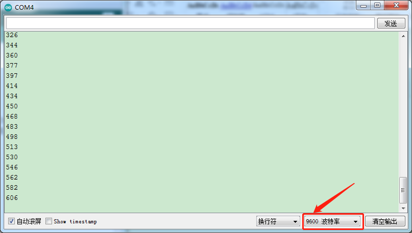

### 实验十八 水滴水蒸气传感器

实验说明

这是一个Keyes DIY电子积木
水滴传感器。它是一个模拟（数字）输入模块，也叫雨水、雨量传感器。可用于各种天气状况的监测，检测是否下雨及雨量的大小，转成数字信号（DO）和模拟信号（AO）输出，并广泛应用于Arduino
机器人套件，雨滴，下雨传感器，可用于各种天气状况的监测，并转成数定信号和
AO 输出，也可用于汽车自动刮水系统、智能灯光系统和智能天窗系统等。

实验中，我们将传感器信号端(S端)输入到plus
开发板的模拟口，感知模拟值的变化，并在串口监视器上显示出对应的模拟值。

实验原理

它的原理是通过电路板上裸露的印刷平行线检测水量的大小。水量越多，就会有更多的导线被联通，随着导电的接触面积增大，2脚输出的电压就会逐步上升。信号端S检测的模拟值就越大。除了可以检测水量的大小，它还可以检测空气中的水蒸气。传感器自带2个直径为4.8mm的定位孔，方便你将传感器固定在其他设备。

实验器材

||||||
|-|-|-|-|-|
|Keyes Uno Plus 开发板*1|传感器扩展板*1|Keyes DIY电子积木 水滴传感器*1|3P XH-2.54mm 黑红蓝硅胶线*1|USB线*1|

接线图

测试代码

/\*

Keyes Arduino DIY电子积木 37合1 传感器套装

课程 18

水滴水蒸气传感器

http://www.keyes-robot.com

\*/

int val = 0;

int Water = A0; //水蒸气传感器的PIN为A0

void setup() {

Serial.begin(9600);//设置波特率为9600

}

void loop() {

val = analogRead(A0); //读取水蒸气传感器的值

Serial.print("Water:");

Serial.println(val);

delay(100);

}

代码说明

设置方法和实验十七类似，这里就不多做介绍了。

测试结果

烧录好测试代码，按照接线图连接好线；利用USB接口上电后，进入串口监视器，设置波特率为9600。当水蒸气传感器上检测到水分时，输出的模拟值在串口监视器显示出来，水量越多输出的电压越大，模拟值越大，如下图。

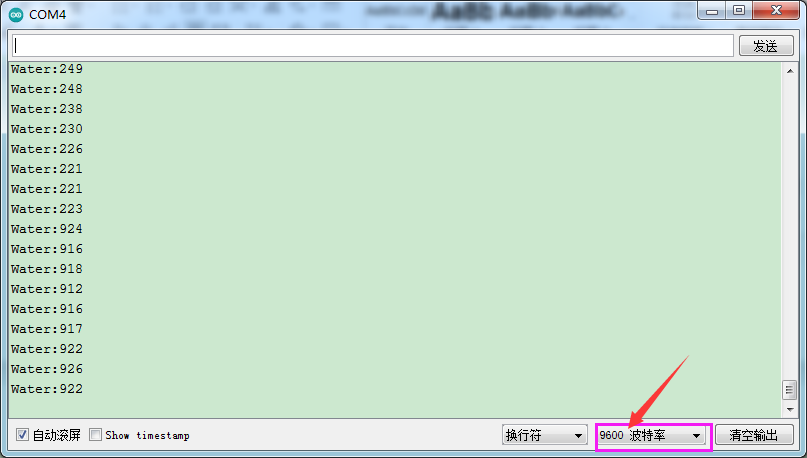

### 实验十九 声音传感器检测声量

实验说明

在这个套件中，有一个Keyes DIY电子积木
声音传感器，实验中，我们利用这个传感器测试当前环境中的声音大小对应的模拟值，声音越大，模拟值越大；并且，我们在串口监视器上显示测试结果。

实验原理

它主要采用一个高感度麦克风元件和LM386芯片。高感度麦克风元件用于检测外界的声音。利用LM386芯片搭建合适的电路，我们对高感度麦克风检测到的声音进行放大，最大倍数为200倍。使用时我们可以通过旋转传感器上电位器，调节声音的放大倍数。调节时，顺时针调节电位器到尽头，放大倍数最大。

实验器材

||||||
|-|-|-|-|-|
|Keyes Uno Plus 开发板*1|传感器扩展板*1|Keyes DIY电子积木 声音传感器*1|3P XH-2.54mm 黑红蓝硅胶线*1|USB线*1|

接线图

测试代码

/\*

Keyes Arduino DIY电子积木 37合1 传感器套装

课程 19

声音传感器

http://www.keyes-robot.com

\*/

int val = 0;

int Microphone = A0; //麦克风传感器接A0

void setup() {

Serial.begin(9600);//设置波特率9600

}

void loop() {

val = analogRead(Microphone); //读取传感器的值赋给变量val

Serial.println(val); //换行打印传感器输出的模拟值

delay(100); //加延时100MS

}

代码说明

设置方法和实验十七类似，这里就不多做介绍了。

测试结果

上传测试代码成功，利用USB线上电后，打开串口监视器，设置波特率为9600。串口监视器显示对应模拟值。实验中，我们顺时针旋转电位器和对准MIC头大声说话，可以看到模拟值数据变大，如下图。

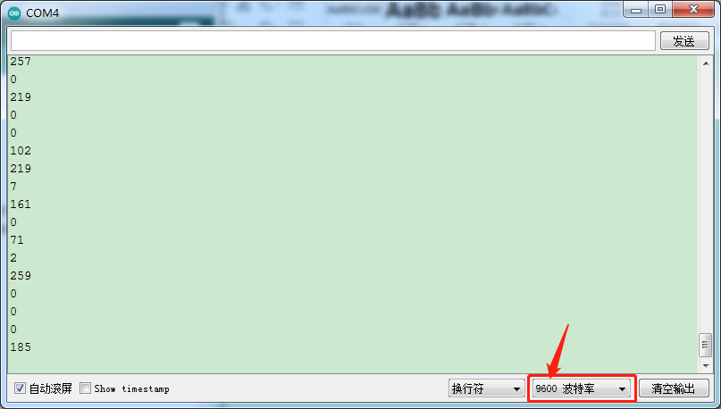

### 实验二十 光敏电阻传感器

实验说明

在这个套件中，有一个Keyes DIY电子积木
光敏电阻传感器，这是一个常用的光敏电阻传感器，它主要采用光敏电阻元件。该电阻元件电阻大小随着光照强度的变化而变化，该传感器就是利用光敏电阻元件这一特性，搭建电路将电阻变化转换为电压变化。光敏电阻传感器可以模拟人对环境光线的强度的判断，从而方便做出与人友好互动的应用。

接线时，我们将传感器信号端(S端)输入到arduino系列单片机的模拟口，感知模拟值的变化，并在串口监视器上显示出对应的模拟值。

实验原理

当没有亮光时，电阻大小为0.2MΩ，信号端（2点）检测的电压接近0，当随着光照抢度增大，光线传感器的电阻值越来越小，所以信号端检测的电压越来越小。

实验器材

||||||
|-|-|-|-|-|
|Keyes Uno Plus 开发板*1|传感器扩展板*1|Keyes DIY电子积木 光敏电阻传感器*1|3P XH-2.54mm 黑红蓝硅胶线*1|USB线*1|

接线图

测试代码

/\*

Keyes Arduino DIY电子积木 37合1 传感器套装

课程 20

光敏电阻传感器

http://www.keyes-robot.com

\*/

int val = 0;

int photoPin = A0; //光敏电阻传感器接模拟口A0

void setup() {

Serial.begin(9600);//设置波特率9600

}

void loop() {

val = analogRead(photoPin);//读取传感器器的值

Serial.println(val);//打印值

delay(100);//延时100MS

}

代码说明

设置方法和实验十七类似，这里就不多做介绍了。

测试结果

烧录好测试代码，按照接线图连接好线，利用USB线上电后，打开软件串口监视器，设置波特率为9600，我们可以看到对应光照强度的模拟值，光照越强，模拟值越大，如下图。

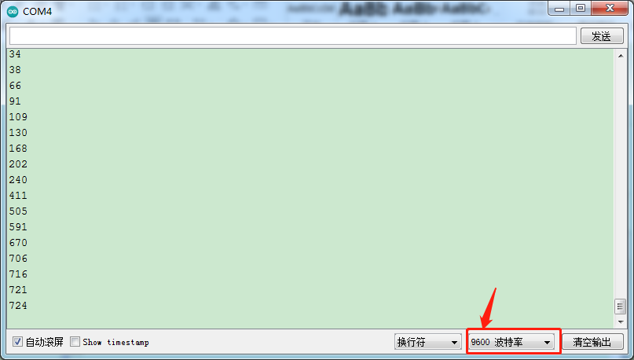

### 实验二十一 NTC-MF52AT模拟温度传感器

实验说明

在这个套件中，有一个Keyes DIY电子积木
NTC-MF52AT模拟温度传感器，它的原理像光敏电阻传感器，只是感应的器件不同，实验中，我们将传感器信号端接到Keyes Uno Plus
开发板模拟口，读出对应的模拟值。我们可以利用模拟值，通过特定公式，计算出当前环境的温度。由于温度计算公式比较复杂，这里就不多介绍了。实验中，我们只是读取对应的模拟值。

实验原理

这个模块主要采用NTC-MF52AT热敏电阻元件。NTC-MF52AT热敏电阻元件能够时感知周边环境温度的变化，电阻大小随着温度的变化而变化，从而引起信号端S的电压变化。该传感器就是利用NTC-MF52AT热敏电阻元件这一特性，搭建电路将电阻变化转换为电压变化。

实验器材

||||||
|-|-|-|-|-|
|Keyes Uno Plus 开发板*1|传感器扩展板*1|Keyes DIY电子积NTC-MF52AT模拟温度传感器*1|3P XH-2.54mm 黑红蓝硅胶线*1|USB线*1|

接线图

测试代码

/\*

Keyes Arduino DIY电子积木 37合1 传感器套装

课程 21

模拟温度传感器

http://www.keyes-robot.com

\*/

int val;

int ntcPin = A0; //设置NTC-MF52AT模拟温度传感器接模拟口A0

void setup() {

Serial.begin(9600);//设置波特率为9600

}

void loop() {

val = analogRead(ntcPin); //读取温度模拟值

Serial.println(val); //读取并打印热敏电阻模拟值

delay(100);//延时100毫秒

}

代码说明

设置方法和实验十七类似，这里就不多做介绍了。

测试结果

上传测试代码成功，利用USB线上电后，打开串口监视器，设置波特率为9600。串口监视器显示对应的模拟值，温度越高，模拟值越大。

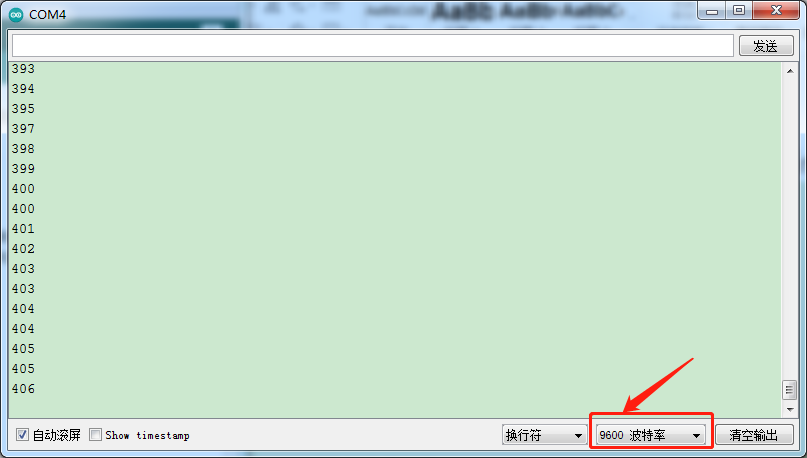

### 实验二十二 薄膜压力传感器

实验说明

在这个套件中，有一个Keyes DIY电子积木
薄膜压力传感器，薄膜压力传感器是基于新型纳米压敏材料辅以舒适杨式模量的超薄薄膜衬底一次性贴片而成，兼具防水和压敏双重功能。

实验中，我们通过采集模块上S端模拟信号，判断压力大小，模拟值越小，压力越大；并且，我们在串口监视器上显示测试结果。

实验原理

当传感器感知到外界压力时，传感器电阻值发生变化，我们采用电路将传感器感知压力变化的压力信号转换成相应变化强度的电信号输出。这样我们就可以通过检测电压信号变化就可以得到压力变化情况。

实验器材

||||||
|-|-|-|-|-|
|Keyes Uno Plus 开发板*1|传感器扩展板*1|Keyes DIY电子积木 薄膜压力传感器*1|3P XH-2.54mm 黑红蓝硅胶线*1|USB线*1|

接线图

测试代码

/\*

Keyes Arduino DIY电子积木 37合1 传感器套装

课程 22

薄膜压力传感器

http://www.keyes-robot.com

\*/

int val = 0;

int Film = A0; //薄膜压力传感器接A0

void setup() {

Serial.begin(9600);//设置波特率为9600

}

void loop() {

val = analogRead(Film);//读取模拟值

Serial.println(val);//打印模拟值

delay(100);//延时100MS

}

代码说明

设置方法和实验十七类似，这里就不多做介绍了。

测试结果

上传测试代码成功，利用USB线上电后，打开串口监视器，设置波特率为9600。当我们用手挤压薄膜时，可以看到我们在串口监视器打印的模拟值变小，如下图。

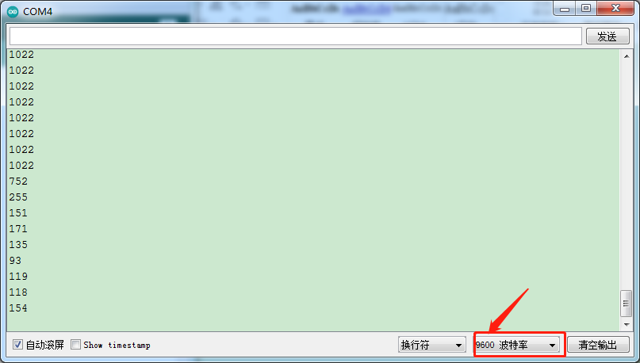

### 实验二十三 火焰传感器

实验说明

在这个套件中，有一个Keyes DIY电子积木
火焰传感器，它对火焰光谱特别灵敏并且灵敏度可调，性能稳定，是救火机器人必备部件，在机器人比赛中，远红外火焰探头起着非常重要的作用，它可以用作机器人的眼睛来寻找火源或足球。利用它可以制作灭火机器人、足球机器人等。

该传感器有两个信号输出端，分别可输出数字信号与模拟信号。实验中，我们分别读取模块传感器数字信号与模拟信号，将测试结果在串口监视器上显示。

实验原理

红外火焰传感器能够探测到波长在700纳米～1000纳米范围内的红外光，探测角度为60，其中红外光波长在880纳米附近时，其灵敏度达到最大。从电路原理图我们可以看到，上电后红色LED2先点亮，红色LED1处于熄灭状态，检测到火焰时，数字信号端D0输出低电平，红色LED1将点亮。红外火焰探头将外界红外光的强弱变化转化为电流的变化，通过A/D转换器反映为0～1023范围内数值的变化。外界红外光越强，数值越小；红外光越弱，数值越大。

实验器材

||||||
|-|-|-|-|-|
|Keyes Uno Plus 开发板*1|传感器扩展板*1|Keyes DIY电子积木 火焰传感器*1|4P XH-2.54mm 黑红蓝黄硅胶线*1|USB线*1|

接线图

测试代码

/\*

Keyes Arduino DIY电子积木 37合1 传感器套装

课程 23

火焰传感器

http://www.keyes-robot.com

\*/

//火焰传感器两个管脚，分别接A0、A1，这里A0作为数字口用

int digitalPin = A0;

int analogPin = A1;

//以下两个变量分别存放数字信号与模拟信号

int analogVal = 0;

int digitalVal = 0;

void setup() {

Serial.begin(9600); //设置波特率为9600

pinMode(digitalPin, INPUT); //数字引脚A0设置为输入模式

}

void loop() {

analogVal = analogRead(analogPin); //读取模拟信号

digitalVal = digitalRead(digitalPin); //读取数字信号

Serial.print(analogVal); //打印模拟值

Serial.print(" "); //空格隔开，方便观察

Serial.println(digitalVal); //打印数字值

delay(100); //延时100毫秒

}

代码说明

我们这里用到两个管脚，我们根据接线分别定义到A0,A1，然后我们前面介绍过了，模拟口也可作为数字口使用，我们这里就把A0当做数字口来使用。

测试结果

上传测试代码成功，利用USB线上电后，传感器模块上的红色LED2点亮，红色LED1熄灭，打开串口监视器，设置波特率为9600。当传感器检测到火焰时，红色LED1点亮，数字值由1变为0，模拟值变小，如下图。

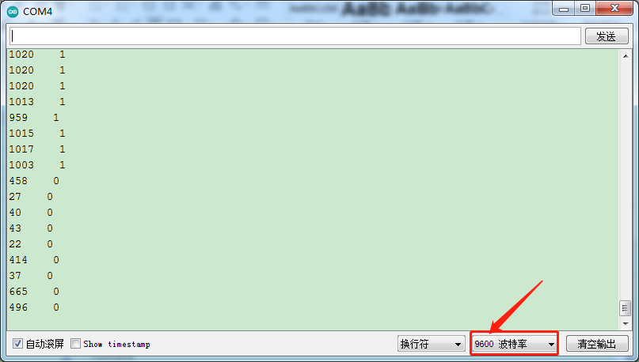

### 实验二十四 MQ-2 烟雾传感器

实验说明

在这个套件中，有一个Keyes DIY电子积木
MQ-2模拟气体传感器，它主要用到了MQ-2
可燃气体、烟雾传感器元件。该元件所使用的气敏材料是在清洁空气中电导率较低的二氧化锡(SnO2)。当传感器所处环境中存在可燃气体时，传感器的电导率随空气中可燃气体浓度的增加而增大。该传感器对液化气、丙烷、氢气的灵敏度高，对天然气和其它可燃蒸汽的检测也很理想。它可检测多种可燃性气体，是一款适合多种应用的低成本传感器。

实验中，我们读取传感器A0端模拟值，和D0端数字值，判断空气中气体的含量，以及它们是否超标。

实验原理

MQ-2型烟雾传感器属于二氧化锡半导体气敏材料，属于表面离子式N型半导体。处于200~300摄氏度时，二氧化锡吸附空气中的氧，形成氧的负离子吸附，使半导体中的电子密度减少，从而使其电阻值增加。当与烟雾接触时，如果晶粒间界处的势垒收到烟雾的调至而变化，就会引起表面导电率的变化。利用这一点就可以获得这种烟雾存在的信息，烟雾的浓度越大，导电率越大，输出电阻越低，则输出的模拟信号就越大。

使用时，A0端读取对应气体的模拟值；D0端连接一个LM393芯片（电压比较器），我们可以通过电位器调节测量气体报警临界点，在D0输出数字值。当测量气体含量超过临界点时，D0端输出低电平；测量气体含量没超过临界点时，D0端输出高电平。

实验器材

||||||
|-|-|-|-|-|
|Keyes Uno Plus 开发板*1|传感器扩展板*1|Keyes DIY电子积木 MQ-2模拟气体传感器*1|4P XH-2.54mm 黑红蓝黄硅胶线*1|USB线*1|

接线图

测试代码

/\*

Keyes Arduino DIY电子积木 37合1 传感器套装

课程 24

MQ-2烟雾传感器

http://www.keyes-robot.com

\*/

//烟雾传感器两个管脚，分别接A0、A1，这里A0作为数字口用

int digitalPin = A0;

int analogPin = A1;

//以下两个变量分别存放数字信号与模拟信号

int analogVal = 0;

int digitalVal = 0;

void setup() {

Serial.begin(9600); //设置波特率为9600

pinMode(digitalPin, INPUT); //数字引脚A0设置为输入模式

}

void loop() {

analogVal = analogRead(analogPin); //读取模拟信号

digitalVal = digitalRead(digitalPin); //读取数字信号

Serial.print(analogVal);

if (digitalVal == 1) {

Serial.println(" Normal");

}

else {

Serial.println(" Exceeding");

}

delay(100); //延时100毫秒

}

代码说明

参考实验二十三，设置两个管脚的接口，并将测试结果在串口监视器上显示。

测试结果

上传测试代码成功，利用USB线上电后，模块上黄绿色LED点亮，打开串口监视器，设置波特率为9600。串口监视器显示对应数据和字符。实验中，我们可以看到当测试的模拟值小于等于584时，气体含量没有超过临界点，红色LED处于熄灭状态；当测试的模拟值大于等于578时，气体含量超过临界点，红色LED点亮；那么就代表气体含量临界点对于的模拟值在578-584之间，我们可以通过旋转传感器上电位器，调节临界点。

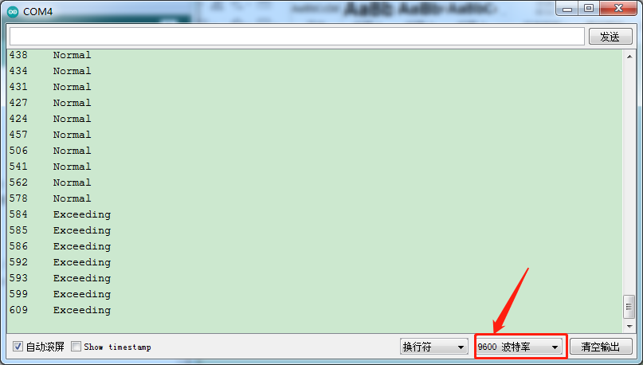

### 实验二十五 摇杆模块

实验说明

大家都应该看过游戏手柄，有些游戏手柄上除了按键，还有摇杆，那摇杆是什么工作原理呢？那么在我们这个套件中，就有一个Keyes DIY电子积木 摇杆模块，它主要采用PS2
手柄摇杆元件。其实它的原理非常简单，内部相当于两个可调电位器（左右和上下）和一个按键，这个按键没被按下时被R1下拉为低电平，按下时接通VCC即为高电平，与我们前面学习过的按键模块是相反的，我们摇动摇杆时内部的电位器就会调节从而输出不同的电压，我们就可以读取到模拟值。控制时，我们需要将模块X Y端口连接单片机模拟口，B端口连接单片机数字口，VCC接单片机电源输出端（3.3-5V），GND接单片机GND。我们可以读取两个模拟值和一个数字口的高低电平情况，判断模块上摇杆的工作状态。

实验中，我们将读取两个模拟值和一个数字值，并在串口监视器上显示测试结果。

实验原理

摇杆电位器在直流电路中作为电流调节使用时，将有电流通过摇杆电位器的滑动臂，此时由于阳极氧化的原因会导致电阻值异常增加。在这种情况下，建议将连接电阻体的端子接负极，滑动臂接正极。如果直流电流直接通过摇杆电位器，摇杆电位器的阳极就会受到氧化损伤，从而让摇杆电位器的阻抗变大，因此最好是将电流的负极接在跟碳膜片接触的端子上，正极接在跟刷子（摇杆电位器接触片）的端子上。摇杆电位器作为可变电阻器时，建议作调整电压的分压器使用，同时摇杆电位器的负载电阻RL应不小于摇杆电位器公称阻值RT的10倍。在稳压器中用来调节输出电压，故设计摇杆电位器应满中顺时针调节时输出电压升高，反时针调节器节时输出电压降低；在可调恒流充电器中摇杆电位器用来调节充电电流折大小，设计摇杆电位器时应满中顺时针调节时，电流增大。

实验器材

||||||
|-|-|-|-|-|
|Keyes Uno Plus 开发板*1|传感器扩展板*1|Keyes DIY电子积木 摇杆模块*1|5P XH-2.54mm 黑红蓝黄绿硅胶线*1|USB线*1|

接线图

测试代码

/\*

Keyes Arduino DIY电子积木 37合1 传感器套装

课程 25

摇杆模块

http://www.keyes-robot.com

\*/

int X = 0;

int Y = 0;

int Button = 0;

void setup() {

Serial.begin(9600);

pinMode(7, INPUT); //定义遥感按钮的PIN为数字口7

}

void loop() {

X = analogRead(A3); //遥感的X轴引脚接模拟值A3

Y = analogRead(A2); //遥感的Y轴引脚接模拟值A2

Button = digitalRead(7); //读取按钮的状态，并在下方打印出来

Serial.write("X:");

Serial.print(X);

Serial.write(" Y:");

Serial.print(Y);

Serial.write(" B:");

Serial.println(Button);

delay(100);

}

代码说明

在实验中，根据接线，x管脚设置为A3，y管脚设置为A2，摇杆按钮管脚设置为7，串口监视器显示测试数据，显示前需设置波特率（我们默认设置为9600，可更改）。

测试结果

上传测试代码成功，利用USB线上电后，打开串口监视器，设置波特率为9600。串口监视器显示对应数值。摇动摇杆，x轴和y轴对应的模拟值发生改变，按下按钮，读取到的数字值为1，否则为0，如下图。

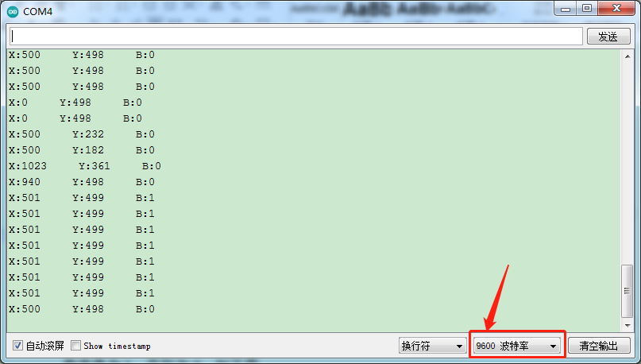

### 实验二十六 太阳光紫外线传感器

实验说明

在这个套件中，有一个Keyes DIY电子积木
太阳光紫外线传感器，这款紫外线传感器用于紫外线指数监测、紫外线辐射剂量测量、火焰检测
。适用于测量智能可穿戴设备的紫外线指数，如手表、智能手机和室外设备的紫外线指数检测。它也可以用来监测紫外线的强度，或者用作紫外线消毒物品时的紫外线火焰探测器。

传感器都有特定的光谱响应，该产品主要是针对太阳光中紫外线测量以及UVA灯强度测量，特别适合UVI的检测。实验中我们将测试结果在串口监视器上显示出来。

实验原理

紫外线传感器输出电流与光照强度成正比，产品输出具有非常高的一致性，模块电路已经设置好，我们直接进行ADC采集模拟信号。

实验器材

||||||
|-|-|-|-|-|
|Keyes Uno Plus 开发板*1|传感器扩展板*1|Keyes DIY电子积 太阳光紫外线传感器*1|3P XH-2.54mm 黑红蓝硅胶线*1|USB线*1|

接线图

测试代码

/\*

Keyes Arduino DIY电子积木 37合1 传感器套装

课程 26

太阳紫外线传感器

http://www.keyes-robot.com

\*/

int val = 0;

void setup() {

Serial.begin(9600);//设置波特率为9600

pinMode(3, INPUT);//设置传感器的PIN输入模式

}

void loop() {

val = digitalRead(3);//读取电平

Serial.print(val);//打印数字电平

if (val == 0) {

Serial.print(" ");

Serial.println("Right");

delay(100);

}

else {

Serial.print(" ");

Serial.println("Left");

delay(100);

}

}

代码说明

设置方法和实验十七类似，这里就不多做介绍了。

测试结果

上传测试代码成功，利用USB线上电后，打开串口监视器，设置波特率为9600。串口监视器显示对应数据和字符。实验中，手握传感器白色接口，当传感器向右倾斜时，val为0，串口监视器显示“Right”字符；当传感器向左倾斜时，val为1，串口监视器显示“Left”字符，如下图。

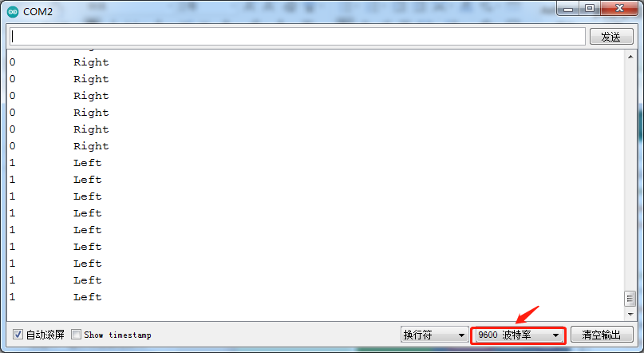

### 实验二十七 SK6812 RGB模块

实验说明

前面我们学习了插件RGB模块，利用PWM信号对模块的三个引脚进行调色。我们这个套价中，还有一个Keyes DIY电子积木 6812 RGB模块，但是这个SK6812 RGB
模块驱动原理不与我们前面学习过的插件RGB模块相同，而且只需要一个引脚就能控制，这是一个集控制电路与发光电路于一体的智能外控LED光源。每个LED原件其外型与一个5050LED灯珠相同，每个元件即为一个像素点，我们这个模块上有四个灯珠即四个像素，

实验中，我们分别使不同的灯亮出不同的颜色。

实验原理

从原理图中我们可以看出，这四个像素点灯珠都是串联起来的，其实不论多少个，我们都可以用一个引脚控制任一一个灯，并且让它显示任一种颜色。像素点内部包含了智能数字接口数据锁存信号整形放大驱动电路，还包含有高精度的内部振荡器和12V高压可编程定电流控制部分，有效保证了像素点光的颜色高度一致。

数据协议采用单线归零码的通讯方式，像素点在上电复位以后，S端接受从控制器传输过来的数据，首先送过来的24bit数据被第一个像素点提取后，送到像素点内部的数据锁存器。这个6812RGB通讯协议与驱动已经在底层封装好了，我们直接调用函数的接口就可以使用，简单方便，LED具有低电压驱动，环保节能，亮度高，散射角度大，一致性好，超低功率，超长寿命等优点。

实验器材

||||||
|-|-|-|-|-|
|Keyes Uno Plus 开发板*1|传感器扩展板*1|Keyes DIY电子积木 6812 RGB模块*1|3P XH-2.54mm 黑红蓝硅胶线*1|USB线*1|

接线图

测试代码

/\*

Keyes Arduino DIY电子积木 37合1 传感器套装

课程 27

6812RGB

http://www.keyes-robot.com

\*/

//添加RGB6812库文件

\#include \<Wire.h\>

\#include \<Adafruit_NeoPixel.h\>

Adafruit_NeoPixel rgb_display(8); //定义一个像素的类

void setup() {

rgb_display.begin(); //启动6812RGB

rgb_display.setPin(8); //设置6812管脚接数字口8

rgb_display.setBrightness(100); //设置亮度为100，范围为0~255

}

void loop() {

rgb_display.setPixelColor(0, 255, 0, 0); //第一颗灯珠亮红色

rgb_display.setPixelColor(1, 0, 255, 0); //第二颗灯珠亮绿色

rgb_display.setPixelColor(2, 0, 0, 255); //第三颗灯珠亮蓝色

rgb_display.setPixelColor(3, 255, 255, 255); //第四颗灯珠亮白色

rgb_display.show(); //显示灯珠颜色

}

代码说明

这里使用到两个库函数，库函数的添加方法请查看第三章第六小节。

我们介绍下主要的几个函数接口及功能：

rgb_display.begin();这个函数用来初始化6812RGB，这是必要的

rgb_display.setPin(8);这个函数用来设置6812RGB所连接的引脚，是必要的

rgb_display.setBrightness(100);这个函数用来设置6812RGB显示的亮度，范围是（0~255），值越大，灯珠越亮，如果我们没有设置亮度，那么默认255，也就是最亮。

rgb_display.setPixelColor(uint16_t n, uint8_t r, uint8_t g, uint8_t b);这个函数用来设置6812RGB的灯珠号也就是位置，及每颗灯珠的颜色。

rgb_display.show();这个函数用来设置显示6812RGB，是必要的，如果没有这条语句，灯珠将不刷新显示

测试结果

烧录好测试代码，按照接线图连接好线，上电后，我们可以看到模块上的四个灯珠分别亮红绿蓝白色，如下图所示。

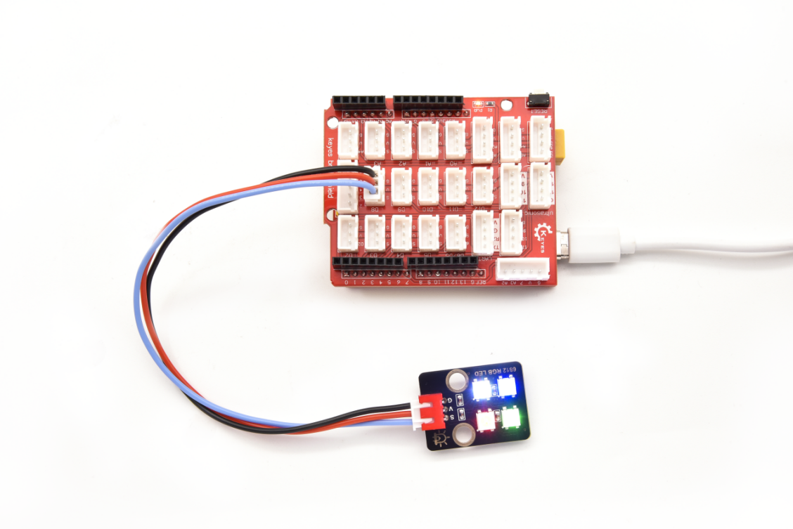

### 实验二十八 旋转编码器模块计数

实验说明

在这个套件中，有一个Keyes DIY电子积木
旋转编码器模块，也叫开关编码器、旋转编码器，EC11系列编码器有直插编码器、贴片式编码器、沉板式编码器、侧插式编码器，EC11A为直插式编码器。因广泛用于车载DVD、车载导航、汽车影音上，也经常被人称为汽车编码器。EC11编码器在各类仪器设备中用于频率、音量、速度、温度、电压、菜单选择、光线强弱等参数的控制。此款编码器有做20脉冲20定位点、15脉冲30定位点两种。调节轴有金属柄和塑胶柄，轴长区间9-30mm，调节轴有全柄、半柄、螺纹柄等类型供您选择。EC11系列编码器主要用于汽车电子、多媒体音响、仪器仪表、家用电器、智能家居、计算机周边、医疗器械等领域。主要用于频率调节、亮度调节、温度调节、音量调节的参数控制等。

实验中，我们利用Keyes DIY电子积木
旋转编码器模块用于计数，当我们顺时针旋转编码器时，设置数据i加1；逆时针旋转编码器时，设置数据i减1；按下编码器中间按键时，打印按键的值；将测试结果在串口监视器上显示。

实验原理

增量式编码器是将位移转换成周期性的电信号，再把这个电信号转变成计数脉冲，用脉冲的个数表明位移的巨细。它主要采用20脉冲旋转编码器元件。它可通过旋转计数正方向和反方向转动过程中输出脉冲的次数，这种转动计数是没有限制的，复位到初始状态，即从0开始计数。如果我们只计算信号的脉冲，则可以使用两个输出中的任何一个来确定旋转位置。但是，如果我们想要确定旋转方向，我们需要同时考虑两个信号。

旋转增量式编码器以转变时输出脉冲，通过计数设备来晓得其方位，当编码器不动或停电时，依托计数设备的内部回忆来记住方位。这样，当停电后，编码器不能有任何的移动，当来电作业时，编码器输出脉冲进程中，也不能有搅扰而丢掉脉冲，否则，计数设备回忆的零点就会偏移，并且这种偏移的量是无从晓得的，只要过错的出产成果呈现后才晓得。

实验器材

||||||
|-|-|-|-|-|
|Keyes Uno Plus 开发板*1|传感器扩展板*1|Keyes DIY电子积木 旋转编码器模块*1|5P XH-2.54mm 黑红蓝黄绿硅胶线*1|USB线*1|

接线图

测试代码

/\*

Keyes Arduino DIY电子积木 37合1 传感器套装

课程 28

旋转编码器

http://www.keyes-robot.com

\*/

\#include \<Encoder.h\>//导入编码器的库

int SW = 4; //编码器按钮就数字口4

int DT = 3;

int CLK = 2;

Encoder encoder(CLK, DT);

int val = 0;

int old = 0;

void setup() {

Serial.begin(9600);//设置波特率

pinMode(SW, INPUT);//按键为输入模式

}

void loop() {

val = encoder.read();//读取编码器的值赋给val

if (digitalRead(SW) == 0) {//如果按键按下

Serial.println(digitalRead(SW));//打印按键值

delay(100);

}

if (old != val) {//与之前读取的值不一样

Serial.println(val);//打印编码器的值

old = val;

}

}

代码说明

1.在实验中，我们需要先把编码器的库导入到我们的IDE库文件夹中，不然编译不过。

2.  我们把CLK设置为2、DAT设置为3。该代码在库文件中设置好了，它的意思是中断2（CLK）下降后，读取数字口3（DAT）电压，当DAT电压为高电平时，旋转编码器的值加1；当DAT电压为低电平时，转编码器的值减1。

3.  然后循环程序中设置按钮管脚（D4）为低电平时，打印出来。

测试结果

上传测试代码成功，利用USB线上电后，打开串口监视器，设置波特率为9600。顺时针旋转编码器，显示数据减小；逆时针旋转编码器，显示数据增加；按下编码器中间按键，显示数据为0，如下图。

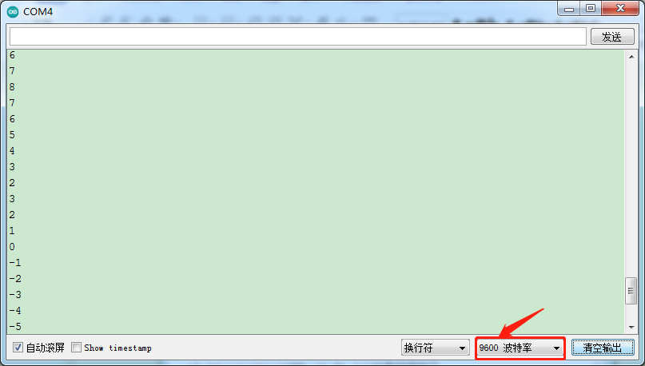

### 实验二十九 舵机的控制原理

实验说明

舵机是一种位置伺服的驱动器，主要是由外壳、电路板、无核心马达、齿轮与位置检测

器所构成。舵机有很多规格，但所有的舵机都有外接三根线，分别用棕、红、橙三种颜

色进行区分，由于舵机品牌不同，颜色也会有所差异，棕色为接地线，红色为电源正极

线，橙色为信号线。

实验原理

舵机的转动的角度是通过调节PWM（脉冲宽度调制）信号的占空比来实现的，标准PWM

（脉冲宽度调制）信号的周期固定为20ms（50Hz），理论上脉宽分布应在1ms到2ms

之间，但是，事实上脉宽可由0.5ms 到2.5ms 之间，脉宽和舵机的转角0°～180°相

对应。有一点值得注意的地方，由于舵机牌子不同，对于同一信号，不同牌子的舵机旋

转的角度也会有所不同。

实验器材

|||||
|-|-|-|-|
|Keyes Uno Plus 开发板*1|传感器扩展板*1|keyes 伺服舵机*1|USB线*1|

接线图

测试代码

//代码1：

/\*

Keyes Arduino DIY电子积木 37合1 传感器套装

课程 29.1

伺服舵机-脉冲函数

http://www.keyes-robot.com

\*/

int servoPin = 9;//舵机的PIN

void setup() {

pinMode(servoPin, OUTPUT);//舵机引脚设置为输出

}

void loop() {

servopulse(servoPin, 0);//转动到0度

delay(1000);//延时1秒

servopulse(servoPin, 90);//转动到90度

delay(1000);

servopulse(servoPin, 180);//转动到180度

delay(1000);

}

void servopulse(int pin, int myangle) { //脉冲函数

int pulsewidth = map(myangle, 0, 180, 500, 2500); //将角度映射到脉宽

for (int i = 0; i \< 5; i++) { //多输出几次脉冲

digitalWrite(pin, HIGH);//将舵机接口电平至高

delayMicroseconds(pulsewidth);//延时脉宽值的微秒数

digitalWrite(pin, LOW);//将舵机接口电平至低

delay(20 - pulsewidth / 1000);

}

}

代码2：

/\*

Keyes Arduino DIY电子积木 37合1 传感器套装

课程 29.2

伺服舵机-库函数

http://www.keyes-robot.com

\*/

\#include \<Servo.h\> //舵机库

Servo myservo;

void setup() {

myservo.attach(9);//舵机连接数字口9

}

void loop() {

for (int pos = 0; pos \< 180; pos++) {

myservo.write(pos); //转动到pos角度

delay(15); //加延时转慢一点

}

for (int pos = 180; pos \> 0; pos--) {

myservo.write(pos);

delay(15);

}

delay(2000);//等待2秒

}

代码说明

代码1说明：

1.  map(value, fromLow, fromHigh, toLow,     toHigh)；value为我们要映射的值；fromLow,     fromHigh为当前值的下限和上限；toLow,     toHigh为我们要映射到的目标范围的下限和上限。比如我们在实验中map(myangle,     0, 180, 500,     2500)的意思就是我们传进来一个需要转动的角度值为myangle，然后这个值的范围是0度到180度，我们要映射的范围为500us到2500us，即把0到180转到了500到2500然后被返回了，返回的数据类型为整型，余数会被截断，不进行四舍五入或平均。

2\.
之后我们调用我们定义的的函数servopulse（）就能让舵机转动了，代码中我们设置了让舵机从0度转动到90度再转动到180度，再转动到0度，中间暂停一秒，反复循环。

代码2说明：

1.  首先我们先添加舵机库，不然编译出错。

2.  这个库的方法.attach()方法是连接舵机引脚，我们连到9，10也可以，这里面用到了定时器，使用其他管脚可能会出现冲突。

3.  myservo.write(pos)为转动到pos角度值。myservo.read()是读取舵机当前角度值。

4.  其他设置请参照前面相关的代码注释。

测试结果

实验1 结果：

上传测试代码成功，利用USB线上电后，舵机由0度，90度，180度三个角度循环转动。

实验2 结果：

上传测试代码成功，利用USB线上电后，舵机由0~180度来回转动，并且每15ms转动一度。

### 实验三十 超声波传感器的原理

眼镜猴。它们大多时候都是“沉默寡言”的形象。但来自加利福尼亚洪堡加州州立大学的科学家近日研究发现，其实眼镜猴是不折不扣的“话匣子”，它们时刻都在发出一种超声波，只不过捕食者无法听到而已。据了解，研究人员发现这种眼镜猴发出声音的“最小频率”可达到67千赫，比陆地上任何一种啮齿动物和蝙蝠发出的音量都要高很多，甚至偶尔还能飙升到70千赫。众所周知，任何声音只要达到20千赫以上，就很难被人们所听见，就连听力一向很敏锐的狗，也只能听到23千赫的声音。而眼镜猴甚至可以直接听到90千赫的声音。最为特别的是，在眼镜猴的群体中彼此传递着一种秘密的语言，这种语言会提醒对方注意捕食者的危险。

蝙蝠和某些海洋动物都能够利用高频率的声音进行回声定位或信息交流。它们能通过口腔或鼻腔把从喉部产生的超声波发射出去，利用折回的声波来定向，并判定附近物体的位置、大小以及是否在移动。超声波是一种频率高于20000赫兹的声波，它的方向性好，穿透能力强，易于获得较集中的声能，在水中传播距离远，可用于测距、测速、清洗、焊接、碎石、杀菌消毒等。在医学、军事、工业、农业上有很多的应用。超声波因其频率下限大于人的听觉上限而得名。科学家们将每秒钟振动的次数称为声音的频率，它的单位是赫兹(Hz)。

实验说明

在这个套件中，有一个keyes HC-SR04超声波传感器，它可以检测前方是否存在障碍物，并且检测出传感器与障碍物的详细距离。它的原理和蝙蝠飞行的原理一样，就是超声波模块发送出一种频率很高的超声波信号，通常正常人耳朵的听力的声波范围是20Hz~20kHz，人类无法听到。这些超声波的信号若是碰到障碍物，就会立刻反射回来，在接收到返回的信息之后，通过判断发射信号和接收信号的时间差，计算出传感器和障碍物的距离。

实验中，我们利用传感器检测传感器和障碍物之间的距离，将测试结果在串口监视器上显示。

实验原理

最常用的超声测距的方法是回声探测法，如图，超声波发射器向某一方向发射超声波，在发射时刻的同时计数器开始计时，超声波在空气中传播，途中碰到障碍物面阻挡就立即反射回来，超声波接收器收到反射回的超声波就立即停止计时。超声波也是一种声波，其声速V与温度有关。一般情况下超声波在空气中的传播速度为340m/s，根据计时器记录的时间t，就可以计算出发射点距障碍物面的距离s，即：s=340t/2

HC-SR04超声波测距模块可提供2cm-400cm的非接触式距离感测功能，
测距精度可达高到3mm；模块包括超声波发射器、接收器与控制电路。基本工作原理：

(1)采用IO口TRIG触发测距，给至少10us的高电平信号;

(2)模块自动发送8个40khz的方波，自动检测是否有信号返回；

(3)有信号返回，通过IO口ECHO输出一个高电平，高电平持续的时间就是超声波从发射到返回的时间。

实验器材

||||||
|-|-|-|-|-|
|Keyes Uno Plus 开发板*1|传感器扩展板*1|keyes brick HC-SR04超声波传感器*1|4P XH-2.54mm 黑红蓝黄硅胶线*1|USB线*1|

接线图

测试代码

/\*

Keyes Arduino DIY电子积木 37合1 传感器套装

课程 30

超声波传感器

http://www.keyes-robot.com

\*/

int distance = 0; //定义一个用来接收距离的变量

int EchoPin = 13; //Echo引脚接D13

int TrigPin = 12; //Trig引脚接D12

float checkdistance() { //获取距离

// 预先给出一个短的低电平，以确保一个干净的高脉冲:

digitalWrite(TrigPin, LOW);

delayMicroseconds(2);

// 传感器由10微秒或更长时间的高脉冲触发

digitalWrite(TrigPin, HIGH);

delayMicroseconds(10);

digitalWrite(TrigPin, LOW);

// 读取来自传感器的信号:一个高电平脉冲，

//其持续时间是指从发送ping命令到接收物体回波的时间(以微秒计)。

float distance = pulseIn(EchoPin, HIGH) / 58.00; //换算成距离

delay(10);

return distance;

}

void setup() {

Serial.begin(9600);//设置波特率为9600

pinMode(TrigPin, OUTPUT);//Trig引脚为输出

pinMode(EchoPin, INPUT); //Echo引脚为输入

}

void loop() {

distance = checkdistance();

if (distance \< 2 || distance \>= 400) { //在范围外打印"-1"

Serial.println("-1");

delay(100);

}

else { //打印距离，单位厘米

Serial.print("distance:");

Serial.print(distance);

Serial.println("cm");

delay(100);

}

}

代码说明

HC-SR04超声波传感器最大测试距离为3-4m，最小测试距离为2cm。设置代码当检测距离小于2cm或者大于等于400cm时，串口监视器显示-1。我们在电脑的串口监视器中显示出传感器和障碍物之间的距离。

测试结果

上传测试代码成功，利用USB线上电后，打开串口监视器，设置波特率为9600。如果障碍物在测试范围外，串口监视器显示“-1”；否则，串口监视器显示超声波传感器和前方障碍物之间的距离，单位为cm，如下图。

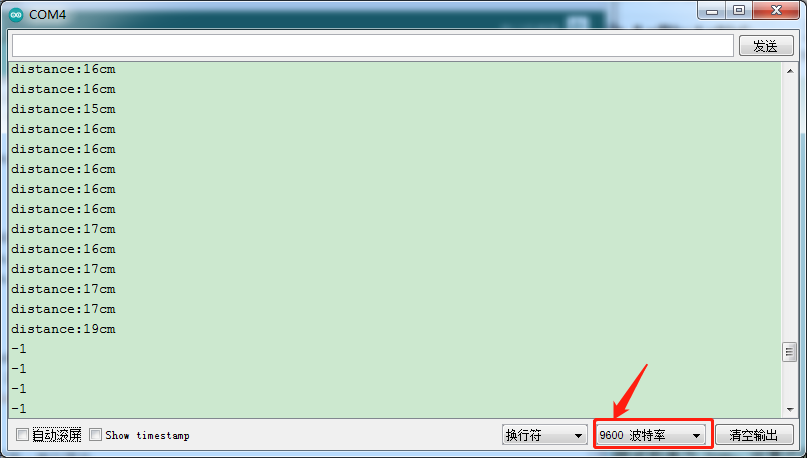

### 实验三十一 红外遥控与接收

实验说明

我们前面也接触了红外信号了，红外线是波长介于微波和可见光之间的电磁波，波长在
760 纳米到 1
毫米之间，是波形比红光长的非可见光。自然界中的一切物体，只要它的温度高于绝对零度(-273)就存在分子和原子的无规则运动，其表面就会不停的辐射红外线。当然了，虽然是都辐射红外线，但是不同的物体辐射的强度是不一样的，而我们正是利用了这一点把红外技术应用到我们的实际开发中。

红外线遥控是目前使用最广泛的一种通信和遥控手段。由于红外线遥控装置具有体积小、功耗低、功能强、成本低等特点，因而，继彩电、录像机之后，在录音机、音响设备、
空凋机以及玩具等其它小型电器装置上也纷纷采用红外线遥控。工业设备中，在高压、
辐射、 有毒气体、 粉尘等环境下，
采用红外线遥控不仅完全可靠而且能有效地隔离电气干扰。红外遥控的发射电路是采用红外发光二极管来发出经过调制的红外光波；红外接收电路由红外接收二极管、三极管或硅光电池组成，它们将红外发射器发射的红外光转换为相应的电信号，再送后置放大器。

这一实验中，我们了解下红外接收传感器的使用方法。红外接收传感器主要采用VS1838B红外接收传感器元件。该元件是集接收、放大、解调一体的器件，内部IC就已经完成了解调，输出的就是数字信号。它可接收标准38KHz调制的遥控器信号。

实验中，我们利用红外接收传感器接收外部红外发射设备发射的红外信号，并将接收信号在串口监视器上显示。

实验原理

在实际的通信领域，发出来的信号一般有较宽的频谱，而且都是在比较低的频率段分布大量的能量，所以称之为基带信号，这种信号是不适合直接在信道中传输的。为便于传输、提高抗干扰能力和有效的利用带宽，通常需要将信号调制到适合信道和噪声特性的频率范围内进行传输，这就叫做信号调制。在通信系统的接收端要对接收到的信号进行解调，恢复出原来的基带信号。这部分通信原理的内容，大家了解一下即可。我们用到的红外遥控器里的红外通信，通常是使用
38K 左右的载波进行调制的。

红外遥控系统的主要部分为调制、发射和接收。红外遥控是以调制的方式发射数据，就是把数据和一定频率的载波进行“与”操作，这样既可以提高发射效率又可以降低电源功耗。调制载波频率一般在30khz到60khz之间，大多数使用的是38kHz，占空比1/3的方波，如图2所示，这是由发射端所使用的455kHz晶振决定的。在发射端要对晶振进行整数分频，分频系数一般取12，所以455kHz÷12≈37.9kHz≈38kHz。38KH载波发射（完整的发射）如下图。

实验器材

<table >

|||||||
|-|-|-|-|-|-|
|Keyes Uno Plus 开发板*1|传感器扩展板*1|keyes DIY电子积木 红外接收模块*1|3P XH-2.54mm 黑红蓝硅胶线*1|USB线*1|遥控器*1|

接线图

测试代码

/\*

Keyes Arduino DIY电子积木 37合1 传感器套装

课程 31

红外接收

http://www.keyes-robot.com

\*/

\#include \<IRremote.h\>

int RECV_PIN = 10;//定义数字口10

IRrecv irrecv(RECV_PIN);

decode_results results;//声明一个IRremote库函数独有的变量类型(decode_resultc)

void setup() {

Serial.begin(9600);//设置波特率

irrecv.enableIRIn();// 使能红外接收

}

void loop() {

if (irrecv.decode(&results)) { //是否接收到红外遥控信号

Serial.println(results.value, HEX); //显示数据

irrecv.resume(); //接收下个数据

}

}

代码说明

编译上传之前我们先导入库文件IRremote.h，导入方法请看前面库文件的添加方法。

下图是红外遥控的键值：

测试结果

按照接线图接线，上传测试代码成功，利用USB线上电后，打开串口监视器，里面就会显示红外接收传感器接收到的数据。

找到红外遥控器，拔出绝缘片，对准红外接收传感器的接收头按下按键。接收到信号后，红外接收传感器上的LED也开始闪烁，串口监视器显示如下图。

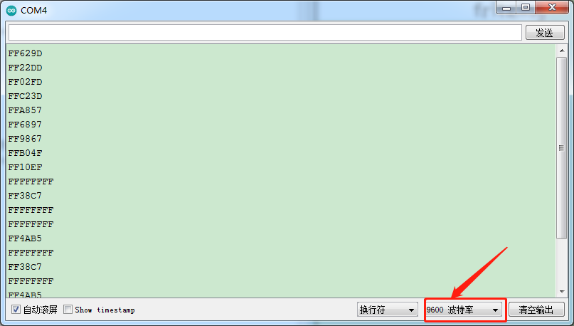

### 实验三十二 DS18B20温度传感器检测温度

实验说明

在这个套件中，有一个Keyes DIY电子积木 DS18B20温度传感器，DS18B20
是美信公司的一款温度传感器，单片机可以通过 1-Wire 协议与 DS18B20
进行通信，最终将温度读出。DS18B20是世界第一片支持"一线总线"接口的温度传感器，一线总线独特而且经济的特点，使用户可轻松组建传感器网络，为测量系统构建系统引入全新概念。

实验中，我们利用这个温度传感器测试当前环境中的温度，测试结果分为℃和℉两种；并且，我们在串口监视器上显示测试结果。

实验原理

1-Wire 总线的硬件接口很简单，只需要把 DS18B20
的数据引脚和单片机的一个 IO
口接上就可以了。硬件的简单，随之而来的，就是软件时序的复杂。1-Wire总线的时序比较复杂，很多同学在这里独立看时序图都看不明白，我们在库里面已经把复杂的时序操作封装好了，直接使用库函数就可以。我们来看一下
DS18B20 的硬件原理图，如图所示。

DS18B20 通过编程，可以实现最高 12
位的温度存储值，在寄存器中，以补码的格式存储，如下图所示。

一共 2 个字节，LSB 是低字节，MSB 是高字节，其中 MSb 是字节的高位，LSb
是字节的低位。大家可以看出来，二进制数字，每一位代表的温度的含义，都表示出来了。其中
S表示的是符号位，低 11 位都是 2 的幂，用来表示最终的温度。DS18B20
的温度测量范围是从-55 度到+125
度，而温度数据的表现形式，有正负温度，寄存器中每个数字如同卡尺的刻度一样分布，如图下所示。

实验器材

||||||
|-|-|-|-|-|
|Keyes Uno Plus 开发板*1|传感器扩展板*1|Keyes DIY电子积木 DS18B20温度传感器*1|3P XH-2.54mm 黑红蓝硅胶线*1|USB线*1|

接线图

测试代码

/\*

Keyes Arduino DIY电子积木 37合1 传感器套装

课程 32

DS18B20

http://www.keyes-robot.com

\*/

\#include \<OneWire.h\>

\#include \<DallasTemperature.h\>

float val1;

float val2;

OneWire oneWire(3);

DallasTemperature sensors(&oneWire);

DeviceAddress insideThermometer;

float ds18b20_getTemp(int w) {

sensors.requestTemperatures();

if (w == 0) {

return sensors.getTempC(insideThermometer);

}

else {

return sensors.getTempF(insideThermometer);

}

}

void setup() {

val1 = 0;

val2 = 0;

Serial.begin(9600);

sensors.getAddress(insideThermometer, 0);

sensors.setResolution(insideThermometer, 9);

}

void loop() {

val1 = ds18b20_getTemp(0);

val2 = ds18b20_getTemp(1);

Serial.print(val1);

Serial.print("C ");

Serial.print(val2);

Serial.println("F");

delay(100);

}

代码说明

1\. 在实验中，我们需要先导入DS18B20的库文件。

2\. 我们把管脚设置为3，获取温度的单位分别设置为℃和℉。

3\. 设置两个小数变量，分别为val1和val2，将所测结果赋值给val1和val2。

4\.
串口监视器显示val1和val2的值，显示前需设置波特率（我们默认设置为9600，可更改）。

5\.
显示时，我们在数据后面添加单位，如果单位直接设置为℃和℉，测试结果会出现乱码。所以我们直接用C代替℃，F代替℉。

测试结果

上传测试代码成功，利用USB线上电后，打开串口监视器，设置波特率为9600。串口监视器显示当前环境的温度，如下图。

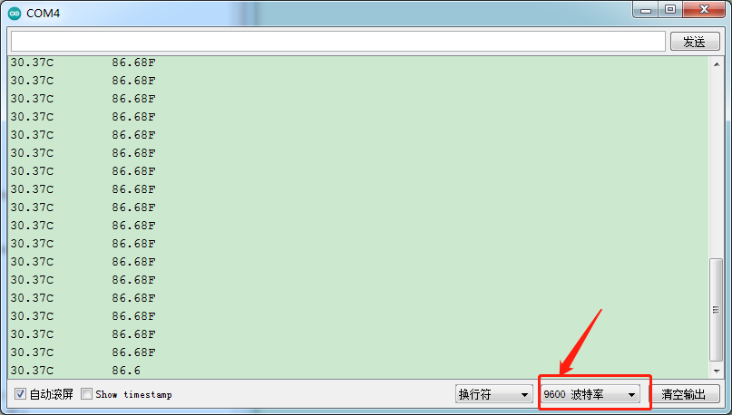

### 实验三十三 XHT11温湿度传感器检测温湿度

实验说明

温湿度与人们生活的关系，如：冬天温度为18至25℃，湿度为30%至80%；夏天温度为23至28℃，湿度为30%至60%。在此范围内感到舒适的人占95%以上。在装有空调的室内，室温为19至24℃，湿度为40%至50%时，人会感到最舒适。如果考虑到温、湿度对人思维活动的影响，最适宜的室温度应是工作效率高。18℃，湿度应是40%至60%，此时，人的精神状态好，思维最敏捷。

在这个套件中，有一个Keyes DIY电子积木
XHT11温湿度传感器，XHT11作为一款低价、入门级的温湿度传感器，常用于我们的单片机设计实例中;它应用专用的数字模块采集技术和温湿度传感技术，确保产品具有极高的可靠性与卓越的长期稳定性。传感器包括一个电阻式感湿元件和一个NTC测温元件，XHT11为4针单排引脚封装，如下图，采用单线制串行接口，只需加适当的上拉电阻，信号传输距离可达20米以上，使其成为各类应用甚至最为苛刻的应用场合的最佳选择。该产品具有品质卓越、超快响应、抗干扰能力强、性价比极高等优点。

实验中，我们用已经封装好底层函数的代码库，利用这个传感器测试当前环境中的温湿度，并且我们在串口监视器上显示测试结果。

实验原理

微处理器与
XHT11之间的通讯和同步,采用单总线数据格式,一次通讯时间4ms左右,数据分小数部分和整数部分,具体格式在下面说明,当前小数部分用于以后扩展,现读出为零，操作流程：一次完整的数据传输为40bit，高位先出。

数据格式：8bit湿度整数数据+8bit湿度小数数据+8bi温度整数数据+8bit温度小数数据+8bit校验和

8位校验和：8bit湿度整数数据+8bit湿度小数数据+8bi温度整数数据+8bit温度小数数据"相加所得结果的末8位。

实验器材

||||||
|-|-|-|-|-|
|Keyes Uno Plus 开发板*1|传感器扩展板*1|Keyes DIY电子积木 XHT11温湿度传感器*1|3P XH-2.54mm 黑红蓝硅胶线*1|USB线*1|

接线图

测试代码

/\*

Keyes Arduino DIY电子积木 37合1 传感器套装

课程 33

DHT11温湿度传感器

http://www.keyes-robot.com

\*/

\#include \<dht11.h\> //include the library code:

dht11 DHT;

\#define DHT11_PIN 3 //定义DHT11为数子口3

void setup() {

Serial.begin(9600);

}

void loop() {

int chk;

chk = DHT.read(DHT11_PIN); // READ DATA

switch (chk) {

case DHTLIB_OK:

break;

case DHTLIB_ERROR_CHECKSUM: //校检和错误返回

break;

case DHTLIB_ERROR_TIMEOUT: //超时错误返回

break;

default:

break;

}

// DISPLAT DATA

Serial.print("humidity:");

Serial.print(DHT.humidity);

Serial.print(" temperature:");

Serial.println(DHT.temperature);

delay(200);

}

代码说明

1\. 在实验中，我们需要先导入XHT11的库文件。

2\.
我们把管脚设置为3，DHT.temperature获取温度和DHT.humidity获取湿度。

3\. 设置两个小数变量，分别为val1和val2，将所测结果赋值给val1和val2。

4\.
串口监视器显示val1和val2的值，显示前需设置波特率（我们默认设置为9600，可更改）。

5\.
显示时，我们在数据后面添加单位。如果温度单位直接设置为℃，测试结果可能出现乱码，所以我们直接用C代替℃；湿度单位直接设置为%。

测试结果

上传测试代码成功，利用USB线上电后，打开串口监视器，设置波特率为9600。串口监视器显示当前环境中的温湿度数据，如下图。

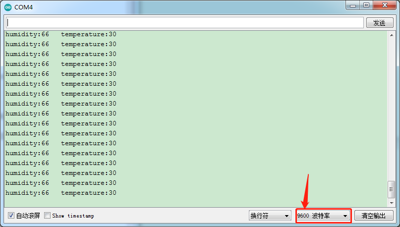

### 实验三十四 DS1307时钟模块

实验说明

这个模块主要用到实时时钟芯片DS1307。是美国DALLAS公司推出的I2C总线接口实时时钟芯片，它可独立于
CPU工作，不受CPU主晶振及其电容的影响，且计时准确，月累积误差一般小于10秒。芯片还具有主电源掉电情况下的时钟保护电路，DS1307的时钟靠后备电池维持工作，拒绝CPU对其读出和写入访问。同时还具有备用电源自动切换控制电路，因而可在主电源掉电和其它一些恶劣环境场合中保证系统时钟的定时准确性。DS1307具有产生秒、分、时、日、月、年等功能，且具有闰年自动调整功能。同时，DS1307芯片内部还集成有一定容量、具有掉电保护特性的静态RAM，可用于保存一些关键数据。

实验中，我们利用DS1307时钟模块获取系统时间，将测试结果在串口监视器上显示出来。

实验原理

DS1307 把8 个寄存器和56 字节的RAM
进行了统一编址，具体地址和寄器数据组织格式如下表：

串行实时时钟记录年、月、日、时、分、秒及星期; AM、PM 分别表示上午和下午;
56 个字节的NVRAM存放数据; 2线串口;
可编程的方波输出;电源故障检测及自动切换电路;电池电流小于500nA。

主要引脚定义如下： X1、32.768kHz 晶振接入端;

VBAT:X2：+3V 电池电压输入;

SDA：串行数据;

SCL：串行时钟;

SQW/OUT：方波/输出驱动器。

实验器材

||||||
|-|-|-|-|-|
|Keyes Uno Plus 开发板*1|传感器扩展板*1|Keyes DIY电子积木DS1307传感器模块*1|4P XH-2.54mm 黑红蓝黄硅胶线*1|USB线*1|

接线图

测试代码

/\*

Keyes Arduino DIY电子积木 37合1 传感器套装

课程 34

DS1307时钟模块

http://www.keyes-robot.com

\*/

\#include \<Wire.h\>

\#include "RtcDS1307.h" //DS1307时钟模块的库

RtcDS1307\<TwoWire\> Rtc(Wire);//i2c接口

void setup(){

Rtc.Begin();

Rtc.SetIsRunning(true);

Rtc.SetDateTime(RtcDateTime(\_\_DATE\_\_, \_\_TIME\_\_));

Serial.begin(9600);//设置波特率为9600

}

void loop(){

//打印年/月/日/时/分/秒/星期

Serial.print(Rtc.GetDateTime().Year());

Serial.print(" ");

Serial.print(Rtc.GetDateTime().Month());

Serial.print(" ");

Serial.print(Rtc.GetDateTime().Day());

Serial.print(" ");

Serial.print(Rtc.GetDateTime().Hour());

Serial.print(" ");

Serial.print(Rtc.GetDateTime().Minute());

Serial.print(" ");

Serial.print(Rtc.GetDateTime().Second());

Serial.print(" ");

Serial.println(Rtc.GetDateTime().DayOfWeek());

delay(1000);//延时1秒

}

代码说明

在实验中，我们需要先导入这个时钟模块的库。Rtc.GetDateTime()为获取当前系统的时间和日期。

Rtc.Begin();启动DS1307实时时钟

Rtc.SetIsRunning(true);运行DS1307实时时钟，如果true改为false则时间暂停

Rtc.SetDateTime()；设置时间

Rtc.GetDateTime().Year() 返回年份

Rtc.GetDateTime().Month() 返回月份

Rtc.GetDateTime().Day()返回日期

Rtc.GetDateTime().Hour()返回时

Rtc.GetDateTime().Minute()返回分

Rtc.GetDateTime().Second()返回秒

Rtc.GetDateTime().DayOfWeek()返回星期

测试结果

烧录好测试代码，按照接线图连接好线；利用USB接口上电后，进入串口监视器，设置波特率为9600。我们可在软件串口监视器中看到设置时间日期（年、月、日、时、分、秒、周），如下图。

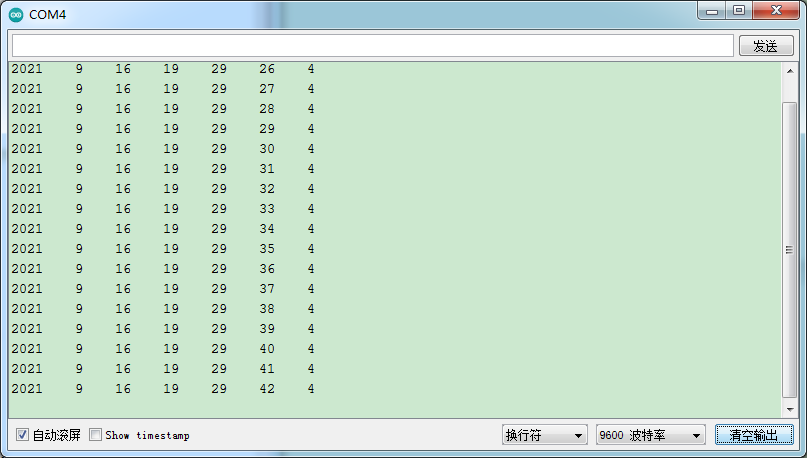

### 实验三十五 TM1650四位数码管模块

实验说明

这个模块主要由一个0.36英寸红色共阳
4位数码管组成，它的驱动芯片是TM1650。使用时，我们只需要2根信号线即可使单片机控制4位8数码管，大大节约了控制板IO口资源。TM1650
是一种带键盘扫描接口的
LED（发光二极管显示器）驱动控制专用电路。内部集成有
MCU输入输出控制数字接口、数据锁存器、LED
驱动、键盘扫描、辉度调节等电路。TM1650
性能稳定、质量可靠、抗干扰能力强，可适用于 24
小时长期连续工作的应用场合。TM1650 采用 2
线串行传输协议通讯（注意该数据传输协议不是标准的I2C协议）。该芯片只需要通过二个引脚与MCU通讯就可以完成数码管的驱动，可以节省MCU引脚资源。

实验中，我们使用封装好的库函数直接驱动，当然大家有兴趣也可以去了解底层的库函数是如何实现的。我们利用四位数码管从0到9999累加显示出来，并刷新时间为0.01秒。

实验原理

TM1650采用的是IIC协议。使用SDA、SCL两条总线。

数据命令设置：0x48，这个是告诉TM1650，我们要用点亮数码管的功能，而不是按键扫描的功能

显示命令设置：

这里实际是一个字节数据，只是不同位部分代表不同功能。   bit\[6:4\]：设置数码管亮度，注意，000是最亮哦。   bit\[3\]：设置要不要显示小数点   bit\[0\]：是不是要开启数码管的显示

数码管显示

比如说，8级亮度，不显示小数点，那就是0x05

起始信号 — 发送数据0x48 — 判断丛机应答 — 发送 数据0x05 — 判断丛机应答 —
终止信号

这样，数码管就打开显示了。

打开之后，在后面显示数字的时候，就不用重复发送数据0x48了，因为我们已经选好了数码管功能。

亮度和显示方式可以做成枚举，清晰，而且多个数据占一个地方，很节省空间

数码管关闭

起始信号 — 发送数据0x48 — 判断丛机应答 — 发送 数据0x00 — 判断丛机应答 —
终止信号

这样，数码管就关闭显示了。

数码管显示数字

我们要显示数字，首先得告诉TM1650，显示的是哪个数码管的数字，下面的数据就对应好了哪个数码管：

然后我们就可以显示数字了，一个数据8个位，刚好对应8个段，1就是亮，0就是灭。

我的话，因为分不清哪个位对那个段，哈哈哈，所以我是循环按位点亮来理清哪个位对哪个段的。

比如点亮数码1显示8，那就是0x68，假设0x7f是8，哈哈哈，因为还有个位是小数点。

那就是：

起始信号 — 发送数据0x68 — 判断丛机应答 — 发送 数据0x7f — 判断丛机应答 —
终止信号

然后，顺利的话，就会在数码管1亮起一个8。

将0~9对应的值，做成一个数组，通过数组下标确定就比较方便了。之后就可以将其完善成一个个小功能，用来显示数字、调节亮度、切换小数点、数码管切换了。

实验器材

||||||
|-|-|-|-|-|
|Keyes Uno Plus 开发板*1|传感器扩展板*1|Keyes DIY电子积木 TM1650四位数码管模块*1|4P XH-2.54mm 黑红蓝黄硅胶线*1|USB线*1|

接线图

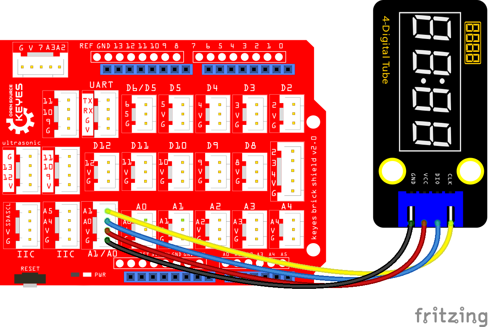

测试代码

/\*

Keyes Arduino DIY电子积木 37合1 传感器套装

课程 35

TM1650四位数码管

http://www.keyes-robot.com

\*/

\#include "KETM1650.h" //导入TM1650的库文件

int item = 0; //要显示的值

KETM1650 tm_4display(A1,A0); //两线接口为A1, A0

void setup(){

tm_4display.init(); //初始化

tm_4display.setBrightness(3); //设置 亮度为3，范围（1~8）

}

void loop(){

tm_4display.displayString(item);//四位数码管显示item值

item = item + 1; //自加一

if (item \> 9999) { //加到超过9999时，清零

item = 0;

}

delay(100); //延时100毫秒

}

代码说明

同样我们需要先导入TM1650模块的库文件，下面介绍一些常用的函数接口：

.init();初始化TM1650

.clear();清除数码管显示

.displayString(char
\*aString);显示字符串，\*aString指向aString的字符串内容

.displayString(String sString);显示字符串，sString为字符串

.displayString(float value);显示小数，内容为float型

.displayString(double value);显示小数，内容为double型

.displayString(int value);显示整数，内容为int型

.displayOn();打开数码管显示

.displayOff();关闭数码管显示，与.clear方法不同的是，一旦关闭必须调用.displayOn();才能重新显示。

.setDot(unsigned int aPos, bool aState);显示小数点，aPos为小数点的位置（0~3）对应（1~4），aState为显示状态：1（true）点亮，2（false）熄灭。

.setBrightness(unsigned int iBrightness);设置数码管的亮度，iBrightness为亮度值（1~8），类型为unsigned int，当设置小于1时自动设置1，当设置大于8时自动设置为8。

细节请看代码注释。

测试结果

烧录好测试代码，按照接线图连接好线,上电后，4位数码管从0开始显示的数字每10毫秒加1，直到大于9999又从0开始。

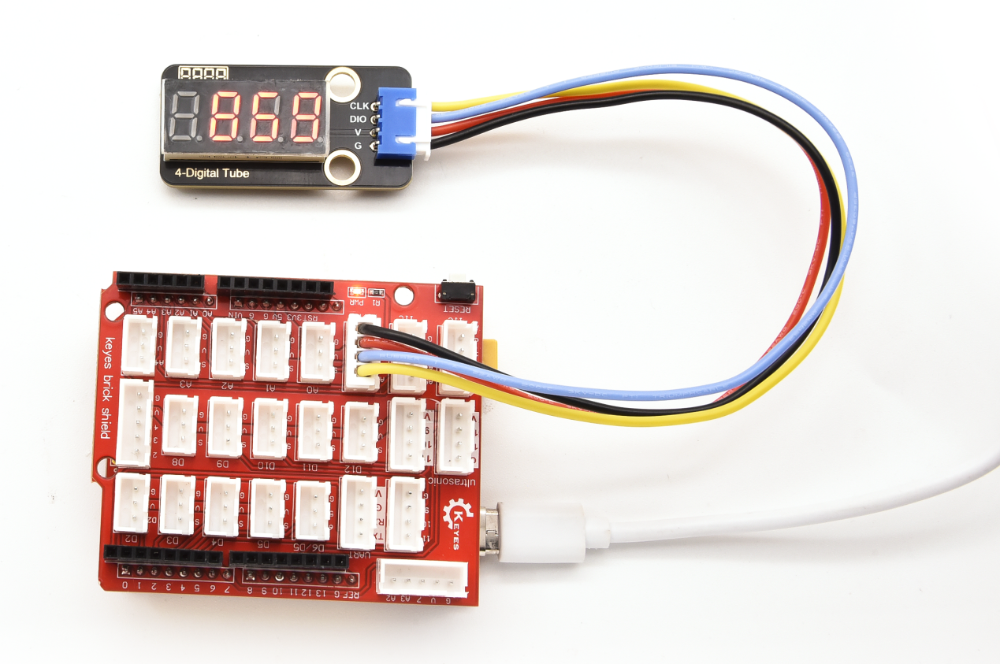

### 实验三十六 HT16K33_8X8点阵模块

实验说明

什么是点阵？我们用之前的方法一个IO口只能控制一个led，如果需要用更少的IO口控制更多的led怎么办呢，于是就有了点阵。

8X8点阵共由64个发光二极管组成，且每个发光二极管是放置在行线和列线的交叉点上，当对应的某一行置1电平，某一列置0电平，则相应的二极管就亮；如要将第一个点点亮，则1脚接高电平a脚接低电平，则第一个点就亮了。实验中我们用点阵显示一个心形图案。

实验原理

如原理图所示，我们如果想要点亮第一行第一列的那个LED灯，只需要把C1置高电平，R1置电平它就亮了，如果我们想让第一行led全部点亮，那么我们让R1为低电平，C1~C8全部为高电平就可以了，原理非常简单。但是这样的话我们总共需要用到16个IO口，这样就极大的浪费单片机资源。为此，我们特别设计了这个模块，利用HT16K33芯片驱动1个8\*8点阵，只需要利用单片机的I2C通信端口控制点阵，大大的节约了单片机资源。

有些模块上自带3个拨码开关，可以让你随意拨动开关，这是用来设置I2C通信地址的。设置方法如下表格。我们的这个模块中，模块已经固定了通信地址，A0，A1，A2全部接地，即地址为0x70.

实验器材

||||||
|-|-|-|-|-|
|Keyes Uno Plus 开发板*1|传感器扩展板*1|Keyes DIY电子积木 HT16K33_8X8点阵模块*1|4P XH-2.54mm 黑红蓝黄硅胶线*1|USB线*1|

接线图

测试代码

/\*

Keyes Arduino DIY电子积木 37合1 传感器套装

课程 36

HT16K33_8X8点阵

http://www.keyes-robot.com

\*/

\#include \<Matrix.h\>//点阵的库

Matrix myMatrix(SDA, SCL);

uint8_t LEDArray\[8\];

const uint8_t LedArray1\[8\] PROGMEM = {0x00, 0x18, 0x3c, 0x7e, 0xff, 0xff, 0x66, 0x00};//心形图案

void setup() {

myMatrix.begin(0x70);//iic地址

myMatrix.clear();//清除显示

myMatrix.setBrightness(5);//亮度5,范围0~15

}

void loop() {

memcpy_P(&LEDArray, &LedArray1, 8);

for (int i = 0; i \< 8; i++)

{

for (int j = 0; j \< 8; j++)

{

if ((LEDArray\[i\] & 0x01))

myMatrix.drawPixel(j, i, 1);

else

myMatrix.drawPixel(j, i, 0);

LEDArray\[i\] = LEDArray\[i\] \>\> 1;

}

}

myMatrix.write(); //显示

}

代码说明

1.  首先我们需要先导入库文件

2.  我们代码中的图案是一个字节数据类型的数组构成，我们在下面的表格上表示出来。

我们将{0x00, 0x18, 0x3c, 0x7e, 0xff, 0xff, 0x66, 0x00}转化为二进制，填入下面的8\*8表格就清晰了。其中1表示亮，0表示灭，我们可以看到是一个心形。

|0|0|0|0|0|0|0|0|
|-|-|-|-|-|-|-|-|
|0|0|0|1|1|0|0|0|
|0|0|1|1|1|1|0|0|
|0|1|1|1|1|1|1|0|
|1|1|1|1|1|1|1|1|
|1|1|1|1|1|1|1|1|
|0|1|1|0|0|1|1|0|
|0|0|0|0|0|0|0|0|

测试结果

烧录好测试代码，按照接线图连接好线；上电后，点阵显示一个心形图案。

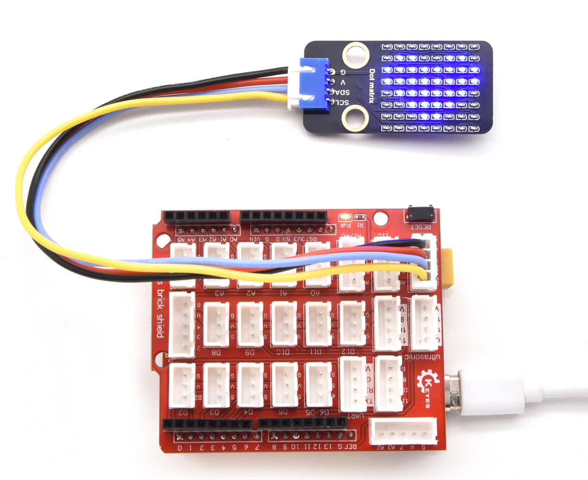

### 实验三十七 RFID刷卡模块

实验说明

这是一个Keyes DIY电子积木
RFID刷卡模块。RFIDRFID-RC522射频模块采用Philips MFRC522原装芯片设计读卡电路，使用方便，成本低廉，适用于设备开发、读卡器开发等高级应用的用户、需要进行射频卡终端设计/生产的用户。本模块可直接装入各种读卡器模具。模块采用电压为5V,通过IIC接口简单的2条线就可以直接与用户任何CPU主板或单片机相连接通信。

实验中我们刷卡模块读取到的数据是4个16进制数，我们把这四个16进制数串为字符串打印出来。例如我们下面读取IC卡的数据为：0x93、0xe6、0x47、0x20，在串口监视器显示出信息字符串就是93e64720；读取钥匙扣的数据为：0x63、0x3d、0x0a、0x54，在串口监视器显示出信息字符串就是633da54。有时候看到的是只有7位是因为前面有个0省略了，如0a它就是a.

实验原理

RFID（Radio Frequency Identification）：无线射频识别，读卡器由频射模块及高平磁场组成。Tag应答器为待感应设备，此设备不包含电池。他只包含微型集成电路芯片及存储数据的介质以及接收和发送信号的天线。读取tag中的数据，首先要放到读卡器的读取范围内。读卡器会产生一个磁场，因为磁能生电由楞次定律，RFID Tag就会供电，从而激活设备。

实验器材

|||||
|-|-|-|-|
|Keyes Uno Plus 开发板*1|传感器扩展板*1|Keyes DIY电子积木 RFID刷卡模块*1|4P XH-2.54mm 黑红蓝黄硅胶线*1|
|||||
|USB线*1|钥匙扣*1|IC卡*1||

接线图

测试代码

/\*

Keyes Arduino DIY电子积木 37合1 传感器套装

课程 37

RFID522 刷卡模块

http://www.keyes-robot.com

\*/

\#include \<Wire.h\>

\#include "MFRC522_I2C.h"

// 0x28 是 SDA 上的 i2c 地址。 如果不匹配，请使用 i2cscanner
检查您的地址

MFRC522 mfrc522(0x28); // 创建 MFRC522 实例。

String rfid_str = "";

void setup() {

Serial.begin(115200); // 设置波特率为115200

Wire.begin(); // 初始化 I2C

mfrc522.PCD_Init(); // 初始化 MFRC522

}

void loop() {

if ( ! mfrc522.PICC_IsNewCardPresent() || !
mfrc522.PICC_ReadCardSerial() ) {

delay(50);

return;

}

rfid_str = "";//字符串清空

Serial.print(F("Card UID:"));

for (byte i = 0; i \< mfrc522.uid.size; i++) {// 转储 UID

rfid_str = rfid_str + String(mfrc522.uid.uidByte\[i\], HEX);
//转为字符串

// Serial.print(mfrc522.uid.uidByte\[i\] \< 0x10 ? " 0" : " ");

// Serial.print(mfrc522.uid.uidByte\[i\], HEX);

}

Serial.println(rfid_str);

}

代码说明

首先导入RFID522的库文件。

Wire.begin(); 我们用到的这个模块是IIC接口的，所以我们先进行IIC初始化

mfrc522.PCD_Init(); MFRC522初始化

String(mfrc522.uid.uidByte\[i\], HEX);
将读取到16进制格式的值转为的字符串

具体请查看代码注释。

测试结果

烧录好测试代码，按照接线图连接好线；上电后，打开串口监视器，设置波特率为9600.当我们用IC卡和钥匙扣靠近RFID模块时，模块读取到的信息打印出来，如下图。

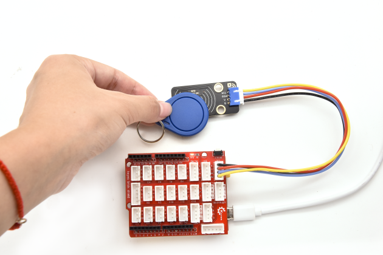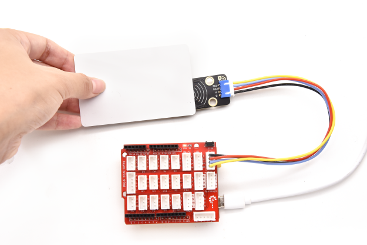

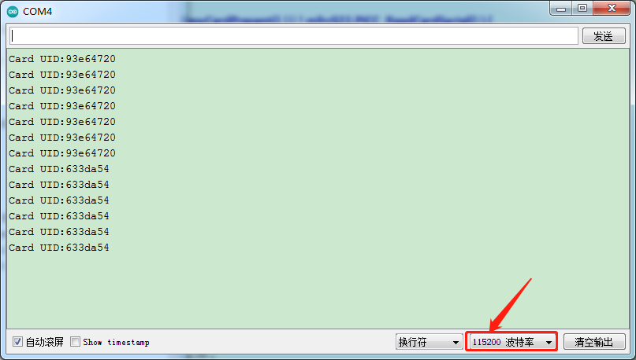

## 传感器/模块组合实验课程

前面课程中，我们单独测试了传感器/模块的功能，功能比较单一。在此，我们可以将多个传感器/模块搭配使用，组合出各种各样的功能。传感器/模块种类比较多，我们只是选择几款比较经典的组合实验。你们也可以根据自己的想法，自己设置代码，组合出你想要的特别的功能。

### 实验三十八 呼吸灯

实验说明

在第一课我们就学习了如何点亮LED灯及让LED闪烁。但是LED的玩法远不仅如此，例如有时候我们看到灯光的慢慢变亮或者慢慢变暗，这个就叫呼吸灯。所谓呼吸灯，就是控制LED首先逐渐变亮，然后逐渐变暗，循环交替，如人体呼吸一样。我们前面是直接用高电平点亮LED,用低电平熄灭LED，如果要让LED不那么亮但又不完全熄灭，那怎么办呢?这个也很简单，我们控制流过LED的电流就可以，电流小了，LED自然就暗了，也就是LED两端的电压小了LED就暗了。如何控制电压呢？前面我们已经学习的插件RGB就是利用PWM原理进行调色，所以我们使用PWM口就可以了，我们PLUS板的PWM口与UNO R3板的PWM口是相同的（D3,D5, D6, D9, D10, D11）。

实验器材

||||||
|-|-|-|-|-|
|Keyes Uno Plus 开发板*1|传感器扩展板*1|Keyes DIY电子积木 白色LED模块*1|3P XH-2.54mm 黑红蓝硅胶线*1|USB线*1|

接线图

测试代码

/\*

Keyes Arduino DIY电子积木 37合1 传感器套装

课程 38

呼吸灯

http://www.keyes-robot.com

\*/

int LED = 3; //LED管脚接数字口3

void setup() {

pinMode(LED, OUTPUT); //设置LED引脚为输出模式

}

void loop() {

for (int i = 0; i \<= 255; i++) { //从0到255，每次加1

analogWrite(LED, i);

delay(10);//延时10ms

}

for (int i = 255; i \>= 0; i--) { //从255到0，每次减1

analogWrite(LED, i);

delay(10);//延时10ms

}

}

代码说明

我们在此实验中用到for (int i = 0; i \<= 255; i = i +
1)；表示变量i从0到255，每次自加1，直到不满足 i \<=
255这个判断表达式，否则一直执行大括号里的代码，即一共执行256次大括号里的代码；同理for (int i = 255; i \>= 0; i = i - 1)；i每次自减1，当不满足i\>=
0时，跳出该for()循环，一共执行256次。

代码中，我们通过利用keyes UNO Plus开发板上PWM口，设置PWM值，控制模块上LED亮度。keyes UNO PLUS开发板上只有D3 D5 D6 D9 D10 D11数字口是PWM口，也就是说如果要控制LED的亮度，信号端就只能接着几个接口。实验中，我们将模块信号端接在D3脚，属于PWM口。设置时我们设置PWM数值越小，模块上LED越暗，数值越大，模块上LED越亮，范围为0-255。analogWrite（pin，value），pin为PWM口，value是要输出的PWM值（0~255）。

通过整合前面知识，我们再来看代码，就清楚多了。将D3的PWM值设置为i，i刚开始由0增加到255，每次加1，每加一次延迟10毫秒，模块上LED逐渐变亮。PWM为255后，i开始由255减小到0，每次减1，每减一次延迟10毫秒，模块上LED逐渐变暗。然后又逐渐变亮，循环交替，如人体呼吸一样。

如果我们感觉逐渐变亮
或者逐渐变暗的时间过长，我们可以更改代码设置。有两种方法，一种是将每次加1减1的延迟时间降低；另一种是更改步长，注意这个步长必须能被255整除，如3 5。步长改为3 -3代表i每次增加3或减小3。

测试结果

上传测试代码成功，上电后，模块上LED逐渐变暗。然后又逐渐变亮，循环交替，如人体呼吸一样。

### 实验三十九 按键控制LED灯

实验说明

从前面的实验课程中我们了解到按键模块按下我们的单片机读取到低电平，松开读取到高电平。在这一实验课程中，我们利用按键和LED做一个扩展，当按键按下时即读取到低电平时我们点亮LED，松开按键时即读取到高电平时我们熄灭LED，这样就可以通过一个模块控制另一个模块了。

实验器材

<table >

|||||||
|-|-|-|-|-|-|
|Keyes Uno Plus 开发板*1|传感器扩展板*1|Keyes DIY电子积木 白色LED模块*1|Keyes DIY电子积木 单路按键模块*1|3P XH-2.54mm 黑红蓝硅胶线*2|USB线*1|

接线图

测试代码

/\*

Keyes Arduino DIY电子积木 37合1 传感器套装

课程 39

按键控制LED灯

http://www.keyes-robot.com

\*/

int button = 0;

void setup() {

pinMode(8, INPUT); //按键的管脚接数字口8并设置为输入模式

pinMode(3, OUTPUT); //LED的管脚接数字口3并设置为输出模式

}

void loop() {

button = digitalRead(8);//读取按键值

if (button == 0) { //按下按键

digitalWrite(3, HIGH); //点亮LED

} else { //松开按键

digitalWrite(3, LOW); //熄灭LED

}

}

代码说明

1.  我们需要跟前面学习的课程一样，根据接线设置传感器/模块连接的IO口，然后配置引脚模式。

2.  我们前面已经知道，按下按键我们读取的值为0，那么我们通过if...else...语句判断按键值为0if     (button == 0)来点亮LEDdigitalWrite(3, HIGH)。

测试结果

上传测试代码成功，按照接线图接好线，利用USB上电后，当我们按下按键，LED被点亮，松开按键，LED熄灭。

### 实验四十 障碍物报警实验

实验说明

在前面实验课程中中，我们利用一个输入模块控制另一个输出模块。在这一实验中，我们还是用一个模块控制另一个模块，当避障传感器检测到障碍物时有源蜂鸣器响起。

生活中，我们可以利用一个检测传感器控制一个有源蜂鸣器响起或者LED点亮，做声光报警设备，如检测磁场（霍尔传感器）、检测倾斜（倾斜模块）等等。

实验器材

<table >

|||||||
|-|-|-|-|-|-|
|Keyes Uno Plus 开发板*1|传感器扩展板*1|Keyes DIY电子积木 避障传感器*1|Keyes DIY电子积木 有源蜂鸣器模块*1|3P XH-2.54mm 黑红蓝硅胶线*2|USB线*1|

接线图

测试代码

/\*

Keyes Arduino DIY电子积木 37合1 传感器套装

课程 40

障碍物报警

http://www.keyes-robot.com

\*/

int item = 0;

void setup() {

pinMode(8, INPUT); //避障传感器接数字口8并设置为输入模式

pinMode(3, OUTPUT); //蜂鸣器接数字口3并设置为输出模式

}

void loop() {

item = digitalRead(8);//读取避障传感器输出的电平值

if (item == 0) {//检测到障碍物

digitalWrite(3, HIGH);//蜂鸣器响起

} else {//没有检测到障碍物

digitalWrite(3, LOW);//蜂鸣器关闭

}

delay(100);//延时100ms

}

代码说明

实验中代码设置和上一课中实验三十九类似，只是将控制LED亮灭换成了控制有源蜂鸣器的响起。

测试结果

上传测试代码成功，按照接线图接好线，上电后，检测到障碍物时，外接的有源蜂鸣器响起声音，否则有源蜂鸣器停止响音。

### 实验四十一 紫外线报警

实验说明

想一想，我们出门在外难免有紫外线伤害，有些智能穿戴设备上就有紫外线提示，我们也可以利用我们学习到的模块做一个紫外线报警设备。在前面实验中，我们利用避障传感器检测前方障碍物控制一个有源蜂鸣器响起。那么我们这个实验就使用一个紫外线传感器来控制有缘蜂鸣器，达到紫外线报警的效果。

实验器材

<table >

|||||||
|-|-|-|-|-|-|
|Keyes Uno Plus 开发板*1|传感器扩展板*1|Keyes DIY电子积木 太阳光紫外线传感器*1|Keyes DIY电子积木 有源蜂鸣器模块*1|3P XH-2.54mm 黑红蓝硅胶线*2|USB线*1|

接线图

测试代码

/\*

Keyes Arduino DIY电子积木 37合1 传感器套装

课程 41

紫外线报警

http://www.keyes-robot.com

\*/

int item = 0;

void setup() {

pinMode(3, OUTPUT); //蜂鸣器接数字口3并设置为输出模式

}

void loop() {

item = analogRead(A3);//读取紫外线传感器输出的模拟值

if (item \>= 20) {//强度高于20

digitalWrite(3, HIGH);//蜂鸣器响起

} else {//否则

digitalWrite(3, LOW);//蜂鸣器关闭

}

delay(100);//延时100ms

}

代码说明

实验中代码设置和前面实验类似，这次我们输入的模块用成了模拟传感器，通过设置一个阈值，超过阈值报警，这里是与前面不同的地方。

测试结果

上传测试代码成功，按照接线图接好线，上电后，我们用紫外线传感器模块检测紫外线，当紫外线达到我们设置的强度时，有源蜂鸣器响起声音。

### 实验四十二 人体红外报警

实验说明

在上一课实验中，我们利用紫外线传感器检测紫外线强度进行报警，在这一实验中，我们利用人体红外热释传感器检测结果控制一个有源蜂鸣器响起。

实验器材

<table >

|||||||
|-|-|-|-|-|-|
|Keyes Uno Plus 开发板*1|传感器扩展板*1|Keyes DIY电子积木 人体红外热释传感器*1|Keyes DIY电子积木 有源蜂鸣器模块*1|3P XH-2.54mm 黑红蓝硅胶线*2|USB线*1|

接线图

测试代码

/\*

Keyes Arduino DIY电子积木 37合1 传感器套装

课程 37

人体红外报警

http://www.keyes-robot.com

\*/

int item = 0;

void setup() {

pinMode(9, INPUT); //人体红外传感器接数字口9并设置为为输入模式

pinMode(3, OUTPUT);//有缘蜂鸣器接数字口3并设置为为输出模式

}

void loop() {

item = digitalRead(9);//读取红外热释传感器输出的数字电平信号

if (item == 1) { //检测到有人运动

digitalWrite(3, HIGH); //打开蜂鸣器

} else { //没有检测到

digitalWrite(3, LOW); //关闭蜂鸣器

}

}

代码说明

实验中代码设置与前面实验相同，这里就不多说了。

测试结果

上传测试代码成功，按照接线图接好线，上电后，传感器检测到附近有人运动时，外接的有源蜂鸣器响起声音，否则有源蜂鸣器停止响声。

### 实验四十三 音乐播放

实验说明

在前面的单个模块是学校中，我们学习了让8002b功放
喇叭模块发出特定频率的声音、播放的节拍以及调节喇叭的声音大小，其实每首音乐就是由一个个特定的节拍与音调（频率）组合而成的。在这一实验中，我们利用这个喇叭模块播放一首音乐。

要演奏出音乐，我们首先需要搞清楚各音调的频率，具体见下表：

低音：

|音调音符|1|2|3|4|5|6|7|
|-|-|-|-|-|-|-|-|
|A|221|248|278|294|330|371|416|
|B|248|278|294|330|371|416|467|
|C|131|147|165|175|196|221|248|
|D|147|165|175|196|221|248|278|
|E|165|175|196|221|248|278|312|
|F|175|196|221|234|262|294|330|
|G|196|221|234|262|294|330|371|

中音：

|音调音符|1|2|3|4|5|6|7|
|-|-|-|-|-|-|-|-|
|A|441|495|556|589|661|742|833|
|B|495|556|624|661|742|833|935|
|C|262|294|330|350|393|441|495|
|D|294|330|350|393|441|495|556|
|E|330|350|393|441|495|556|624|
|F|350|393|441|495|556|624|661|
|G|393|441|495|556|624|661|742|

高音：

|音调音符|1|2|3|4|5|6|7|
|-|-|-|-|-|-|-|-|
|A|882|990|1112|1178|1322|1484|1665|
|B|990|1112|1178|1322|1484|1665|1869|
|C|525|589|661|700|786|882|990|
|D|589|661|700|786|882|990|1112|
|E|661|700|786|882|990|1112|1248|
|F|700|786|882|935|1049|1178|1322|
|G|786|882|990|1049|1178|1322|1484|

我们知道了音调的频率后，下一步就是控制音符的演奏时间。每个音符都会播放一定的时间，这样才能构成一首优美的曲子，而不是生硬的一个调的把所有的音符一股脑的都播放出来。音符节奏分为一拍、半拍、1/4拍、1/8拍，我们规定一拍音符的时间为1；半拍为0.5；1/4拍为0.25；1/8拍为0.125……，所以我们可以为每个音符赋予这样的拍子播放出来，音乐就成了。

这里我们具体以《生日快乐》为例：

实验器材

||||||
|-|-|-|-|-|
|Keyes Uno Plus 开发板*1|传感器扩展板*1|Keyes DIY电子积木 8002b功放 喇叭模块*1|3P XH-2.54mm 黑红蓝硅胶线*1|USB线*1|

接线图

测试代码

/\*

Keyes Arduino DIY电子积木 37合1 传感器套装

课程 43

音乐播放

http://www.keyes-robot.com

\*/

\#define D0 -1

\#define D1 262

\#define D2 293

\#define D3 329

\#define D4 349

\#define D5 392

\#define D6 440

\#define D7 494

\#define M1 523

\#define M2 586

\#define M3 658

\#define M4 697

\#define M5 783

\#define M6 879

\#define M7 987

\#define H1 1045

\#define H2 1171

\#define H3 1316

\#define H4 1393

\#define H5 1563

\#define H6 1755

\#define H7 1971

//列出全部D调的频率

\#define WHOLE 1

\#define HALF 0.5

\#define QUARTER 0.25

\#define EIGHTH 0.25

\#define SIXTEENTH 0.625

//列出所有节拍

int tune\[\] = //根据简谱列出各频率

{

D5, D5, D6, D5, M1, D7,

D5, D5, D6, D5, M2, M1,

D5, D5, M5, M3, M1, D7, D6,

M4, M4, M3, M1, M2, M1

};

float durt\[\] = //根据简谱列出各节拍

{

0.5, 0.5, 1, 1, 1, 1 + 1,

0.5, 0.5, 1, 1, 1, 1 + 1,

0.5, 0.5, 1, 1, 1, 1, 1,

0.5, 0.5, 1, 1, 1, 1 + 1

};

int beeppin = 3; //功放喇叭引脚接D3

int length;

void setup() {

pinMode(beeppin, OUTPUT); //设置蜂鸣器引脚输出模式

length = sizeof(tune) / sizeof(tune\[0\]); //计算长度

}

void loop() {

for (int x = 0; x \< length; x++)

{

tone(beeppin, tune\[x\]);

delay(500 \* durt\[x\]);
//这里用来根据节拍调节延时，500这个指数可以自己调整，在该音乐中，我发现用500比较合适。

noTone(beeppin);

}

delay(2000);

}

代码说明

我们先是列出了所有D调的频率，方便后面使用。然后根据简谱列出各频率，再列出各节拍，我们用到的一个节拍为500ms，这个可以自己调整，然后循环响起音调与对应节拍就成了一首歌曲。

测试结果

上传测试代码成功，按照接线图接好线，功放喇叭模块播放出生日快乐歌曲。

### 实验四十四 旋转编码器模块控制RGB模块

实验说明

在前面课程的实验二十八中，我们利用旋转编码器计数。在这里我们将它扩展一下，通过得出的计数，我们用来控制RGB模块上LED显示不同颜色。

设计代码时，我们需要对所得数据取绝对值。然后我们将数据除以3，得到余数，余数为0控制插件RGB模块上LED亮红光，余数为1，RGB模块上LED亮绿光，余数为2，RGB模块上LED亮蓝光。

实验器材

|||||
|-|-|-|-|
|Keyes Uno Plus 开发板*1|传感器扩展板*1|Keyes DIY电子积木 共阴RGB模块*1|Keyes DIY电子积木 旋转编码器模块*1|
|||||
|4P XH-2.54mm 黑红蓝黄硅胶线*1|5P XH-2.54mm 黑红蓝黄绿硅胶线*1|USB线*1||

接线图

测试代码

/\*

Keyes Arduino DIY电子积木 37合1 传感器套装

课程 44

旋转编码器控制RGB模块

http://www.keyes-robot.com

\*/

\#include \<Encoder.h\>

Encoder encoder(2, 3);

int redPin = 9; //定义红色接D9

int greenPin = 10; //定义绿色接D10

int bluePin = 11; //定义蓝色接D11

int i;

int val;

void setup() {

Serial.begin(9600);

pinMode(redPin, OUTPUT);

pinMode(greenPin, OUTPUT);

pinMode(bluePin, OUTPUT);

}

void loop() {

i = encoder.read();

val = i % 3;

Serial.println(val);

if (val == 0) {

//红色(255, 0, 0)

analogWrite(9, 255);

analogWrite(10, 0);

analogWrite(11, 0);

} else if (val == 1) {

//绿色(255, 0, 0)

analogWrite(9, 0);

analogWrite(10, 255);

analogWrite(11, 0);

} else {

//蓝色(255, 0, 0)

analogWrite(9, 0);

analogWrite(10, 0);

analogWrite(11, 255);

}

delay(100);

}

代码说明

1.  在实验中我们将val设置为i除以3的余数，i是编码器的值。得到余数后根据接线设置管脚为9（红灯）、10（绿灯）和11（蓝灯）。参考前面实验学习的控制方法，利用余数控制模块上LED显示对应灯光颜色，任何数对3进行取余得到的值都是0或1或2，我们就利用这三个值来判断，并显示对应的颜色。

测试结果

上传测试代码成功，按照接线图接好线，上电后，打开串口监视器，设置波特率为9600。旋转编码器，串口监视器显示对应余数。即可控制外接的RGB模块上的LED的颜色（红绿蓝）。

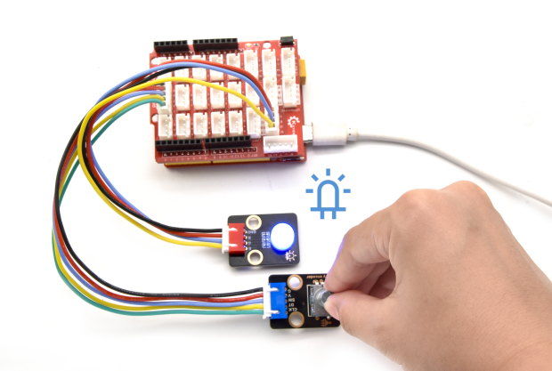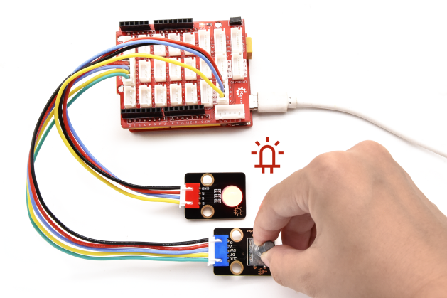

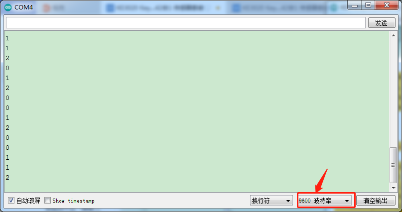

### 实验四十五 电位器调节灯光亮度

实验说明

在前面课程中，我们学习了呼吸灯、按键控制LED灯，我们可不可以把这两个实验现象结合起来呢？答案是肯定的。学习利用可调电位器读取模拟值的方法，我们利用从可调电位器读取到的模拟值控制LED的亮度。设计代码时，模拟值的范围是0-1023；LED的亮度是由PWM值控制，范围为0-255。在这里，我们就需要用到映射功能，将0-1023数值映射到0-255。例如我们读取到模拟值为512，那么通过映射后输出到PWM值就为128。

设置成功后，我们就可以通过旋转电位器，控制模块上LED的亮度。

实验器材

<table >

|||||||
|-|-|-|-|-|-|
|Keyes Uno Plus 开发板*1|传感器扩展板*1|Keyes DIY电子积木 白色LED模块*1|Keyes DIY电子积木 旋转电位器传感器*1|3P XH-2.54mm 黑红蓝硅胶线*2|USB线*1|

接线图

测试代码

/\*

Keyes Arduino DIY电子积木 37合1 传感器套装

课程 45

电位器调节灯光亮度

http://www.keyes-robot.com

\*/

int val1 = 0;//这个变量用来存放模拟值

int val2 = 0;//这个变量用来存放要输出的PWM值

void setup() {

Serial.begin(9600);//设置波特率为9600

}

void loop() {

val1 = analogRead(A3);//读取电位器的模拟值

Serial.print(val1);//打印模拟值

Serial.print(" ");

val2 = map(val1, 0, 1023, 0, 255);//把模拟值范围映射到输出到PWM值范围

Serial.println(val2);//打印转换后的PWM值

analogWrite(3, val2);//引脚3输出PWM值

delay(100);//延时100ms

}

代码说明

设置变量，控制设置，以及串口通信，我们都在前面课程中介绍了。实验中映射功能

将val1从范围0-1023映射到0-255，并赋值给val2，这里可参照前面实验二十九的代码说明。

测试结果

上传测试代码成功，上电后，旋转模块上电位器，就可以调节LED模块上的LED的亮度。

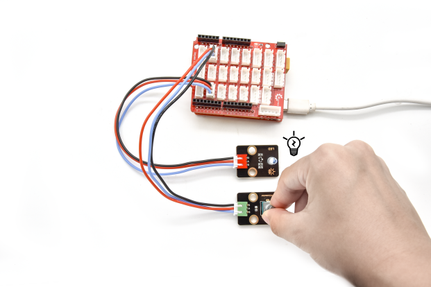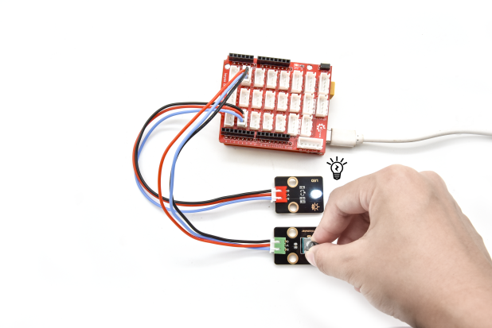

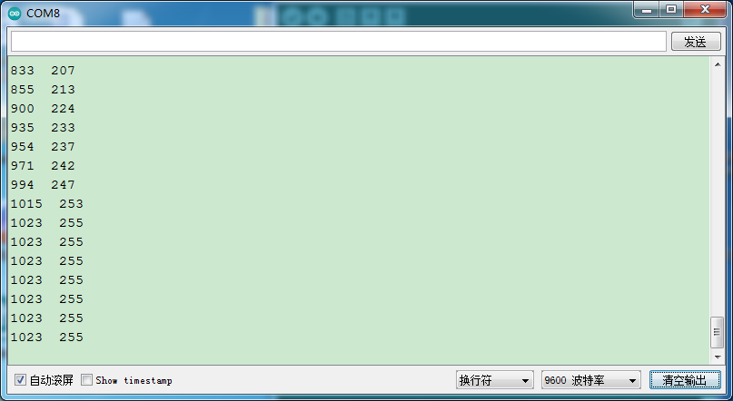

### 实验四十六 智能窗户

实验说明

生活中，我们可以看到各种各样的智能产品，例如智能家居。智能家居里面就有智能窗帘、智能窗户、智能电视、智能灯光啊等等。我们这一实验中要做的就是智能窗帘，原理就是利用水滴水蒸气传感器模块检测雨水，然后通过设置舵机的角度来达到关窗和开窗的效果。

当然这是我们搭模拟的一个场景，主要用于加深我们的印象，达到学以致用的一个效果，在现实生活中，我们窗户不是使用舵机来关的哦。

实验器材

<table >

|||||||
|-|-|-|-|-|-|
|Keyes Uno Plus 开发板*1|传感器扩展板*1|Keyes DIY电子积木 水滴传感器*1|舵机*1|3P XH-2.54mm 黑红蓝硅胶线*1|USB线*1|

接线图

测试代码

/\*

Keyes Arduino DIY电子积木 37合1 传感器套装

课程 46

智能窗户

http://www.keyes-robot.com

\*/

\#include \<Servo.h\>//导入舵机的库文件

int item = 0;//存放水滴传感器输出的模拟值的变量

Servo myservo;//定义一个舵机类实例

void setup(){

myservo.attach(9);//舵机接数字口9

}

void loop(){

item = analogRead(A0);//水滴传感器接模拟口A0

if (item \> 200) {//模拟值大于200

myservo.write(0);//关窗

delay(500);//给舵机一定的时间转动

} else {//没下雨

myservo.write(180);//开窗

delay(500);//延时500ms

}

}

代码说明

实验中代码设置和前面实验类似，通过设置一个阈值，超过这个阈值就将转动舵机。

测试结果

上传测试代码成功，按照接线图接好线，上电后，当水滴传感器检测到一定水量，舵机转动达到关窗的效果，否则舵机转动到另一个角度也就是开窗。

### 实验四十七 声控灯

实验说明

如今智能家居发展迅速，很多人都想自己制作一个可以根据温度和湿度发生变换的智能感光声控灯，在这里我就教大家做一个最简单的智能声控灯。这些灯平时不亮，当我们吼一句或者拍拍手，LED自动亮起；当没有声音时，这些灯就自动关闭。难道是有人在手动控制这些灯光？实际上不是的，实际上这些灯光上都安装有声音探测原价，这些传感器将外界声音的大小，转换成对应数值。然后设置一个临界点，当超过临界点时，控制灯光熄灭，没有超过时，控制灯光亮起。

在这个实验中，我们利用套件中自带的声音电阻传感器和LED模块模拟这一现象。

实验器材

<table >

|||||||
|-|-|-|-|-|-|
|Keyes Uno Plus 开发板*1|传感器扩展板*1|Keyes DIY电子积木 声音传感器*1|Keyes DIY电子积木 白色LED模块*1|3P XH-2.54mm 黑红蓝硅胶线*2|USB线*1|

接线图

测试代码

/\*

Keyes Arduino DIY电子积木 37合1 传感器套装

课程 47

声控灯

http://www.keyes-robot.com

\*/

int val = 0;

void setup() {

Serial.begin(9600);//设置波特率为9600

pinMode(3, OUTPUT);//LED管脚接D3

}

void loop() {

val = analogRead(A1);//声音传感器接A1

Serial.println(val);//串口监视器打印声音模拟值

if (val \> 100) {//模拟值高于100

digitalWrite(3, HIGH);//点亮LED

delay(3000); //延时3秒

}

else {//否则

digitalWrite(3, LOW);//熄灭LED

}

}

代码说明

在实验中，我们设置了当模拟值阈值为150，超过150点亮LED，否则熄灭。

测试结果

上传测试代码成功，利用USB线上电后，打开串口监视器，设置波特率为9600。串口监视器显示对应模拟值。实验中，我们制造声音，数据变大，大于100时，LED模块上LED亮起，否则熄灭。

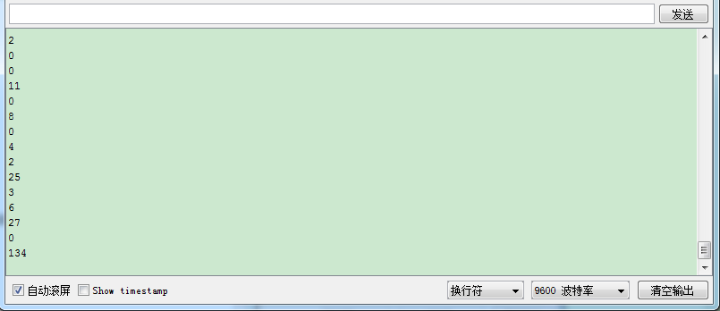

### 实验四十八 火焰报警

实验说明

在前面实验四十一中，我们制作了一个利用紫外线传感器检测紫外线强度来提醒我们的一个场景。在这一实验中，我们制作一个火灾报警系统。同样原理很简单，利用火焰传感器检测结果控制一个有源蜂鸣器响起。

生活中，火灾的危害是相当大的，这个实验虽然简单，但是它是非常具有意义的。

实验器材

|||||
|-|-|-|-|
|Keyes Uno Plus 开发板*1|传感器扩展板*1|Keyes DIY电子积木 火焰传感器*1|Keyes DIY电子积木 有源蜂鸣器模块*1|
|||||
|3P XH-2.54mm 黑红蓝硅胶线*1|4P XH-2.54mm 黑红蓝黄硅胶线*1|USB线*1||

接线图

测试代码

/\*

Keyes Arduino DIY电子积木 37合1 传感器套装

课程 48

火焰报警

http://www.keyes-robot.com

\*/

int item = 0;

void setup() {

Serial.begin(9600);

pinMode(A0, INPUT);//火焰传感器数字管脚接A0

pinMode(3, OUTPUT);//蜂鸣器管脚接D3

}

void loop() {

item = digitalRead(A0);//读取火焰传感器输出的数字电平

Serial.println(item);//换行打印电平信号

if (item == 0) {//检测到火焰

digitalWrite(3, HIGH);//打开蜂鸣器

} else {//否则，关闭蜂鸣器

digitalWrite(3, LOW);

}

delay(100);//延时100ms

}

代码说明

实验中代码设置和实验四十七类似，四十七是设置一个模拟值的阈值，达到这个阈值进行点亮或者熄灭LED，在前面单个传感器模块中我们学到，这个火焰传感器有使用到一个模拟管脚和一个数字管脚，当检测到火焰时，数字管脚输出低电平。前面我们使用到模拟口，这个实验我们就使用数字口。

测试结果

上传测试代码成功，按照接线图接好线，上电后，传感器检测到火焰，外接的有源蜂鸣器响起声音，否则有源蜂鸣器不响。

### 实验四十九 烟雾报警器

实验说明

在前面章节中，实验十三，我们学会了利用有源蜂鸣器模块；实验二十四，我们学会了利用MQ-2
烟雾传感器检测可燃气体；实验三十五，我们学会了控制四位数码管，让四位数码管显示我们想让它显示的数字或字符。我们可以将三个实验结合在一起。设置时，我们通过烟雾传感器测试出可燃气体的浓度。然后，我们利用浓度大小控制有源蜂鸣器报警和四位数码管显示浓度来制作一个简单的烟雾报警器。

实验器材

|||||
|-|-|-|-|
|Keyes Uno Plus 开发板*1|传感器扩展板*1|Keyes DIY电子积木 MQ-2模拟气体传感器*1|Keyes DIY电子积木 有源蜂鸣器模块*1|
|||||
|Keyes DIY电子积木 TM1650四位数码管模块*1|3P XH-2.54mm 黑红蓝硅胶线*1|4P XH-2.54mm 黑红蓝黄硅胶线*2|USB线*1|

接线图

测试代码

/\*

Keyes Arduino DIY电子积木 37合1 传感器套装

课程 49

烟雾报警器

http://www.keyes-robot.com

\*/

\#include "KETM1650.h"

int val = 0;

KETM1650 tm_4display(A5, A4);

void setup() {

tm_4display.init();//TM1650初始化

pinMode(3, OUTPUT);//有缘蜂鸣器接D3

}

void loop() {

val = analogRead(A1);//读取烟雾模拟值

tm_4display.displayString(val);//四位数码管显示模拟值

if (val \> 100) {//模拟值大于100

digitalWrite(3, HIGH); //蜂鸣器报警

} else {//否则

digitalWrite(3, LOW); //关闭蜂鸣器

}

delay(100);//延时100ms

}

代码说明

定义一个整数变量val，用于存储烟雾传感器的模拟值，然后我们把这个模拟值显示在四位数码管中，再设置一个阈值，达到这个阈值让有缘蜂鸣器响起来。

测试结果

上传测试代码成功，按照接线图接好线，上电后，检测到可燃气体浓度超标时，外接有源蜂鸣器模块上蜂鸣器报警，四位数码管显示浓度值。

### 实验五十 6812花样彩灯

实验说明

晚上的时候，我们可以看到各种各样的非常漂亮，炫目的灯光。城市的夜景也是是一个个霓虹灯组成，其实这么美丽炫目的灯光，我们也可以用我们的模块来完成。在前面实验二十七，我们学会了使用6812RGB模块，我们知道这个模块只用到一个管脚便可点亮任何一个灯的任何一种颜色；我们这个实验就通过制作一个炫目的灯光来加深对这个灯的印象。（注意，灯光的亮度可能过高，避免用眼睛长时间直视灯珠！以免损害我们的眼睛。）

实验器材

||||||
|-|-|-|-|-|
|Keyes Uno Plus 开发板*1|传感器扩展板*1|Keyes DIY电子积木 6812 RGB模块*1|3P XH-2.54mm 黑红蓝硅胶线*1|USB线*1|

接线图

测试代码

/\*

Keyes Arduino DIY电子积木 37合1 传感器套装

课程 50

6812花样彩灯

http://www.keyes-robot.com

\*/

\#include \<Wire.h\>

\#include \<Adafruit_NeoPixel.h\>

//用来储存RGB颜色的变量

int R = 0;

int G = 0;

int B = 0;

int num = 0;//存放灯号

Adafruit_NeoPixel rgb_display(8);//创建一个6812类实例

void setup() {

rgb_display.begin();

rgb_display.setPin(8);//6812管脚接数字口8

}

void loop() {

//取0~255之间的随机整数

R = random(0, 255);

G = random(0, 255);

B = random(0, 255);

if (num \< 4) { //num在1~4之间

num = num + 1;

} else {

num = 1;

}

rgb_display.setPixelColor(num - 1, R, G, B); //设置num-1灯号颜色

rgb_display.show();//显示

delay(150);//150ms刷新颜色

rgb_display.setPixelColor(num - 1, 0, 0, 0); //关闭num-1灯号颜色

rgb_display.show();//显示

}

代码说明

random(0, 255):在0~255之间取随机数

.setPixelColor(num - 1, R, G, B)：设置num-1位置灯珠显示RGB颜色

.show()：显示，如果没有这个函数，我们前面设置的将不起作用

测试结果

上传代码成功后，按照接线图接好线，上电，我们就能看到我们6812RGB模块。四个灯珠以随机颜色显示流水灯。

### 实验五十一 超声波雷达

实验说明

我们知道，蝙蝠飞行与获取猎物是通过回声定位的。在现实生活中有种在水里专用的电子设备：声呐，一种声学探测设备，由于
电磁波在水中衰减的速率非常的高，无法做为侦测的讯号来源，因此以声波探测水面下的人造物体成为运用最广泛的手段在水中进行观察和测量，具有得天独厚条件的只有声波。这是由于其他探测手段的作用距离都很短，光在水中的穿透能力很有限，即使在最清澈的海水中，人们也只能看到十几米到几十米内的物体；
电磁波在水中也衰减太快，而且波长越短，损失越大，即使用大功率的低频电磁波，也只能传播几十米。然而，声波在水中传播的衰减就小得多，在[深海声道](https://baike.sogou.com/lemma/ShowInnerLink.htm?lemmaId=73004794&ss_c=ssc.citiao.link)中爆炸一个几公斤的炸弹，在两万公里外还可以收到
信号，低频的声波还可以穿透海底几千米的地层，并且得到地层中的信息。在水中进行测量和观察，至今还没有发现比声波更有效的手段。

在前面实验中，我们学会了控制RGB模块发出彩色光；也学会了利用功放喇叭模块发出不同频率的声音及播放音乐，我们也学会了利用超声波传感器检测前方障碍物的距离，也会用四位数码管来显示检测数据；如果说，我们把这几个模块结合起来呢？我们利用距离大小控制功放喇叭模块模块响起对应频率的声音和RGB亮起对应颜色，然后把这个距离显示在四位数码管上。这就搭建好了一个简易的超声波雷达系统。

实验器材

||||||
|-|-|-|-|-|
|Keyes Uno Plus 开发板*1|传感器扩展板*1|keyes brick HC-SR04超声波传感器*1|Keyes DIY电子积木 8002b功放 喇叭模块*1|Keyes DIY电子积木 共阴RGB模块*1|
||||||
|Keyes DIY电子积木 TM1650四位数码管模块*1|3P XH-2.54mm 黑红蓝硅胶线*1|4P XH-2.54mm 黑红蓝黄硅胶线*3|USB线*1||

接线图

测试代码

/\*

Keyes Arduino DIY电子积木 37合1 传感器套装

课程 51

超声波雷达

http://www.keyes-robot.com

\*/

\#include "KETM1650.h"//四位数码管的库文件

KETM1650 tm_4display(A5, A4);

int beeppin = 3; //定义喇叭引脚为D3

int EchoPin = 13; //Echo引脚接D13

int TrigPin = 12; //Trig引脚接D12

int distance;//超声波测的距离

int redPin = 9; //定义红色接D9

int greenPin = 10; //定义绿色接D10

int bluePin = 11; //定义蓝色接D11

float checkdistance() { //获取距离

// 预先给出一个短的低电平，以确保一个干净的高脉冲:

digitalWrite(TrigPin, LOW);

delayMicroseconds(2);

// 传感器由10微秒或更长时间的高脉冲触发

digitalWrite(TrigPin, HIGH);

delayMicroseconds(10);

digitalWrite(TrigPin, LOW);

// 读取来自传感器的信号:一个高电平脉冲，

//其持续时间是指从发送ping命令到接收物体回波的时间(以微秒计)。

float distance = pulseIn(EchoPin, HIGH) / 58.00; //换算成距离

delay(10);

return distance;

}

void setup() {

tm_4display.init(); //数码管初始化

pinMode(TrigPin, OUTPUT);//Trig引脚为输出

pinMode(EchoPin, INPUT); //Echo引脚为输入

pinMode(beeppin, OUTPUT);//定义功放喇叭模块数字口为输出模式

pinMode(redPin, OUTPUT);

pinMode(greenPin, OUTPUT);

pinMode(bluePin, OUTPUT);

}

void loop() {

distance = checkdistance(); //超声波测距

tm_4display.displayString(distance); //数码管显示距离

if (distance \<= 10) {

tone(beeppin, 880);

delay(100);

noTone(beeppin);

analogWrite(9, 255);//红色(255, 0, 0)

analogWrite(10, 0);

analogWrite(11, 0);

} else if (distance \> 10 && distance \<= 20) {

tone(beeppin, 532);

delay(200);

noTone(beeppin);

analogWrite(9, 0);//蓝色(255, 0, 0)

analogWrite(10, 0);

analogWrite(11, 255);

} else {

analogWrite(9, 0);//绿色(255, 0, 0)

analogWrite(10, 255);

analogWrite(11, 0);

}

}

代码说明

1.  设置时，我们通过调节不同距离范围，设置声音频率和灯光颜色。

2.  为方便控制障碍物距离，我们可以在上面代码中，根据实际情况，在控制逻辑里调节距离范围。

测试结果

上传测试代码成功，按照接线图接好线，上电后，超声波传感器检测到障碍物不同距离时，外接无源蜂鸣器模块上蜂鸣器响起不同频率的声音、RGB亮起不同的颜色，并且测得的距离显示在四位数码管上。

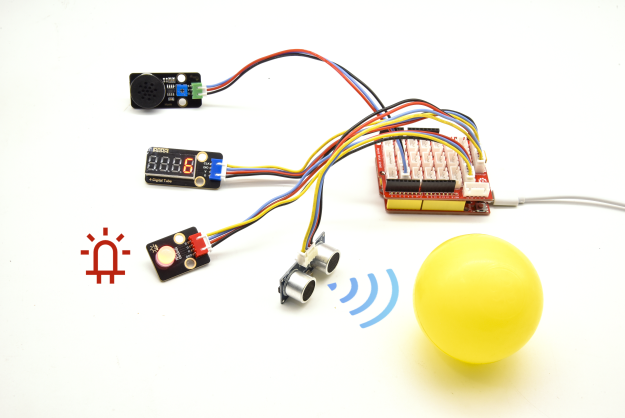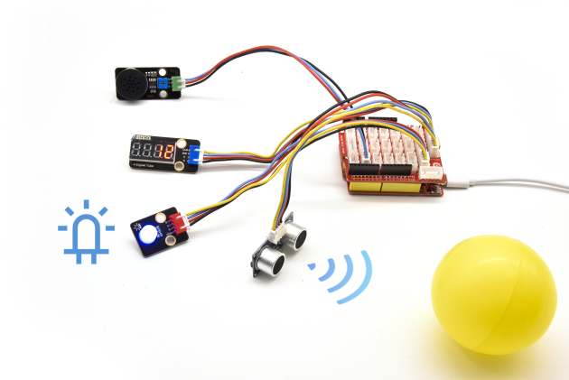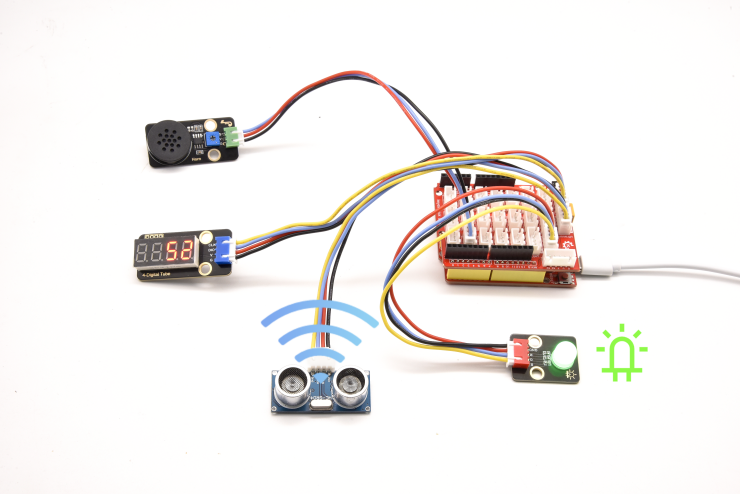

### 实验五十二 红外遥控灯

实验说明

大家生活中不知道有没有这个场景，当我们快要入睡的时候，还没有关灯，然而灯的开关又比较远，当我们起床去关灯，又影响了我们入睡，这个时候大家是不是希望有个遥控器能遥控电视一样来控制灯光，这样就方便多了。在前面实验中，我们学会了点亮或熄灭LED、利用PWM技术调节灯光的亮度；实验三十一，我们学会了使用红外接收模块，并把接收到的遥控器的信息打印了出来。那么在这个实验中，我们就用红外遥控接控制我们的LED模块亮灭和亮度。

当我们接收到一个按键值时，我们通过对应按键值来设置输出的PWM值，这样就可以设置亮度了，控制LED亮灭也一样，但是如果说，在控制LED亮灭这里，我们用同一个按键来控制LED的亮与灭，就需要一个灵活的编程技巧了。我们可以先自己思考，再来看程序。

实验器材

|||||
|-|-|-|-|
|Keyes Uno Plus 开发板*1|传感器扩展板*1|Keyes DIY电子积木 白色LED模块*1|Keyes DIY电子积木 红外接收模块*1|
|||||
|3P XH-2.54mm 黑红蓝硅胶线*2|遥控器*1|USB线*1||

接线图

测试代码

/\*

Keyes Arduino DIY电子积木 37合1 传感器套装

课程 52

红外遥控灯

http://www.keyes-robot.com

\*/

\#include \<IRremote.h\> //导入红外接收库文件

boolean flag = true;//LED标志位

long ir_rec;

IRrecv irrecv(8);

decode_results results;

void setup() {

Serial.begin(9600);

pinMode(5, OUTPUT);//LED管脚接PWM口5

irrecv.enableIRIn();//使能红外接收

}

void loop() {

if (irrecv.decode(&results)) {//接收到信号

ir_rec = results.value; //信号赋给变量ir_rec

Serial.print(ir_rec, HEX); //以十六进制打印变量ir_rec

if (ir_rec == 0xFF02FD && flag == true) { //按下OK键并且flag为true

digitalWrite(5, HIGH); //点亮LED

Serial.print(" LED on"); //打印" LED on"

flag = false;//flag改为false，以便下次熄灭

} else if (ir_rec == 0xFF02FD && flag == false) {
//按下OK键并且flag为false

digitalWrite(5, LOW); //关闭LED

Serial.print(" LED Off"); //打印" LED Off"

flag = true;//flag改为true，以便下次点亮

} else if (ir_rec == 0xFF6897) { //按下1

analogWrite(5, 80);

} else if (ir_rec == 0xFF9867) { //按下1

analogWrite(5, 160);

} else if (ir_rec == 0xFFB04F) { //按下1

analogWrite(5, 240);

}

Serial.println();//换行

irrecv.resume();//下次接收

}

}

代码说明

1\.
与前面定义变量不同，这里我们定义一个布尔变量，布尔变量的值只有两个，真（true）或者假（false），boolean flag = true。

2\.
我们按下OK键时，红外接收的值为0xFF02FD，此时我们需要设置一个布尔变量flag，flag为真(true)的时候点亮LED，为假(false)的时候熄灭LED，点亮LED后我们又把它设置为假，这样当下次按下OK键时，LED将熄灭。

3\. 通过按“1”，“2”，“3”来设置输出PWM值，这个很好理解。

测试结果

上传测试代码成功，按照接线图接好线，上电后，打开串口监视器，设置波特率为9600.按下遥控器按钮，串口监视器显示我们按下的值，按下ok键点亮LED，再次按下LED熄灭LED，按下按键“1”，LED较暗，按下按下按键“2”，LED中等亮度，按下按键“3”，LED较亮。

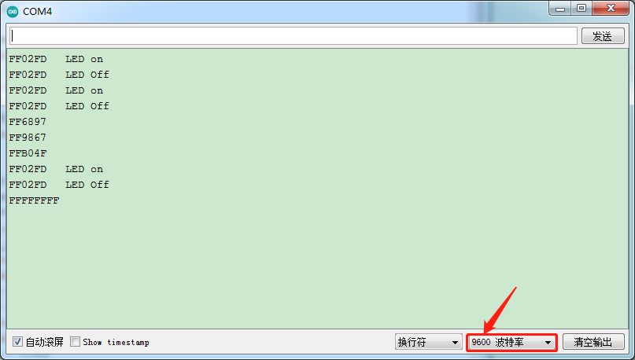

### 实验五十三 温度散热装置

实验说明

生活中，我们的电脑或者电路板芯片等等经常会由于工作时间或者功耗问题而发热严重，所以我们常常需要一个散热装置。

在前面我们学会使用温度传感器和电机模块，所以我们这节实验可以把它们结合起来做成一个智能散热装置。当检测到环境温度高于某一个值时的时候，电机开启，从而降低环境温度，达到散热效果。再把温度值显示在四位数码管中。

实验器材

|||||
|-|-|-|-|
|Keyes Uno Plus 开发板*1|传感器扩展板*1|Keyes DIY电子积木 DS18B20温度传感器*1|Keyes DIY电子积木 130电机模块*1|
|||||
|Keyes DIY电子积木 TM1650四位数码管模块*1|3P XH-2.54mm 黑红蓝硅胶线*1|4P XH-2.54mm 黑红蓝黄硅胶线*2|USB线*1|

接线图

测试代码

/\*

Keyes Arduino DIY电子积木 37合1 传感器套装

课程 53

温度散热装置

http://www.keyes-robot.com

\*/

\#include "KETM1650.h"//导入TM1650库文件

\#include \<OneWire.h\>

\#include \<DallasTemperature.h\>//DS18B20库

int val = 0;

KETM1650 tm_4display(A5, A4);//四位数码引脚CLK接A5,DIO接A4

OneWire oneWire_8(8);

DallasTemperature sensors(&oneWire_8);

DeviceAddress insideThermometer;

float ds18b20_8_getTemp(int w) {

sensors.requestTemperatures();

if (w == 0) {

return sensors.getTempC(insideThermometer);

}

else {

return sensors.getTempF(insideThermometer);

}

}

void setup() {

tm_4display.init();//数码管初始化

sensors.getAddress(insideThermometer, 0);

sensors.setResolution(insideThermometer, 9);

//电机接A0A1

pinMode(A0, OUTPUT);

pinMode(A1, OUTPUT);

}

void loop() {

val = ds18b20_8_getTemp(0);//读取摄氏温度

tm_4display.displayString(val);//数码管显示温度

if (val \> 30) {//超过30摄氏度，开启风扇

digitalWrite(A0, LOW);

digitalWrite(A1, HIGH);

} else {//否则 关闭风扇

digitalWrite(A0, LOW);

digitalWrite(A1, LOW);

}

delay(100);

}

代码说明

变量的设置与存储检测值，与前面我们学习的一样，也是通过设置一个温度的阈值，超过这个阈值进行控制电机转动，然后我们用数码管显示这个温度值。

测试结果

烧录好测试代码，按照接线图连接好线，利用USB线上电后，我们可以在四位数码管中看到当前环境的温度（单位是摄氏度），如下图。当这个值超过我们设定的值时，风扇转动进行散热。

### 实验五十四 智能门禁系统

实验说明

生活中，我们很多门禁系统都是使用射频模块进行开锁了，这样既方便又安全。我们这个套件中就有个射频模块，那就是RFID522刷卡模块，这个实验，我们就利用RFID522刷卡模块和舵机设置一个智能门禁系统。

原理很简单，我们使用RFID522刷卡模块感应，使用IC卡或者钥匙卡来开锁，舵机的作用即门禁锁。

实验器材

|||||
|-|-|-|-|
|Keyes Uno Plus 开发板*1|传感器扩展板*1|Keyes DIY电子积木 RFID刷卡模块*1|舵机*1|
|||||
|4P XH-2.54mm 黑红蓝黄硅胶线*1|USB线*1|钥匙扣*1|IC卡*1|

接线图

测试代码

/\*

Keyes Arduino DIY电子积木 37合1 传感器套装

课程 54

智能门禁系统

http://www.keyes-robot.com

\*/

\#include \<Servo.h\>

\#include \<Wire.h\>

\#include \<MFRC522_I2C.h\>

MFRC522 mfrc522(0x28);

Servo myservo;

String rfid_str = "";

void setup() {

Serial.begin(9600);

Wire.begin();

mfrc522.PCD_Init();

myservo.attach(10);//舵机接数字口10

myservo.write(0);//初始角度0度

delay(500);

}

void loop() {

if ( ! mfrc522.PICC_IsNewCardPresent() || !
mfrc522.PICC_ReadCardSerial() ) {

delay(50);

return;

}

rfid_str = "";//字符串清空

Serial.print(F("Card UID:"));

for (byte i = 0; i \< mfrc522.uid.size; i++) {// 转储 UID

rfid_str = rfid_str + String(mfrc522.uid.uidByte\[i\], HEX);
//转为字符串

// Serial.print(mfrc522.uid.uidByte\[i\] \< 0x10 ? " 0" : " ");

// Serial.print(mfrc522.uid.uidByte\[i\], HEX);

}

Serial.print(rfid_str);

if (rfid_str == "93e64720" || rfid_str == "633da54") {

myservo.write(180);

delay(500);

Serial.println(" open the door!");

}

}

代码说明

前面实验中，我们刷卡模块已经测试出来了IC卡和钥匙扣的信息，我们就利用这个对应的信息来控制舵机转动对应的角度，从而实现开锁门。

测试结果

上传测试代码成功，按照接线图接好线，利用USB上电后，打开串口监视器，设置波特率为9600；串口监视器显示刷卡信息。当我们使用IC卡或者钥匙卡刷卡时，串口监视器显示出卡信息和“open the door”，如下图，舵机转动到对应的角度模拟开门。

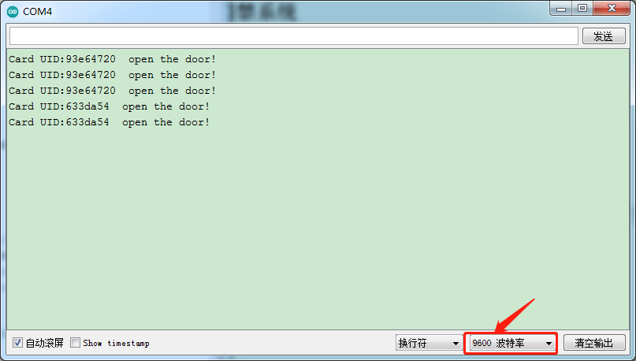

### 实验五十五 综合实验

实验说明

在前面我们做了很多实验，也做了多个传感器模块扩展实验。可能有些同学就会觉得太过简单？不妨，在这一实验中，我们将搭配更多个传感器模块组合在一起。我们已经做过很多个实验，编程方法也有多种，我们这个实验设置时，参考前一章节实验八和本章节实验四十四编程的方法。我们利用外接按键模块，每按一次按键，功能变换一次，实验功能循环交替。其实搭配的实验多种多样，大家可以发挥我们的想象力，做出更多具有意义的实验。

实验器材

<table >

||||||
|-|-|-|-|-|
|Keyes Uno Plus 开发板*1|传感器扩展板*1|Keyes DIY电子积木 白色LED模块*1|Keyes DIY电子积木 单路按键模块*1|Keyes DIY电子积木 XHT11温湿度传感器*1|
||||||
|Keyes DIY电子积木 旋转电位器传感器*1|Keyes DIY电子积木 红外接收模块*1|Keyes DIY电子积木 摇杆模块*1|keyes brick HC-SR04超声波传感器*1|Keyes DIY电子积木 光敏电阻传感器*1|
||||||
|Keyes DIY电子积木 6812 RGB模块*1|3P XH-2.54mm 黑红蓝硅胶线*7|4P XH-2.54mm 黑红蓝黄硅胶线*1|5P XH-2.54mm 黑红蓝黄绿硅胶线*1|USB线*1|
||||||
|JMP-1 17键 红外遥控器*1|||||

接线图

测试代码

/\*

Keyes Arduino DIY电子积木 37合1 传感器套装

课程 55

综合实验

http://www.keyes-robot.com

\*/

\#include \<Wire.h\>//IIC文件

\#include \<Adafruit_NeoPixel.h\>//6812的库

\#include \<IRremote.h\>//红外接收的库

\#include \<dht11.h\> //dht11的库

//rgb6812接数字口8

Adafruit_NeoPixel rgb_display(8);

//红外接收接数字口11

IRrecv irrecv(11);

decode_results results;

//定义DHT11为数子口5

dht11 DHT;

\#define DHT11_PIN 5

//摇杆模块接口

int X = A3;

int Y = A2;

int KEY = 7;

//电位器管脚接模拟口A0

int resPin = A0;

//LED接数字口9

int LED = 9;

//光敏电阻模块接模拟口A1

int light_pin = A1;

//超声波传感器接口

int Trig = 12;

int Echo = 13;

//按键模块接口

int button = 2;

int PushCounter = 0;//存放按键按下的次数

int State = 1;//按键的状态

int LastState = 1;//上一个状态，要么按下，要么松开，两种状态

int PushCounter1 = 0;//对PushCounter取余后的值

void setup() {

Serial.begin(9600);//设置波特率为9600

rgb_display.begin();

rgb_display.setPin(8);

irrecv.enableIRIn();//使能红外接收

pinMode(KEY, INPUT);//遥感模块的按钮

pinMode(button, INPUT);//按键模块

pinMode(Trig, OUTPUT);//超声波模块

pinMode(Echo, INPUT);

}

void loop() {

State = digitalRead(button);//读取按键模块的状态

if (LastState != State) { //按键的状态改变了

if (State == 0) { //按下了按键

PushCounter = PushCounter + 1; //累计按下次数加1

}

}

LastState = State;//刷新上一次状态

PushCounter1 = PushCounter % 7;
//对按下状态对7取余，也就是按7次就重新开始

if (PushCounter1 == 0) { //余数为0

yushu_0(); //6812显示

} else if (PushCounter1 == 1) { //余数为1

yushu_1(); //显示红外遥控信号

} else if (PushCounter1 == 2) { //余数为2

yushu_2(); //显示温湿度值

} else if (PushCounter1 == 3) { //余数为3

yushu_3(); //显示摇杆值

} else if (PushCounter1 == 4) { //余数为4

yushu_4(); //显示电位器控制LED

} else if (PushCounter1 == 5) { //余数为5

yushu_5(); //显示光敏模拟值

} else if (PushCounter1 == 6) { //余数为6

yushu_6(); //显示超声波测的距离

}

}

//6812

void yushu_0() {

int R = random(0, 255);

int G = random(0, 255);

int B = random(0, 255);

rgb_display.setPixelColor(0, R, G, B);

rgb_display.show();

rgb_display.setPixelColor(1, R, G, B);

rgb_display.show();

rgb_display.setPixelColor(2, R, G, B);

rgb_display.show();

rgb_display.setPixelColor(3, R, G, B);

rgb_display.show();

delay(300);

}

//红外接收

void yushu_1() {

if (irrecv.decode(&results)) {

long ir_rec = results.value;

Serial.println(ir_rec, HEX);

irrecv.resume();

}

}

void yushu_2() {

int chk = DHT.read(DHT11_PIN); // 读取数据

switch (chk) {

case DHTLIB_OK:

break;

case DHTLIB_ERROR_CHECKSUM: //校检和错误返回

break;

case DHTLIB_ERROR_TIMEOUT: //超时错误返回

break;

default:

break;

}

//打印数据

Serial.print("Temperature:");

Serial.print(DHT.temperature);

Serial.print("C ");

Serial.print("Humidity:");

Serial.print(DHT.humidity);

Serial.println("%");

delay(100);

}

void yushu_3() {

int x = analogRead(A3);

int y = analogRead(A2);

int key = digitalRead(KEY);

Serial.print("X:");

Serial.print(x);

Serial.print(" Y:");

Serial.print(y);

Serial.print(" KEY:");

Serial.println(key);

delay(100);

}

void yushu_4() {

int RES = analogRead(resPin);

int res = map(RES, 0, 1023, 0, 255);

Serial.println(res);

analogWrite(LED, res);

delay(100);

}

void yushu_5() {

int light = analogRead(light_pin);

Serial.println(light);

delay(100);

}

void yushu_6() {

float distance = checkdistance();

Serial.print("distance:");

Serial.print(distance);

Serial.println("cm");

delay(100);

}

float checkdistance() {

digitalWrite(Trig, LOW);

delayMicroseconds(2);

digitalWrite(Trig, HIGH);

delayMicroseconds(10);

digitalWrite(Trig, LOW);

float distance = pulseIn(Echo, HIGH) / 58.00;

delay(10);

return distance;

}

代码说明

1.  设置时，我们参考本章节实验四十四方法。计算出按下按键的次数，除以7，得到余数，为0     1 2 3 4 5     6，根据不同的余数，构造7个独一的函数来控制实验实现不同功能。

2.  参照介绍方法，我们可以在接线中添加或减少传感器/模块，然后在代码中更改实验功能。

测试结果

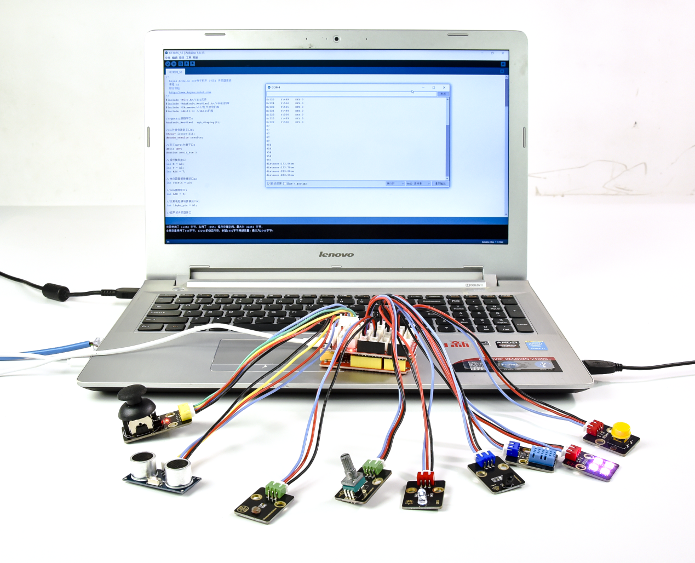

上传测试代码成功，按照接线图接好线，利用USB上电。

刚开始时，按键次数为0，余数为0，6812RGB模块上四个灯珠循环闪烁随机颜色。

点击打开串口监视器，设置波特率为9600，按一下按键（时间长些），6812灯停止闪烁，按键次数为1，余数为1，实验实现的功能是红外接收模块红外发射信息。如果我们利用红外遥控对准接收模块接收头，按下按键，红外接收头接收到信息，串口监视器显示如下。

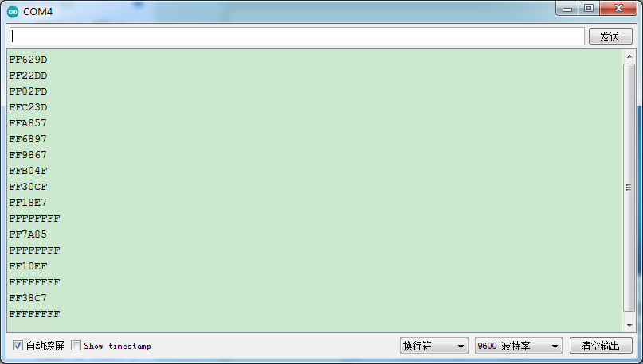

特别注意：如果先按下按键，按键次数变为1，再打开串口监视器时，程序会复位，按键成次数会变为0，需要再按下按键重新设置按键次数。

再按一下按键，按键次数为2，余数为2，实验实现的功能是利用XHT11温湿度传感器读取环境中的温湿度数值，每0.1秒读取一次，串口监视器显示数据如下图。

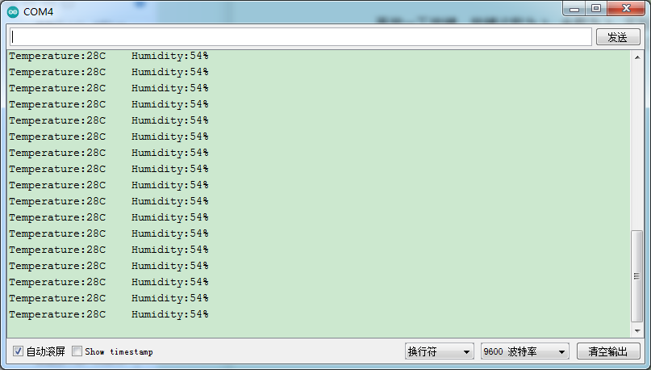

再按一下按键，按键次数为3，余数为3，实验实现的功能是读取摇杆模块传感器X轴和Y轴对应的模拟值，KEY（Z轴）接口对应的数字值，串口监视器显示如下图。

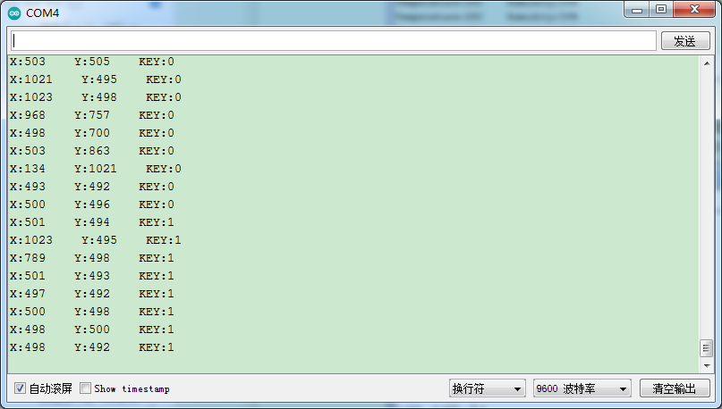

再按一下按键，按键次数为4，余数为4，实验实现的功能是利用外接可调电位器模块调节LED(D5)接口的PWM值，从而调节外接的白色LED模块上LED的亮度。串口监视器显示图下图。

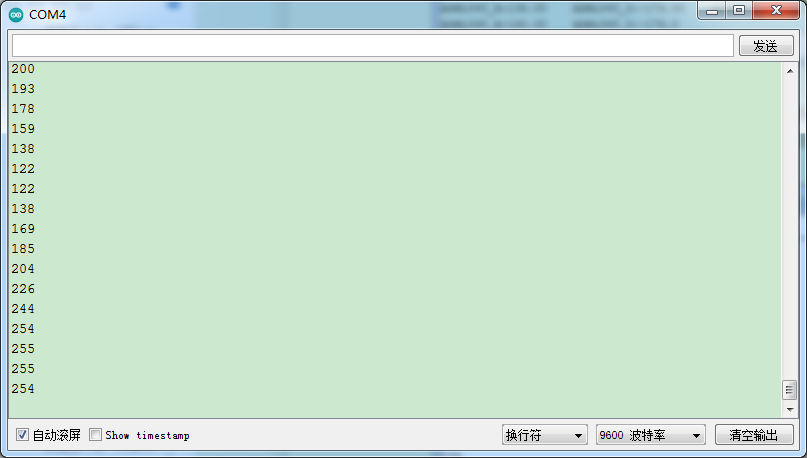

再按一下按键，按键次数为5，余数为5，实验实现的功能是利用外接光敏电阻传感器输出模拟值。串口监视器显示图下图。

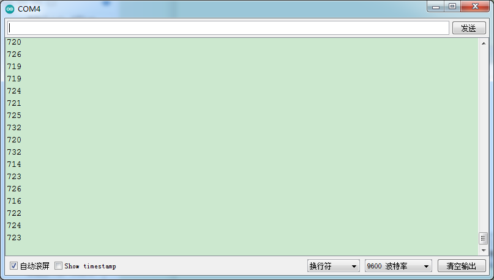

再按一下按键，按键次数为6，余数为6，实验实现的功能是利用超声波模块检测距离并在串口打印出来，串口监视器显示图下图。

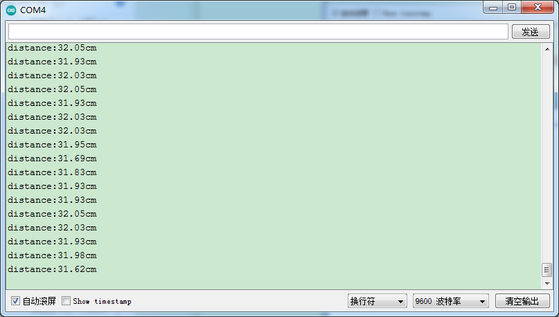

再按一下按键，按键次数为7，余数为0，实现初始时的现象，6812RGB再次闪烁。不断按下按键，余数循环变化，实验功能也循环变化。

