# 软件下载

1. 打开[Software | Arduino](https://www.arduino.cc/en/software)下载软件，然后选择对应的系统下载，下面以window系统为例。（)

   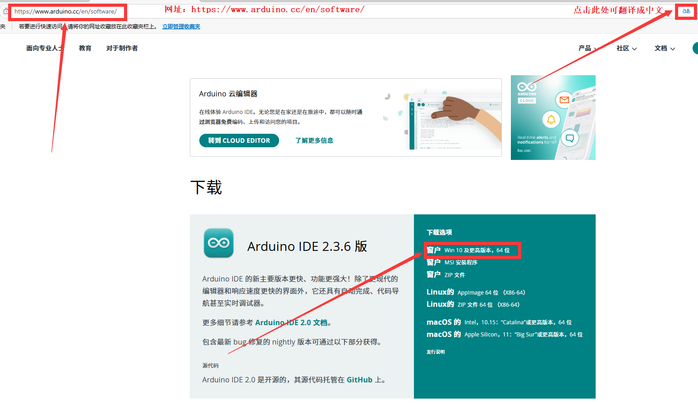

   

2. 然后选择，再一次选择，就可以看到正在下载的页面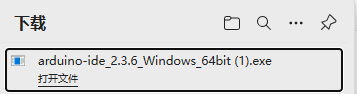。

   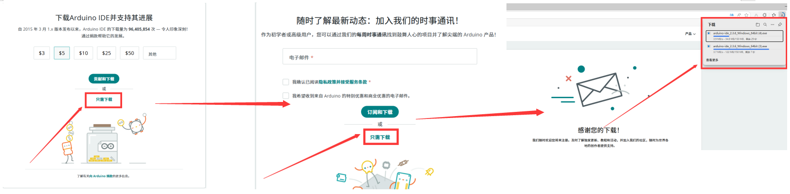

   # 软件安装

   1. 点击此处文件夹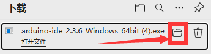进入到下载中心，双击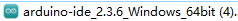进行安装。

      

   2. 选择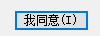，跳转页面后选择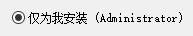,再点击下一步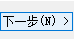。

      

      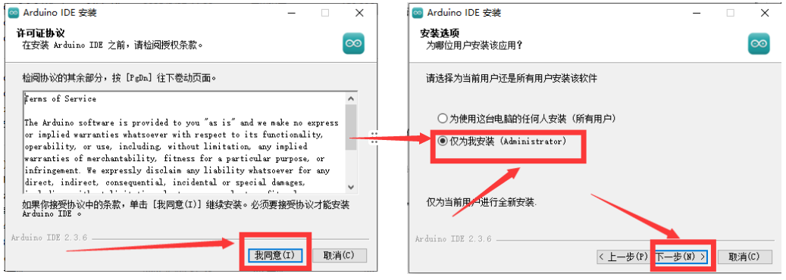

   3. 跳转页面后，点击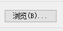，可把软件放到指定位置，点击安装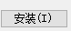，安装完成后，点击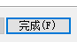。
   
      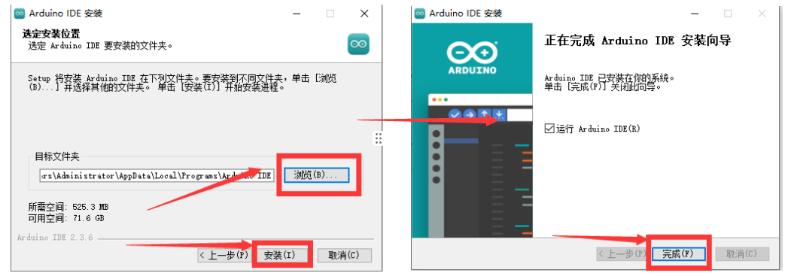
   
      
   
      
   
      
   
      
   
   
   
   
   
   

