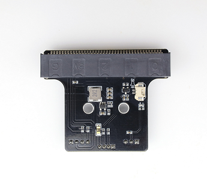
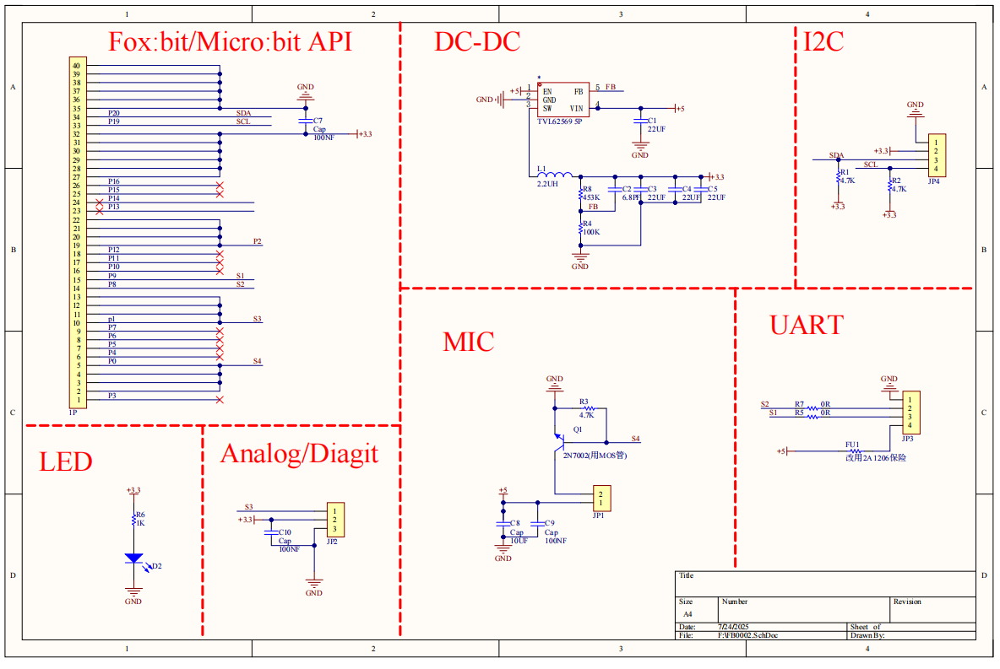
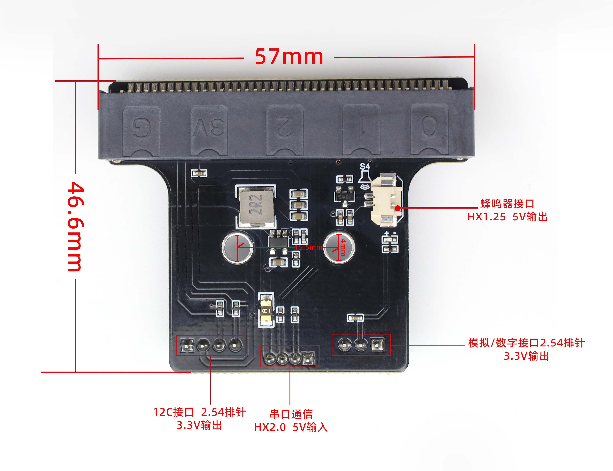

# FB0002 fox:bit T型机器人扩展板

## 产品描述
该扩展版支持输入电源DC5V，带有一路IIC接口、一路串口通信接口、一路模拟/数字接口、以及一路扬声器接口。自带DC-DC降压电路，可支持DC5V转DC3.3V降压。支持我司Fox:bit系列与Micro:bit系列产品。可用于外接扬声器及其它传感器模块。
### 产品参数：
- 输入电压：5V
- 输出电压：3.3V/5V
- 引脚功能：模拟或数字/IIC通信/扬声器/串口通信
- 外观：黑油白字
- 尺寸：57\*46.5\*12MM
- 工作温度：0~50℃
- 重量：14g
## 原理图

## 接口介绍
| Shiled | Micro:bit | Fox:bit |
| :-- | :-- | :-- |
| S1 | P9 | IO16 |
| S2 | P8 | IO17 |
| S3 | P1 | IO14 |
| s4 | P0 | IO12 |
| SDA| P19| IO22 |
| SCL| P20| IO21 |

可根据上表与所使用的开发板查询所对应的扩展引脚。

