# Keyes Arduino DIY电子积木 37合1 传感器套装

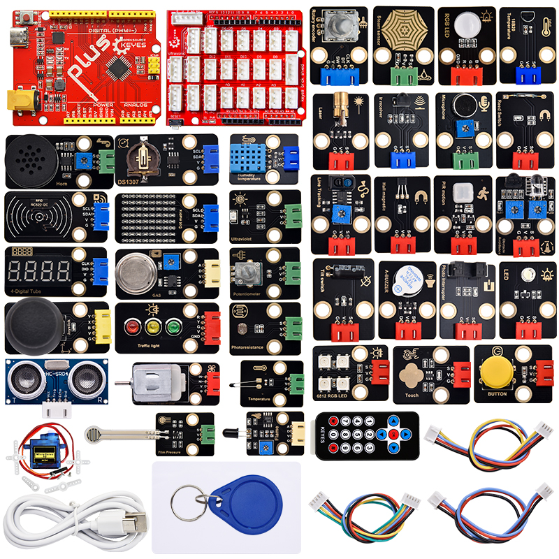

# 产品介绍

Keyes Arduino DIY电子积木 37合1
传感器套装主要包含了我们常用的37款传感器/模块，还有对应的Keyes Uno Plus
开发板、传感器扩展板和连接线。37款传感器/模块上都带有防反接口，和我们提供的传感器扩展板接口完全匹配。使用时，我们只需要将传感器扩展板堆叠在Keyes Uno Plus
开发板，利用1根自带的连接线将传感器/模块连接在扩展板上，简单方便。

为了让你对这个37款传感器/模块有更深入的了解，我们还基于这个37款传感器/模块做个多个学习课程。这些课程是利用arduino IDE软件平台制作的，课程中我们提供了对应的原理图、接线方法、c语言代码、实验结果和简单的代码介绍等信息。通过这些课程，可以让我们对编程方法、逻辑、电子电路有了更深刻的理解。

# 清单

|序号|图片|规格|倍用量|
|-|-|-|-|
|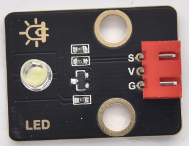|Keyes 2021新款 DIY电子积木 白色LED模块 黑色环保（红色端子）|1|
|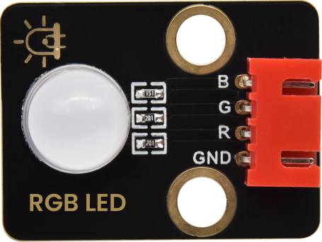|Keyes 2021新款 DIY电子积木 共阴RGB模块 黑色环保（红色端子）|1|
|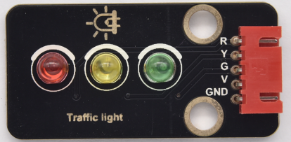|Keyes 2021新款 DIY电子积木 交通灯模块 黑色环保（红色端子）|1|
|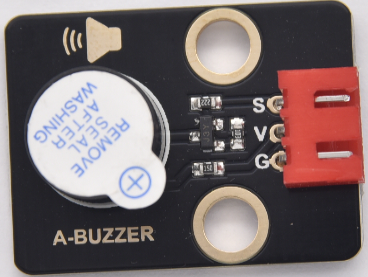|Keyes 2021新款 DIY电子积木 有源蜂鸣器模块 黑色环保（红色端子）|1|
|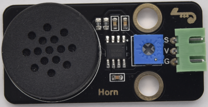|Keyes 2021新款 DIY电子积木 8002b功放 喇叭模块黑色环保（绿色端子）|1|
|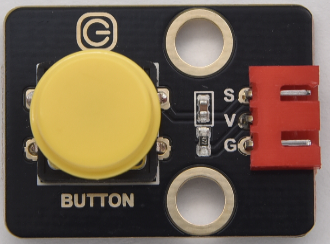|Keyes 2021新款 DIY电子积木 单路按键模块 黑色环保（红色端子）|1|
|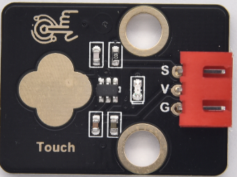|Keyes 2021新款 DIY电子积木 电容触摸模块 黑色环保（红色端子）|1|
|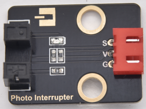|Keyes 2021新款 DIY电子积木 光折断模块 黑色环保（红色端子）|1|
|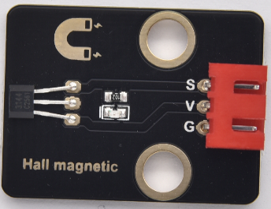|Keyes 2021新款 DIY电子积木 霍尔传感器 黑色环保（红色端子）|1|
|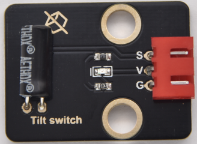|Keyes 2021新款 DIY电子积木 倾斜传感器 黑色环保（红色端子）|1|
|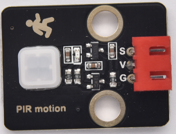|Keyes 2021新款 DIY电子积木 人体红外热释传感器黑色环保（红色端子）|1|
|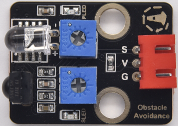|Keyes 2021新款 DIY电子积木 避障传感器 黑色环保（红色端子）|1|
||Keyes 2021新款 DIY电子积木 火焰传感器 黑色环保（黄色端子）|1|
|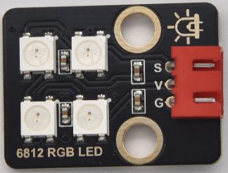|Keyes 2021新款 DIY电子积木 6812 RGB模块 黑色环保（红色端子）|1|
|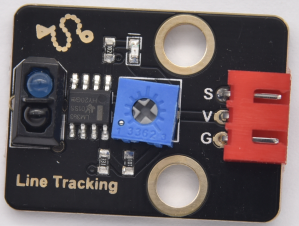|Keyes 2021新款 DIY电子积木 单路循线传感器 黑色环保（红色端子）|1|
|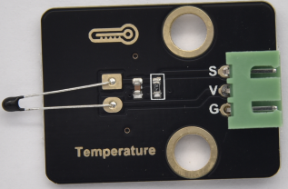|Keyes 2021新款 DIY电子积木 NTC-MF52AT模拟温度传感器黑色环保（绿色端子）|1|
|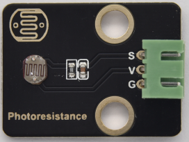|Keyes 2021新款 DIY电子积木 光敏电阻传感器 黑色环保（绿色端子）|1|
|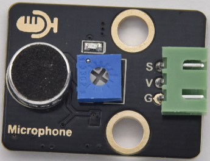|Keyes 2021新款 DIY电子积木 声音传感器 黑色环保（绿色端子）|1|
|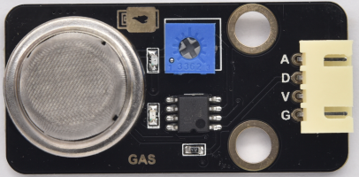|Keyes 2021新款 DIY电子积木 MQ-2模拟气体传感器黑色环保（黄色端子）|1|
|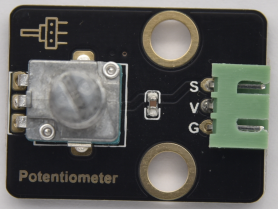|Keyes 2021新款 DIY电子积木 旋转电位器传感器黑色环保（绿色端子）|1|
|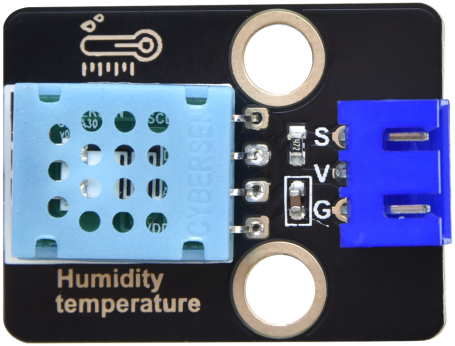|Keyes 2021新款 DIY电子积木 XHT11温湿度传感器（兼容DHT11）黑色环保（蓝色端子）|1|
|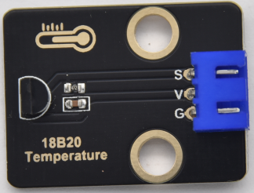|Keyes 2021新款 DIY电子积木 DS18B20温度传感器黑色环保（蓝色端子）|1|
|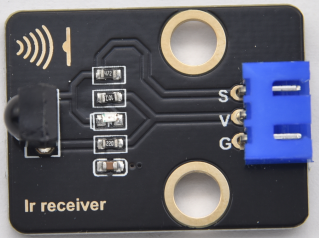|Keyes 2021新款 DIY电子积木 红外接收模块 黑色环保（蓝色端子）|1|
|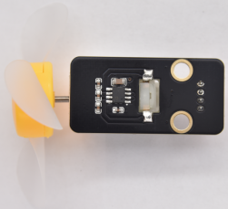|Keyes 2021新款 DIY电子积木 130电机模块黑色环保（红色端子）带扇叶|1|
|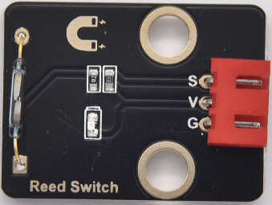|Keyes 2021新款 DIY电子积木 干簧管模块 黑色环保（红色端子）|1|
|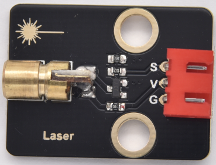|Keyes 2021新款 DIY电子积木 激光模块 黑色环保（红色端子）|1|
|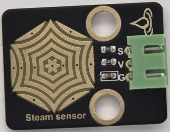|Keyes 2021新款 DIY电子积木 水滴传感器 黑色环保（绿色端子）|1|
|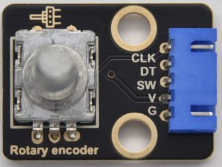|Keyes 2021新款 DIY电子积木 旋转编码器模块 黑色环保（蓝色端子）|1|
|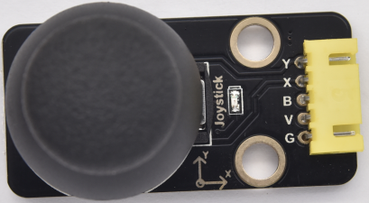|Keyes 2021新款 DIY电子积木 摇杆模块 黑色环保（黄色端子）|1|
|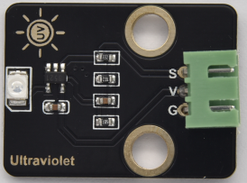|Keyes 2021新款 DIY电子积木 太阳光紫外线传感器黑色环保（绿色端子）|1|
|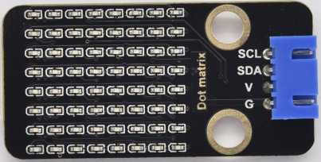|Keyes 2021新款 DIY电子积木 HT16K33_8X8点阵模块黑色环保（蓝色端子）|1|
|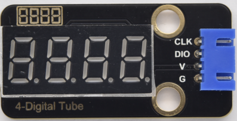|Keyes 2021新款 DIY电子积木 TM1650四位数码管模块黑色环保（蓝色端子）|1|
|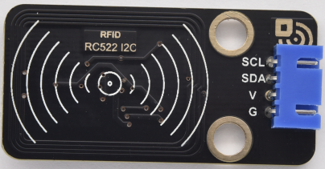|Keyes 2021新款 DIY电子积木 RFID刷卡模块 黑色环保（蓝色端子）|1|
|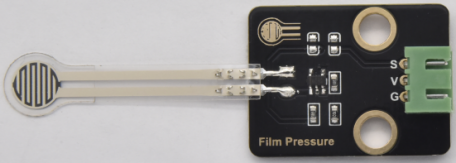|Keyes 2021新款 DIY电子积木 薄膜压力传感器 黑色环保（绿色端子）|1|
|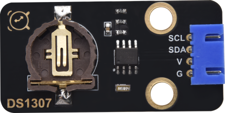|Keyes 2021新款 DIY电子积木 DS1307传感器模块黑色环保（蓝色端子）|1|
||keyes brick HC-SR04超声波传感器 防反插白色端子|1|
|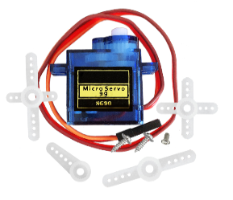|SG90 9G 23*12.2*29mm 配十字臂 蓝色 辉盛 90度 环保|1|
|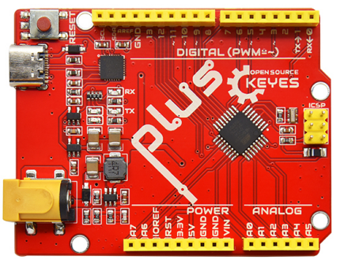|Keyes Uno Plus 开发板 红色环保|1|
|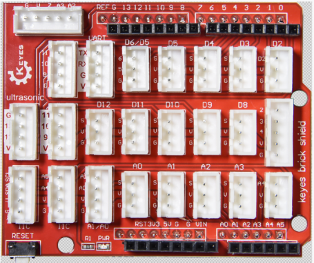|Keyes brick shield 传感器扩展板 防反插白色端子（妙学专用）|1|
|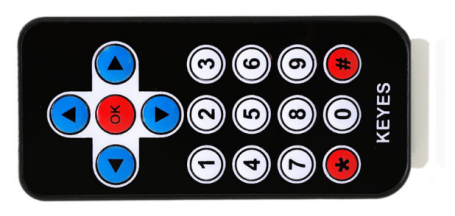|JMP-1 17键86*40*6.5MM 黑色|1|
||USB2.0对TYPE C 白色 L:1M OD：4.0MM|1|
||3P XH-2.54mm 22AWG 200mm 黑红蓝线 高温硅胶线 反向 环保|8|
||4P XH-2.54mm 22AWG 200mm 黑红蓝黄线 高温硅胶线 反向 环保|5|
||5P XH-2.54mm 22AWG 200mm 黑红蓝黄绿线 高温硅胶线 反向 环保|3|
|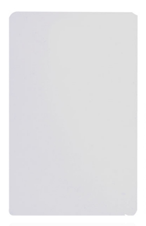|白卡 85.5*54*0.80MM 环保|1|
||TAG-03 41*33*403mm ABS蓝色|1|

