# Mixly 教程

## 关于Mixly IDE

### 1. Mixly 软件下载、安装

**下载软件：**

读者可以在米思齐(Mixly)网站 [https://mixly.org/bnu-maker/mixl2.0rc](https://mixly.org/bnu-maker/mixl2.0rc) 下载Mixly开发环境，网站页面如下图所示：

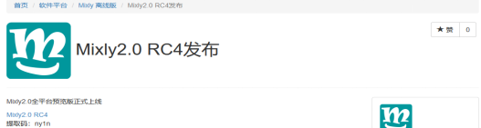

点击“Mixly2.0 RC4”进入百度云盘首界面，复制提取码 “**ny1n**” 至 “**请输入提取码，不区分大小写**” 的文本框，点击 “**提取文件**” 进入Mixly软件下载页面，左键单击“mixly2.0”。根据计算机系统选择下载对应的版本，Windows系统一般是下载“**mixly2.0-win32-x64-rc4完整版.zip**”版本，如下图所示。

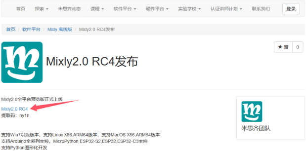

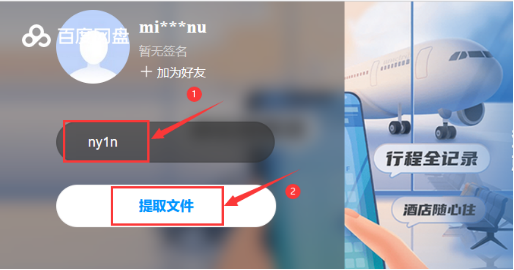

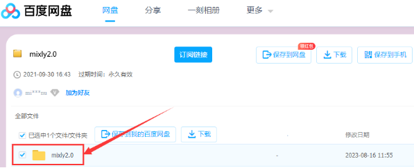

Mixly For Windows：

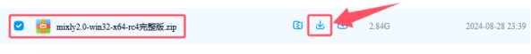

Mixly For Mac(根据系统选择)：

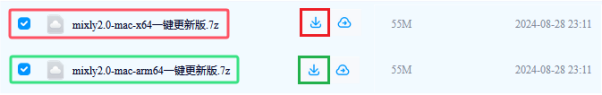

**安装软件：**

1.Windows版本安装：

下载mixly2.0-win32-x64-rc4完整版压缩包之后，重新命名为mixly2.0 ，右键解压到本地磁盘。

**特别提醒**：
 
(1)建议解压到硬盘根目录，路径不能包含中文及特殊字符(如:._( )等)。
 
(2)建议安装路径如D:mixly2.0 

因为Mixly是一个绿色免安装软件，所以“**mixly2.0-win32-x64-rc4完整版**”版本在解压之后就可以直接使用了。如果是下载“**一键更新版.7z**”版本的压缩包，压缩包解压后，需要左键双击打开“一键更新.bat”按照提示更新Mixly。

完整的Mixly文件夹中的内容如下图所示：

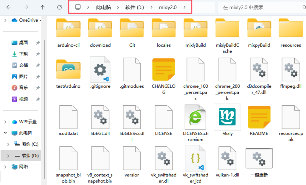

启动软件：

这里双击“**Mixly.exe**”就能打开Mixly软件。如下图所示：

打开Mixly软件后，找到并且单击“ **Arduino ESP32** ”就可以进入Mixly编程界面。软件界面如下图所示：

2.Mac版本安装：

这里有MAC安装Mixly2.0.txt文件说明。

如果米思齐(Mixly)官网网站更新，请通过百度网盘分享的文件：mixly2.0-2024。
 
链接：[https://pan.baidu.com/s/1sV0DUDKg7OiQcKyIkBI1Ew?pwd=keye](https://pan.baidu.com/s/1sV0DUDKg7OiQcKyIkBI1Ew?pwd=keye) 
 
提取码：keye 

**页面介绍:**

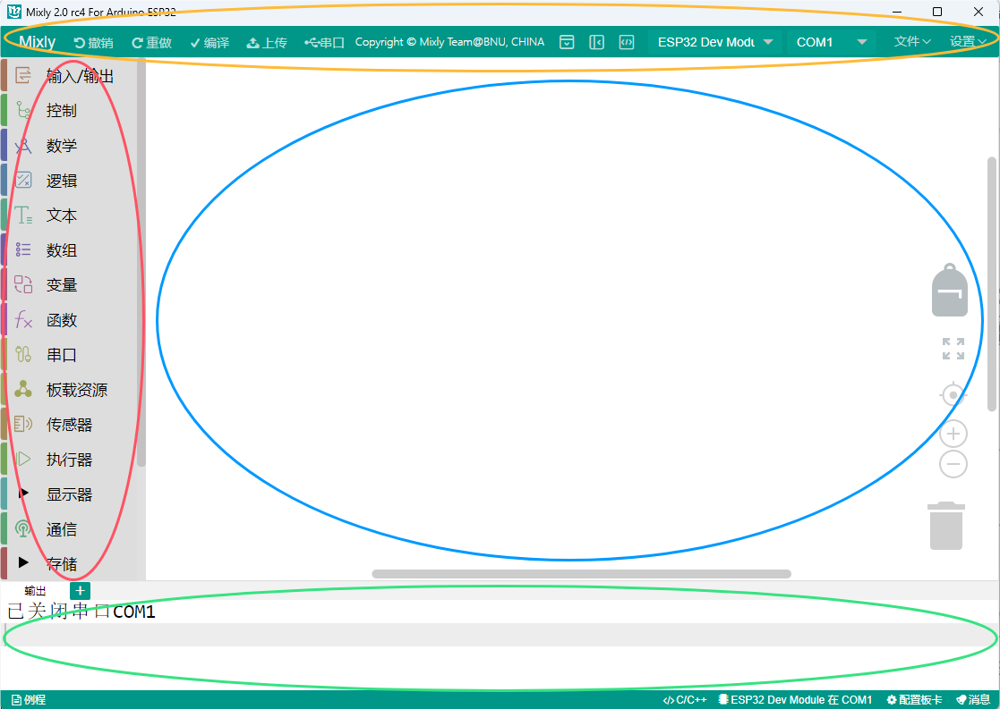

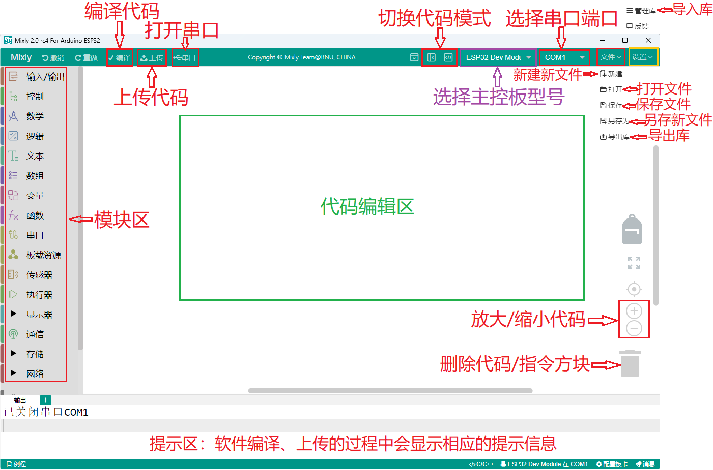

总体来说，Mixly软件界面分为4部分。

1.界面左侧为模块区，这里包含了Mixly中所有能用到的程序模块，根据功能的不同，大概分为以下几类:“输入/输出”、“控制”、“数学”、“逻辑”、“文本”、“数组”、“变量”、“函数”、“串口”、“传感器”、“执行器”、“显示器”、“通信”、“存储”、“网络”。每种类型的模块都用不同的颜色块表示，其中每一个分类中的模块会在附录A中有专门的介绍。

2.模块区的右侧是程序构建区，模块区的模块可通过鼠标拖拽放到程序构建区，拖诟过来的模块会在这里组合成一段有一定逻辑关系的程序块。这个区域有点类似代码程序编辑软件中写代码的地方，在这个区域的右下角有一个垃圾桶，当我们删除模块时，就要将模块拖到垃圾桶中，在垃圾桶的上方有三个圆形的按钮，能够实现程序构建区的放大、缩小以及居中。

3.模块区和程序构建区的上方是基本功能区，类似一般软件的菜单区。这里不仅包含了“新建”、“打开”、“保存”、“另存为”、“导出库”和“管理库”软件都具有的按钮，还包含了硬件编程软件中需要用到的“编译”、“上传”、“控制板选择”、“串口端口”、“串口”这样的按钮。

4.界面的最下方是提示区，这里在软件编译、上传的过程中会显示相应的提示信息。我们可以通过提示信息来解决编译上传过程中出现的一些问题。

最后还要补充两点：

第一点是 Mixly支持多国语言，我们可以通过如下界面找到并且点击  进入个性化设置页面，找到语言下面的简体中文下拉菜单，选择不同的语言版本，此时这个下拉菜单显示的是简体中文，如下图所示：

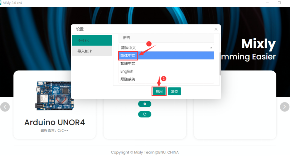

第二点是在界面最上方右侧有一个 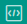 按钮，单击这个按钮就能进入纯代码形式，如下图所示：

Mixly作为一款将图形化编程方式和代码编程方式融合在一起的开发环境，如果只能单独地显示代码或显示图形程序块，那么肯定是不够好的。在Mixly中是能够将代码和图形程序块一起呈现在屏幕上的，这个功能可以通过界面最上方右侧有一个按钮实现，单击这个  按钮之后，如下图所示：

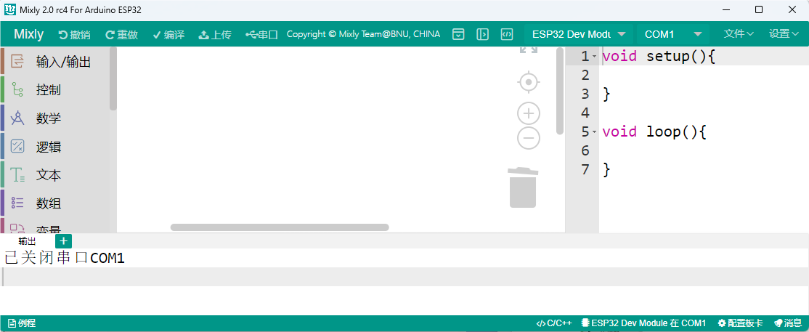

这时，在程序构建区的右侧会显示出对应的代码，这段代码是与程序构建区中的模块所组成的程序块对应的，会随着模块的变化而变化，不过区域中的代码是不可编辑的。同时，界面最右侧那个向左的箭头按钮变成了向右的箭头。

**注意：想了解更多关于Mixly相关知识的请点击链接：**[https://mixly.readthedocs.io/zh-cn/latest/](https://mixly.readthedocs.io/zh-cn/latest/) 。

**Mixly 软件相关使用教程**

[https://www.bilibili.com/video/bv1BE411A7hX](https://www.bilibili.com/video/bv1BE411A7hX)

[https://www.bilibili.com/video/BV1jE411A78S](https://www.bilibili.com/video/BV1jE411A78S)

[https://www.bilibili.com/video/BV1YE411A7FT](https://www.bilibili.com/video/BV1YE411A7FT)

[https://wiki.mixly.org/](https://wiki.mixly.org/)

