# **Комплект умного дома Keyestudio для Arduino**


## 1.**Обзор:**


Этот учебный комплект для умного дома, основанный на платформе Arduino, был недавно выпущен компанией Keyestudio DIY Robot Co. Ltd.

Он имитирует настоящий умный дом и демонстрирует людям уютную и комфортную жизнь.

Фактически, логическое программирование, невидимая рука, контролирует все в умном доме: она включает кондиционер, включает водонагреватель, защищает ваш дом электронным замком и настраивает ваши светодиодные фонари и умные шторы на автоматическое включение. когда придешь домой. Между тем, интеллектуальная система освещения позволяет создать комфортную, спокойную атмосферу. Все завершается с помощью пульта дистанционного управления или вашего собственного мобильного телефона.

Как выразился Билл Гейтс: «В ближайшем будущем дом без системы умного дома будет столь же немодным, как дом без доступа к Интернету сегодня».

Итак, вперед и приступайте; давайте построим этот удивительный аналоговый умный дом.


## 2.**Комплект**

Получив этот комплект для умного дома, нам нужно убедиться, что в нем нет недостающих компонентов

| # | Имя                                                        | КОЛИЧЕСТВО | Картина                                   |
|----|----------------------------------------------------------------|-----|--------------------------------------------------|
| 1  | Панель управления Keyestudio PLUS（Совместим с Arduino ООН ） | 1   |  |
| 2  | Экран сенсора Keyestudio V 5.2 | 1   |  |
| 3  | Деревянная доска * 10 т = 3 мм  | 1          | 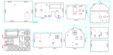 |
| 4  | Белый светодиодный модуль                      | 1   |  |
| 5  | Желтый светодиодный модуль                    | 1   |  |
| 6  | Датчик кнопки                                     | 2   |  |
| 7  | Датчик фотоэлемента                            | 1   |  |
| 8  | Датчик движения PIR                           | 1   |  |
| 9  | Датчик газа MQ-2                                | 1   |   |
| 10 | Модуль реле                                        | 1   |  |
| 11 | Модуль Bluetooth HM-10                   | 1   |   |
| 12 | Пассивный датчик зуммера                  | 1   |  |
| 13 | Модуль вентилятора                                   | 1   |  |
| 14 | Датчик пара                                        | 1   |  |
| 15 | Серводвигатель                                      | 2   |   |
| 16 | Модуль дисплея LCD1602    | 1   |  |
| 17 | Датчик влажности почвы                    | 1   |  |
| 18 | USB-кабель                                            | 1   |  |
| 19 | Кабели Dupont между женщинами и женщинами | 40  |   |
| 20 | Кабели Dupont Cables между мужчинами и женщинами | 6   |   |
| 21 | Никелированные гайки M3                   | 25  |  |
| 22 | Винты с полукруглой головкой M2 * 12 мм | 6   |  |
| 23 | Никелированные гайки M2 | 6   | 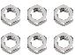 |
| 24 | M3 * 10 мм, двухходовые Медный куст | 4    | 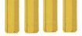 |
| 25 | Винты с полукруглой головкой M3 * 6 мм | 8   | 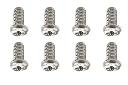 |
| 26 | M3 304 нержавеющая сталь Самоконтрящиеся гайки | 4   | 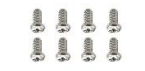 |
| 27 | Винты с полукруглой головкой M3 * 10 мм | 20  |  |
| 28 | Винты с полукруглой головкой M2,5 * 10 мм | 6    | 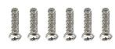 |
| 29 | Никелированные гайки M2.5                                    |            | 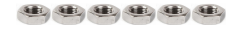 |
| 30 | Винты с полукруглой головкой M3 * 12 мм | 6    | 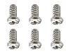 |
| 31 | Винты с плоской головкой M3 * 10 мм | 2   | 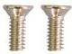 |
| 32 | M1,2 * 5 мм с круглой головкой Саморезы | 10  | 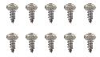 |
| 33 | Держатель для батареек AA на 6 слотов с постоянным током Голова и линия росы 15 см | 1   |   |
| 34 | Черный желтый Ручка 3 * 40 мм крест Отвертка | 1   |  |
| 35 | 20 см 2,54 3Pin FF перемычка     | 13  |   |
| 36 | 20 см 2,54 4Pin FF перемычка     | 2   |  |


## **3. **Загрузите программное обеспечение и установите драйвер.****

### (1) Загрузить программное обеспечение**

Когда мы получаем плату управления, нам в первую очередь нужно загрузить Arduino IDE и 

драйвер.

Вы можете скачать Arduino IDE с официального сайта:<https://www.arduino.cc/>, и щелкните **ПРОГРАММНОЕ ОБЕСПЕЧЕНИЕ> ЗАГРУЗИТЬ,** как показано 

ниже:

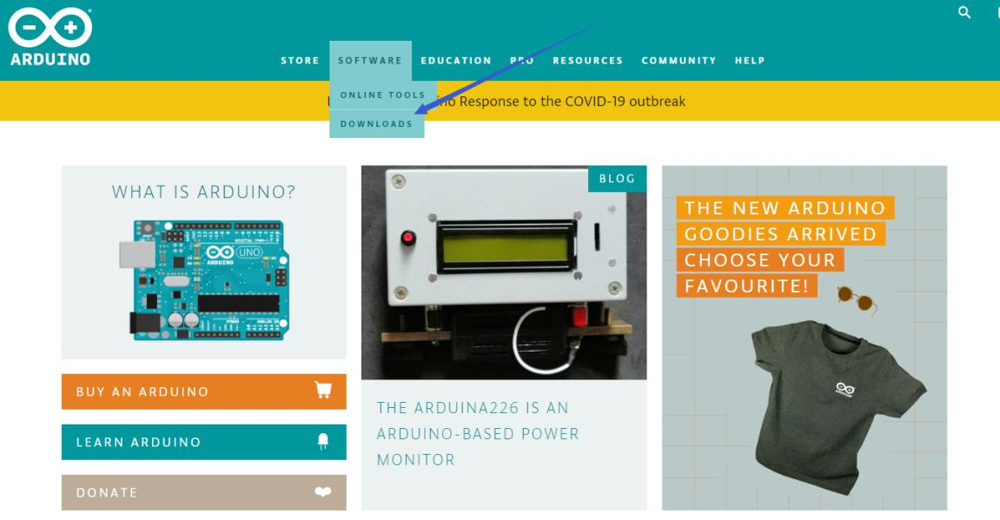


Вы можете выбрать последнюю версию ----- 1.8.13. Другой вариант - предыдущая версия.

В этом проекте мы используем версию 1.8.12.

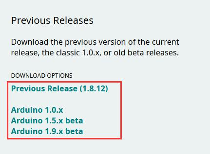

Нажмитедля входа на новую страницу. Как показано ниже;

В **Установщик Windows** требует установки вручную. Тем не менее,**ZIP-файл Windows**

**для установки без администратора**，zip-файл версии Arduino 1.8.12, может быть 

загружен и установлен напрямую.


### **(2) **Плата разработки Keyestudio PLUS****

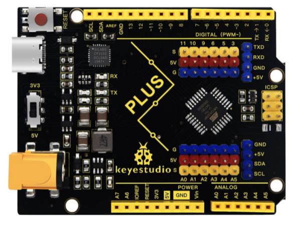

Теперь давайте познакомимся с платой разработки Keyestudio PLUS. Это ядровесь комплект.

Плата управления Keyestudio PLUS полностью совместима с платой Arduino UNO R3. Его функции такие же, как у платы Arduino UNO R3. Более того, некоторые улучшения значительно усилили его функцию. В качестве альтернативы, это лучший выбор для изучения построения схем и проектирования кодов.

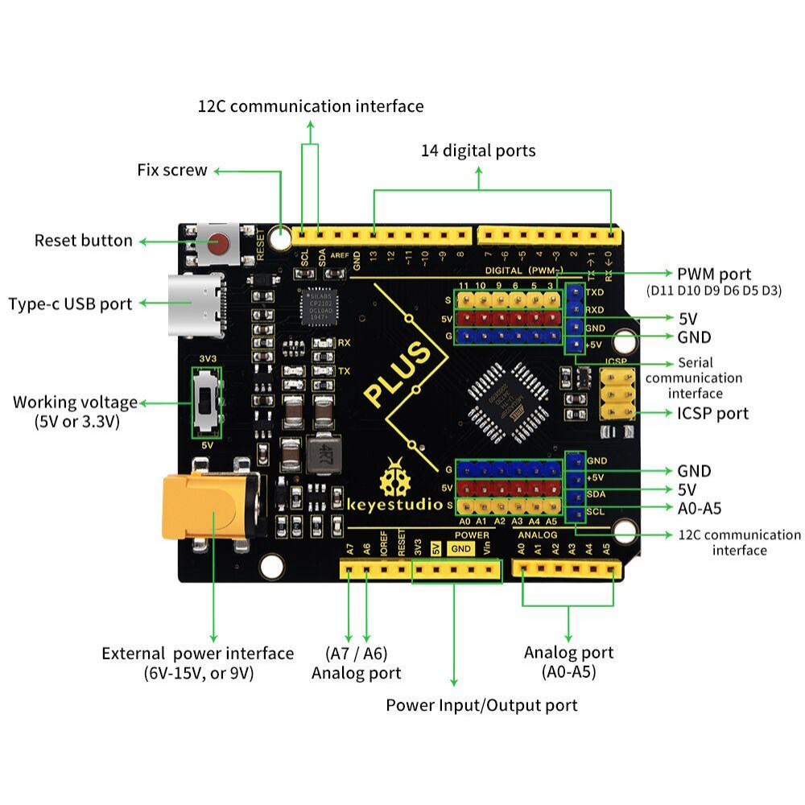

Интерфейс последовательной связи: D0 - RX, D1 - TX

Интерфейс ШИМ (широтно-импульсная модуляция): D3 D5 D6 D9 D10 D11 

Интерфейс внешнего прерывания: D2 (прерывание 0) и D3 (прерывание 1)

Интерфейс связи SPI: D10 - SS, D11 - MOSI, D12 - MISO, D13 - SCK

Порт связи IIC: A4 - SDA, A5 - SCL


### **(3) **Установка драйвера****

Установим драйвер Keyestudio PLUS Control Board. Чип USB-TTL на плате PLUS использует серийный чип CP2102. Программа драйвера этого чипа включена в версию Arduino 1.8 и выше, что удобно.

Когда вы подключаете USB-порт к компьютеру, можно установить драйвер CP2102.

Если драйвер устанавливается безуспешно, необходимо установить его вручную.

Откройте диспетчер устройств компьютера. Щелкните правой кнопкой мыши Компьютер ----- Свойства ---- Диспетчер устройств.

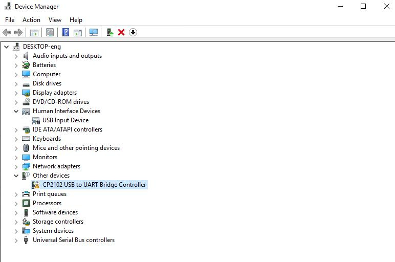

На странице есть желтый восклицательный знак, что означает сбой установки драйвера CP2102.

Действуйте следующим образом；

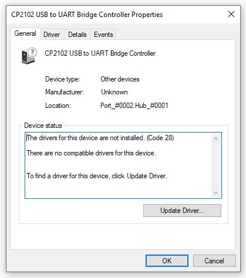

Нажмите «ОК», чтобы перейти на следующую страницу, и нажмите «найти на моем компьютере обновленное программное обеспечение драйвера».

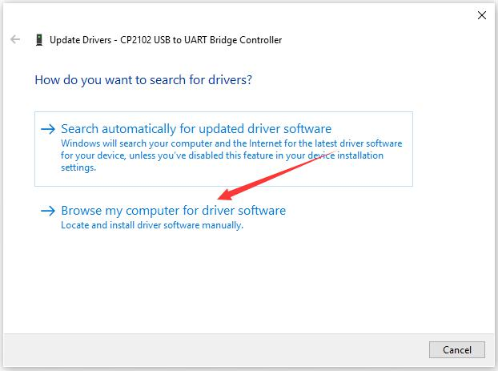

Нажмите «Обзор», затем найдите драйвер CP2102 и нажмите «Далее».

Eсть ВОДИТЕЛИ папка в Установленный пакет программного обеспечения Arduino(),откройте папку с драйверами и проверьте драйвер CP210X серии чипсы.

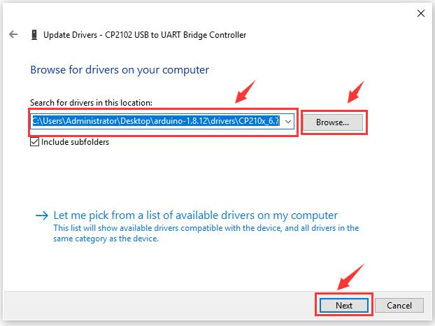

При открытии диспетчера устройств желтый восклицательный знак исчезает. Драйвер CP2102 успешно установлен.

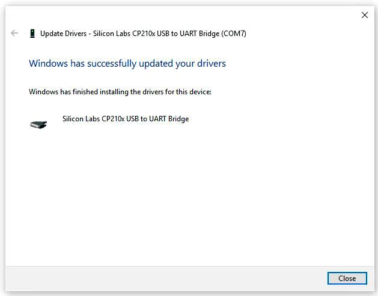

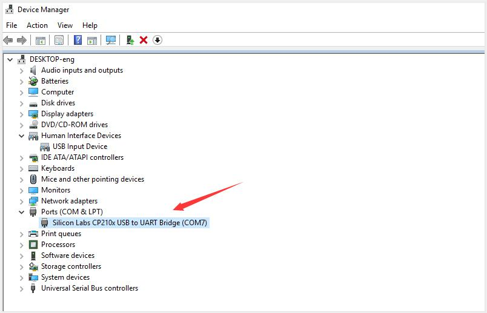


### (4) **Настройка Arduino IDE**

Нажмитезначок ,откройте Arduino IDE.

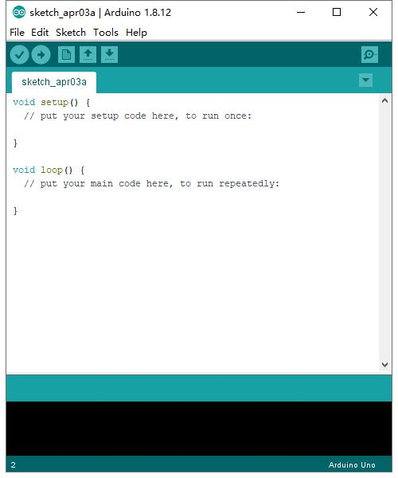

При загрузке скетча на плату вы должны выбрать правильное имя платы Arduino, которое соответствует плате, подключенной к вашему компьютер. Как показано ниже;

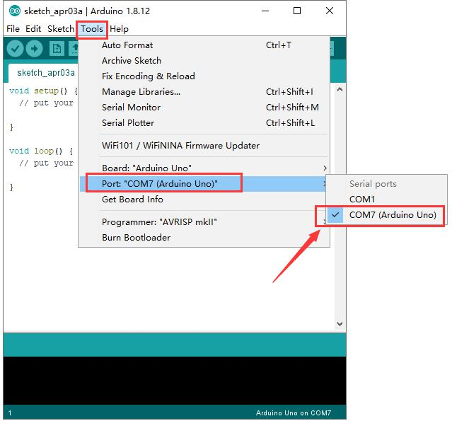


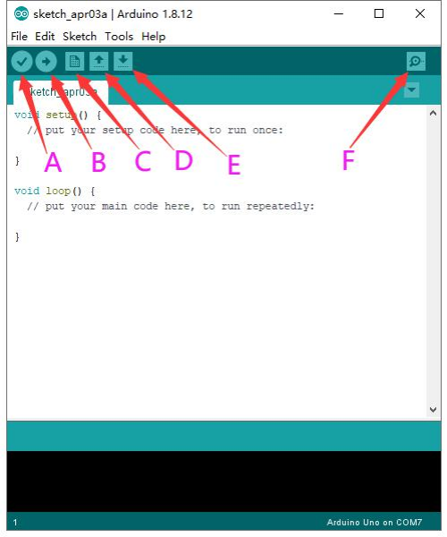

A- Используется для проверки наличия ошибок компиляции. 

B- Используется для загрузки эскиза на плату Arduino.

C- Используется для создания окна быстрого доступа к новому эскизу. 

D- Используется для непосредственного открытия примерного скетча.

E- Используется для сохранения эскиза.

F- Используется для отправки последовательных данных, полученных с платы, на последовательный монитор.


### (5)**Запустите свою первую программу**

Откройте файл, чтобы выбрать **Пример,** и нажмите **ОСНОВНОЙ> МИГАНИЕ,** как показано ниже:

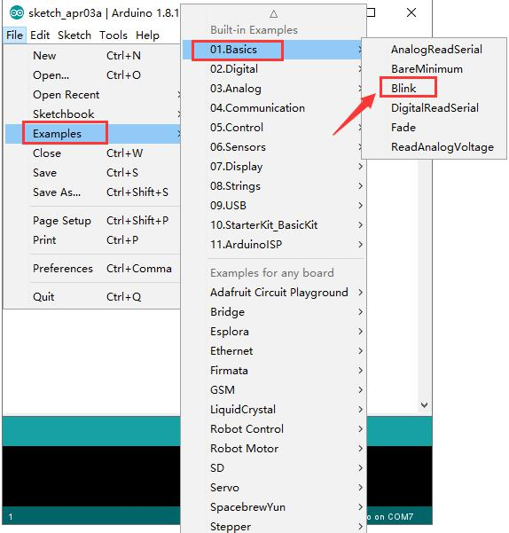

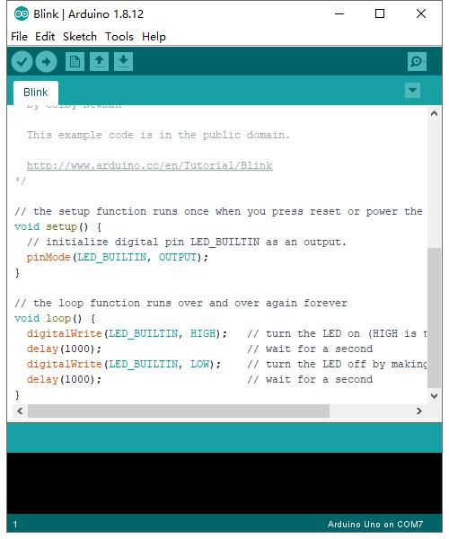

Установите правильный **COMport,** а соответствующая плата и COM-порт показаны в правом нижнем углу IDE.

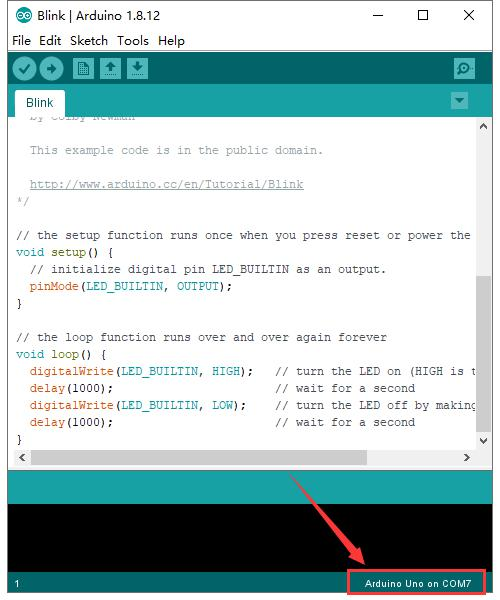

Нажмите начать компилировать программу и проверить ошибки.

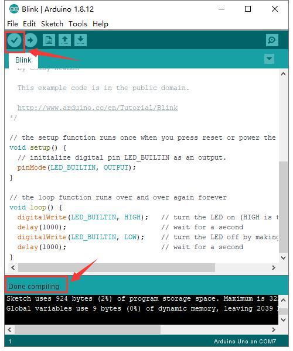

Нажмитезагрузить программу

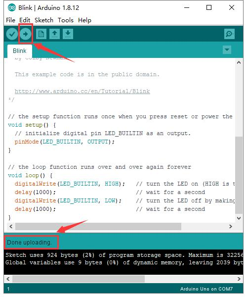

После успешной загрузки программы на плате мигает светодиод. 

Поздравляю, вы закончили первую программу.


## **4.**Как добавить библиотеку?****

Что такое библиотеки?

Библиотеки - это набор кода, который упрощает управление датчиками, 

дисплеями, модулями и т. Д.

В Интернете для загрузки доступны сотни дополнительных библиотек.

Встроенные библиотеки и некоторые из этих дополнительных библиотек перечислены в 

справочнике.

Здесь мы познакомим вас с самым простым способом добавления библиотек.

Шаг 1. После правильной загрузки IDE Arduino вы можете щелкнуть правой кнопкой мыши 

значок Arduino IDE.

Найдите опцию «Открыть расположение файла», как показано ниже

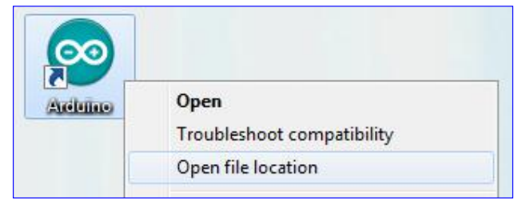

Шаг 2: Войдите в папку библиотек Arduino, как показано ниже;

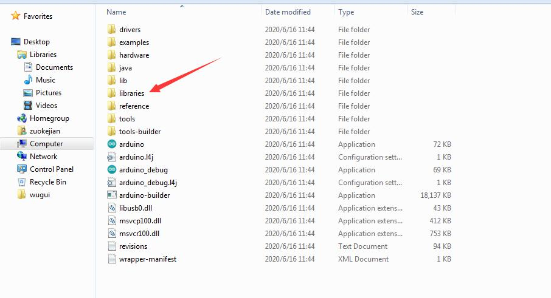

Шаг 3 ： Затем найдите«Библиотеки» комплекта умного дома(видно по ссылке:<https://fs.keyestudio.com/KS0085>), как показано ниже:

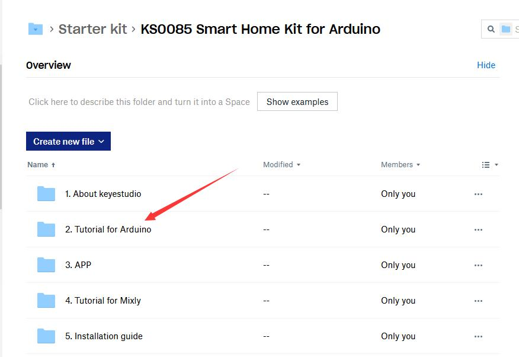


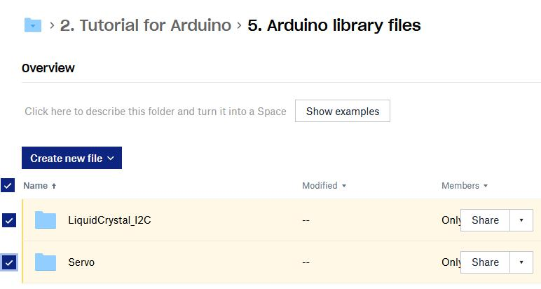


Вам просто нужно скопировать и вставитьв библиотеки папка Arduino IDE.

Затем библиотеки домашнего смарта успешно устанавливаются, как показано ниже:

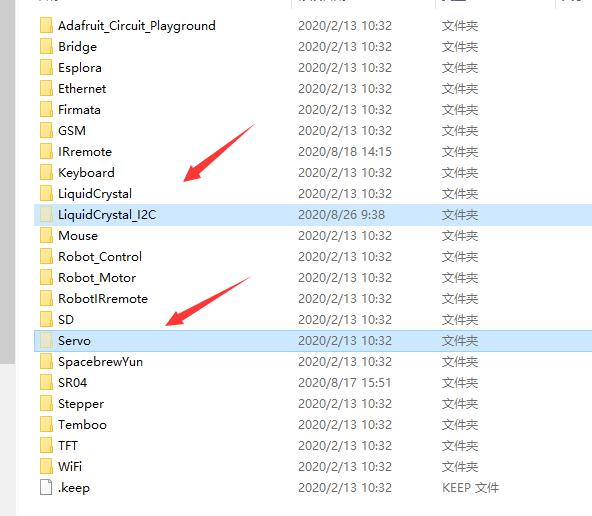


## **5.**Проекты****


Хорошо, перейдем к нашим проектам. В этом комплекте 14 датчиков и модулей. 

Мы познакомим вас с умным домом с помощью простого датчика. Однако, если вы профессионально работаете с Arduino. Вы можете пропустить эти шаги и собрать комплект умного дома напрямую (в папке есть сборочное видео)

**Примечание. В этом случае интерфейс каждого датчика / модуля, отмеченный** **(G, -, GND), указывает отрицательный полюс, G подключен к G, - или GND экрана** **датчика или платы управления; «V» - положительный полюс и связан с V, VCC** **или 5V.**

### **Проект 1: мигание светодиода**

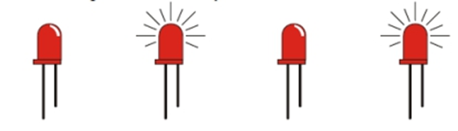

**1. Описание**

Мы установили драйвер платы разработки Keyestudio V4.0. В 

этом уроке мы проведем эксперимент, чтобы светодиод мигал.

Подключим GND и VCC к питанию. Светодиод будет гореть, когда на конце сигнала S будет высокий уровень, и наоборот, светодиод погаснет, когда на конце сигнала S будет низкий уровень.

Кроме того, различная частота мигания может быть представлена путем настройки времени задержки.

**2.Технические характеристики**

Интерфейс управления: цифровой порт 

Рабочее напряжение: 3,3-5 В постоянного 

тока Шаг контактов: 2,54 мм

Цвет светодиодного дисплея: 

белый Цвет дисплея: белый

**1.3 Что вы Нужно**

| PLUS Control Доска * 1                                   | Датчик Щит * 1                                   | Белый светодиод Модуль * 1                       | USB Кабель * 1                                  | 3-контактный FF Dupont Кабель * 1               |
| -------------------------------------------------------- | ------------------------------------------------ | ------------------------------------------------ | ----------------------------------------------- | ----------------------------------------------- |
| Доска * 1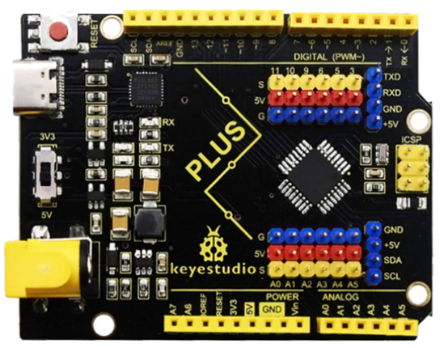 | 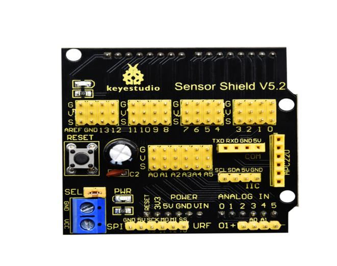 | 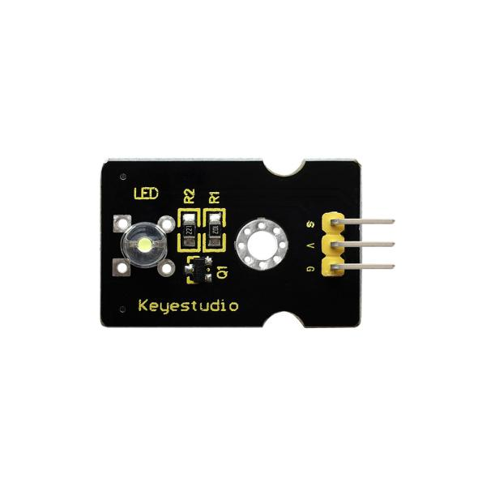 |  | 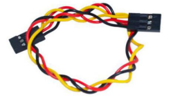 |

**1.4 Сенсорный экран**

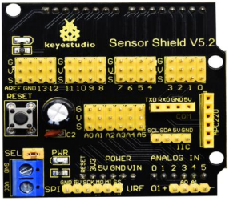

Обычно мы комбинируем плату управления Arduino с большим количеством датчиков и модулей. 

Однако количество контактов и портов на плате управления ограничено.

Чтобы справиться с этим недостатком, нам просто нужно установить плату датчика V5 на плату 

управления Keyestudio PLUS.

Этот экран V5 может быть непосредственно присоединен к датчикам с помощью 3-контактных разъемов, а также может быть расширен до часто используемых портов связи, таких как последовательная связь, связь IIC и порты связи SPI. Более того,щиток поставляется с кнопкой сброса и 2 сигнальными лампами.

**1.5 Описание контактов**

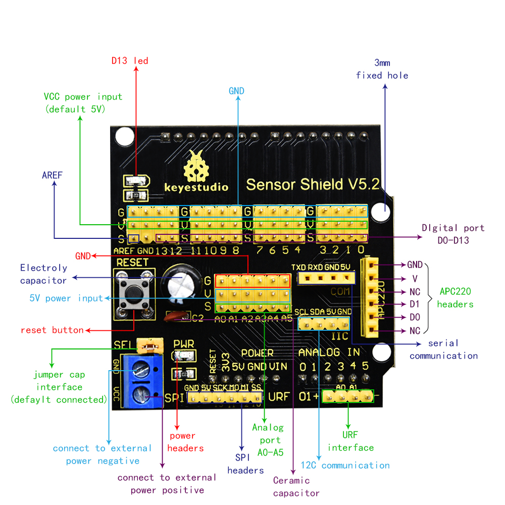

**1.6 Схема подключения**

Свяжите светодиодный модуль с D13 экрана.

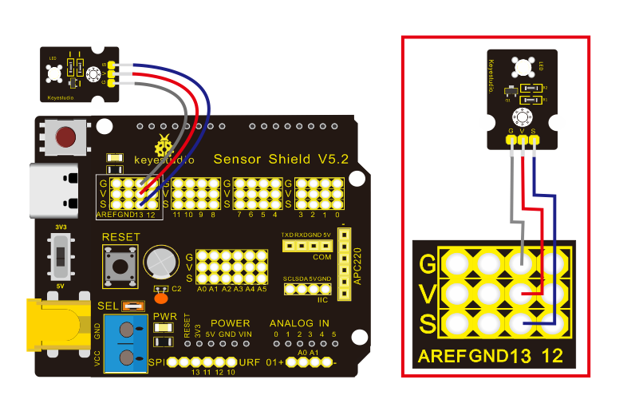

Примечание: контакты G, V и S модуля белого светодиода связаны с G, V и 13 на плате V5.

**1.7 Тестовый код**

```c
/*
Keyestudio smart home Kit for Arduino
Project 1
Blink
http://www.keyestudio.com
*/
void setup() 
{
  pinMode(13, OUTPUT);
}
// the loop function runs over and over again forever
void loop() {
  digitalWrite(13, HIGH);   // turn the LED on (HIGH is the voltage level)
  delay(1000);              // wait for a second
  digitalWrite(13, LOW);    // turn the LED off by making the voltage LOW
  delay(1000);              // wait for a second
}
```

**1.8 Результат теста：**

После загрузки кода белый светодиод будет попеременно мигать в течение 1000 мс.

**1.9 Расшифровка кода**

Код выглядит длинным и беспорядочным, но по большей части это комментарии. Грамматика Arduino основана на C.

Комментарии обычно имеют две формы выражения:

 / * ....... /: подходит для длинных комментариев абзаца 

//: подходит для однострочных комментариев

Код содержит много важной информации, такой как автор, подписанный договор и т. Д.

Начинающий должен выработать хорошую привычку просматривать код.

Комментарии, составляющие большую часть всего кода, содержат важную информацию и действительно помогают быстро понять тестовый код.

```c
// the setup function runs once when you press reset or power the board
void setup() {
  // initialize digital pin 13 as an output.
  pinMode(13, OUTPUT);
}
```

Согласно комментариям, мы обнаружим, что автор определяет режим вывода D13 как цифровой выход в функции setup ().

Setup () - это основная функция Arduino, которая выполняется один раз при запуске программы.

```c
// the loop function runs over and over again forever
void loop() {
  digitalWrite(13, HIGH);   // turn the LED on (HIGH is the voltage level)
  delay(1000);              // wait for a second
  digitalWrite(13, LOW);    // turn the LED off by making the voltage LOW
  delay(1000);              // wait for a second
}
```

Loop () - необходимая функция Arduino, она может запускаться и зацикливаться все время после того, как «setup ()» выполнится один раз.

В функции loop () автор использует

```c
digitalWrite(13, HIGH); // turn the LED on (HIGH is the voltage level)
```

digitalWrite (): установите выходное напряжение вывода на высокий или низкий уровень. Делаем вывод D13 высоким уровнем, после чего загорается светодиод.

```c
delay(1000); // wait for a second
```

Функция задержки используется для времени задержки, 1000 мс - 1 с, единица - мс

```c
digitalWrite(13, LOW); // turn the LED off by making the voltage LOW
```

Аналогично делаем вывод D13 низким уровнем, светодиод погаснет

```c
delay(1000); // wait for a second
```

Задержка на 1 с, светодиод горит - держится 1 с - светодиод не горит - остается на 1 с, итерация процесса. Светодиод мигает с интервалом в 1 секунду.

Что делать, если вы хотите, чтобы светодиод быстро мигал? Вам нужно только изменить значение блока задержки. Уменьшение значения задержки означает, что время ожидания короче, то есть быстрое мигание. И наоборот, вы можете заставить светодиод мигать медленно

**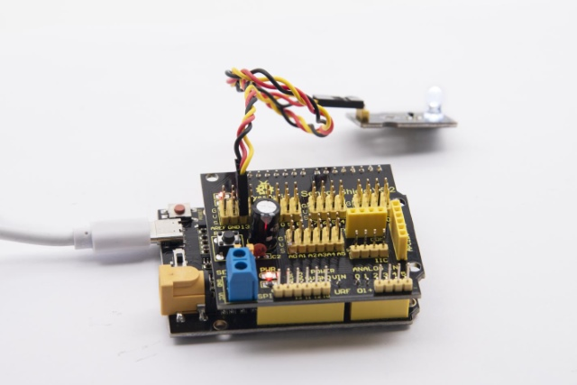**

### Проект 2：**Дышащий свет**


**2.1 Описание**

В предыдущем уроке мы управляли включением и выключением светодиода и заставляли его мигать.

В этом проекте мы будем управлять яркостью светодиода с помощью ШИМ для имитации эффекта дыхания. Точно так же вы можете изменить длину шага и время задержки в коде, чтобы продемонстрировать другой эффект дыхания.

ШИМ - это средство управления аналоговым выходом с помощью цифровых средств. Цифровое управление используется для генерации прямоугольных сигналов с различными рабочими циклами (сигнал, который постоянно переключается между высоким и низким уровнями) для управления аналоговым выходом. Как правило, входное напряжение порта составляет 0 В и 5 В. Что делать, если требуется 3В? Или что, если переключиться между 1 В, 3 В и 3,5 В? Мы не можем постоянно менять резистор. Для этой ситуации нам нужно управление с помощью ШИМ


Для выхода напряжения цифрового порта Arduino есть только LOW и HIGH, которые соответствуют выходному напряжению 0 В и 5 В. Вы можете определить LOW как 0 и HIGH как 1, и позволить Arduino выводить пятьсот сигналов 0 или 1 в течение 1 секунды.

Если вывести пятьсот 1, то это 5В; если все это 1, то это 0 В. Если вывести 010101010101 таким образом, то выходной порт будет 2,5 В, что похоже на показ фильма. Фильм, который мы смотрим, не является полностью непрерывным. Фактически он выводит 25 изображений в секунду. В этом случае человек не может сказать этого, как и ШИМ. Если требуется другое напряжение, необходимо контролировать соотношение 0 и 1. Чем больше 0,1 сигналов выход за единицу времени, тем точнее контроль.

**2.2 Что вы Нужно**

| PLUS Control Доска * 1                          | Датчик Щит * 1                                   | Желтый светодиод Модуль * 1                      | USB -кабель * 1                                 | 3-контактный FF Dupont Кабель * 1               |
| ----------------------------------------------- | ------------------------------------------------ | ------------------------------------------------ | ----------------------------------------------- | ----------------------------------------------- |
|  |  | 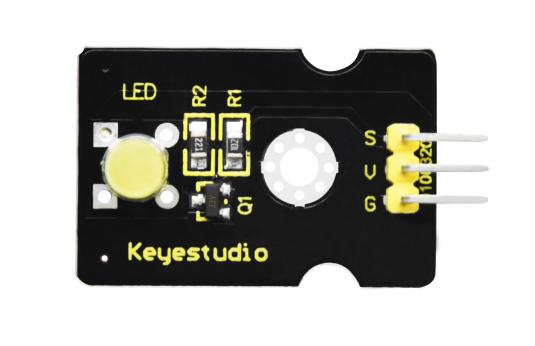 |  |  |

**2.3 Сенсорный экран**

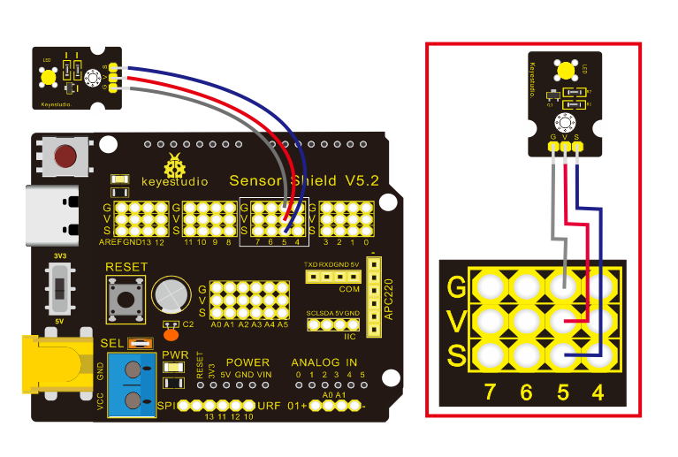

Примечание: на экране датчика контакты G, V и S желтого светодиодного модуля соединены с G, V и 5.

**2.4 Тестовый код**

```c
/*
Keyestudio smart home Kit for Arduino
Project 2
PWM
http://www.keyestudio.com
*/
int ledPin = 5; // Define the LED pin at D5
void setup () {
      pinMode (ledPin, OUTPUT); // initialize ledpin as an output.
}
void loop () {
for (int value = 0; value<255; value = value + 1) {
     analogWrite (ledPin, value); // LED lights gradually light up
     delay (5); // delay 5MS
   }
   for (int value = 255; value>0; value = value-1) {
     analogWrite (ledPin, value); // LED gradually goes out
     delay (5); // delay 5MS
   }}
```

Светодиод плавно меняет свою яркость от темной к яркой и обратно к темной, продолжая это делать, что похоже на вдох и выдох легких.

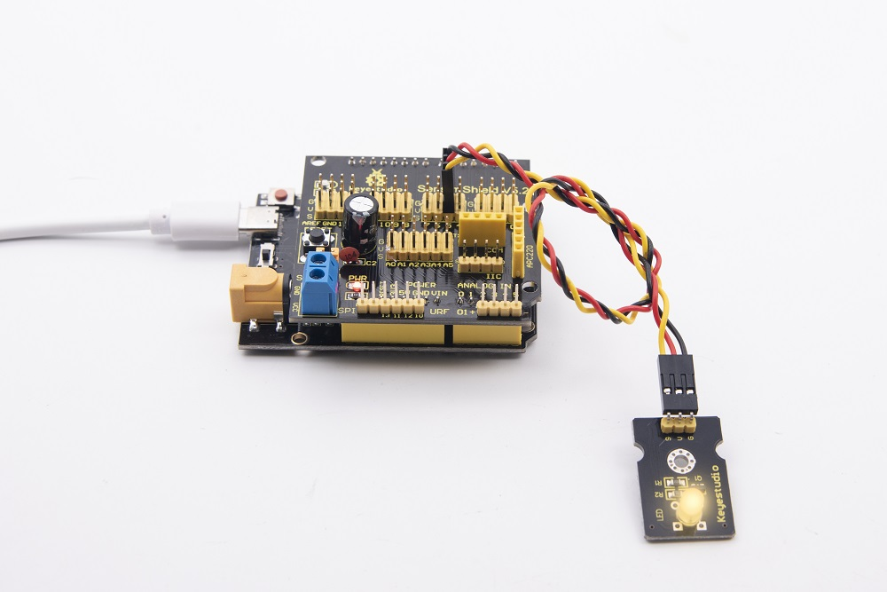

**2.5 Анализ кода**

Когда нам нужно повторить некоторые операторы, мы должны использовать оператор «for» в формате .

оператора For следующим образом:

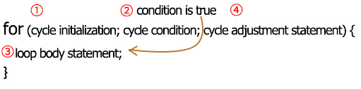 

«Для» циклической последовательности:

1 тур：1 → 2 → 3 → 4 

Раунд 2：2 → 3 → 4

…

Пока номер 2 не установлен, цикл for завершается. 

Узнав этот порядок, вернитесь к коду:

```c
for (int value = 0; value < 255; value=value+1){
        ...
}
for (int value = 255; value >0; value=value-1){
       ...
}
```

Два оператора «for» увеличивают значение от 0 до 255, затем уменьшают с 255 до 0, затем увеличивают до 255, .... бесконечный цикл.

В операторе for появилась новая функция ----- analogWrite ()

Мы знаем, что цифровой порт имеет только два состояния: 0 и 1. Итак, как передать аналоговое значение в цифровое значение? Здесь нам нужна эта функция, обратите внимание на плату Arduino, и вы найдете 6 контактов со знаком «~». Они отличаются от других контактов и могут выводить сигналы ШИМ.

Формат функции следующий:

```c
analogWrite(pin,value)
```

analogWrite () используется для записи аналогового значения от 0 до 255 для порта ШИМ, поэтому значение находится в диапазоне 0 ~ 255, обратите внимание, что вы пишете только цифровые контакты с функцией PWM, такие как контакты 3, 5, 6, 9, 10, 11.

ШИМ - это технология получения аналоговой величины цифровым методом. Цифровое управление формирует прямоугольную волну, а прямоугольный сигнал имеет только два состояния переключения (то есть высокий или низкий уровень наших цифровых контактов). Регулируя соотношение продолжительности включения и выключения, можно моделировать напряжение от 0 до 5 В. Затраченное время (академически называемое высоким уровнем) называется шириной импульса, поэтому ШИМ также называется широтно-импульсной модуляцией.

Давайте узнаем больше о ШИМ через следующие пять квадратных волн.


На приведенном выше рисунке зеленая линия представляет период, а значение analogWrite () соответствует проценту, который также называется рабочим циклом. Рабочий цикл подразумевает, что длительность высокого уровня делится на продолжительность низкого уровня в цикле. Сверху довнизу, рабочий цикл первой прямоугольной волны равен 0%, а соответствующее ему значение - 0. Яркость светодиода самая низкая, то есть выключен. Чем дольше длится высокий уровень, тем ярче светодиод. Следовательно, последний рабочий цикл равен 100%, что соответствует 255, светодиод самый яркий. 25% означает темнее.

ШИМ в основном используется для регулировки яркости светодиода или скорости вращения двигателя.

### Проект 3：**Пассивный зуммер**

**3.1  Описание**

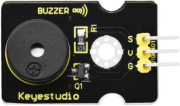

Arduino выполняет множество интерактивных работ.Самый распространенный - это звуковая и световая индикация. Мы всегда используем светодиоды для экспериментов. Для этого урока мы разработаем схему, излучающую звук. Универсальные звуковые компоненты - зуммер и рожки. Зуммер проще в использовании. А зуммер включает в себя активный зуммер и пассивный зуммер. В этом эксперименте мы используем пассивный зуммер.

Используя пассивный зуммер, мы можем управлять разными звуками, вводя прямоугольные волны с разной частотой. Во время эксперимента мы контролируем код, который издает звуковой сигнал, начиная со звука «тик-тик», затем заставляем пассивный зуммер издавать «do re mi fa so la si do» и воспроизводить определенные песни.

**3.2 Что вы Нужно**

| PLUS control Доска * 1                          | Датчик Щит * 1                                   | Пассивны Зуммер * 1                              | USB-кабель * 1                                  | 3-контактный FF Dupont Кабель * 1               |
| ----------------------------------------------- | ------------------------------------------------ | ------------------------------------------------ | ----------------------------------------------- | ----------------------------------------------- |
|  |  | 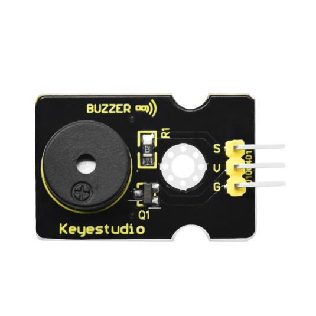 |  |  |

**3.2 Схема подключения**

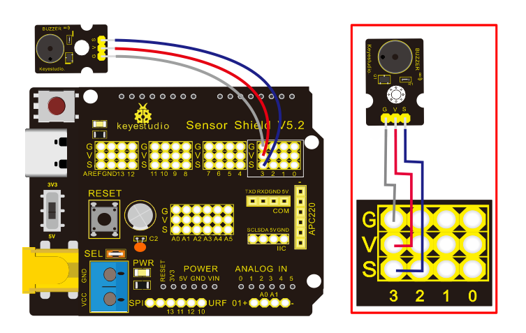

Контакты G, V и S пассивного зуммер подключаются к G, V и 3.

**3.4 Тестовый код**

```c
/*
Keyestudio smart home Kit for Arduino
Project 3.1
Buzzer
http://www.keyestudio.com
*/
int tonepin = 3; // Set the Pin of the buzzer to the digital D3
     void setup ()
     {
       pinMode (tonepin, OUTPUT); // Set the digital IO pin mode to output
     }
     void loop ()
     {
       unsigned char i, j;
       while (1)
       {
         for (i = 0; i <80; i ++) // output a frequency sound
         {
           digitalWrite (tonepin, HIGH); // Sound
           delay (1); // Delay 1ms
           digitalWrite (tonepin, LOW); // No sound
           delay (1); // Delay 1ms
         }
         for (i = 0; i <100; i ++) // output sound of another frequency
         {
           digitalWrite (tonepin, HIGH); // Sound
           delay (2); // delay 2ms
           digitalWrite (tonepin, LOW); // No sound
           delay (2); // delay 2ms
         }
       }
     }
```

Из приведенного выше кода числа 80 и 100 определяют частоту в операторе «for». Время задержки контролирует продолжительность, как ритм в музыке.


Мы будем играть сказочную музыку, если будем хорошо контролировать частоту и ритм, поэтому давайте разберемся с частотой тонов. Как показано ниже:

Бас：

| Тональная нота | 1#   | 2#   | 3#   | 4#   | 5#   | 6#   | 7#   |
| -------------- | ---- | ---- | ---- | ---- | ---- | ---- | ---- |
| A              | 221  | 248  | 278  | 294  | 330  | 371  | 416  |
| B              | 248  | 278  | 294  | 330  | 371  | 416  | 467  |
| C              | 131  | 147  | 165  | 175  | 196  | 221  | 248  |
| D              | 147  | 165  | 175  | 196  | 221  | 248  | 278  |
| E              | 165  | 175  | 196  | 221  | 248  | 278  | 312  |
| F              | 175  | 196  | 221  | 234  | 262  | 294  | 330  |
| G              | 196  | 221  | 234  | 262  | 294  | 330  | 371  |

Альто：

| Тональная нота | 1    | 2    | 3    | 4    | 5    | 6    | 7    |
| -------------- | ---- | ---- | ---- | ---- | ---- | ---- | ---- |
| A              | 441  | 495  | 556  | 589  | 661  | 742  | 833  |
| B              | 495  | 556  | 624  | 661  | 742  | 833  | 935  |
| C              | 262  | 294  | 330  | 350  | 393  | 441  | 495  |
| D              | 294  | 330  | 350  | 393  | 441  | 495  | 556  |
| E              | 330  | 350  | 393  | 441  | 495  | 556  | 624  |
| F              | 350  | 393  | 441  | 495  | 556  | 624  | 661  |
| G              | 393  | 441  | 495  | 556  | 624  | 661  | 742  |

Высокие частоты：

| Тональная нота | 1#   | 2#   | 3#   | 4#   | 5#   | 6#   | 7#   |
| -------------- | ---- | ---- | ---- | ---- | ---- | ---- | ---- |
| A              | 882  | 990  | 1112 | 1178 | 1322 | 1484 | 1665 |
| B              | 990  | 1112 | 1178 | 1322 | 1484 | 1665 | 1869 |
| C              | 525  | 589  | 661  | 700  | 786  | 882  | 990  |
| D              | 589  | 661  | 700  | 786  | 882  | 990  | 1112 |
| E              | 661  | 700  | 786  | 882  | 990  | 1112 | 1248 |
| F              | 700  | 786  | 882  | 935  | 1049 | 1178 | 1322 |
| G              | 786  | 882  | 990  | 1049 | 1178 | 1322 | 1484 |

Далее нам нужно контролировать время воспроизведения ноты. Музыка будет воспроизводиться, когда каждая нота играет определенное количество времени. Ритм ноты делится на одну долю, половину доли, 1/4 доли, 1/8 доли .

Время для ноты определяется как половина доли (0,5), 1/4 доли (0,250, 1/8 долей),beat (0,125) ..... значит, играет музыка. 

Возьмем пример «Оды радости».

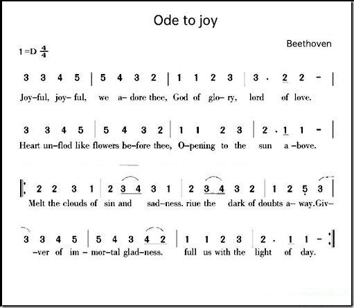

Судя по нотной записи, музыка 4/4 удара. Есть особые 

примечания, которые нам нужно объяснить:

1.  . Нормальная нота, как и первая нота 3, соответствует 350 (частота), занимает 1 долю
2.  Нота с подчеркиванием означает 0,5 долей
3.  Примечание с точкой()означает, что добавлено 0,5 удара, то есть 1 + 0,5 удара
4.   Нота со знаком «-» означает, что добавляется 1 доля, то есть 1 + 1 доля.
5.  Две последовательные ноты с дугой подразумевают легато, вы можете немного изменить частоту ноты после легато (необходимо отладить ее самостоятельно), например, уменьшив или увеличив некоторые значения, звук будет более плавным.

```c
/*
Keyestudio smart home Kit for Arduino
Project 3.2
Buzzer music
http://www.keyestudio.com
*/
#define NTD0 -1
#define NTD1 294
#define NTD2 330
#define NTD3 350
#define NTD4 393
#define NTD5 441
#define NTD6 495
#define NTD7 556
 
#define NTDL1 147
#define NTDL2 165
#define NTDL3 175
#define NTDL4 196
#define NTDL5 221
#define NTDL6 248
#define NTDL7 278
 
#define NTDH1 589
#define NTDH2 661
#define NTDH3 700
#define NTDH4 786
#define NTDH5 882
#define NTDH6 990
#define NTDH7 112
// List all D-tuned frequencies
#define WHOLE 1
#define HALF 0.5
#define QUARTER 0.25
#define EIGHTH 0.25
#define SIXTEENTH 0.625
// List all beats
int tune [] = // List each frequency according to the notation
{
  NTD3, NTD3, NTD4, NTD5,
  NTD5, NTD4, NTD3, NTD2,
  NTD1, NTD1, NTD2, NTD3,
  NTD3, NTD2, NTD2,
  NTD3, NTD3, NTD4, NTD5,
  NTD5, NTD4, NTD3, NTD2,
  NTD1, NTD1, NTD2, NTD3,
  NTD2, NTD1, NTD1,
  NTD2, NTD2, NTD3, NTD1,
  NTD2, NTD3, NTD4, NTD3, NTD1,
  NTD2, NTD3, NTD4, NTD3, NTD2,
  NTD1, NTD2, NTDL5, NTD0,
  NTD3, NTD3, NTD4, NTD5,
  NTD5, NTD4, NTD3, NTD4, NTD2,
  NTD1, NTD1, NTD2, NTD3,
  NTD2, NTD1, NTD1
};
float durt [] = // List the beats according to the notation
{
  1,1,1,1,
  1,1,1,1,
  1,1,1,1,
  1 + 0.5,0.5,1 + 1,
  1,1,1,1,
  1,1,1,1,
  1,1,1,1,
  1 + 0.5,0.5,1 + 1,
  1,1,1,1,
  1,0.5,0.5,1,1,
  1,0.5,0.5,1,1,
  1,1,1,1,
  1,1,1,1,
  1,1,1,0.5,0.5,
  1,1,1,1,
  1 + 0.5,0.5,1 + 1,
};
int length;
int tonepin = 3; // Use interface 3
void setup ()
{
  pinMode (tonepin, OUTPUT);
  length = sizeof (tune) / sizeof (tune [0]); // Calculate length
}
void loop ()
{
  for (int x = 0; x <length; x ++)
  {
    tone (tonepin, tune [x]);
    delay (350* durt [x]); // This is used to adjust the delay according to the beat, 350 can be adjusted by yourself.
    noTone (tonepin);
  }
  delay (2000); // delay 2S
}
```

Загрузите тестовый код на плату для разработки. 

Вы слышите «Оду радости»?


### **Проект 4**：Датчик кнопки**


**4.1 Описание**

В этом уроке мы будем использовать функцию ввода порта ввода / вывода, то есть чтение выходного значения внешнего устройства. Кроме того, мы проведем эксперимент с кнопкой и светодиодом, чтобы узнать больше о вводе-выводе.

Кнопочный переключатель - это обычное дело в нашей жизни. Он относится к компонентам переключателя количества (цифрового количества). Состоящий из нормально разомкнутого контакта и нормально замкнутого контакта, он похож на обычный переключатель.

Когда нормально открытый контакт выдерживает давление, контур будет включен; однако, когда это давление исчезнет, нормально открытый контакт вернется в исходное состояние, то есть в выключенное состояние.

**4.2 Что вы Нужно**

| PLUS control Доска * 1                          | Датчик Щит * 1                                   | Желтый ВЕЛ Модуль * 1                            | Кнопка Датчик * 1                                | USB Кабель * 1                                  | 3pinF-F Дюпон Кабель * 2                        |
| ----------------------------------------------- | ------------------------------------------------ | ------------------------------------------------ | ------------------------------------------------ | ----------------------------------------------- | ----------------------------------------------- |
|  |  |  |  |  |  |

**4.3 Схема подключения**


Примечание. Контакты G, V и S сенсорного модуля кнопки отдельно подключаются к G,V и 4 на экране, а контакты G, V и S желтого светодиодного модуля связаны с G, V и 5 на экране.

**4.4  Тестовый код**

Затем мы разработаем программу, которая будет включать светодиод по кнопке. По сравнению с В предыдущих экспериментах мы добавляли условное суждение --- оператор «если». Письменные предложения Arduino основаны на языке C, поэтому формулировка условия суждения C подходит для Arduino, например while, swich и т. Д.

В этом уроке мы возьмем простую инструкцию «если» в качестве примера, чтобы продемонстрировать:

Если кнопка нажата, цифра 4 - низкий уровень, тогда мы делаем выход цифрового 5 высоким уровнем, тогда светодиод будет гореть; и наоборот, если кнопка отпущена, цифра 4 - высокий уровень, мы сделаем цифровой выход 5 низким уровнем, тогда светодиод погаснет

Что касается вашей ссылки：

```c
/*
Keyestudio smart home Kit for Arduino
Project 4
Button
http://www.keyestudio.com
*/
int ledpin = 5; // Define the led light in D5
int inpin = 4; // Define the button in D4
int val; // Define variable val
void setup ()
{
  pinMode (ledpin, OUTPUT); // The LED light interface is defined as      output
  pinMode (inpin, INPUT); // Define the button interface as input
}
void loop ()
{
  val = digitalRead (inpin); // Read the digital 4 level value and assign it to val
  if (val == LOW) // Whether the key is pressed, the light will be on when pressed
{  digitalWrite (ledpin, HIGH);}
else
{  digitalWrite (ledpin, LOW);}
}
```

Этот эксперимент довольно прост и широко применяется к различным схемам и 

электрическим приборам.

Подсветка будет включаться при нажатии кнопки.


### **Проект 5：1-канальный релейный модуль**


**5.1  Описание**

Этот модуль представляет собой специальный модуль Arduino, совместимый с платой расширения датчика Arduino. Он имеет систему управления (также называемую входным контуром) и управляемую систему (также называемую выходным контуром).

Обычно используемый в схемах автоматического управления, релейный модуль представляет собой «автоматический переключатель», который управляет большим током и более низким напряжением с меньшим током и более низким напряжением.

Таким образом, он играет роль автоматической регулировки, защиты и преобразования в цепи. Это позволяет Arduino управлять нагрузками ниже 3А, такими как светодиоды.световые полосы, двигатели постоянного тока, миниатюрные водяные насосы, интерфейс электромагнитного клапана.

Основными внутренними компонентами релейного модуля являются электромагнит А, якорь.B, пружина C, подвижный контакт D, статический контакт (нормально открытый контакт) E и статический контакт (нормально закрытый контакт) F (как показано на рисунке).


Пока к обоим концам катушки приложено определенное напряжение, через катушку будет течь определенный ток, вызывающий электромагнитные эффекты, и якорь будет притягивать железный сердечник против тянущей силы возвратной пружины под действием электромагнитной силы. притяжение, тем самым заставляя движущийся контакт и статический контакт (нормально открытый контакт) притягиваться. Когда катушка отключена, электромагнитное всасывание также исчезнет, и якорь вернется в исходное положение под действием силы реакции пружины, освобождая подвижный контакт и исходный статический контакт (нормально замкнутый контакт). Это втягивает и отпускает, таким образом достигая цели включения и выключения в цепи. «Нормально разомкнутые и замкнутые» контакты реле можно различить таким образом: статические контакты в отключенном состоянии, когда катушка реле отключена, называются «нормально разомкнутыми контактами»; статические контакты на подключенных состояние называется «нормально замкнутый контакт». В модуле есть 2 установочных отверстия, чтобы вы могли закрепить модуль на другом оборудовании.

**5.2 Xарактеристики：**

- Рабочее напряжение: 5 В (постоянный ток)
- Входной сигнал: цифровой сигнал (высокий уровень 1, низкий уровень 0)
- Контакты: статические контакты (нормально разомкнутые контакты, нормально замкнутые контакты)и перемещение контактов
- Номинальный ток: 10A (NO) 5A (NC)
- Максимальное коммутируемое напряжение: 150 В (AC) 24 В (DC) Ток
- поражения электрическим током: менее 3A
- Время действия контакта: 10 мс

**5.3 Что вы Нужно**

| Плата управления PLUS * 1                                    | Сенсорный экран * 1                                          | USB-кабель * 1                                  |
| ------------------------------------------------------------ | ------------------------------------------------------------ | ----------------------------------------------- |
|               |              |  |
| **Модуль реле * 1**                                          | **Белый светодиодный модуль * 1**                            | **3-контактный кабель FF Dupont * 1**           |
|              |              |  |
| От женщины к женщине Кабели Dupont * 2                       | От мужчины к женщине Dupon Кабели * 2                        |                                                 |
|   |   |                                                 |

**5.4Схема подключения：**


Примечание. На экране контакты G, V и S 1-канального релейного модуля подключены к G, V и 12 соответственно. NO связан с V; контакты G, V и S белого светодиода соответственно подключены к G, V и статическому контакту NO на релейном модуле.

**5.5 Тестовый код：**

```c
/*
Keyestudio smart home Kit for Arduino
Project 5
Relay
http://www.keyestudio.com
*/
int Relay = 12; // Define the relay pin at D12
void setup ()
{
   pinMode (13, OUTPUT); // Set Pin13 as output
   digitalWrite (13, HIGH); // Set Pin13 High
   pinMode (Relay, OUTPUT); // Set Pin12 as output
}
void loop ()
{
   digitalWrite (Relay, HIGH); // Turn off relay
   delay (2000);
   digitalWrite (Relay, LOW); // Turn on relay
   delay (2000);
}
```

**5.6  Расшифровка кода：**

Когда реле подключено («NO» включено, NC выключено) на 0,5 с, белый светодиод будет гореть; и наоборот, когда он отключен, белый светодиод погаснет.


### **Проект 6：Датчик фотоэлемента**

**6.1 Описание：**


Датчик фотоэлемента (фоторезистор) представляет собой резистор, созданный за счет фотоэлектрического эффекта полупроводника. Поскольку он очень чувствителен к окружающему свету, его значение сопротивления меняется в зависимости от интенсивности света.

Его сигнальный конец подключен к аналоговому порту микроконтроллера. Когда интенсивность света увеличивается, сопротивление уменьшается, а аналоговое значение микроконтроллера - нет. Напротив, при уменьшении интенсивности света аналоговое значение микроконтроллера будет уменьшаться.

Таким образом, мы можем использовать модуль датчика фоторезистора для считывания соответствующего аналогового значения и определения интенсивности света в окружающей среде.

Это обычно измерение света, управление и преобразование, управление освещением применяется и к цепи.

**6.2 What You Need**

| Плата управления PLUS * 1                       | Датчик * 1                                       | Фотоэлемент Датчик * 1                           | Желтый светодиод Модуль * 1                      | USB Кабель * 1                                  | 3-контактный FF Дюпон                           |
| ----------------------------------------------- | ------------------------------------------------ | ------------------------------------------------ | ------------------------------------------------ | ----------------------------------------------- | ----------------------------------------------- |
|  |  |  |  |  |  |

**6.3 Схема подключения：**


Примечание. На плате расширения контакты G, V и S модуля датчика фотоэлемента подключены к G, V и A1; контакты G, V и S модуля желтого светодиода соединены с G, V и 5 отдельно.

**6.4 Тестовый код**：

```c
/*
Keyestudio smart home Kit for Arduino
Project 6
photocell
http://www.keyestudio.com
*/
int LED = 5; // Set LED pin at D5
int val = A1; // Read the voltage value of the photodiode
void setup () {
       pinMode (LED, OUTPUT); // LED is output
       Serial.begin (9600); // The serial port baud rate is set to 9600
}
void loop () {
       val = analogRead (A1); // Read the voltage value of A1 Pin
       Serial.println (val); // Serial port to view the change of voltage value
       if (val <900)
       {// Less than 900, the LED lights up
       digitalWrite (LED, HIGH);
       } 
       else 
       {// Otherwise,LED light is off
       digitalWrite (LED, LOW);
       }
       delay (10); // Delay 10ms
} 
```

Светодиод будет гореть после загрузки тестового кода. Если вы используете фонарик, чтобы указать на фотоэлемент, светодиод автоматически выключится. Однако, если вы выключите фонарик, светодиод будет снова.

**6.5 Обзор**

Для этой строки кода это просто. Считываем значение через аналоговый порт и обращаем внимание на то, что аналоговая величина не требует режима ввода и вывода. Вы можете прочитать аналоговое значение датчика фотоэлемента через аналоговый порт.

Аналоговое значение будет постепенно уменьшаться, если есть свет. Когда значение до900, это значение можно настроить в соответствии с выбранной вами яркостью.


### **Проект 7：Регулировка угла сервопривода двигателя**


**7.1  Описание：**

Сервопривод может управлять дверьми и окнами. В этом курсе мы познакомимся с его принципом и продемонстрируем, как его использовать.

Серводвигатель - это поворотный привод с контролем положения. Он в основном состоит из корпуса, печатной платы, двигателя без сердечника, редуктора и датчика положения. Его принцип работы заключается в том, что сервопривод принимает сигнал, отправленный MCU или приемником, и производитопорный сигнал с периодом 20 мс и шириной 1,5 мс, затем сравнивает полученное напряжение смещения постоянного тока с напряжением потенциометра и получает выходной сигнал разности напряжений.

Когда скорость двигателя постоянна, потенциометр приводится во вращение через каскадный редуктор, что приводит к нулевой разнице напряжений, и двигатель перестает вращаться. Как правило, диапазон углов поворота сервопривода составляет 0° -180 °.

Угол поворота серводвигателя регулируется путем регулирования рабочего цикла сигнала ШИМ (широтно-импульсной модуляции). Стандартный цикл сигнала ШИМ составляет 20 мс (50 Гц). Теоретически ширина распределяется от 1 до 2 мсек, но на самом деле это от 0,5 до 2,5 мс. Ширина соответствует углу поворота от 0 ° до 180 °. Но обратите внимание, что для двигателей разных марок один и тот же сигнал может иметь разные угол поворота.


Один из способов - использовать общий порт цифрового датчика Arduino для генерации прямоугольной волны с разным рабочим циклом, а также для имитации сигнала ШИМ и использования этого сигнала для управления позиционированием двигателя.

Другой использует функцию сервопривода Arduino для управления двигателем. Таким образом, программу будет проще разработать, но она сможет управлять только двухканальным двигателем, потому что функция сервопривода использует только цифровые выводы 9 и 10.

Емкость диска Arduino ограничена. Поэтому, если вам нужно управлять более чем одним двигателем, вам понадобится внешний источник питания.

Обратите внимание, что не подавайте питание через USB-кабель, есть возможность повредить USB-кабель, если текущая потребность превышает 500 мА. Мы рекомендуем внешний источник питания.

**7.2Технические характеристики:**

-   Рабочее напряжение: 4,8 В ~ 6 В постоянного тока
-   Диапазон рабочих углов: около 180 ° (при 500 → 2500 мкс)
-   Диапазон ширины импульса: 500 → 2500 мкс
-   Скорость холостого хода: 0,12 ± 0,01 с / 60 (4,8 В постоянного тока) 0,1 ± 0,01 с / 60 (6 В постоянного тока)
-   Ток холостого хода: 200 ± 20 мА (4,8 В постоянного тока) 220 ± 20 мА (6 В постоянного тока)
-   Момент остановки: 1,3 ± 0,01 кг · см (4,8 В постоянного тока) 1,5 ± 0,1 кг · см (6 В постоянного тока)
-   Остановить ток: ≦ 850 мА (4,8 В постоянного тока) ≦ 1000 мА (6 В постоянного тока)
-   Ток в режиме ожидания: 3 ± 1 мА (4,8 В постоянного тока) 4 ± 1 мА (6 В постоянного тока)
-   Длина провода: 250 ± 5 мм
-   Размер внешнего вида: 22,9 * 12,2 * 30 мм
-   Вес: 9 ± 1 г (без сервопривода)

**7.3 What You Need**

| PLUS control Доска * 1                          | Сенсорный экран * 1                              | Сервопривод * 1                                  | USB-кабель * 1                                  |
| ----------------------------------------------- | ------------------------------------------------ | ------------------------------------------------ | ----------------------------------------------- |
|  |  | U |  |

**7.4  Схема подключения：**


Примечание: сервопривод подключен к G (GND), V (VCC), 9. Коричневый провод сервопривода подключен к Gnd (G), красный провод подключен к 5 В (V), а оранжевый провод подключен. к цифровому выводу 9.

**7.5 Тестовый код：**

```c
/*
Keyestudio smart home Kit for Arduino
Project 7
Sevro
http://www.keyestudio.com
*/
#include <Servo.h> // Servo function library
Servo myservo;
int pos = 0; // Start angle of servo
void setup ()
{
   myservo.attach (9); // Define the position of the servo on D9
}
void loop ()
{
   for(pos = 0; pos < 180; pos += 1)// angle from 0 to 180 degrees
{
   myservo.write (pos); // The servo angle is pos
   delay (15); // Delay 15ms
}
for(pos = 180; pos>=1; pos-=1) // Angle from 180 to 0 degrees
{
   myservo.write (pos); // The angle of the servo is pos
   delay (15); // Delay 15ms
}
}
```

**7.6  Результат теста：**

Загрузите код, подключите компоненты в соответствии со схемой подключения и включите питание. Сервопривод вращается от 0 ° до 180 °, затем от 180 ° до 0 °.


### **Проект 8**：**Модуль вентилятора**


**8.1  Описание**

Модуль вентилятора L9110 использует микросхему управления двигателем L9110 и контролирует направление вращения и скорость двигателя. Кроме того, этот модуль эффективен, с высококачественным вентилятором, который может погасить пламя на расстоянии 20 см. Точно так же это также важная часть пожарного робота.

**8.2 Tехнические характеристики:**

-   Рабочее напряжение: 5 В
-   Рабочий ток: 0,8 А
-   Совместимость выходного уровня TTL / CMOS
-   Управление и привод интегрированы в ИС
-   Имеют функцию защиты штифта от высокого давления
-   Рабочая температура: 0-80 °

**8.3 Что вы Нужно**

| PLUS control Доска * 1                          | Датчик Щит * 1                                   | Поклонник Модуль * 1                             | USB Кабель * 1                                  | От женщины к женщине Кабели Dupont * 4          |
| ----------------------------------------------- | ------------------------------------------------ | ------------------------------------------------ | ----------------------------------------------- | ----------------------------------------------- |
|  |  |  |  |  |

**8.4 Схема подключения：**


Примечание. На экране контакты GND, VCC, INA и INB модуля вентилятора соответственно подключены к G, V, 7, 6

**8.5Тестовый код：**

```c
/*
Keyestudio smart home Kit for Arduino
Project 8
Fan
http://www.keyestudio.com
*/
void setup () {
   pinMode (7, OUTPUT); //define D7 pin as output
   pinMode (6, OUTPUT); //define  D6 pin as output
}
void loop () {
   digitalWrite (7, LOW);
   digitalWrite (6, HIGH); // Reverse rotation of the motor
   delay (3000); // delay 3S
   digitalWrite (7, LOW);
   digitalWrite (6, LOW); // The motor stops rotating
   delay (1000); //delay 1S
   digitalWrite (7, HIGH);
   digitalWrite (6, LOW); // The motor rotates in the forward direction
   delay (3000); // delay 3S
}
```

**8.6 Test Result：**

Загрузите тестовый код, подключите компоненты в соответствии со схемой подключения, поверните DIP-переключатель вправо и включите питание. Вентилятор вращается против часовой стрелки в течение 3000 мс, останавливается на 1000 мс, затем вращается по часовой стрелке в течение 3000 мс.


### **Проект 9: Датчик пара**


**9.1 Описание：**

Это обычно используемый датчик пара. Его принцип состоит в том, чтобы определять количество воды по неизолированным параллельным линиям на печатной плате. Чем больше воды, тем больше будет подключено проводов. Как проводящее контактное покрытие увеличивается, выходное напряжение будет постепенно расти. Он также может обнаруживать водяной пар в воздухе. Датчик пара можно использовать как датчик дождевой воды и реле уровня. Когда влажность на поверхности датчика резко возрастает, выходное напряжение увеличивается.

Датчик совместим с различными платами управления микроконтроллеров, такими как микроконтроллеры серии Arduino. При его использовании мы предоставляем руководство по работе с датчиком пара и платой управления Arduino.

Сначала подключите датчик к аналоговому порту микроконтроллера и отобразите соответствующее аналоговое значение на последовательном мониторе.

Примечание: соединительная часть не является водонепроницаемой, поэтому, пожалуйста, не погружайте ее в воду

**9.2 Технические характеристики:**

-   Рабочее напряжение: 3,3-5 В постоянного тока
-   Рабочий ток: <20 мА
-   Диапазон рабочих температур: -10 ℃ ～ ＋ 70 ℃;
-   Управляющий сигнал: аналоговый выходной сигнал
-   Интерфейс: 3-контактный интерфейс с шагом 2,54 мм

**9.3Что вы Нужно**

| PLUS control Доска * 1                          | Датчик Щит * 1                                   | Готовить на пару Датчик * 1                     | USB-кабель * 1                                  | 3-контактный FF Dupont Кабель * 1               |
| ----------------------------------------------- | ------------------------------------------------ | ----------------------------------------------- | ----------------------------------------------- | ----------------------------------------------- |
|  |  |  |  |  |

**9.4  Схема подключения：**


Примечание. На экране датчика контакты G，V и S датчика пара подключаются к G, V и A3

**9.5 Тестовый код：**

```c
/*
Keyestudio smart home Kit for Arduino
Project 9
Steam
http://www.keyestudio.com
*/
void setup()
{
   Serial.begin(9600); //open serial port, and set baud rate at 9600bps
}
void loop()
{
   int val;
   val=analogRead(3); //plug vapor sensor into analog port 3
   Serial.print("Moisture is ");
   Serial.println(val,DEC); //read analog value through serial port printed
   delay(100); //delay 100ms
}
```

**9.6 Результат теста：**

При обнаружении различной влажности датчик будет получать обратную связь с другим значением тока. Как показано ниже;

Когда датчик обнаруживает пар кипяченой воды, значение влажности отображается на последовательном мониторе программного обеспечения ARDUINO.


### **Проект 10: Датчик движения PIR**

**10.1 Описание：**


Пироэлектрический инфракрасный датчик движения может обнаруживать инфракрасные сигналы от движущихся объектов и выводить сигналы переключения. Применяемый в различных случаях, он может обнаруживать движение человеческого тела.

Обычные пироэлектрические инфракрасные датчики намного больше, со сложной схемой и меньшей надежностью. Тем не менее, этот новый пироэлектрический инфракрасный датчик движения более практичен. Он объединяет цифровой пироэлектрический инфракрасный датчик и соединительные штыри. Отличается повышенной чувствительностью и надежностью, меньшим энергопотреблением, легкостьювес, небольшие размеры, режим работы с низким напряжением и более простая периферийная схема.

**10.2 Технические характеристики**

- Входное напряжение: 3,3 В ~ 18 В

- постоянного тока Рабочий ток: 15 мкА

- Рабочая температура: -20 ~ 85 градусов Цельсия Выходное

- напряжение: высокое 3 В, низкое 0 В

- Время задержки вывода (высокий уровень): от 2,3 до 3 секундDetection angle: about 100 °

- Расстояние обнаружения: 3-4 метра

- Светодиодный индикатор выхода (высокий

- уровень) Предельный ток вывода: 100 мА

**ПримечаниеP:**

1. Максимальное расстояние во время тестирования составляет 3-4 метра.

2. Во время теста откройте белую линзу, чтобы проверить прямоугольную чувствительную часть. Когда длинная линия чувствительной части параллельна земле, расстояние является наилучшим.

3. Во время теста, накрыв сенсор белой линзой, можно точно определить расстояние.

4. Расстояние лучше всего при 25 ℃, и значение расстояния обнаружения уменьшится.когда температура превышает 30 ℃.

5. После включения и загрузки кода вы можете начать тестирование через 5-10 секунд, иначе датчик не чувствителен.

**10.3 What You Need**

| PLUS control Доска * 1                           | Датчик Щит * 1                                   | PIR движение Датчик * 1                          | От женщины к женщине Кабели Dupont * 4                       |
| ------------------------------------------------ | ------------------------------------------------ | ------------------------------------------------ | ------------------------------------------------------------ |
|   |  |  |               |
| Поклонник Модуль * 1                             | Белый светодиод Модуль * 1                       | USB-кабель * 1                                   | 3pinF-F Dupont  Строка * 2                                   |
|  |  |   |  |

**10.4 Схема подключения：**


Примечание. На экране G, V и S датчика движения PIR подключены к G, V и 2; GND, VCC, INA и INB модуля вентилятора отдельно связаны сГ, В, 7,6. Контакты G, V и S светодиодного модуля связаны с G, V и 13.

**10.5  Тестовый код：**

```c
/*
Keyestudio smart home Kit for Arduino
Project 10
PIR
http://www.keyestudio.com
*/

void setup () {
   Serial.begin (9600); // open serial port, and set baud rate at 9600bps
   pinMode (2, INPUT); // Define PIR as input in D2
   Serial.begin (9600);
   pinMode (13, OUTPUT); // Define LED as output in D13
   pinMode (7, OUTPUT); // Define D7 as output
   pinMode (6, OUTPUT); // Define D6 as output
}

void loop () {
   Serial.println (digitalRead (2));
   delay (500); // Delay 500ms
   if (digitalRead (2) == 1) // If someone is detected walking
  {
     digitalWrite (13, HIGH); // LED light is on
     digitalWrite (7, HIGH);
     analogWrite (6,150); // Fan rotates

   } else // If no person is detected walking
{
     digitalWrite (13, LOW); // LED light is not on
     digitalWrite (7, LOW);
     analogWrite (6,0); // The fan does not rotate
   }
   }
```

**10.6 Результат теста：**

Загрузите приведенный выше тестовый код, откройте монитор последовательного порта и установите скорость передачи на 9600. Если датчик движения PIR обнаружит кого-то поблизости, монитор последовательного порта отобразит «1», а также загорятся светодиод и D13, и вентилятор будет вращаться. Если рядом никого нет, серийный монитор покажет «0», индикаторы погаснут и вентилятор перестанет вращаться.

****

### **Проект 11: Аналоговый газ**（**MQ-2**）**Датчик**


**11.1  Описание：**

Этот датчик газа используется для сигнализации утечки газа в быту, сигнализации для промышленных горючих газов и портативных приборов обнаружения газа. Также он подходит для обнаружения сжиженного газа, бензола, алкана, спирта, водорода и т. Д.

Датчик дыма MQ-2 может быть детектором нескольких газов с такими преимуществами, как высокая чувствительность, быстрый отклик, хорошая стабильность, долгий срок службы и простая схема привода.

Он может обнаруживать концентрацию горючего газа и дыма в диапазоне 300 ~ 10000 ppm. Между тем, он имеет высокую чувствительность к природному газу, сжиженному углеводородному газу и другому дыму, особенно к дыму алканов

Перед использованием датчика дыма его необходимо нагреть в течение некоторого времени, в противном случае выходное сопротивление и напряжение будут неточными. Однако напряжение нагрева не должно быть слишком высоким, в противном случае это приведет к перегоранию внутренней сигнальной линии.

Он относится к полупроводниковому газочувствительному материалу из диоксида олова. При определенной температуре диоксид олова адсорбирует кислород в воздухе и формирует адсорбцию отрицательных ионов кислорода, уменьшая электронную плотность в полупроводнике, тем самым увеличивая значение его сопротивления.

При контакте с горючим газом в воздухе и смогом, а потенциальный барьер на границе зерен регулируется смогом, это вызовет изменение поверхностной проводимости. Таким образом можно получить информацию о наличии дыма или горючего газа. Чем выше концентрация дыма или горючего газа в воздухе, тем выше проводимость и чем ниже выходное сопротивление, тем больше аналоговый выходной сигнал. Кроме того, чувствительность можно регулировать вращением потенциометра.

**11.2 Технические характеристики:**

- Рабочее напряжение: 3,3-5 В (постоянный ток)

- Интерфейс: 4 контакта (VCC, GND, D0, A0)

- Выходной сигнал: цифровой сигнал и аналоговый сигнал

- Вес: 7,5 г

**11.3 Что вы Нужно**

| ПЛЮС контроль Доска * 1                          | Датчик Щит * 1                                   | MQ-2 Газ Датчик * 1                                          | 3pinF-FDupont Кабель * 1                                     |
| ------------------------------------------------ | ------------------------------------------------ | ------------------------------------------------------------ | ------------------------------------------------------------ |
|   |  |               |  |
| **Пассивный зуммер * 1 **                        | **USB-кабель * 1**                               | **F-F Dupint Кабель * 3**                                    |                                                              |
|  |   |  |                                                              |

**11.4 Схема подключения：**


Примечание. На экране контакты GND, VCC, D0 и A0 газового датчика связаны с контактами G, V и A0. Контакты G, V и S пассивного зуммера подключены к G, V и 3.

**11.5 Тестовый код：**

```c
/*
Keyestudio smart home Kit for Arduino
Project 11
Gas
http://www.keyestudio.com
*/
int MQ2 = A0; // Define MQ2 gas sensor pin at A0
int val = 0; // declare variable
int buzzer = 3; // Define the buzzer pin at D3
void setup ()
{
    pinMode (MQ2, INPUT); // MQ2 gas sensor as input
    Serial.begin (9600); // Set the serial port baud rate to 9600
    pinMode (buzzer, OUTPUT); // Set the digital IO pin mode for output
}
void loop ()
{
    val = analogRead (MQ2); // Read the voltage value of A0 port and assign it to val
    Serial.println (val); // Serial port sends val value
if (val> 450)
{
    tone (buzzer, 589);
    delay(300);
}
else
{
    noTone (buzzer);
}
}
```

**11.6Результат теста：**

Загрузите тестовый код, подключите компоненты в соответствии со схемой подключения и включите питание. Когда обнаруженное значение горючего газа больше 70, пассивный зуммер будет издавать звук, однако, когда нет горючего газа, пассивный зуммер не будет издавать звук.


### **Проект 12: ЖК‑дисплей 1602**


**12.1 Описание：**

Это модуль дисплея с коммуникационным модулем I2C, может отображать 2 строки по 16 символов в строке.

Он показывает синий фон и белое слово и прикреплен к интерфейсу I2C MCU. На задней панели ЖК‑дисплея находится синий потенциометр для регулировки подсветки. Адрес связи по умолчанию ‑ 0x27.

Оригинальный ЖК‑дисплей 1602 может работать с 7 портами ввода‑вывода, но наш построен с интерфейсом ARDUINOIIC / I2C, что позволяет сэкономить 5 портов ввода‑вывода. В качестве альтернативы модуль поставляется с 4 отверстиями для позиционирования диаметром 3 мм, которые удобно устанавливать на других устройствах.

Обратите внимание, что когда экран становится ярче или темнее, символы становятся более или менее заметными.

**12.2 Технические характеристики:**

- Адрес I2C: 0x27
- Подсветка (синяя, белая)
- Напряжение источника питания: 5 В 
- Регулируемая контрастность
- GND: контакт, который подключается к земле
- VCC: контакт, который подключается к источник питания + 5В
- SDA: контакт, который подключается к аналоговый порт A4 для связи IIC
- SCL: контакт, который подключается к аналоговый порт A5 для связи IIC

**12.3 What You Need**

| PLUS control Доска * 1                          | Датчик Щит * 1                                   | 1602 ЖК‑дисплей Дисплей * 1                      | USB Кабель * 1                                  | 4pinF-F Dupont  Кабель * 1                      |
| ----------------------------------------------- | ------------------------------------------------ | ------------------------------------------------ | ----------------------------------------------- | ----------------------------------------------- |
|  |  |  |  |  |

**12.4 Схема подключения：**


Примечание: на модуле 1602LCD есть контакты GND, VCC, SDA и SCL. GND связан с GND（‑）связи IIC, VCC подключен к 5V（+）, SDA в SDA, SCL в SCL.

**12.5 Тестовый код:**

```c
/*
Keyestudio smart home Kit for Arduino
Project 12
1602 LCD
http://www.keyestudio.com
*/
#include <Wire.h>
#include <LiquidCrystal_I2C.h>
LiquidCrystal_I2C lcd (0x27,16,2); // set the LCD address to 0x27 for a16 chars and 2 line display
void setup ()
{
    lcd.init (); // initialize the lcd
    lcd.init (); // Print a message to the LCD.
    lcd.backlight ();
    lcd.setCursor (3,0);
    lcd.print ("Hello, world!"); // LED print hello, world!
    lcd.setCursor (2,1);
    lcd.print ("keyestudio!"); // LED print keyestudio!
}
void loop ()
{
}
```

**12.6 Результат теста**

После подключения компонентов и загрузки образца кода ЖК‑дисплей 1602 напечатает «Hello, world !, keyestudio!», И вы можете настроить подсветку ЖК‑дисплея с помощью потенциометр.


Примечание. Если на дисплее не отображаются символы, вы можете отрегулировать потенциометр за 1602LCD и подсветку, чтобы 1602LCD отображал соответствующую строку символов.


### **Проект 13：Датчик влажности почвы**

**13.1  Описание**


Это датчик для определения влажности почвы.

Если в почве мало воды, аналоговое значение, выводимое датчиком, уменьшится; в противном случае значение увеличится. Его можно применять, чтобы ваши домашние растения не лишались воды.

Модуль датчика влажности почвы не такой сложный, как вы думаете. Имеет два зонда. Когда он вставлен в почву, он будет получать значение сопротивления путем считывания изменений тока между двумя датчиками и преобразования значения сопротивления в содержание влаги. Чем выше влажность (меньше сопротивление), тем выше проводимость.

Между тем, он имеет 2 установочных отверстия для установки на другие устройства.

**13.2  Спецификация**

- Напряжение источника питания: 3,3 В или 5 В
- Рабочий ток: ≤ 20 мА
- Выходное напряжение: 0‑2,3 В (когда датчик полностью погружен в воду, напряжение будет 2,3 В), чем выше влажность, тем выше выходное напряжение.
- Тип датчика: аналоговый выход
- Определение интерфейса: S‑сигнал, G‑GND, V‑VCC

**13.3 Что вы Нужно**

| PLUS control Доска * 1                          | Датчик Щит * 1                                   | Влажность почвы Датчик * 1                                   | 1602 ЖК‑дисплей Дисплей * 1                      |
| ----------------------------------------------- | ------------------------------------------------ | ------------------------------------------------------------ | ------------------------------------------------ |
|  |  |              |  |
| USB‑кабель * 1                                  | Кабель Dupont 4pinF‑F * 1                        | Кабель 3pinF‑F Dupont * 1                                    |                                                  |
|  |   |  |                                                  |

**13.4 Схема подключения：**


Примечание: на экране контакты G, V и S датчика влажности почвы подключены к G, V и A2; GND 1602LCD связан с GND связи ICC, VCC подключен к 5V（+）, SDA в SDA, SCL в SCL.

**13.5 Тестовый код：**

```c
/*
Keyestudio smart home Kit for Arduino
Project 13
Soil Humidity
http://www.keyestudio.com
*/
#include <Wire.h>
#include <LiquidCrystal_I2C.h>
volatile int value;
LiquidCrystal_I2C mylcd (0x27,16,2); // set the LCD address to 0x27 for a16 chars and 2 line display
void setup () {
  Serial.begin (9600); // Set the serial port baud rate to 9600
  value = 0;
  mylcd.init ();
  mylcd.backlight (); // Light up the backlight
  mylcd.clear (); // Clear the screen
  Serial.begin (9600); // Set the serial port baud rate to 9600
  pinMode (A2, INPUT); // Soil sensor is at A2, the mode is input
}
void loop () {
  Serial.print ("Soil moisture value:"); // Print the value of soil moisture
  Serial.print ("");
  Serial.println (value);
  delay (500); // Delay 0.5S
  value = analogRead (A2); // Read the value of the soil sensor
  if (value <300) // If the value is less than 300
{
    mylcd.clear (); // clear screen
    mylcd.setCursor (0, 0);
    mylcd.print ("value:"); //
    mylcd.setCursor (6, 0);
    mylcd.print (value);
    mylcd.setCursor (0, 1);
    mylcd.print ("dry soil"); // LCD screen print dry soil
    delay (300); // Delay 0.3S
  } 
  else if ((value>=300) && (value <= 700)) // If the value is greater than 300 and less than 700
 {
    mylcd.clear (); //clear screen
    mylcd.setCursor (0, 0);
    mylcd.print ("value:");
    mylcd.setCursor (6, 0);
    mylcd.print (value);
    mylcd.setCursor (0, 1);
    mylcd.print ("humid soil"); // LCD screen printing humid soil
    delay (300); // Delay 0.3S
  } else if (value> 700) // If the value is greater than 700
 {
    mylcd.clear ();//clear screen
    mylcd.setCursor (0, 0);
    mylcd.print ("value:");
    mylcd.setCursor (6, 0);
    mylcd.print (value);
    mylcd.setCursor (0, 1);
    mylcd.print ("in water"); /// LCD screen printing in water
    delay (300); // Delay 0.3S
  }
}
```

**13.6Результат теста：**

Загрузите код, откройте серийный монитор и вставьте датчик влажности почвы в почву.Чем выше влажность, тем больше значение (0‑1023). Также 1602LCD отобразит соответствующее значение.


### **Проект 14: Тест Bluetooth**

**14.1  Описание контактов**


Технология Bluetooth ‑ это стандартная беспроводная технология, которая обеспечивает обмен данными на короткие расстояния между фиксированными и мобильными устройствами и построение персональных сетей (используя радиоволны УВЧ в диапазоне ISM от 2,4 до2,485 ГГц).Этот комплект оснащен модулем Bluetooth HM‑10, который является устройством ведущий‑ведомый. 

При использовании в качестве хоста он может активно посылать команды подчиненному; при использовании в качестве ведомого он может получать команды только от хоста.Модуль Bluetooth HM‑10 поддерживает протокол Bluetooth 4.0, который поддерживает не только мобильные устройства Android, но и систему iOS.

В эксперименте мы берем Bluetooth‑модуль HM‑10 в качестве подчиненного устройства, а мобильный телефон ‑ в качестве хоста. Устанавливаем приложение Bluetooth на мобильный телефон, подключаем модуль Bluetooth; и используйте приложение Bluetooth для управления комплектом умного дома. Мы 

также предоставляем вам приложение для системы Android и iOS.

| Булавки | Описание                                                     |
| ------- | ------------------------------------------------------------ |
| BRK     | В качестве входного контакта, короткое нажатие или входной одиночный импульс низкого уровня 100 мс для достижения следующих функций:\1. Когда модуль находится в спящем состоянии:Модуль активирован в нормальное состояние, если открыть AT + NOTI, последовательный порт отправит OK + WAKE.2. В подключенном состоянии:Модуль будет активно запрашивать отключение В режиме ожидания:Модуль будет в исходном состоянии Входы |
| RXD     | последовательных данных                                      |
| TXD     | Последовательные выходы данных                               |
| GND     | заземляющий провод                                           |
| VCC     | Положительный полюс питания, вход 5В                         |
| STATE   | В качестве выходного контакта показывает рабочее состояние модуля. Медленно мигает в режиме ожидания ‑ повторение импульса 500 мс.；Всегда светится в подключенном состоянии ‑ высокий уровень Вы можете отключить мигание в режиме ожидания, всегда светиться в подключенном состоянии |

**14.2  Параметры:**

- Протокол Bluetooth: Спецификация Bluetooth V4.0 BLE
- Нет ограничения на количество байтов в последовательном порту Приемопередача
- В открытой среде реализуйте связь на сверхдальном расстоянии 100 м с помощью протокола 
- USB iphone4s: USB V2.0
- Рабочая частота: диапазон ISM 2,4 ГГц
- Метод модуляции: GFSK (гауссовская частотная манипуляция)
- Мощность передачи: ‑23 дБм, ‑6 дБм, 0 дБм, 6 дБм, может быть изменена командой AT.
- Чувствительность: ≤‑84 дБм при 0,1% BER
- Скорость передачи: Асинхронный: 6 Кбайт; Синхронный: 6 Кбайт. Функция 
- безопасности: аутентификация и шифрование.
- Служба поддержки: центральный и периферийный UUID FFE0, FFE1
- Потребляемая мощность: автоматический спящий режим, ток в режиме ожидания 400 мкА ~ 800 мкА, 8,5 мА во время передачи
- Источник питания: 5 В постоянного тока
- Рабочая температура: от –5 до +65 градусов по Цельсию.

**14.3  Использование приложения Bluetooth**

В предыдущем уроке мы познакомили с принципом основных параметров модуля Bluetooth HM‑10. В этом проекте мы покажем вам, как использовать модуль Bluetooth HM‑10. Чтобы эффективно управлять этим комплектом с помощью модуля Bluetooth HM‑10, мы специально разработанное приложение, как показано ниже.


В приложении 16 кнопок управления. Когда мы нажимаем кнопку управления в приложении, Bluetooth мобильного телефона отправляет управляющий символ, а модуль Bluetooth получает соответствующий управляющий символ. При программировании мы устанавливаем соответствующую функцию каждого датчика или модуля согласно соответствующему ключевому управляющему символу. Затем давайте протестируем 16 кнопок в приложении.

**Приложение для Android Mobile：**

**Примечание: вам необходимо включить информацию о местоположении перед подключением** **к модулю Bluetooth HM‑10 через мобильный телефон, в противном случае Bluetooth может неподключиться.**

Входить **Google** играть，поиск «ключей IoT». Если вы не можете найти его в магазине приложений, пожалуйста,скачать приложение：<https://play.google.com/store/apps/details?id=com.keyestudio.iot_keyes>

Откройте приложение，и появится интерфейс, как показано ниже:


Загрузите код и включите. Светодиод модуля Bluetooth мигает.

Запустите Bluetooth на своем мобильном телефоне и откройте приложение, чтобы нажать «СКАНИРОВАНИЕ» для сопряжения.


Нажмите «Подключиться», тогда Bluetooth будет успешно подключен (индикатор всегда горит). Как показано ниже;


**Система iOS：**

(1) Открыть магазин приложений.

(2)  Найдите «ключи Интернета вещей» в магазине приложений.，затем нажмите «скачать».


(3)  После успешной установки приложения нажмитевойти в интерфейс следующее:


(4)  После успешной загрузки тестового кода вставьте модуль Bluetooth и включите питание.

Сначала запустите Bluetooth на мобильном телефоне, затем нажмите «Подключиться» в приложении, чтобы выполнить поиск по Bluetooth и выполнить сопряжение. После успешного сопряжения светодиод модуля Bluetooth всегда будет гореть.

Примечание. Удалите модуль Bluetooth при загрузке тестового кода. В противном случае код не будет загружен.

Не забудьте выполнить сопряжение Bluetooth и модуля Bluetooth после загрузки тестового кода.

**14.4 Схема подключения：**


Примечание. На плате расширения датчика RXD, TXD, GND и VCC модуля Bluetooth соответственно подключены к TXD, RXD, GND и 5 В, а контакты STATE и BRK модуля Bluetooth не нуждаются в подключении.

**14.5 Тестовый код：**

```c
/*
Keyestudio smart home Kit for Arduino
Project 14
Bluetooth
http://www.keyestudio.com
*/
char val;
void setup()
{
	Serial.begin(9600);// Set the serial port baud rate to 9600
}
void loop()
{
	while (Serial.available()>0)
{
    val=Serial.read();// Read the value sent by Bluetooth
    Serial.print(val);// The serial port prints the read value
}
}
```


Функции соответствующего символа и кнопки показаны ниже:


###  Руководство по сборке

В первую очередь проверьте плату A ~ I и детали.


**Шаг 1. Установите датчики на плату**

Подготовьте компоненты следующим образом;

-   Доска * 1
-   M3 * 10 мм круглый винт * 4
-   Никелированная гайка M3 * 4；
-   M2,5 * 10 мм круглый винт * 4button sensor\*2
-   датчик кнопки * 2
-   белый светодиод * 1
-   Датчик движения PIR * 1
-   4‑контактный кабель FF dupont * 1
-   3‑контактный кабель FF dupont * 4


1.  а. Исправитьбелый светодиод, 2 кнопочных датчика и Датчик движения PIR на соответствующих участках платы A с помощью 4 винтов с полукруглой головкой M3 * 10 мм и Гайки М3 4шт.
2.   Затем установитеLCD1602 дисплей на доске с 4шт M2,5 * 10 мм круглым винты с головкой и 4 гайки M2,5.
3.  Подключите их с помощью кабелей Dupont 3pin и 4pin.


**Шаг 2: Установите датчики на плату B**

-   Доска B，
-   3‑контактная линия FF dupont * 1
-   M3 * 10 мм винт с круглой головкой * 2
-   Никелированная гайка M3 * 2
-   Релейный модуль


Соберите модуль реле на плате B с помощью 2 винтов M3 * 10 мм и 2 никелированных гаек M3 и прикрепите 3‑контактный кабель FF dupont к модулю реле.


**Шаг 3. Закрепите плату A и плату B вместе с помощью Т‑образного болта.**


**Шаг 4: Соберите датчики и держатель батареи на плате C**

Доска C * 1

Датчик газа MQ‑2 * 1

Держатель батареи

Винт с плоской головкой M3 * 10 мм * 2 

Винт с круглой головкой M3 * 10 мм * 1 

никелированная гайка M3 * 3

4‑контактная линия FF dupont * 1


1.  Закрепите держатель батареи на плате C 2 винтами M3 * 10 мм с плоской головкой и 2 гайками M3 с никелевым покрытием.
2.  Затем установите датчик газа MQ‑2 на соответствующую область платы C с помощью винта с полукруглой головкой M3 * 10 мм и гайки с никелевым покрытием M3.
3.   Подключите 4‑контактную линию dupont к датчику газа MQ‑2.


**Шаг 5: Установите датчики и детали на плату D**

-   Сервопривод
-   Саморез М1.2 * 5 * 4
-   Крепление белого креста（включен в сервопривод）
-   Винт M2 * 5 с круглой головкой（включен в сервопривод） *1
-   M2 * 12 мм винт с круглой головкой * 2
-   Никелированная гайка M2 * 2
-   M3 * 12 мм винт с круглой головкой * 4
-   Самоконтрящаяся гайка из нержавеющей стали M3 * 4
-   Доска D
-   Шестерня
-   Доска1


Перед установкой нам нужно установить сервопривод на 90 °. Просто следуйте инструкциям ниже. Подключите сервопривод к контрольной плате Keyestudio PLUS и загрузите тестовый код, чтобы сервопривод повернуть на 90 °

|  Серводвигатель   |         |
| :---------------: | :-----: |
| Коричневый провод |   GND   |
|  Красный провод   |   5V    |
| Оранжевый провод  | S（10） |


**Тестовый код：**

```c
#include <Servo.h>
Servo servo_10;

void setup(){
  servo_10.attach(10);
}
void loop(){
  servo_10.write(90);
  delay(500);}
```

После успешной загрузки тестового кода сервопривод повернется на 90 °.

1.  Закрепите сервопривод на соответствующей области платы D с помощью 2 винтов с полукруглой головкой M2 * 12 мм и 2 никелированных гаек M2.
2.  Затем установите квадратную доску 1 на доску D с помощью 4 винтов с круглой головкой M3 * 12 мм и 4 самоконтрящихся гаек M3.


Установите белое крестовое крепление на шестерню с помощью 4 саморезов M1,2 * 5 мм и закрепите шестерню на серводвигателе с помощью 1 винта с полукруглой головкой M2 * 5 мм.


**Шаг 6: Соберите плату C с доской D с помощью Т‑образного болта.**


**Шаг 7: Установите желтый светодиод на плату E**

-   Желтый светодиодный модуль
-   Доска AE
-   M3 * 10 мм винт с круглой головкой * 1
-   Никелированная гайка M3 * 1
-   3‑контактная линия FF dupont * 1


Установите желтый светодиод на соответствующую область платы E с помощью 1 винта с полукруглой головкой M3 * 10 мм и 1 никелированной гайки M3，затем подключите к нему 3‑контактную линию dupont.


**Шаг 8: Установите плату управления, датчики и детали на плату H**

- Сервопривод
- Пассивный зуммер
- Саморез М1.2 * 5 * 4,
- Белое крестовое крепление (входит в комплект 
- сервопривода) * 1 Винт M2 * 5 (входит в комплект 
- сервопривода) Винт M2 * 12 мм с круглой головкой * 2
- Никелированная гайка M2 * 2
- M3 * 10 мм круглый винт * 1
- Никелированная гайка M3 * 1 Винт с 
- полукруглой головкой M3 * 6 мм * 8 
- Двухходовая медная стойка M3 * 10 мм * 4 
- Плата управления Keyestudio PLUS Экран 
- датчика
- 3pinF‑F линия dupont * 1
- H доска E
- 2 передачи
- Доска 2 * 2


A. Установите 4 шт. Двухходовых медных столбов на плату H с помощью 4 шт. Винтов M3 * 6 мм.

B. Затем закрепите пассивный зуммер на плате H с помощью 1 винта с полукруглой головкой M3 * 10 мм и 1 гайки M3.

C. Подключите кабель 3pinF‑F dupont к пассивному зуммеру.


Перед установкой установите сервопривод на 90 °. Метод такой же, как в шаге 6.

Закрепите 4 медных опоры M3 * 10 мм на плате управления Keyestudio PLUS с помощью 4 винтов M3 * 6 мм с круглой головкой, затем закрепите сервопривод на соответствующей области платы H с помощью 2 винтов M2 * 12 мм с круглой головкой и 2 гаек M2.


Смонтируйте 2 платы 2 вместе, затем закрепите белое крестовое крепление на шестерне с помощью 4 саморезов M1.2 * 5.


Закрепите шестерню с белым крестообразным креплением на черном сервоприводе с помощью винта 1 M2 * 5 мм (входит в комплект сервопривода), затем установите комбинацию из 2 шт. Платы 2 и еще одного сервопривода в соответствующую область платы H, наконец, установите экран датчика на Keyestudio Плата управления PLUS.


Шаг 9: Соберите все доски вместе с помощью 2‑х Т‑образных болтов.

(Примечание: порт платы управления PLUS совмещен с отверстием ➇ на плате B, и интерфейс USB‑кабеля совмещен с отверстием ➆ на борту B)


**Шаг 10: Установите датчики на плату F**

- Датчик пара
- Датчик фотоэлемента
- Модуль вентилятора (с 
- вентилятором) Плата F
- 3pinF‑F dupont line * 2
- 4pin FF dupont line * 1 винт с полукруглой 
- головкой M3 * 10 мм * 3 никелированная 
- гайка M3 * 3


Отдельно закрепите датчик пара, датчик фотоэлемента и модуль вентилятора на плате F с помощью 3 винтов M3 * 10 мм с круглой головкой и 3 гаек M3, затем прикрепите 3‑контактные и 4‑контактные линии Dupont к датчикам.


**Шаг 11: Подключите датчик / модуль**

Подключите один конец 3‑контактной линии Dupont к датчику влажности почвы, затем соедините все датчики с экраном датчика. (проделайте двойные провода сервопривода через отверстия на плате)


| Имя                        | Соответствующие интерфейсы датчиков     | B соответствующий установленная площадь на борту |      |
| -------------------------- | --------------------------------------- | ------------------------------------------------ | ---- |
| PIR движение Датчик        | G/V/S                                   | G/V/2                                            | ⑤    |
| Пассивный зуммер           | G/V/S                                   | G/V/3                                            | ⑯    |
| Кнопочный модуль 1         | G/V/S                                   | G/V/4                                            | ③    |
| Желтый светодиод           | G/V/S                                   | G/V/5                                            | ⑫    |
| Модуль вентилятора         | GND/VCC/INA/INB                         | G/V/7/6                                          | ⑮    |
| Кнопочный модуль 2         | G/V/S                                   | G/V/8                                            | ④    |
| Серво 1 контроль над дверь | Коричневый / красный / оранжевый провод | G/V/9                                            | ⑰    |
| Серво 2 контроль над дверь | Коричневый / красный / оранжевый провод | G/V/10                                           | ⑪    |
| Датчик газа MQ‑2           | GND/VCC/D0/A0                           | G/V/11/A0                                        | ⑩    |
| Модуль реле                | G/V/S                                   | G/V/12                                           | ⑥    |
| Белый светодиод            | G/V/S                                   | G/V/13                                           | ①    |
| LCD1602 Дисплей            | GND/VCC/SDA/SCL                         | GND/5V/SDA/SCL                                   | ②    |
| Датчик фотоэлемента        | G/V/S                                   | G/V/A1                                           | ⑭    |
| Влажность почвы Датчик     | G/V/S                                   | G/V/A2                                           |      |
| Датчик пара                | G/V/S                                   | G/V/A3                                           | ⑬    |


Вставьте модуль Bluetooth в экран датчика, затем закрепите Доска F с 2Винты M3 * 10 мм с полукруглой головкой, 2 гайки M3 и 2 детали и закрепите плату G с помощью 2 болтов «T».

| Модуль Bluetooth | Щиток датчика |
| ---------------- | ------------- |
| VCC              | 5V            |
| GND              | GND           |
| TXD              | RXD           |
| RXD              | TXD           |


**Шаг 12: соберите комплект**

Закрепите плату I 6 Т‑образными болтами.


Установлен комплект умного дома.

### **Проект 15：Многоцелевой умный дом**


**15.1 Описание**

В предыдущих проектах мы рассказывали, как использовать датчики, модули и модуль Bluetooth HM‑10. В этом уроке мы представим все функции этого умного дома.Добьемся эффекта следующим образом:


（1）Датчик фотоэлемента, датчик движения PIR и светодиод. Когда ночью кто‑то проходит, горит светодиод; никого нет, светодиод не горит.

(2) Дисплей 1602LCD, 2 кнопки, 1 сервопривод на плате.

Когда нажата кнопка 1, вы можете ввести пароль (установить пароль в тестовом коде), и 1602LCD отобразит «*», затем нажмите кнопку 2 для «подтверждения». Если пароль правильный, 1602LCD покажет «открыто» и дверь будет открыта. Однако, если пароль неправильный, выскакивает «ошибка»; через 2 секунды «ошибка» превратится в«Снова», что означает, что вы можете ввести пароль еще раз.

Примечание: Правильный пароль ‑ ». ‑ ‑. ‑. » Это означает, что кратковременное нажатие кнопки1, длительное нажатие кнопки1, длительное нажатие кнопки1, короткое нажатие кнопки1, длительное нажатие кнопки1 и короткое нажатие кнопки1.

«‑» означает долгое нажатие кнопки1, «.» Означает короткое нажатие кнопки1.

(3) Дверь будет закрыта, если датчик движения PIR не обнаружит людей вокруг. Более того, если вы нажмете и удерживаете кнопку 2, зуммер издаст звук, а ЖК‑дисплей покажет «подождите».

（Если пароль правильный, сервопривод повернется на 180 °, в противном случае，он не вращается）

(4) ) Вставьте датчик влажности почвы в горшок с растением, когда почва станет слишком сухой, раздастся звуковой сигнал, и вы получите уведомление из приложения.


(5) Когда датчик газа обнаруживает газ с высокой концентрацией, зуммер издает звуковой сигнал «тик‑тик».


(6) Когда датчик пара обнаруживает дождь, сервопривод 2 будет активирован, и окно закроется автоматически, в противном случае окно будет открыто.


**15.2Что вы Нужно**


Плата управления Keyestudio PLUS * 1, экран датчика * 1, модуль Bluetooth * 1, датчик движения PIR * 1, датчик фотоэлемента * 1, датчик кнопки * 2, модуль белого светодиода * 1, модуль желтого светодиода * 1, модуль реле * 1, модуль пассивного зуммера * 1, модуль вентилятора1, датчик пара * 1, сервомодуль * 2, модуль дисплея LCD1602 * 1, почвадатчик влажности * 1 газовый датчик MQ‑2 * 1, 3pinF‑F кабель dupont * 10, 4pin FF кабель dupont * 1, несколько кабелей dupont FF, кабель USB * 1.

**15.3 Схема подключения：**


| Имя                        | Соответствующие интерфейсы датчики и сенсорный экран | board           | Соответствующие установленная площадь н доска |
| -------------------------- | ---------------------------------------------------- | --------------- | --------------------------------------------- |
| PIR движение Датчик        | G/V/S                                                | G/V/2           | ⑤                                             |
| Пассивный зуммер           | G/V/S                                                | G/V/3           | ⑯                                             |
| Датчик кнопки 1            | G/V/S                                                | G/V/4           | ③                                             |
| Желтый светодиод Модуль    | G/V/S                                                | G/V/5           | ⑫                                             |
| Модуль вентилятора         | GND/VCC/ INA/INB                                     | G/V/7/6         | ⑮                                             |
| Кнопочный модуль 2         | G/V/S                                                | G/V/8           | ④                                             |
| Серво 1 контроль над дверь | Коричневый / Красный /Оранжевый провод               | G/V/9           | ⑰                                             |
| Серво 2 контроль над дверь | Коричневый / Красный /Оранжевый провод               | G/V/10          | ⑪                                             |
| Датчик газа MQ‑2           | GND/VCC/ D0/A0                                       | G/V/11/A0       | ⑩                                             |
| Модуль реле                | G/V/S                                                | G/V/12          | ⑥                                             |
| Белый светодиод            | G/V/S                                                | G/V/13          | ①                                             |
| LCD1602 Отображать         | GND/VCC /SDA/SCL                                     | GND/5V /SDA/SCL | ②                                             |
| Датчик фотоэлемента        | G/V/S                                                | G/V/A1          | ⑭                                             |
| Влажность почвы            | G/V/S                                                | G/V/A2          |                                               |
| Датчик пара                | G/V/S                                                | G/V/A3          | ⑬                                             |

**15.4 Тестовый код：**

Закончим разводку, займемся разработкой кода:

```c
//call the relevant library file
#include <Servo.h>
#include <Wire.h>
#include <LiquidCrystal_I2C.h>
//Set the communication address of I2C to 0x27, display 16 characters every line, two lines in total
LiquidCrystal_I2C mylcd(0x27, 16, 2);

//set ports of two servos to digital 9 and 10
Servo servo_10;
Servo servo_9;

volatile int btn1_num;//set variable btn1_num
volatile int btn2_num;//set variable btn2_num
volatile int button1;//set variable button1
volatile int button2;//set variable button2
String fans_char;//string type variable fans_char
volatile int fans_val;//set variable fans_char
volatile int flag;//set variable flag
volatile int flag2;//set variable flag2
volatile int flag3;//set variable flag3
volatile int gas;//set variable gas
volatile int infrar;//set variable infrar
String led2;//string type variable led2
volatile int light;//set variable light
String pass;//string type variable pass
String passwd;//string type variable passwd

String servo1;//string type variable servo1
volatile int servo1_angle;//set variable light
String servo2;//string type variable servo2
volatile int servo2_angle;//set variable servo2_angle

volatile int soil;//set variable soil
volatile int val;//set variable val
volatile int value_led2;//set variable value_led2
volatile int water;//set variable water

int length;
int tonepin = 3; //set the signal end of passive buzzer to digital 3
//define name of every sound frequency
#define D0 -1
#define D1 262
#define D2 293
#define D3 329
#define D4 349
#define D5 392
#define D6 440
#define D7 494
#define M1 523
#define M2 586
#define M3 658
#define M4 697
#define M5 783
#define M6 879
#define M7 987
#define H1 1045
#define H2 1171
#define H3 1316
#define H4 1393
#define H5 1563
#define H6 1755
#define H7 1971

#define WHOLE 1
#define HALF 0.5
#define QUARTER 0.25
#define EIGHTH 0.25
#define SIXTEENTH 0.625

//set sound play frequency
int tune[] =
{
  M3, M3, M4, M5,
  M5, M4, M3, M2,
  M1, M1, M2, M3,
  M3, M2, M2,
  M3, M3, M4, M5,
  M5, M4, M3, M2,
  M1, M1, M2, M3,
  M2, M1, M1,
  M2, M2, M3, M1,
  M2, M3, M4, M3, M1,
  M2, M3, M4, M3, M2,
  M1, M2, D5, D0,
  M3, M3, M4, M5,
  M5, M4, M3, M4, M2,
  M1, M1, M2, M3,
  M2, M1, M1
};

//set music beat
float durt[] =
{
  1, 1, 1, 1,
  1, 1, 1, 1,
  1, 1, 1, 1,
  1 + 0.5, 0.5, 1 + 1,
  1, 1, 1, 1,
  1, 1, 1, 1,
  1, 1, 1, 1,
  1 + 0.5, 0.5, 1 + 1,
  1, 1, 1, 1,
  1, 0.5, 0.5, 1, 1,
  1, 0.5, 0.5, 1, 1,
  1, 1, 1, 1,
  1, 1, 1, 1,
  1, 1, 1, 0.5, 0.5,
  1, 1, 1, 1,
  1 + 0.5, 0.5, 1 + 1,
};


void setup() {
  Serial.begin(9600);//set baud rate to 9600
  
  mylcd.init();
  mylcd.backlight();//initialize LCD
  //LCD shows "password:" at first row and column
  mylcd.setCursor(1 - 1, 1 - 1);
  mylcd.print("password:");
  
  servo_9.attach(9);//make servo connect to digital 9
  servo_10.attach(10);//make servo connect to digital 10
  servo_9.write(0);//set servo connected digital 9 to 0°
  servo_10.write(0);//set servo connected digital 10 to 0°
  delay(300);
  
  pinMode(7, OUTPUT);//set digital 7 to output
  pinMode(6, OUTPUT);//set digital 6 to output
  digitalWrite(7, HIGH); //set digital 7 to high level
  digitalWrite(6, HIGH); //set digital 6 to high level
  
  pinMode(4, INPUT);//set digital 4 to input
  pinMode(8, INPUT);//set digital 8 to input
  pinMode(2, INPUT);//set digital 2 to input
  pinMode(3, OUTPUT);//set digital 3 to output
  pinMode(A0, INPUT);//set A0 to input
  pinMode(A1, INPUT);//set A1 to input
  pinMode(13, OUTPUT);//set digital 13 to input
  pinMode(A3, INPUT);//set A3 to input
  pinMode(A2, INPUT);//set A2 to input

  pinMode(12, OUTPUT);//set digital 12 to output
  pinMode(5, OUTPUT);//set digital 5 to output
  pinMode(3, OUTPUT);//set digital 3 to output
  length = sizeof(tune) / sizeof(tune[0]); //set the value of length
}

void loop() {
  auto_sensor();
  if (Serial.available() > 0) //serial reads the characters
  {
    val = Serial.read();//set val to character read by serial    Serial.println(val);//output val character in new lines
    pwm_control();
  }
  switch (val) {
    case 'a'://if val is character 'a'，program will circulate
      digitalWrite(13, HIGH); //set digital 13 to high level，LED   lights up
      break;//exit loop
    case 'b'://if val is character 'b'，program will circulate
      digitalWrite(13, LOW); //Set digital 13 to low level, LED is off
      break;//exit loop
    case 'c'://if val is character 'c'，program will circulate
      digitalWrite(12, HIGH); //set digital 12 to high level，NO of relay is connected to COM
      break;//exit loop
    case 'd'://if val is character 'd'，program will circulate
      digitalWrite(12, LOW); //set digital 12 to low level，NO of relay is disconnected to COM

      break;//exit loop
    case 'e'://if val is character 'e'，program will circulate
      music1();//play birthday song
      break;//exit loop
    case 'f'://if val is character 'f'，program will circulate
      music2();//play ode to joy song
      break;//exit loop
    case 'g'://if val is character 'g'，program will circulate
      noTone(3);//set digital 3 to stop playing music
      break;//exit loop
    case 'h'://if val is character 'h'，program will circulate
      Serial.println(light);//output the value of variable light in new lines
      delay(100);
      break;//exit loop
    case 'i'://if val is character 'i'，program will circulate
      Serial.println(gas);//output the value of variable gas in new lines
      delay(100);
      break;//exit loop
    case 'j'://if val is character 'j'，program will circulate
      Serial.println(soil);//output the value of variable soil in new lines
      delay(100);
      break;//exit loop
    case 'k'://if val is character 'k'，program will circulate
      Serial.println(water);//output the value of variable water in new lines
      delay(100);
      break;//exit loop
    case 'l'://if val is character 'l'，program will circulate
      servo_9.write(180);//set servo connected to digital 9 to 180°
      delay(500);
      break;//exit loop
    case 'm'://if val is character 'm'，program will circulate
      servo_9.write(0);;//set servo connected to digital 9 to 0°
      delay(500);
      break;//exit loop
    case 'n'://if val is character 'n'，program will circulate
      servo_10.write(180);//set servo connected to digital 10 to 180°
      delay(500);
      break;//exit loop
    case 'o'://if val is character 'o'，program will circulate
      servo_10.write(0);//set servo connected to digital 10 to 0°
      delay(500);
      break;//exit loop
    case 'p'://if val is character 'p'，program will circulate
      digitalWrite(5, HIGH); //set digital 5 to high level, LED is on
      break;//exit loop
    case 'q'://if val is character 'q'，program will circulate
      digitalWrite(5, LOW); // set digital 5 to low level, LED is off
      break;//exit loop
    case 'r'://if val is character 'r'，program will circulate
      digitalWrite(7, LOW);
      digitalWrite(6, HIGH); //fan rotates anticlockwise at the fastest speed
      break;//exit loop
    case 's'://if val is character 's'，program will circulate
      digitalWrite(7, LOW);
      digitalWrite(6, LOW); //fan stops rotating
      break;//exit loop
  }
}

////////////////////////set birthday song//////////////////////////////////
void birthday()
{
  tone(3, 294); //digital 3 outputs 294HZ sound 
  delay(250);//delay in 250ms
  tone(3, 440);
  delay(250);
  tone(3, 392);
  delay(250);
  tone(3, 532);
  delay(250);
  tone(3, 494);
  delay(500);
  tone(3, 392);
  delay(250);
  tone(3, 440);
  delay(250);
  tone(3, 392);
  delay(250);
  tone(3, 587);
  delay(250);
  tone(3, 532);
  delay(500);
  tone(3, 392);
  delay(250);
  tone(3, 784);
  delay(250);
  tone(3, 659);
  delay(250);
  tone(3, 532);
  delay(250);
  tone(3, 494);
  delay(250);
  tone(3, 440);
  delay(250);
  tone(3, 698);
  delay(375);
  tone(3, 659);
  delay(250);
  tone(3, 532);
  delay(250);
  tone(3, 587);
  delay(250);
  tone(3, 532);
  delay(500);
}


//detect gas
void auto_sensor() {
  gas = analogRead(A0);//assign the analog value of A0 to gas
  if (gas > 700) {
//if variable gas>700
    flag = 1;//set variable flag to 1
    while (flag == 1)
      //if flag is 1, program will circulate
    {
      Serial.println("danger");//output "danger" in new lines
      tone(3, 440);
      delay(125);
      delay(100);
      noTone(3);
      delay(100);
      tone(3, 440);
      delay(125);
      delay(100);
      noTone(3);
      delay(300);
      gas = analogRead(A0);//gas analog the value of A0 to gas
      if (gas < 100)  //if variable gas is less than 100
      {
        flag = 0;//set variable flag to 0
        break;//exit loop exist to loop
      }
    }

  } else
    //otherwise
  {
    noTone(3);// digital 3 stops playing music
  }
  light = analogRead(A1);////Assign the analog value of A1 to light
  if (light < 300)//if variable light is less than 300
  {
    infrar = digitalRead(2);//assign the value of digital 2 to infrar 
    Serial.println(infrar);//output the value of variable infrar in new lines
    if (infrar == 1)
      // if variable infra is 1
    {
      digitalWrite(13, HIGH); //set digital 13 to high level, LED is on
    } else//Otherwise
    {
      digitalWrite(13, LOW); //set digital 13 to low level, LED is off 
    }

  }
  water = analogRead(A3);//assign the analog value of A3 to variable water
  if (water > 800)
    // if variable water is larger than 800
  {
    flag2 = 1;//if variable flag 2 to 1
    while (flag2 == 1)
      // if flag2 is 1, program will circulate
    {
      Serial.println("rain");//output "rain" in new lines
      servo_10.write(180);// set the servo connected to digital 10 to 180°
      delay(300);//delay in 300ms
      delay(100);
      water = analogRead(A3);;//assign the analog value of A3 to variable water
      if (water < 30)// if variable water is less than 30
      {
        flag2 = 0;// set flag2 to 0
        break;//exit loop
      }
    }

  } else//Otherwise
  {
    if (val != 'u' && val != 'n')
      //if val is not equivalent 'u' either 'n'
    {
      servo_10.write(0);//set servo connected to digital 10 to 0°
      delay(10);

    }

  }
  soil = analogRead(A2);//assign the analog value of A2 to variable soil
  if (soil > 50)
    // if variable soil is greater than 50
  {
    flag3 = 1;//set flag3 to 1
    while (flag3 == 1)
      //If set flag3 to 1, program will circulate 
    {
      Serial.println("hydropenia ");//output "hydropenia " in new lines
      tone(3, 440);
      delay(125);
      delay(100);
      noTone(3);
      delay(100);
      tone(3, 440);
      delay(125);
      delay(100);
      noTone(3);//digital 3 stops playing sound
      delay(300);
      soil = analogRead(A2);//Assign the analog value of A2 to variable soil
      if (soil < 10)//If variable soil<10
      {
        flag3 = 0;//set flag3 to 0
        break;//exit loop
      }
    }

  } else//Otherwise
  {
    noTone(3);//set digital 3 to stop playing music
  }
  door();//run subroutine
}

void door() {
  button1 = digitalRead(4);// assign the value of digital 4 to button1
  button2 = digitalRead(8);//assign the value of digital 8 to button2
  if (button1 == 0)//if variablebutton1 is 0
  {
    delay(10);//delay in 10ms
    while (button1 == 0) //if variablebutton1 is 0，program will circulate
    {
      button1 = digitalRead(4);// assign the value of digital 4 to button1
      btn1_num = btn1_num + 1;//variable btn1_num plus 1
      delay(100);// delay in 100ms
    }

  }
  if (btn1_num >= 1 && btn1_num < 5) //1≤if variablebtn1_num<5
  {
    Serial.print(".");
    Serial.print("");
    passwd = String(passwd) + String(".");//set passwd 
pass = String(pass) + String("*");//set pass
    //LCD shows pass at the first row and column
    mylcd.setCursor(1 - 1, 2 - 1);
    mylcd.print(pass);
  }
  if (btn1_num >= 5)
    //if variablebtn1_num ≥5
  {
    Serial.print("-");
    passwd = String(passwd) + String("-");//Set passwd 
    pass = String(pass) + String("*");//set pass
    //LCD shows pass at the first row and column
    mylcd.setCursor(1 - 1, 2 - 1);
    mylcd.print(pass);

  }
  if (button2 == 0) //if variablebutton2 is 0
  {
    delay(10);
    if (button2 == 0)//if variable button2 is 0
    {
      if (passwd == ".--.-.")//if passwd is ".--.-."
      {
        mylcd.clear();//clear LCD screen
        //LCD shows "open!" at first character on second row
        mylcd.setCursor(1 - 1, 2 - 1);
        mylcd.print("open!");
        servo_9.write(100);//set servo connected to digital 9 to 100°
        delay(300);
        delay(5000);
        passwd = "";
        pass = "";
        mylcd.clear();//clear LCD screen
        //LCD shows "password:"at first character on first row
        mylcd.setCursor(1 - 1, 1 - 1);
        mylcd.print("password:");

      } else //Otherwise
      {
        mylcd.clear();//clear LCD screen
        //LCD shows "error!"at first character on first row
        mylcd.setCursor(1 - 1, 1 - 1);
        mylcd.print("error!");
        passwd = "";
        pass = "";
        delay(2000);
        //LCD shows "again" at first character on first row
        mylcd.setCursor(1 - 1, 1 - 1);
        mylcd.print("again");
      }
    }
  }
  infrar = digitalRead(2);//assign the value of digital 2 to infrar
  if (infrar == 0 && (val != 'l' && val != 't'))
    //if variable infrar is 0 and val is not 'l' either 't'
  {
    servo_9.write(0);//set servo connected to digital 9 to 0°
    delay(50);
  }
  if (button2 == 0)//if variablebutton2 is 0
  {
    delay(10);
    while (button2 == 0) //if variablebutton2 is 0，program will circulate
    {
      button2 = digitalRead(8);//assign the value of digital 8 to button2
      btn2_num = btn2_num + 1;//variable btn2_num plus 1
      delay(100);
      if (btn2_num >= 15)//if variablebtn2_num ≥15
      {
        tone(3, 532);
        delay(125);
        mylcd.clear();//clear LCD screen
        //LCD shows "password:" at the first character on first row
        mylcd.setCursor(1 - 1, 1 - 1);
        mylcd.print("password:");
        //LCD shows "wait" at the first character on first row
        mylcd.setCursor(1 - 1, 1 - 1);
        mylcd.print("wait");
      } else//Otherwise
      {
        noTone(3);//digital 3 stops playing music
      }
    }

  }
  btn1_num = 0;//set btn1_num to 0
  btn2_num = 0;//set btn2_num to 0
}

// Birthday song
void music1() {
  birthday();
}
//Ode to joy
void music2() {
  Ode_to_Joy();
}
void Ode_to_Joy()//play Ode to joy song
{
  for (int x = 0; x < length; x++)
  {
    tone(tonepin, tune[x]);
    delay(300 * durt[x]);
  }
}

//PWM control
void pwm_control() {
  switch (val)
  {
    case 't'://if val is 't'，program will circulate
      servo1 = Serial.readStringUntil('#');
      servo1_angle = String(servo1).toInt();
      servo_9.write(servo1_angle);//set the angle of servo connected to digital 9 to servo1_angle
      delay(300);
      break;//exit loop
    case 'u'://if val is 'u'，program will circulate
      servo2 = Serial.readStringUntil('#');
      servo2_angle = String(servo2).toInt();
      servo_10.write(servo2_angle);//set the angle of servo connected to digital 10 to servo2_angle
      delay(300);
      break;//exit loop
    case 'v'://if val is 'v'，program will circulate
      led2 = Serial.readStringUntil('#');
      value_led2 = String(led2).toInt();
      analogWrite(5, value_led2); //PWM value of digital 5 is value_led2
      break;//exit loop
    case 'w'://if val is 'w'，program will circulate
      fans_char = Serial.readStringUntil('#');
      fans_val = String(fans_char).toInt();
      digitalWrite(7, LOW);
      analogWrite(6, fans_val); //set PWM value of digital 6 to fans_val，the larger the value, the faster the fan
      break;//exit loop
  }
}

```

Загрузите весь код и посмотрите результат！

Примечание. Удалите модуль Bluetooth при загрузке тестового кода. В противном случае код не будет загружен.Не забудьте выполнить сопряжение Bluetooth и модуля Bluetooth после загрузки тестового кода

**15.5 Результат теста：**

Загрузите тестовый код, плату расширения стека на PLUS Control Board и включите питание. После успешного сопряжения и подключения Bluetooth мы можем управлять умным домом через приложение.


## 6 **Связанные ресурсы**

Вики‑страница:  <https://wiki.keyestudio.com/Main_Page>

Официальный веб‑сайт: <https://keyestudio.com/>

Сайт Kidsbits: <https://wiki.kidsbits.cc/>

Загрузите код, библиотеку, программное обеспечение и приложение:

<https://fs.keyestudio.com/KS0085>


