# Scratch

## Keyes Uno Plus 开发板

### 第1小节 简单介绍Keyes Uno Plus 开发板

我们先看一下它的特写：

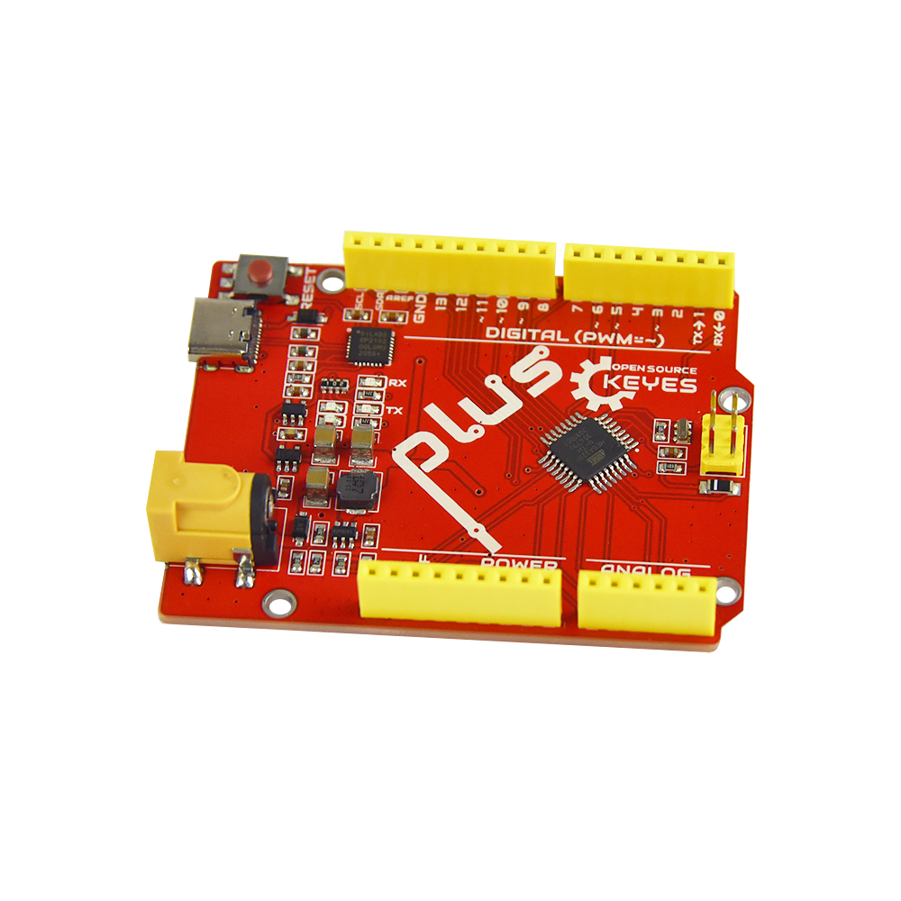

在我们进行DIY电子产品实验时，我们经常会用到arduino系列单片机在Arduino IDE开发环境上编程设置。Keyes Uno Plus 开发板是一款完全兼容Arduino IDE开发环境的控制板。它包含官网的 UNO R3板的所有功能，并且在 UNO R3板的基础上，我们做了一些改进，使它的功能更加强大。具体改进如下图。为了方便接线，我们还配了1根长度为1米的type-c接口的USB线。

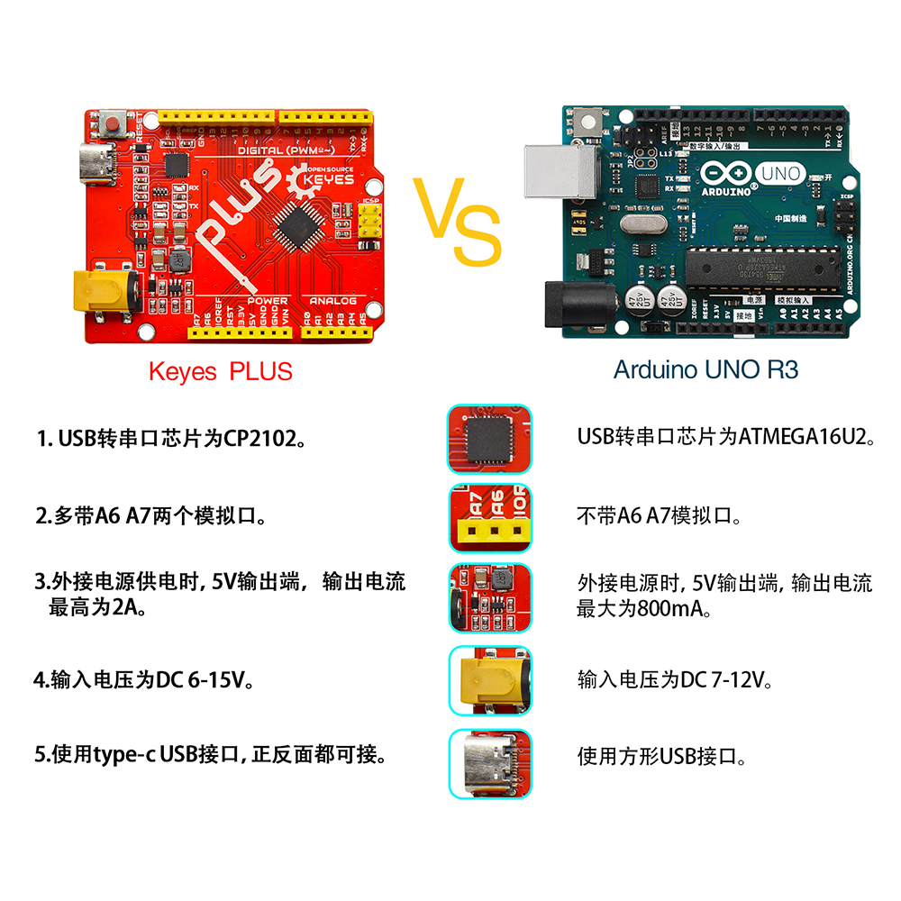

我们再通过下面的图来了解一下这个开发板的各个接口和主要元器件。

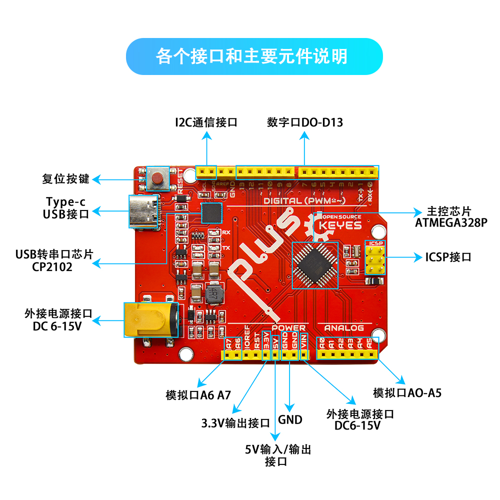

规格参数

微控制器：ATMEGA328P-AU

USB转串口芯片：CP2102

工作电压：DC 5V

外接电源: DC 6-15V（建议9V）

数字I/O引脚: 14 (D0-D13)

PWM通道：6 (D3 D5 D6 D9 D10 D11)

模拟输入通道（ADC）: 8(A0-A7)

每个I/O直流输出能力: 20 mA

3.3V端口输出能力: 50 mA

Flash Memory: 32 KB（其中引导程序使用0.5 KB）

SRAM:2 KB (ATMEGA328P-AU)

EEPROM: 1 KB (ATMEGA328P-AU)

时钟速度:16MHz

板载LED引脚:D13

### 第2小节 Keyes brick shield 传感器扩展板

1.概述

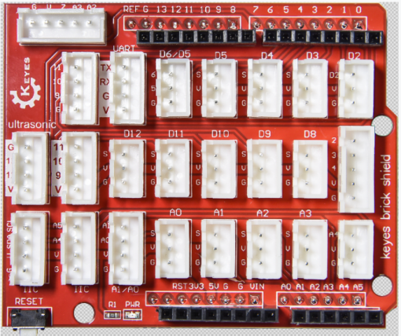当我们在做DIY实验时，我们经常会利用UNO R3控制板和其他传感器/模块搭配使用。为了方便接线，我们的最新一版传感器/模块使用了间距为2.54mm防反接口。为了兼容最新一版传感器/模块接口，我们特别设计了这一款扩展板。使用时，我们只需要将扩展板堆叠在UNO R3控制板上，利用一个特定接线连接传感器/模块。接线简单方便，由于是防反接口，线序固定，将不会再出现控制板连接传感器/模块时，因线序接反，导致烧坏传感器/模块现象。

为方便接线，扩展板上接口都带有丝印。3pin接口丝印一般为G V S，其中扩展板上所有的G代表GND，V代表VCC（5V）接口，S代表接口上方的数字口/模拟口。4pin/5pin接口左面都有对应接口丝印。扩展板上两边还自带间距为2.54mm的排母接口，接线顺序和UNO Plus板的排母接口的线序一致。同时扩展板上自带一个复位按键，1个电源指示灯PWR。

为了方便将扩展板固定在其他设备，扩展板自带3个直径为3mm的定位孔大小。

2.接口说明

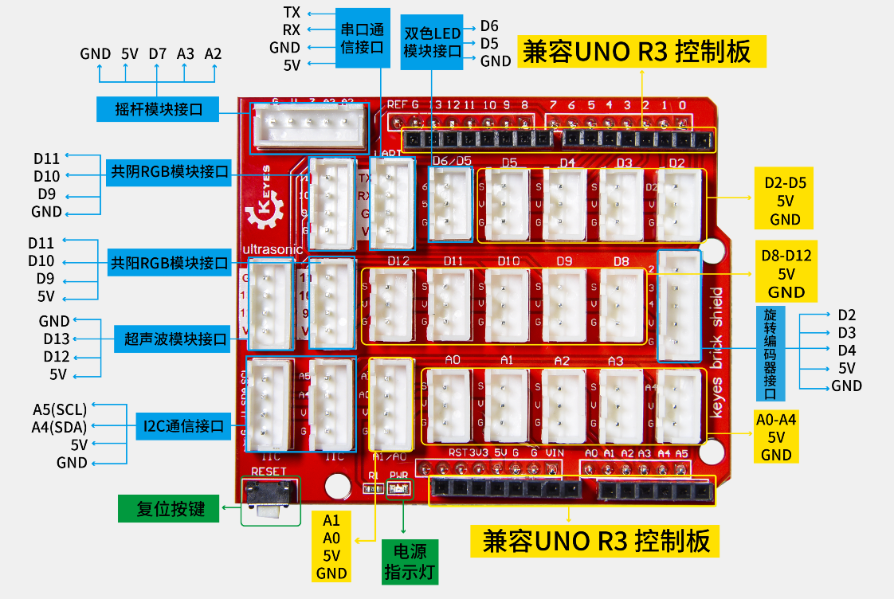

3.使用方法

堆叠在Keyes Uno Plus 开发板上即可使用，如下图

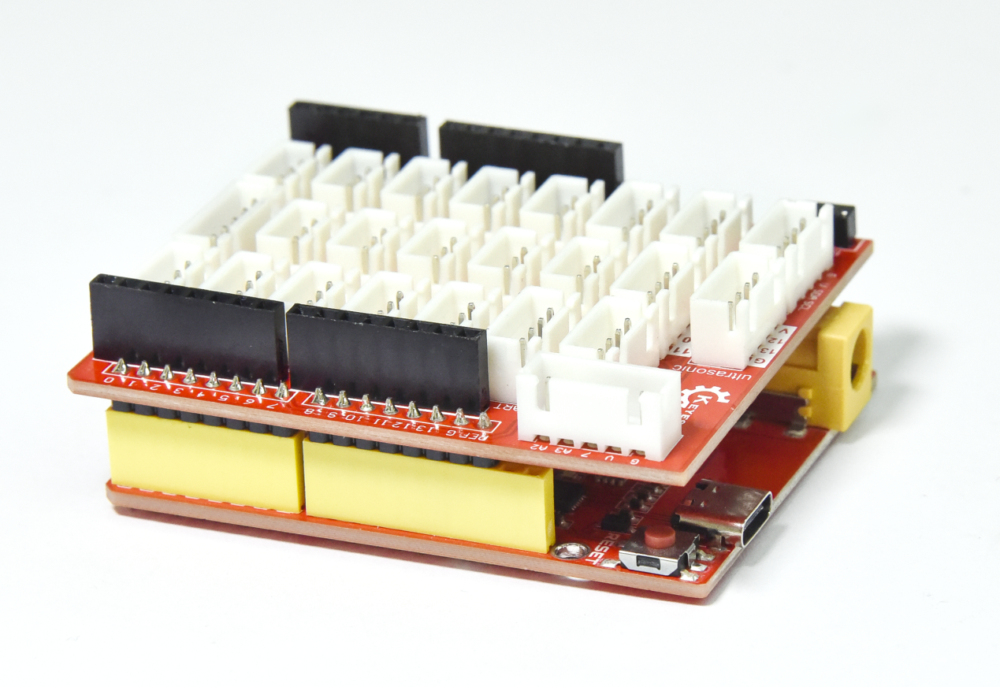

### 第3小节 KidsBlock软件安装方法

注意：这里是以Windows系统为例，macOS 系统可以以此作为参考。

1.  双击“KidsBlock 1.0.0     Setup.exe”。

2.  先选中“为使用这台电脑的任何人安装”，再点击“下一步”。

3.  先点击“浏览（B）...”,选择安装的位置（我这里选择安装在C盘，你也可以选择安装在电脑的其他盘），再点击“安装”。这样，软件就在安装过程中。

4.  几秒种后，安装完成。点击“完成”就可以打开安装好的软件。

5.  如果出现电脑安全警报窗口，点击“允许访问”。这样就可以打开了软件页面。

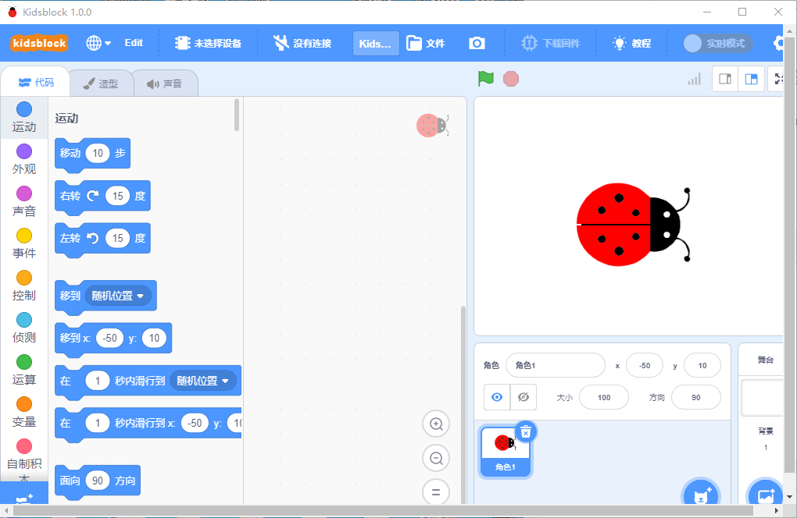

有更新软件时一般打开会自动提醒，为了软件能正常使用我们选择升级

我们也可在设置中手动更新软件

如果已经是最新版本则显示

### 第4小节 KidsBlock软件的使用方法

（以下是以Windows系统为例，MacOS系统可以参考）

1.软件中各按钮的功能：

2.  点击可以选择语言“English”和“简体中文”。

3.  点击，选择点击“安装驱动”。（注意：如果电脑已经安装了驱动程序，则不需要再安装驱动；如果没有，则需要进行以下操作）

A.在“设备驱动程序安装向导”页面选择点击“下一页”。

2.  过一会儿，选择点击“完成”。

3.  选择点击“下一页”。

4.  选择点击“完成”。

5.  如果出现安全页面，选择点击“允许”即可，然后选择点击“Install”。

E.选择点击“安装”。

6.  过一会儿，点击“Finish”。

7.  选择点击“Extract”。

8.  选择点击“下一页”。

9.  选择点击“我接受这个协议”后，点击“下一页”。

10. 选择点击“完成”。

11. 选择“安装”。

15. 过几秒钟后，驱动安装完成，点击“确定”即可。

4.  驱动安装完后，点击进入主控板页面，可以选择需要添加的设备（控制板），本项目需要选择Uno     Plus主控板。先点击Uno Plus主控板所处区域，后点击“连接”。这样Uno     Plus主控板已连接上，点击“返回编辑器”回到编码编辑器。这样，我们会发现变成，同时变成，说明Uno     Plus主控板和端口（COM） 都已经连接上了。

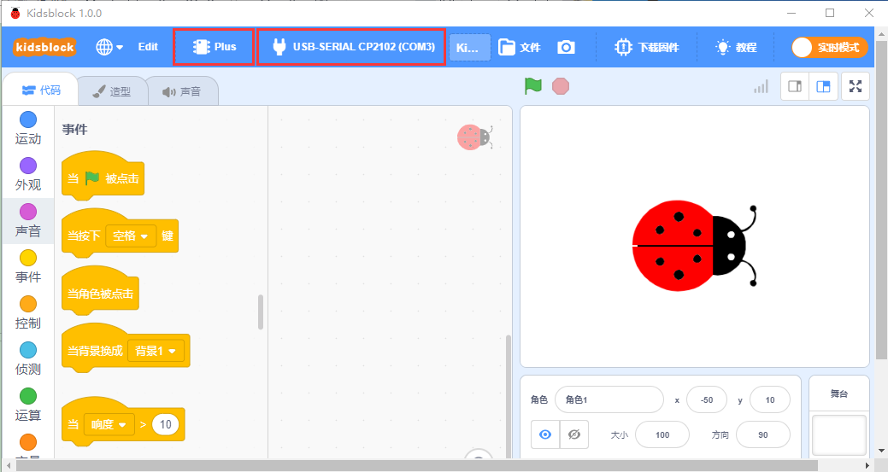

5.  假如Uno     Plus主控板已经连接上后，但是没有变成，则需要手动点击来连接端口（COM）。先点击，在出现的对话页面中点击，连接成功后，会出现“已连接”页面，说明端口已连接上了。

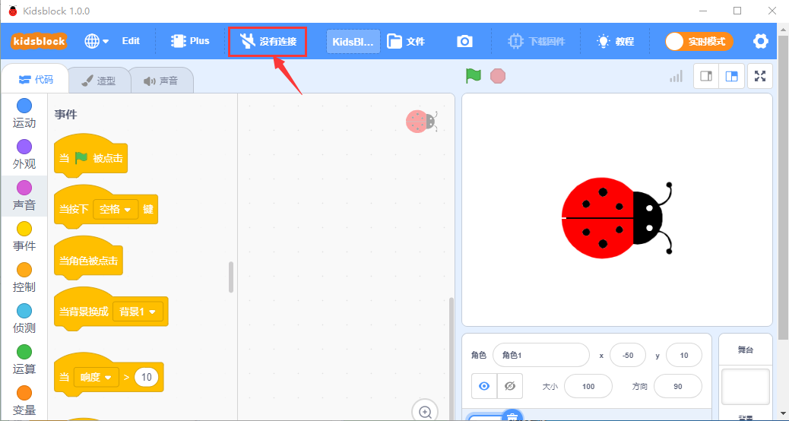

如果需要断开端口，先点击，在出现的对话页面中点击“断开连接”。这样，端口就断开了。

6.  Uno     Plus主控板和端口（COM）都已经连接上，接着点击切换模式，这样就可以将切换成。

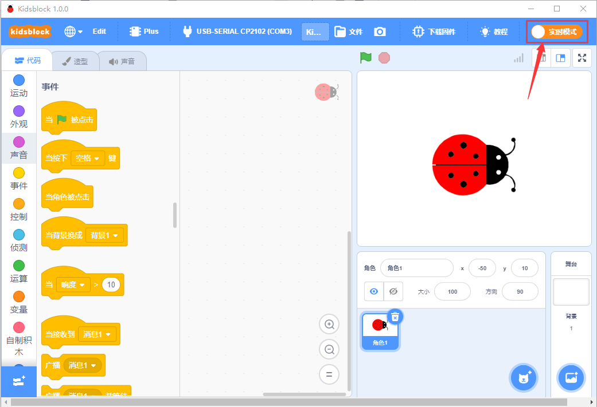

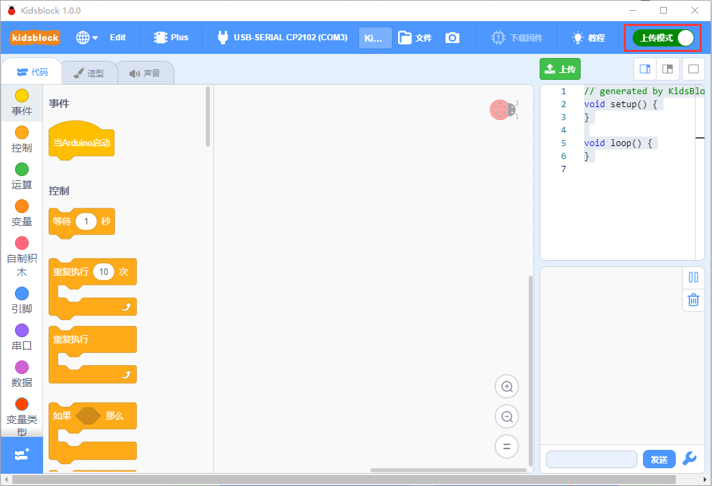

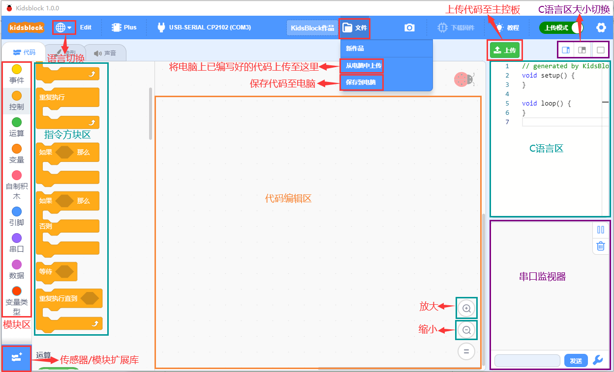

7.  是添加传感器/模块和元件的扩展包，点击可以进入传感器/模块扩展库界面，点击传感器/模块所处区域，就可以添加对应的传感器/模块。例如需要添加无源蜂鸣器模块，点击“无源蜂鸣器”所处区域，“未加载”变成“已加载”，说明“无源蜂鸣器”模块添加成功。

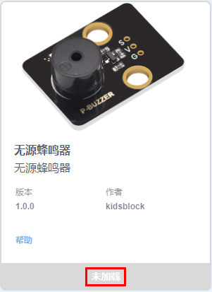
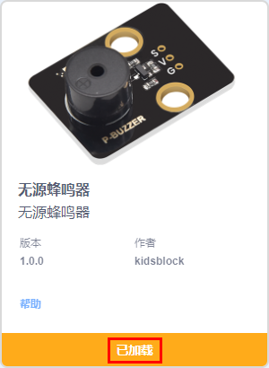

点击，可以回到代码编辑器界面，在模块区可以看到添加的“无源蜂鸣器”模块。

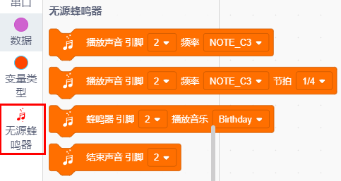

如果需要删除“无源蜂鸣器”模块，只需要点击再次进入传感器/模块扩展库界面，点击“无源蜂鸣器”所处区域，“已加载”变成“未加载”，则说明“无源蜂鸣器”模块删除成功。

其他的传感器/模块和元器件的添加和删除，方法是一样的。

8.  打开已有的SB3类型文件的方法：推荐使用方法2，方法1打开时有时可能会丢失代码数据！

方法1：鼠标左键双击SB3类型文件，这样就可以打开SB3类型文件。例如：需要打开文件，则只需要左键双击文件就可以直接打开。

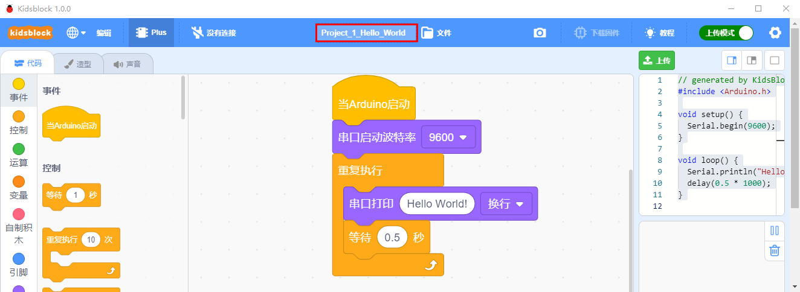

方法2：打开Kidsblock软件，点击“文件”，选择点击“从电脑中上传”，在电脑上选中需要打开的SB3类型文件（例如：文件）

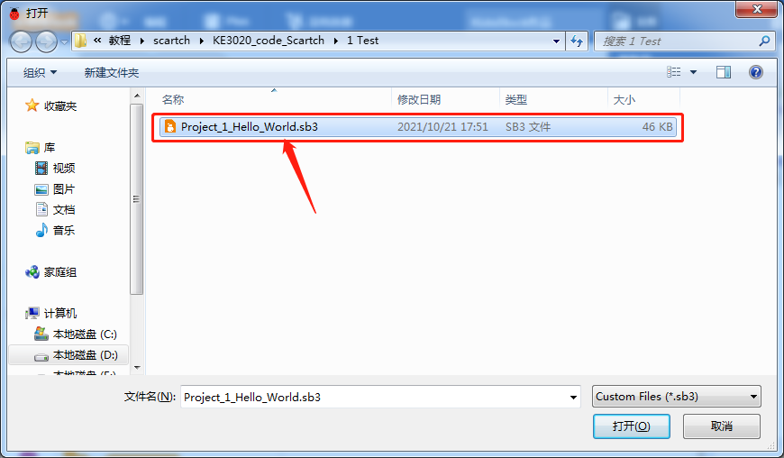

## 单个传感器/模块实验课程

拿到套件后，我们可以看到套件中有37款传感器/模块，有对应的Keyes Uno Plus
开发板、传感器扩展板和连接线。这里，我们将37款传感器/模块利用自带连接线，单独连接在Keyes Uno Plus
开发板和传感器扩展板。然后上传对应的测试代码，单独测试各个传感器/模块的功能。我们下面的课程是先从简单到复杂学习单个模块/传感器的原理，后面再学习一些模块/传感器的扩展应用以巩固加深我们对该套件的理解。

特别注意：实验时，模块/传感器连接线材时，必须按照资料里的接线方法及位置，电源与信息脚不能错接，否则可能会损坏模块/传感器。

### 实验一 点亮LED

实验说明

在这个套件中，我们有一个Keyes DIY电子积木
白色LED模块。它的控制方法非常简单，要想点亮LED，只要让它两端有一定的电压就可以。

实验中，我们通过编程控制信号端S的高低电平，从而控制LED的亮灭。我们提供两个测试代码，分别控制LED模块上实现点亮和闪烁的效果。

实验原理

下面附了两个电路原理图，左边我们直接把LED串联一个电阻，负极接地，正极接到单片机的IO口，理论上来说当我们把信号端S输出高电平(5V)，LED两端就会有电压，LED就会被点亮，那么我们为什么说这么接不合理呢？原因就是我们单片机IO口输出电流的能力有限(最大20mA)，虽然输出了高电平，但是可能达不到控制LED的电流，此时LED可能比较暗。

右边的接法：控制时，GND和VCC上电后，如果信号端S为高电平，那么三极管Q1就会导通，则LED有电流流过，LED即会亮起(注意：此时电流是由VCC电源端流经LED和电阻R3到GND，而不是直接从单片机IO口输出，此时输出电流的能力就比较强)，S端为低电平时三极管Q1截止，那么就没有电流流过LED，那么LED就会熄灭。也就是说，我们这里的三极管Q1相当于一个开关作用，而电阻R1,R3都是一个限流电阻，顾名思义就是限制电流的大小，以免烧坏电子元器件。

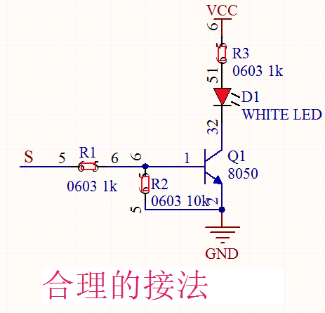

实验器材

|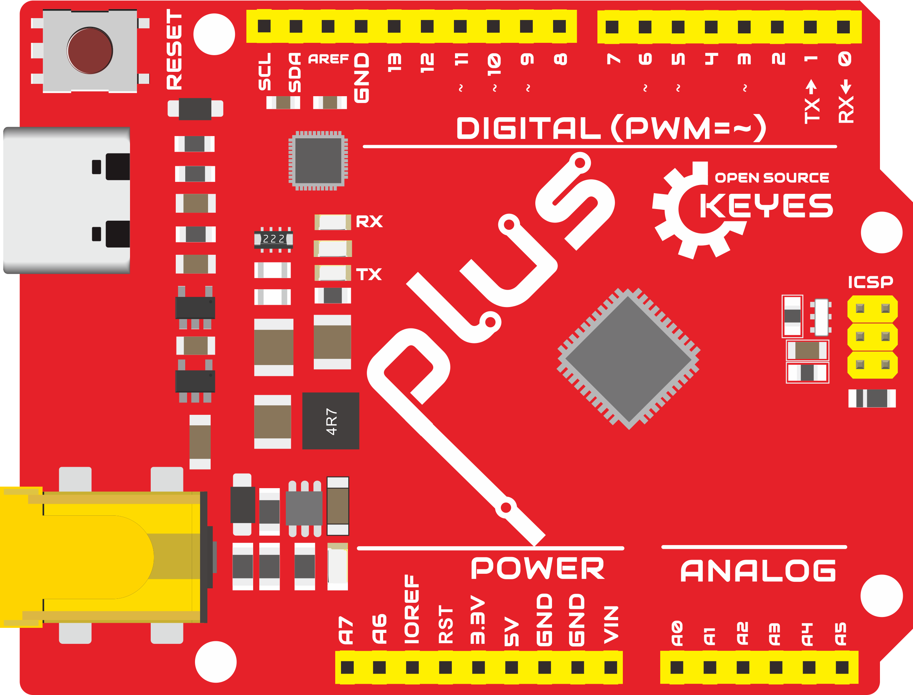|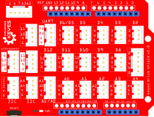|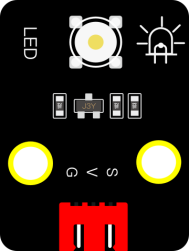|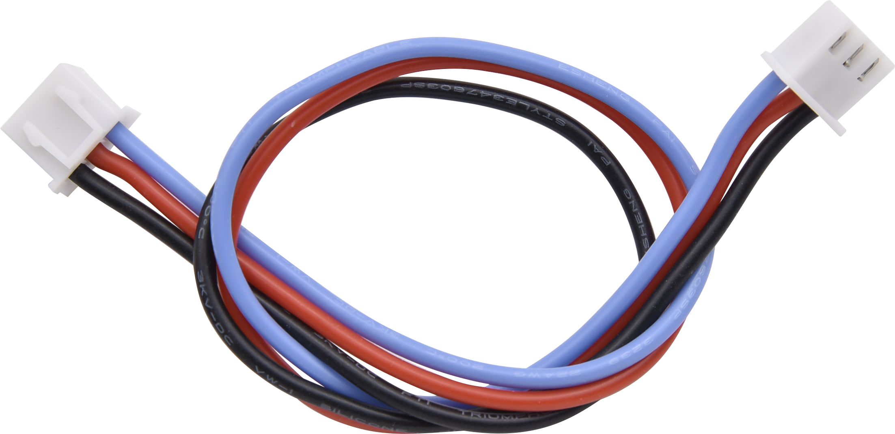|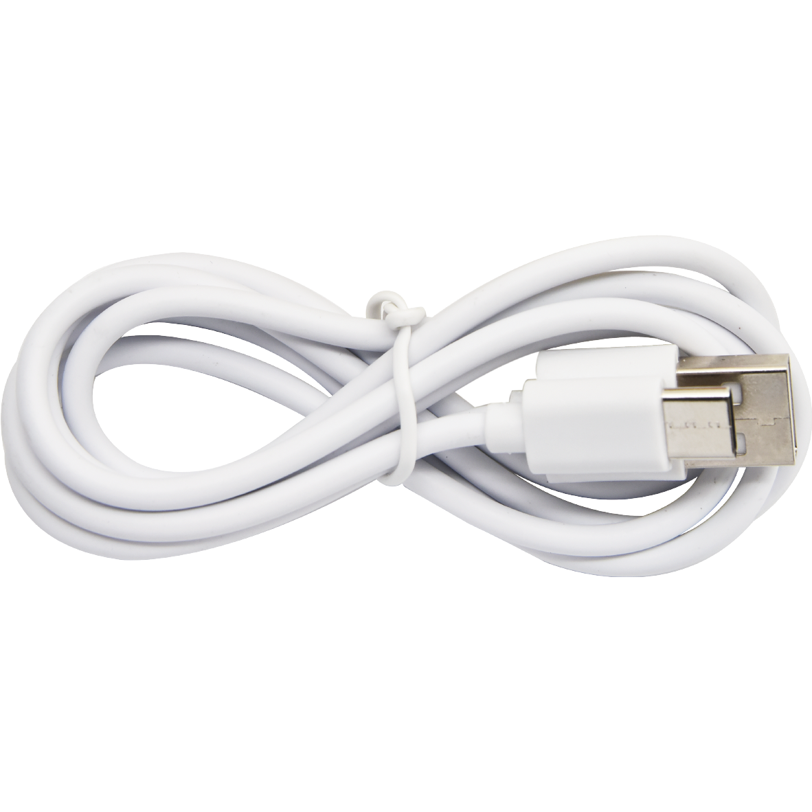|
|-|-|-|-|-|
|Keyes Uno Plus 开发板*1|传感器扩展板*1|Keyes DIY电子积木 白色LED模块*1|3P XH-2.54mm 黑红蓝硅胶线*1|USB线*1|

接线图

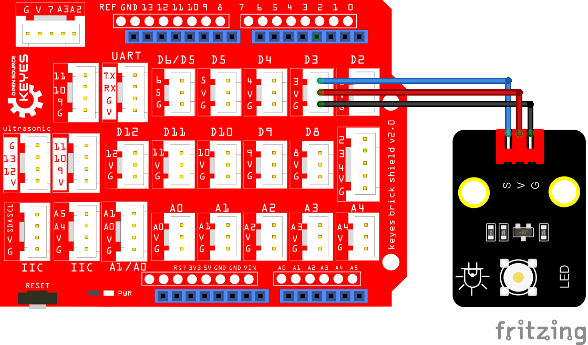

测试代码

代码1：

代码2：

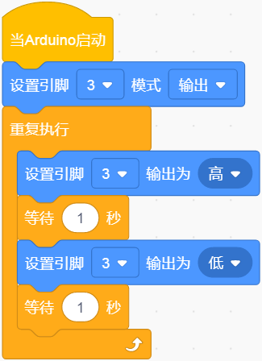

代码说明

代码1说明：

1.  首先选择与连接设备点击上传实时模式改为上传模式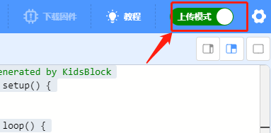。

2.  从“事件”中找到并拖出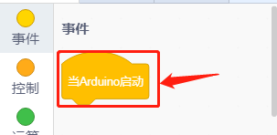，再从“引脚”中找到并拖出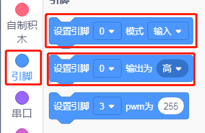，由接线图我们知道，我们LED管脚接数字口3，所以我们把引脚设置为3，模式设置为输出模式，因为我们要输出高电平，设置完输出模式后，我们再把引脚输出高电平。

3.  我们的代码块一定要紧连或者在循环函数中，不然不会运行，在下的代码块只运行一次，二循环函数中的代码块循环运行，我们LED模块信号端连接在D3，我们可以将模块信号端S设置为高低电平。我们测试的过程中，当模块S端设为高电平（高）时，模块上LED亮起，设为低电平（低）时，模块上LED熄灭。

代码2说明：

1.代码1中我们找到并设置了和。

2.从“控制”模块找到并拖出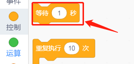，1为延时的秒数，默认1秒，如果填0.1，则代表0.1秒。

3.通过整合前面知识。我们再来看代码就清楚明了了，代码中我们先设置引脚3位输出模式，然后我们把模块信号端接到D3，设置为高电平，就是点亮模块上LED；第二条延迟1秒，就是让模块上LED点亮1秒。同样第三条第四条代码表示让模块上LED熄灭1秒。代码块在，也就是控制模块上LED，循环亮1秒，灭1秒，实现闪烁效果。通过代码设置，我们可以更改模块上LED亮灭的延迟时间，从而使模块上LED实现不同的闪烁效果。

实验结果：

代码一：白色LED模块常亮

代码二：LED亮一秒，灭一秒，循环交替。

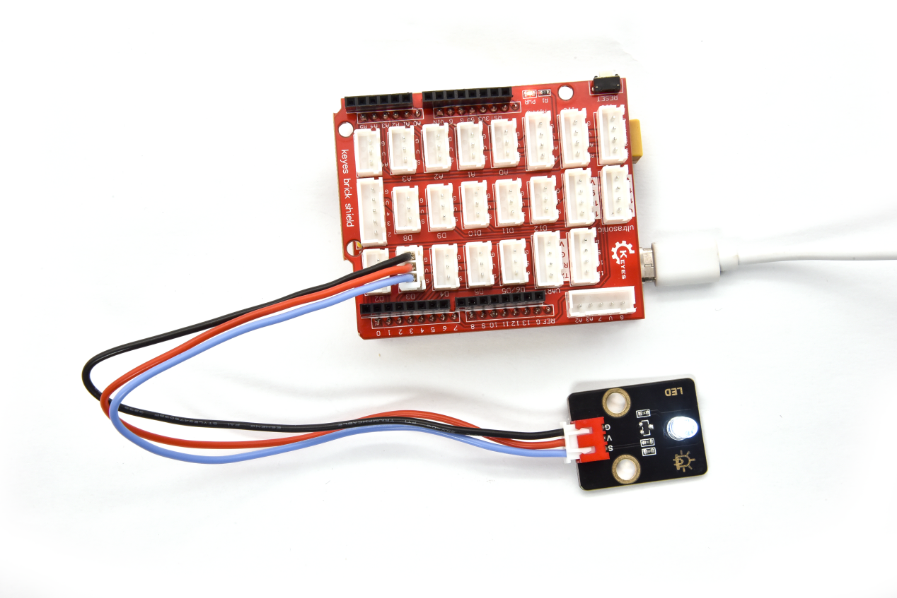

### 实验二 交通灯模块

实验说明

我想大家都看见过交通灯，就是马路上十字路口的红绿灯。如果您开过车，我想您一定仔细观察过交通灯，如果您还没有驾驶过车，您是否仔细观察过交通灯呢？在我们这个套件中，就包含一个交通灯模块。我们经常会用红绿黄3个LED外接电路来模拟路边的红绿黄灯闪烁。因此我们特别设计了这款模块，模块上自带了红黄绿3个LED灯，我们这个实验就做一个模拟交通灯。

实验原理

前面第一课我们就学习了如何控制一个LED，由原理图容易得知，控制这个模块就好比分别控制3个独立的LED灯(我们这个灯可直接由单片机IO口驱动)，给对应颜色灯高电平就亮起对应的颜色。比如，我们给信号“R”输出高电平，也就是5V，则红色LED点亮。

实验器材

|||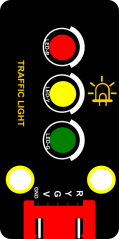|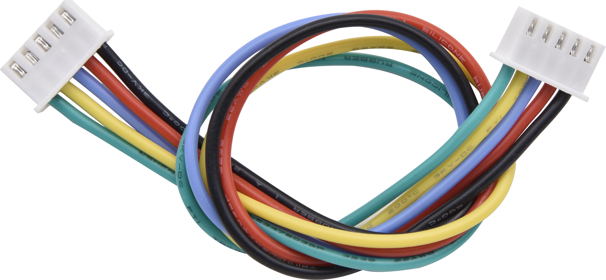||
|-|-|-|-|-|
|Keyes Uno Plus 开发板*1|传感器扩展板*1|Keyes DIY电子积木 交通灯模块*1|5P XH-2.54mm 黑红蓝黄绿硅胶线*1|USB线*1|

接线图

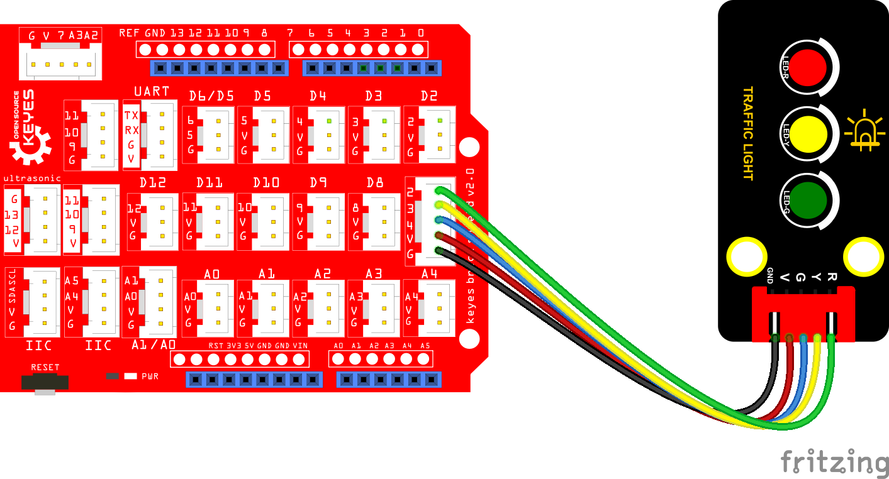

测试代码

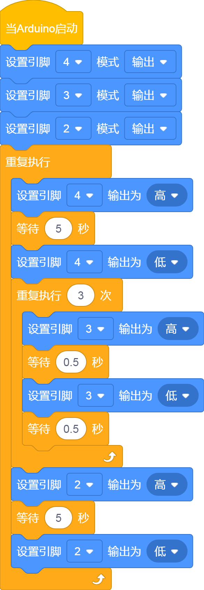

代码说明

1\.
首先在代码块下找到拖出“当Arduino启动”，再在引脚模块下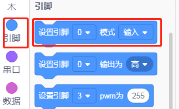找到引脚模式设置，并把引脚分别设置为2、3、4，且都设置为输出模式，由接线图我们知道，我们交通灯模块上的绿灯是接数字口4，黄灯是接数字口3，红灯是接数字口2，在实验中，我们设置对应数字输出引脚高电平即点亮对应颜色的灯。

2\.
然后找到循环函数，这里我们还用到了for()循环：，这个代码块位于“控制”模块下，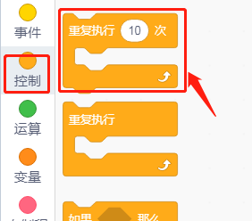，我们循环三次，把10改为3就可以了。

3\. 我们还用到延时函数，分别有延时5秒和0.5秒，可参照实验一的代码说明。

实验结果

上传测试代码成功，上电后，模块上绿色LED亮5秒然后熄灭，黄色LED闪烁3秒然后熄灭，再然后红色LED亮5秒，然后熄灭，模块上3个LED自动模拟交通灯运行。我们可以看到右边代码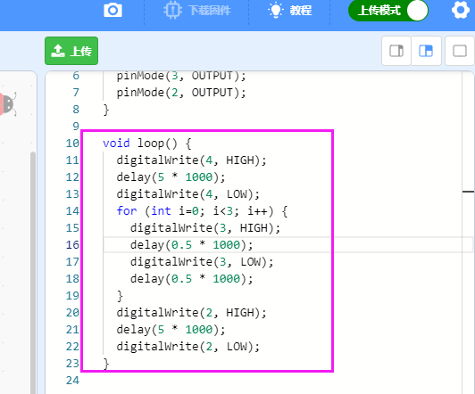就可以看到其实这部分代码是在一个循环函数“loop”中。更多详细可参照https://www.arduino.cc/reference/en/language/structure/sketch/loop/

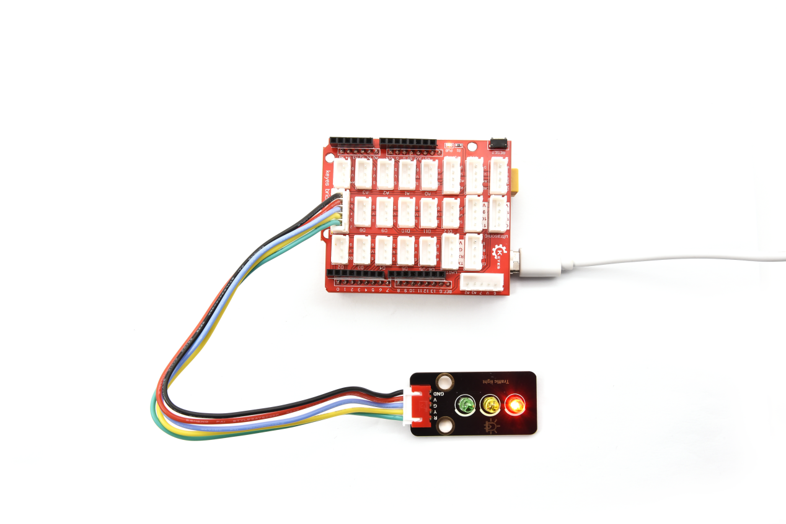

### 实验三 激光头传感器模块发出激光

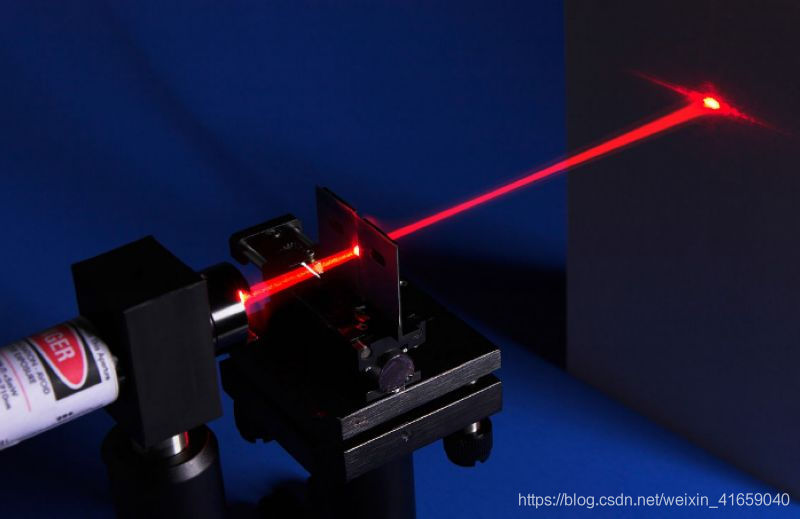

实验说明

我们都应该经常又听说激光，激光与常见的光不同。

一方面是由于它的来源。当原子被激发，从而电子从低能级跃迁到高能级，再从高能级回落到低能级的时候，能量以特定频率的电磁波向外辐射。由于电子的能级是特定的，因而辐射出的电磁波频率是一致的。由此，一束激光只有一种特定频率的电磁波（光）。这使得激光比起普通光源，激光的单色性好。另一方面，激光发射器内部特定的结构，使得激光能够被聚集成单束光，朝着同一方向射出，亮度高，方向性好。

正是由于这些特性，激光被广泛用于对特定材料进行切割、焊接、表面处理等等。激光的能量非常高，玩具激光笔照射人眼可能导致眩光，长时间可能导致视网膜损害，我国也禁止用激光照射航行的飞机。因此，请注意不要用激光发射器对准人眼。

实验原理

激光头传感器模块主要由激光头组成，激光头由发光管芯、聚光透镜、铜可调套筒三部分组成。我们可以看到此模块电路原理图，可知该模块的控制方法与我们前面学习过的LED非常相似，都是用三极管驱动，在信号端直接输入一个高电平数字信号，传感器开始工作，输入低电平时停止工作。

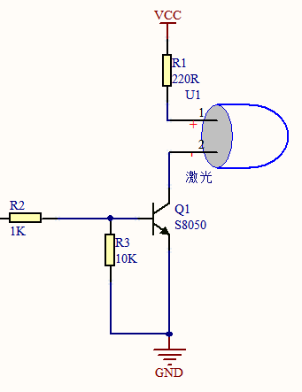

实验器材

||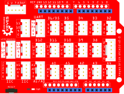|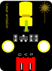|||
|-|-|-|-|-|
|Keyes Uno Plus 开发板*1|传感器扩展板*1|Keyes DIY电子积木 激光模块*1|3P XH-2.54mm 黑红蓝硅胶线*1|USB线*1|

接线图

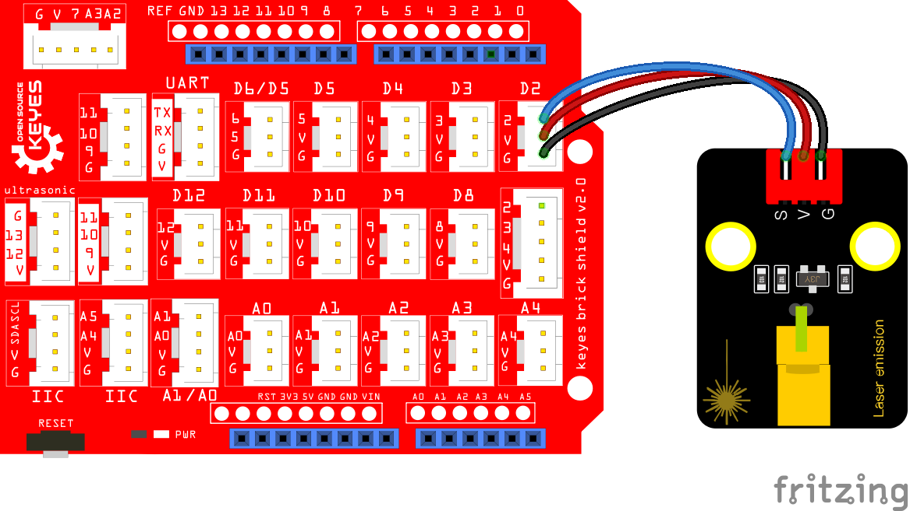

测试代码

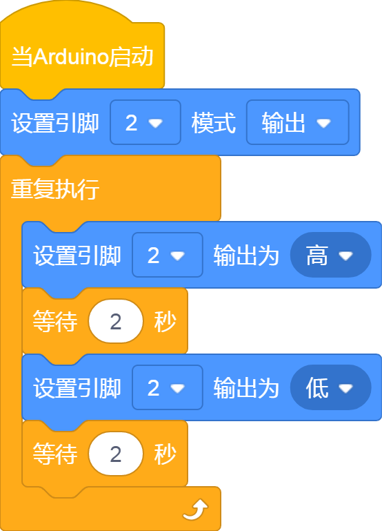

代码说明

1\.
与前面我们学习的一样，因为我们接线在数字口2，所以我们需要设置数字口2位输出模式，然后在循环函数代码块中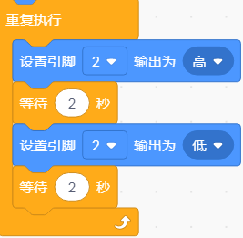设置为高时，模块上激光管发射出红色激光信号；设置为低时，模块上激光管不发射出红色激光信号。

2\. 延时函数2秒，可参照实验一代码说明。

测试结果

上传测试代码成功，上电后，模块上激光管发射红色激光信号2秒，停止发射红色激光信号2秒，循环交替。

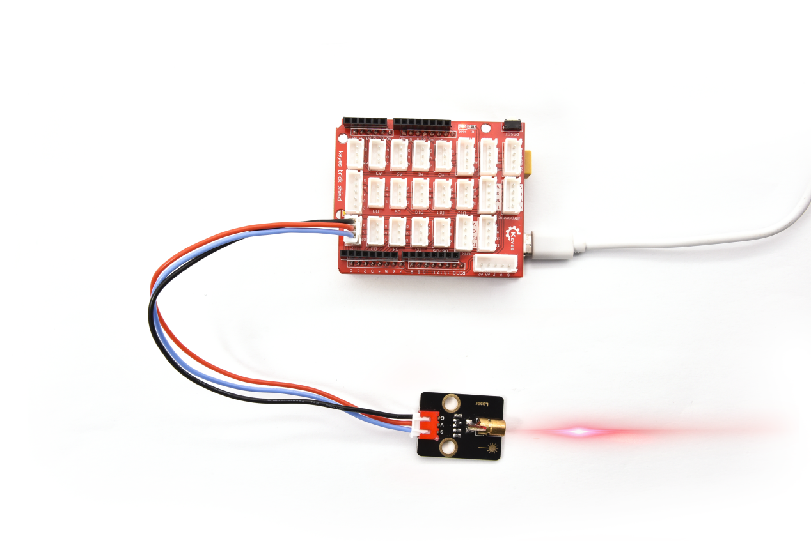

### 实验四 按键传感器检测实验

实验说明

在这个套件中，有一个Keyes DIY电子积木
单路按键模块，它主要采用1个轻触开关，自带1个黄色按键帽。前面我们学习了怎么让我们单片机的引脚输出一个高电平或者低电平，这节实验我们就来学习怎么读取引脚是高电平（5V）还是低电平（0V）。

实验中，我们通过读取传感器上S端高低电平，判断传感器上按键是否按下；并且，我们在串口监视器上显示测试结果。

实验原理

附原理图，按键有四个引脚，其中1和3是相连的，2和4是相连的，在我们未按下按键时，13与24是断开的，信号端S读取的是被4.7K的上拉电阻R1所拉高的高电平，而当我们按下按键时，13和24连通。信号端S连接到了GND，此时读取到的电平为低电平，即按下按键，传感器信号端为低电平；松开按键时，信号端为高电平。

实验器材

|||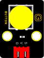|||
|-|-|-|-|-|
|Keyes Uno Plus 开发板*1|传感器扩展板*1|Keyes DIY电子积木 单路按键模块*1|3P XH-2.54mm 黑红蓝硅胶线*1|USB线*1|

接线图

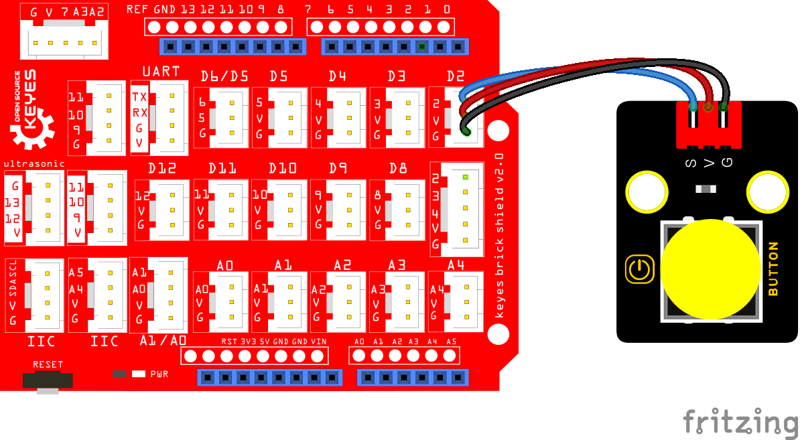

测试代码

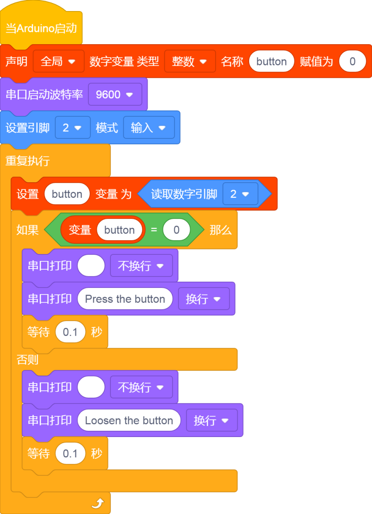

代码说明

1\.
在变量类型单元找到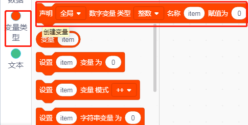，将item变量名改为“button”，这里修改变量名是方便我们理解与记忆。设置button初始变量为整数，并赋值为0，。

2.初始化设置波特率为9600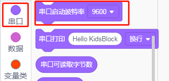，波特率是串口通信传输的一个速度量，这里表示9600bit每秒。

3.同样，在我们引脚单元找到我们这里接数字口2，所以我们将管脚设置为2，我们需要读取按键的值，所以需要将引脚2设置为输入模式。然后再在变量类型单元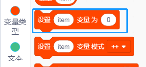找到，将item改为button，0的位置填入按键接收的值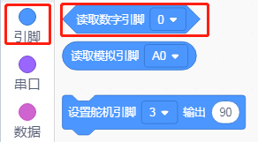将引脚改为2即可。我们需要循环检测，所以我们在循环函数中再将读取到D2读取到的按键值赋值给变量button。

4.在控制单元中找到条件控制语句，如果...否则...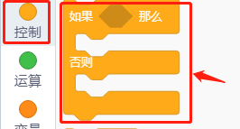，然后运算单元中找到“等于条件”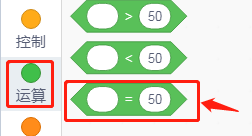，在条件语句代码块左边填入，将item改为button，右边填入“0”，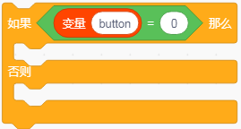，因为我们前面了解到按键传感器的原理，按下去我们接受到信号“0”，所以这条语句的意思就是，如果我们按下按键。我们为了清除明了的显示，我们打印一些按键的信息：找到串口单元下的串口打印代码块，然后将换行改为不换行，“Hello KidsBlock”改为“
”，复制一遍然后把“
”改为“Press the button”,“不换行”改为“换行”，再延时0.1秒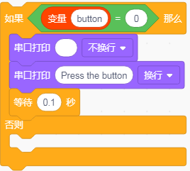，点击第一行代码复制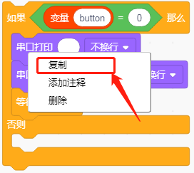，复制后的代码放入到否则下然后把“Press the button”改为“Loosen the button”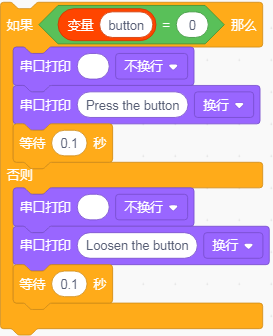，否则下的代码块即button不等于0，即我们松开了按键。

5.整个代码逻辑是传感器感应到按键按下时，信号端为低电平，D2口为低电平，即button为0。这时我们在串口监视器显示对应的数字值和字符；否则（传感器感应到按键松开时），button为1，窗口监视器显示1和另外的字符。

实验结果

上传测试代码成功，利用USB线上电后，串口监视器显示对应数据和字符。实验中，当传感器按下按键时，button为0，串口监视器显示“Press the button”字符；松开按键时，button为1，串口监视器显示“Loosen the button”字符，如下图。

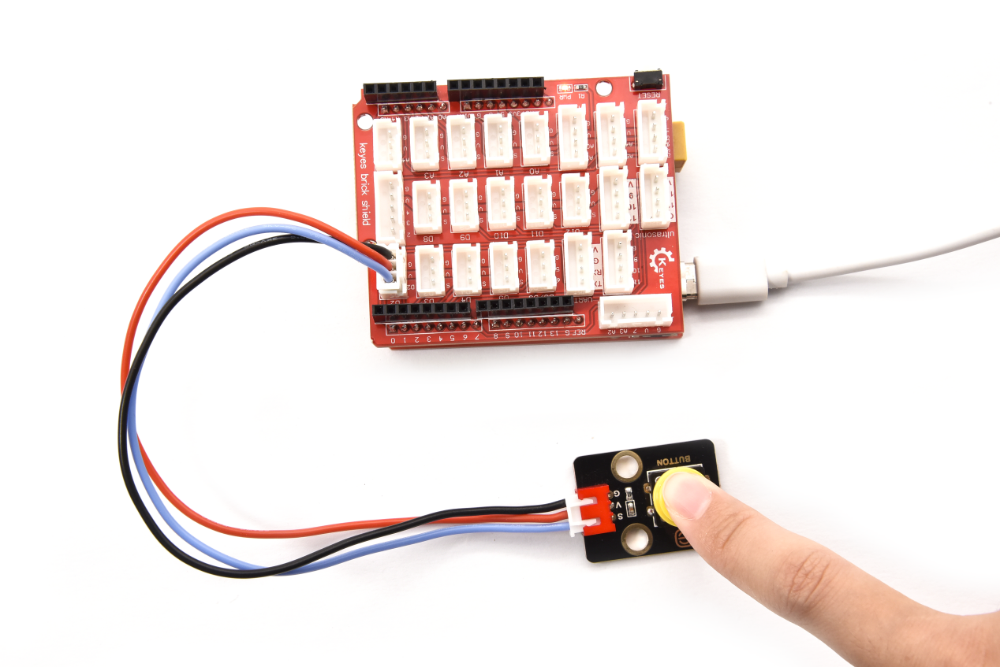

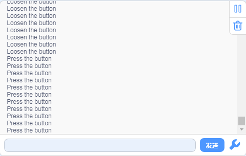

### 实验五 电容触摸传感器检测实验

实验说明

在这个套件中，有一个Keyes DIY电子积木
电容触摸模块，它主要采用1个TTP223-BA6芯片。它是触摸检测芯片，提供一个触摸按键，功能是用可变面积的按键取代传统按键。当我们上电之后，传感器需要约0.5秒的稳定时间，此时间段内不要对键进行触摸，此时所有功能都被禁止，始终进行自校准，校准周期约为4秒。

我们在串口监视器上显示测试结果。

实验原理

当我们用手指触摸模块时，信号端S输出高电平，板载红色LED点亮，我们通过读取传感器上S端高低电平，判断传感器上按键是否按下（上一实验学习的单路按键模块刚好相反，按下为低电平）。

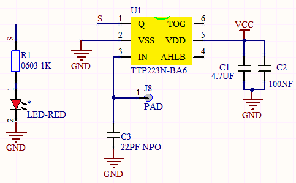

实验器材

|||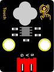|||
|-|-|-|-|-|
|Keyes Uno Plus 开发板*1|传感器扩展板*1|Keyes DIY电子积木 电容触摸模块*1|3P XH-2.54mm 黑红蓝硅胶线*1|USB线*1|

接线图

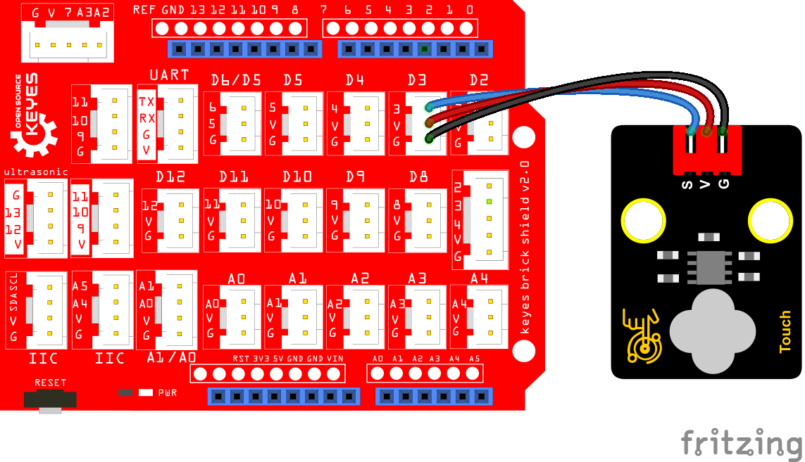

测试代码

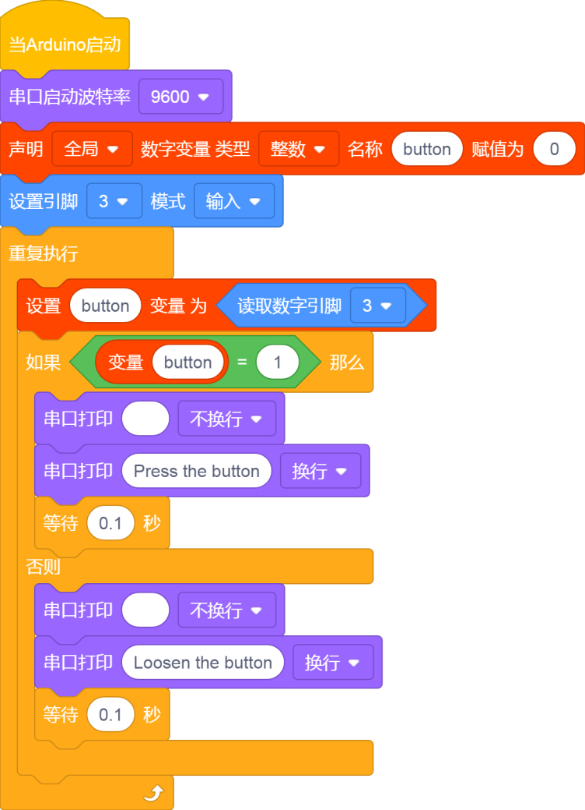

代码说明

1\.
我们前面学习了按键模块，知道了首先我们得先创建一个变量用来存储读取按键的值。

2\.
同样，我们这里接数字口3，所以我们将管脚设置为3。其它设置方法和上一实验类似。在上一实验中，当检测到按键信号时，信号端为低电平，即button为0。在这一实验中，当检测到按键信号时，信号端为高电平，即button为1。

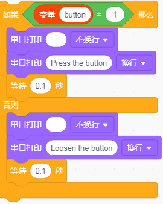

测试结果

上传测试代码成功，利用USB线上电后，串口监视器显示对应数据和字符。实验中，当传感器按下按键时，板载红色LED点亮，button为1，串口监视器显示“Press the button”字符；松开按键时，板载红色LED熄灭，button为0，串口监视器显示“Loosen the button”字符，如下图。

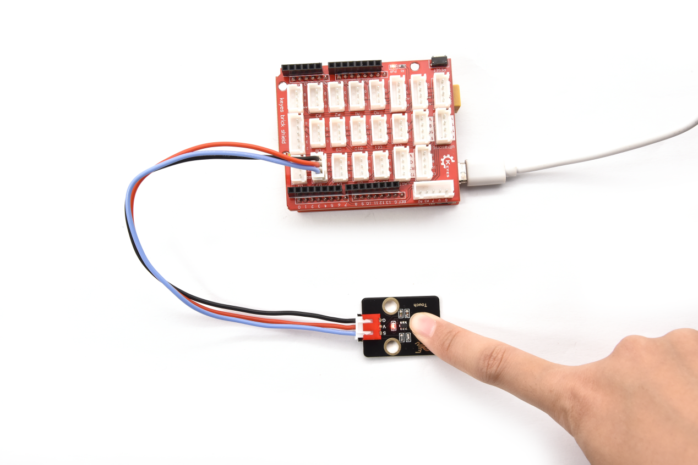

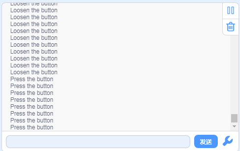

### 实验六 避障传感器检测障碍物

实验说明

在这个套件中，有一个Keyes DIY电子积木
避障传感器，它主要采用一对红外线发射与接收管元件。实验中，我们通过读取传感器上S端高低电平，判断是否存在障碍物；并且，我们在串口监视器上显示测试结果。

实验原理

原理就是NE555时基电路提供发射管TX发射出一定频率的红外信号，红外信号会随着传送距离的加大逐渐衰减，如果遇到障碍物，就会形成红外反射。当检测方向RX遇到反射回来的信号比较弱时，接收检测引脚输出高电平，说明障碍物比较远；当反射回来的信号比较强，接收检测引脚输出低电平，说明障碍物比较近了，接收检测引脚输出低电平，此时指示灯亮起。传感器上有两个电位器，一个用于调节发送功率，一个用于调节接收频率，通过调节2个电位器，我们可以调节它的有效距离。

实验器材

|||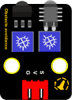|||
|-|-|-|-|-|
|Keyes Uno Plus 开发板*1|传感器扩展板*1|Keyes DIY电子积木 避障传感器*1|3P XH-2.54mm 黑红蓝硅胶线*1|USB线*1|

接线图

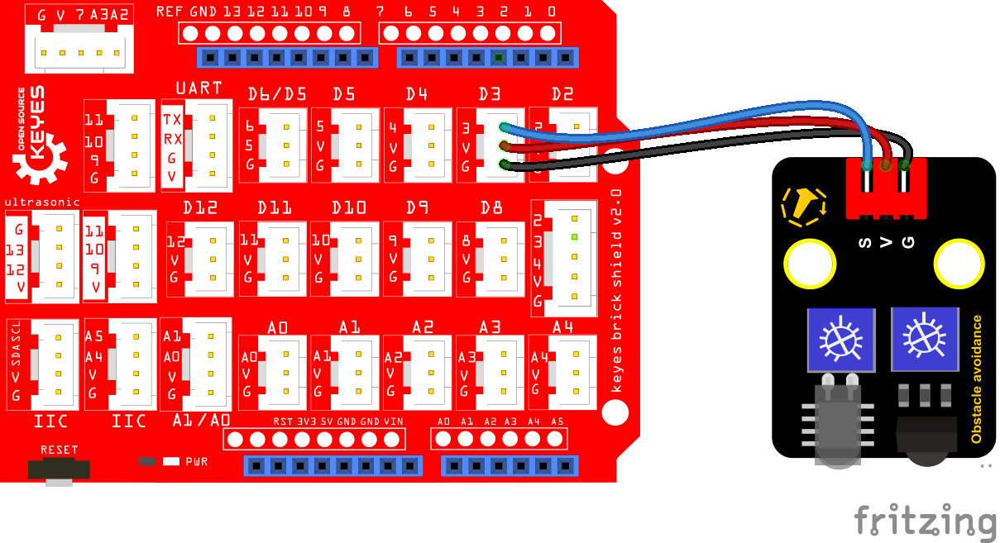

测试代码

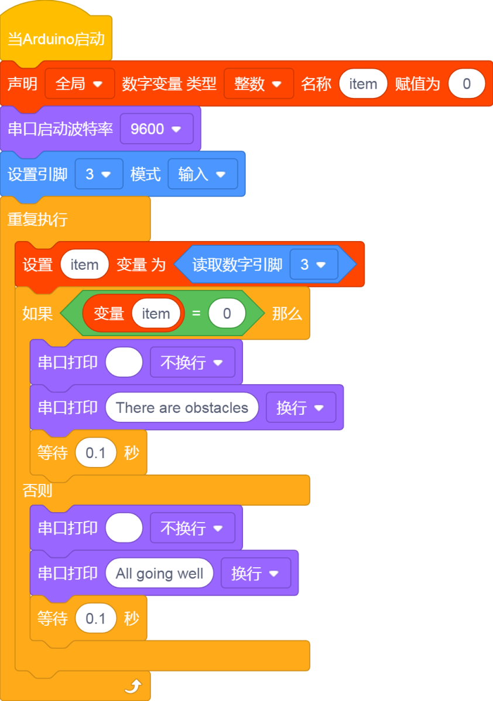

代码说明

设置方法和按键实验类似，这里简单介绍一下：首先我们先声明一个整数变量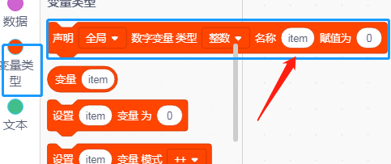，我们这里没有改变量名，用默认的“item”，然后设置波特率为9600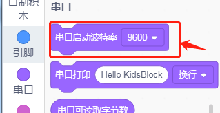，因为我们避障传感器接的数字口3，我们需要读取传感器的值，所以我们将数字口3设置为输入模式，重复读取存储到变量item中。由上面我们讲的原理可知，当检测到障碍物时传感器输出低电平，也就是我们的单片机读取到低电平，即条件满足，打印对应的信息。

特别注意

烧录好测试代码，按照接线图连接好线，上电后，我们开始调节两个电位器调节感应距

离。

1.调节发射功率调节电位器，先将电位器顺时针到尽头，然后回调一些，使传感器上

P LED介于不亮与亮之间的零界点。

2.调节接收频率调节电位器，顺时针调节时，频率增大。调节使它产生38KHz频率的方波，调节时，也观察传感器上S LED，使它介于不亮与亮之间的零界点。

实验结果

上传测试代码成功，利用USB线上电后，串口监视器显示对应数据和字符。实验中，当传感器检测到障碍物时，item为0，串口监视器显示“There are obstacles”字符；没有检测到障碍物时，item为1，串口监视器显示“All going well”字符，如下图。

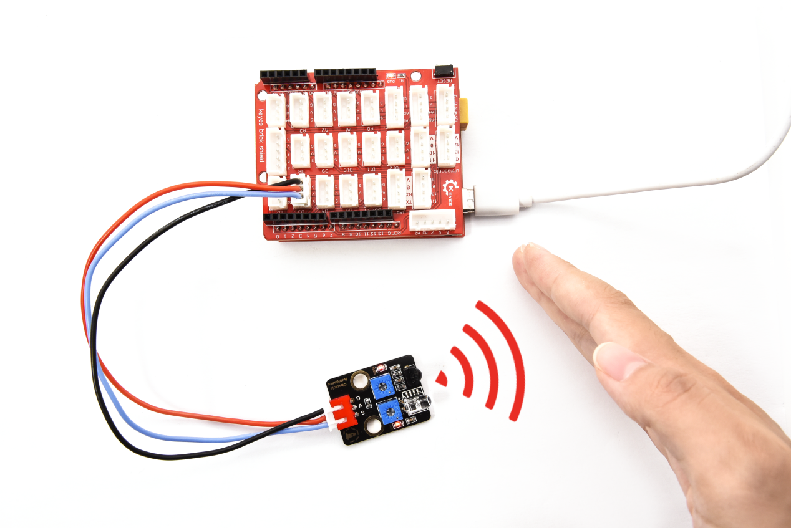

### 实验七 巡线传感器检测黑白线

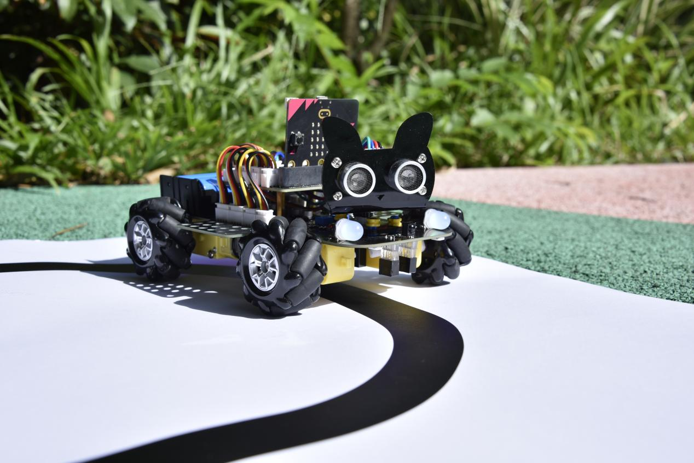

实验说明

在这个套件中，有一个Keyes DIY电子积木
单路循线传感器，它主要采用1个TCRT5000 反射型 黑白线识别传感器元件。

实验中，我们通过读取模块上S端高低电平，判断传感器检测到的物体颜色（黑白）；并且，我们在串口监视器上显示测试结果。

实验原理

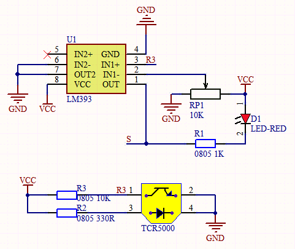上个实验我们学习了避障传感器的原理，其实巡线传传感器的原理也是相同的。是利用红外线对颜色的反射率不一样，将反射信号的强弱转化成电流信号。上电时，发射二极管发射红外光，RP1
是一个电位器，我们通过调整电位器给 电压比较器LM393 的 2
脚提供一个阈值电压，这个电压值的大小可以根据实际情况来调试确定。而红外光敏二极管收到红外光的时候，会产生电流，并且随着红外光的从弱变强，电流会从小变大。当没有红外光或者说红外光很弱的时候，3
脚的电压就会接近 VCC，即信号R3电压接近VCC，如果 3 脚比 2
脚的电压高的话，通过 LM393
比较器后，接收检测引脚输出一个高电平。当随着光强变大，电流变大，3
脚的电压值等于 VCC-I\*R3，电压就会越来越小，当小到一定程度，比 2
脚的电压还小的时候，接收检测引脚就会变为低电平。当红外信号发送到黑色轨道时，黑色因为吸光能力比较强，红外信号发送出去后就会被吸收掉，反射部分很微弱。白色轨道就会把大部分红外信号反射回来。

也就是说检测到黑色或没检测到物体时，信号端为高电平；检测到白色物体时，信号端为低电平；它的检测高度为
0—3cm。我们可以通过旋转传感器上电位器，调节灵敏度，即调节检测高度。当旋转电位器，是传感器上红色
LED介于不亮与亮之间的临界点时，灵敏度最好。

实验器材

|||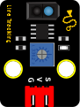|||
|-|-|-|-|-|
|Keyes Uno Plus 开发板*1|传感器扩展板*1|Keyes DIY电子积木 单路循线传感器*1|3P XH-2.54mm 黑红蓝硅胶线*1|USB线*1|

接线图

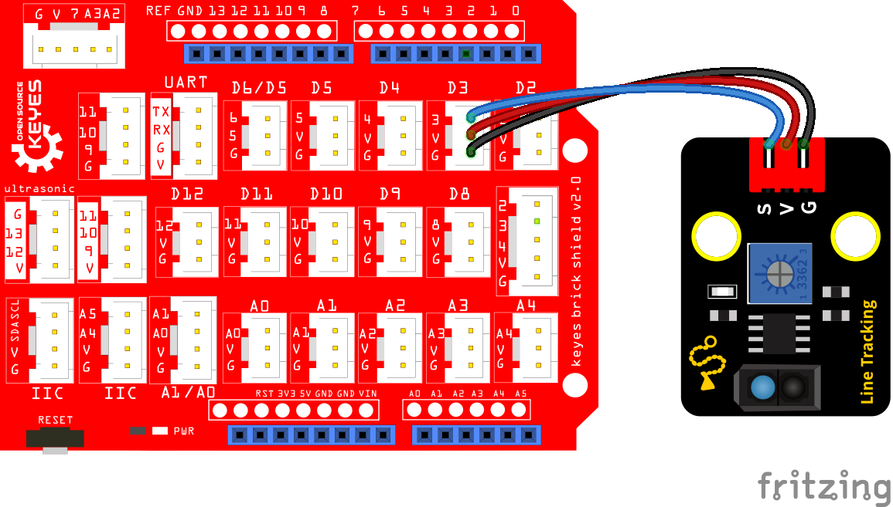

测试代码

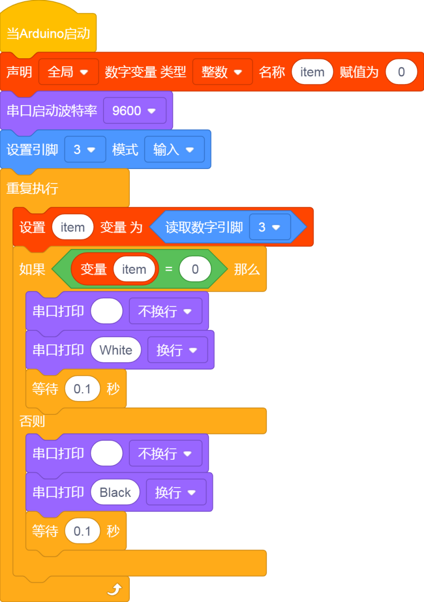

代码说明

设置方法和避障传感器实验类似，这里简单介绍一下：首先我们先声明一个整数变量，我们这里没有改变量名，用默认的“item”，然后设置波特率为9600，因为我们避障传感器接的数字口3，我们需要读取传感器的值，所以我们将数字口3设置为输入模式，重复读取存储到变量item中。由上面我们讲的原理可知，当检测到白色时传感器输出低电平，也就是我们的单片机读取到低电平，即条件满足，打印对应的信息。

测试结果

上传测试代码成功，利用USB线上电后，串口监视器显示对应数据和字符。实验中，当传感器没有检测到物体或者检测到黑色物体时，item为1，串口监视器显示“Black”字符；检测到白色物体（能够反光）时，板载红色LED亮起，item为0，串口监视器显示“White”字符，如下图。

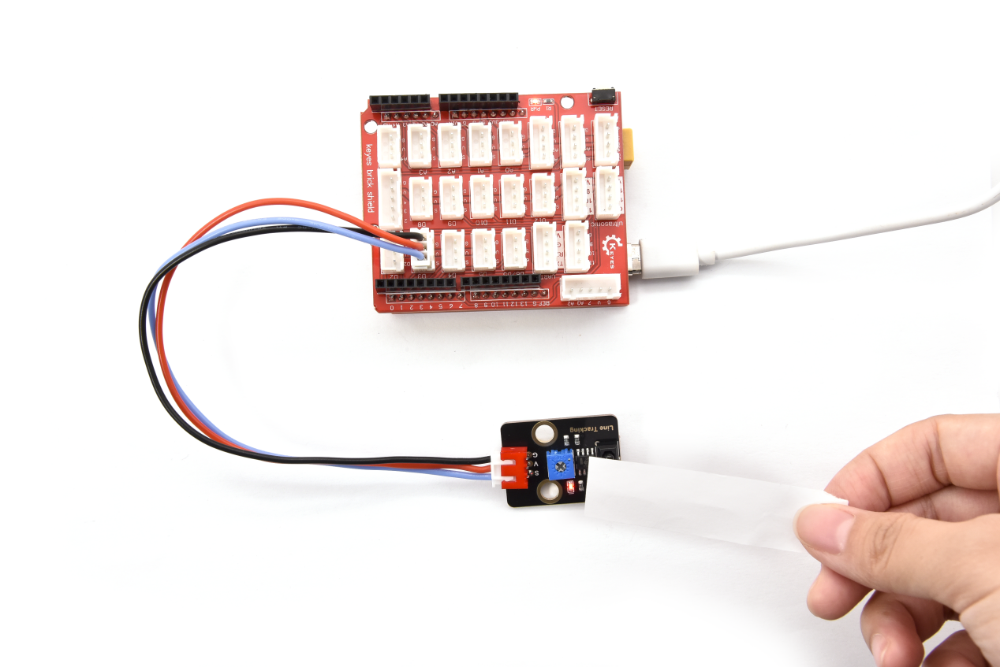

### 实验八 光折断计数 

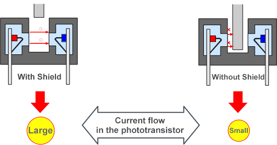

实验说明

这个套件中包含一个Keyes DIY电子积木
光折断模块，它主要采用1个ITR-9608光电开关。它属于对射遮断式光电开关光学开关传感器。

在这里，我们不仅与前面的课程一样只打印信号端的电平信号，而是通过代码设置，模拟出流水线上利用类似传感器，对产品进行计数。

实验原理

如原理图：当用纸片挡住传感器凹槽后，C与VCC导通，传感器信号端S为高电平，自带红色
LED熄灭；否则传感器信号端为被R2拉低为低电平，自带红色LED亮起。

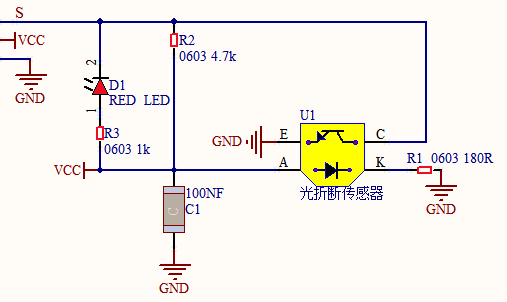

实验器材

|||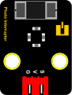|||
|-|-|-|-|-|
|Keyes Uno Plus 开发板*1|传感器扩展板*1|Keyes DIY电子积木 光折断模块*1|3P XH-2.54mm 黑红蓝硅胶线*1|USB线*1|

接线图

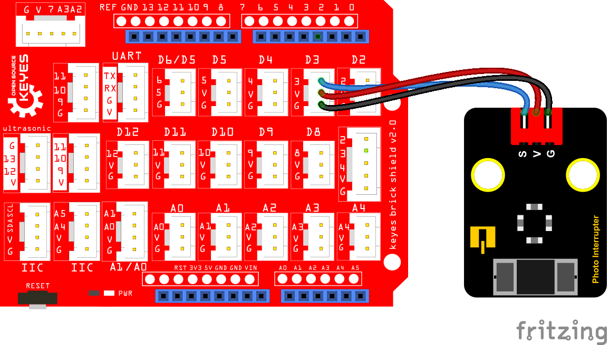

测试代码

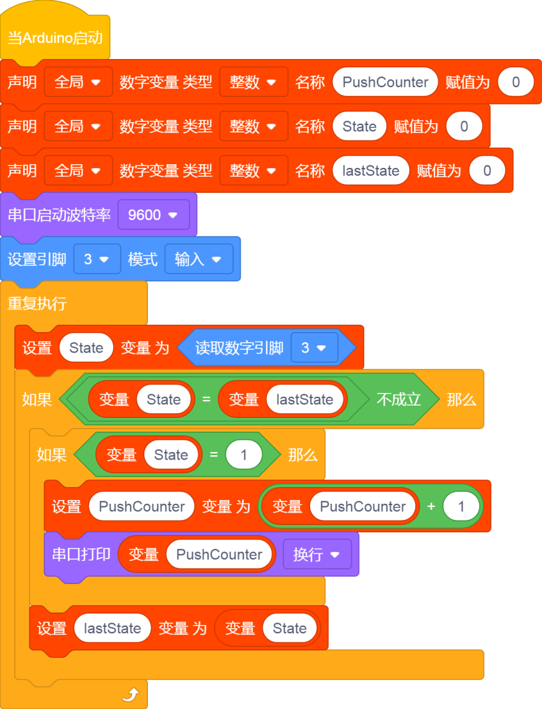

代码说明

1\.
在实验中，我们首先分别定义几个变量State，lastState和PushCounter，State用于存储当前传感器检测的信号，lastState用于保存传感器上次检测的信号，PushCounter为计数值。

实验结果

上传测试代码成功，按照接线图接好线，利用USB上电后，串口监视器显示PushCounter数据，每次物体穿过传感器凹槽，PushCounter数据不断加1。

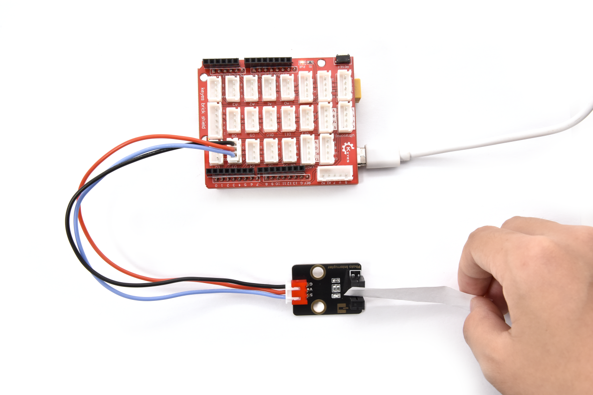

### 实验九 倾斜模块的原理

实验说明

在这个套件中，有一个Keyes DIY电子积木
倾斜传感器，倾斜开关可以依据模块是否倾斜而输出不同电平信号。其内部带有一颗滚珠，因此可以监测倾斜情况。当开关高于水平位置倾斜时开关导通，低于水平位置时开关断开。倾斜模块可用于倾斜检测、报警器制作或者其他检测。

实验中我们用串口监视器打印出信号端检测到的数字电平信号。

实验原理

它的原理非常简单，附原理图，主要是利用滚珠在开关内随不同倾斜角度的发化使滚珠开关P1的引脚1和2导通或者不导通，当1和2导通时，因为1教接GND，所以信号端S为低电平，此时红色LED形成回路，将会点亮；当1和2不导通时，引脚2被4.7K的上拉电阻R1拉高而使信号端S为高电平，模块上的LED将熄灭。

实验器材

|||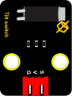|||
|-|-|-|-|-|
|Keyes Uno Plus 开发板*1|传感器扩展板*1|Keyes DIY电子积木 倾斜传感器*1|3P XH-2.54mm 黑红蓝硅胶线*1|USB线*1|

接线图

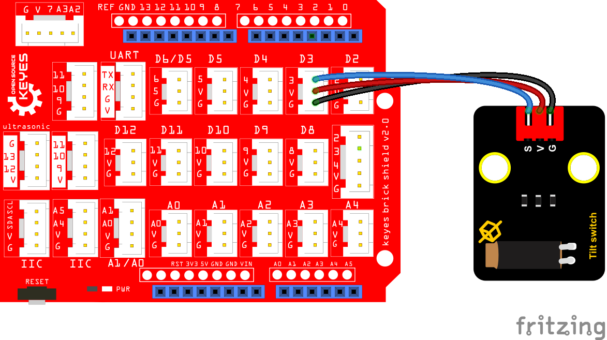

测试代码

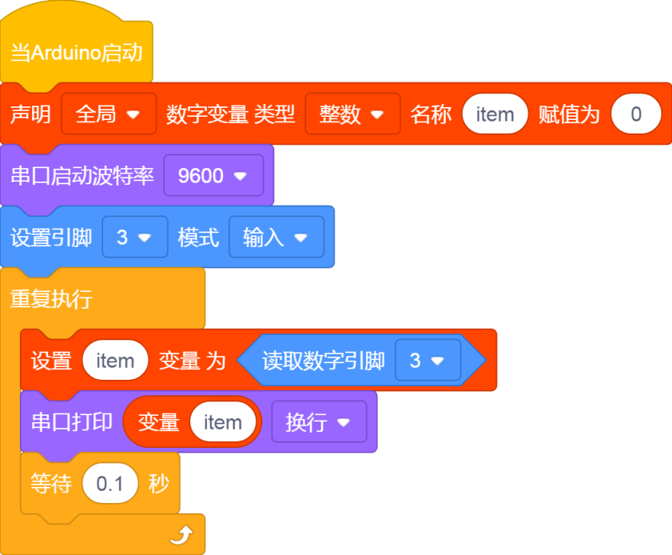

代码说明

前面我们已经学习了几个数字传感器了，使用方法大同小异，这里就不多说了。

我们这里接数字口3，要读取引脚3的电平状态，所以我们将管脚3设置为输入模式。大家可能发现我们有好几个课程都是用的数字口3，其实这里用别的数字口都行，但是大家在用别的IO口时别忘了把线接上对应的位置哦！

测试结果

上传测试代码成功，利用USB线上电后，观察串口监视器，将倾斜模块倾斜一边，模块上的红色LED不亮，串口监视器打印数字电平信号“1”；将倾斜模块倾斜另一边，
模块上的红色LED点亮，串口监视器打印数字电平信号“0”。

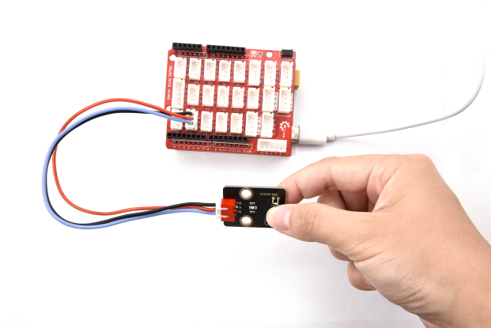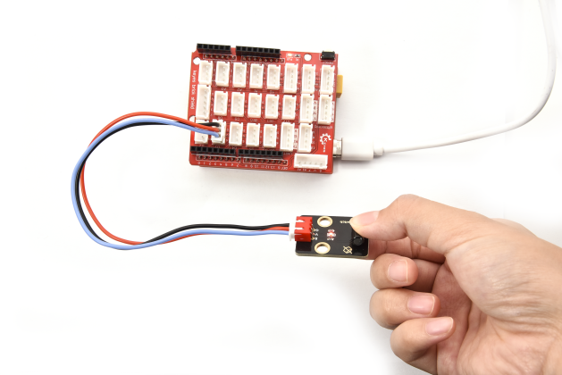

### 实验十 霍尔传感器检测南极磁场

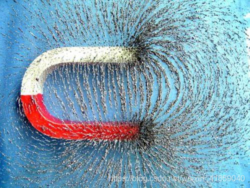

实验说明

在这个套件中，有一个Keyes新款 DIY电子积木
霍尔传感器，它主要采用A3144线性霍尔元件。该元件P1是由电压调整器、霍尔电压发生器、差分放大器、史密特触发器，温度补偿电路和集电极开路的输出级组成的磁敏传感电路，其输入为磁感应强度，输出是一个数字电压讯号。它是单极开关型的霍尔传感器，只感应南极磁场。

实验中，我们利用霍尔传感器检测南极磁场，将测试结果在串口监视器上显示。

实验原理

传感器感应到无磁场或北极磁场时，信号端为高电平；感应到南极磁场时，信号端为低电平。当感应磁场强度越强时，感应距离越长。

实验器材

|||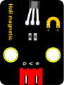|||
|-|-|-|-|-|
|Keyes Uno Plus 开发板*1|传感器扩展板*1|Keyes新款 DIY电子积木 霍尔传感器*1|3P XH-2.54mm 黑红蓝硅胶线*1|USB线*1|

接线图

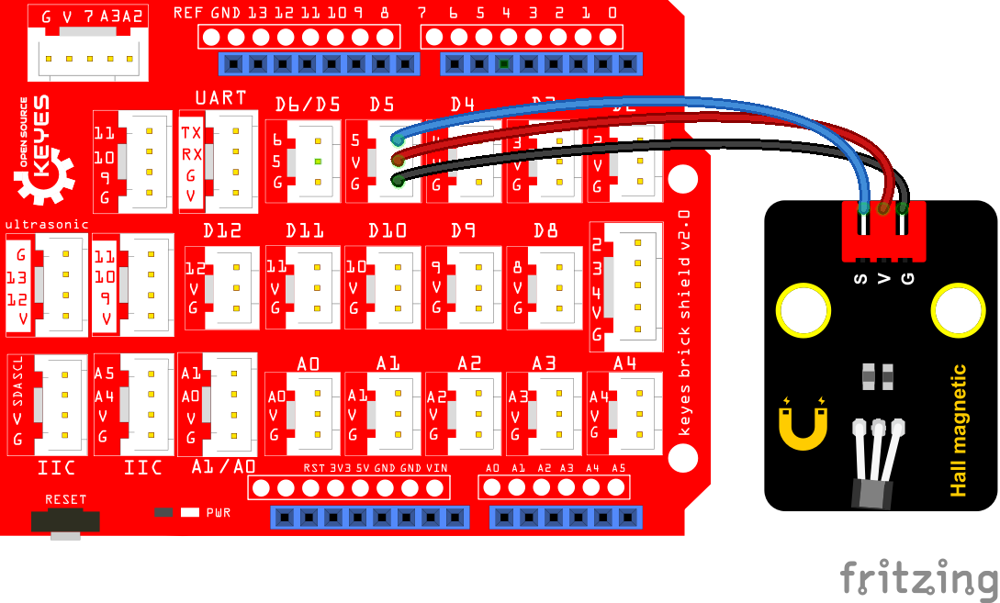

测试代码

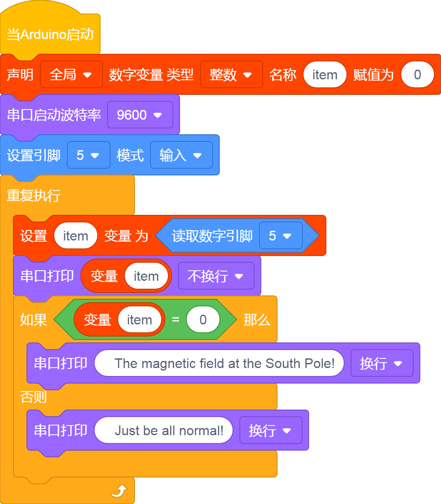

代码说明

由接线图知道我们这里接数字口5，我们需要读取霍尔传感器输出的信号，所以我们将管脚5设置为输入模式。其他代码设置与前面设置的方法相同，读取到的信号存储到变量item中，然后打印变量的值，当霍尔传感器检测到南极磁场时输出低电平，即我们读取到低电平成立，串口监视器打印对应的信息。

测试结果

上传测试代码成功，利用USB线上电后，当传感器感应到无磁场或北极磁场时，串口监视器显示“1 Just be all normal!”，传感器上的LED熄灭，当传感器感应到南极磁场时，传感器监视器显示“0 The magnetic field at the South Pole!”，传感器上的LED点亮。

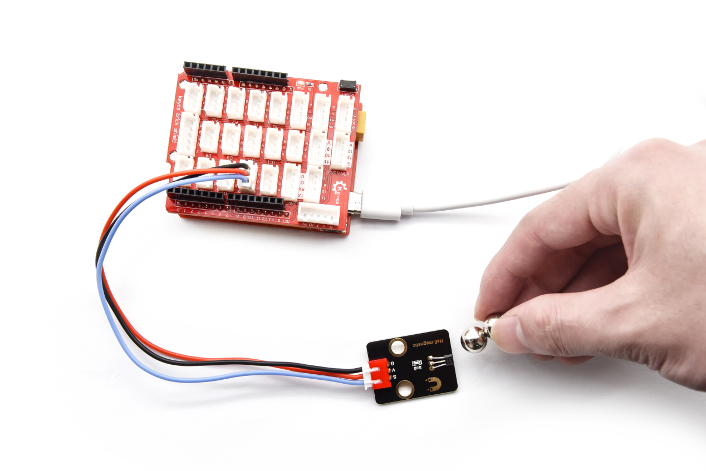

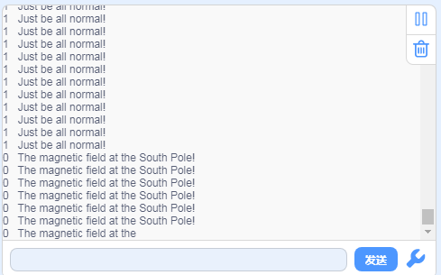

### 实验十一 干簧管检测附近磁场

实验说明

在这个套件中，有一个Keyes DIY电子积木 干簧管模块，它主要采用MKA10110
绿色磁簧元件元件。簧管是干式舌簧管的简称，是一种有触点的无源电子开关元件，具有结构简单，体积小便于控制等优点。它的外壳是一根密封的玻璃管，管中装有两个铁质的弹性簧片电板，还灌有一种惰性气体。与前面我们学习到霍尔传感器不同，霍尔传感器检测南极磁场，而干簧管传感器检测附近有无磁场。

实验中，我们通过读取模块上S端高低电平，判断模块附近是否存在磁场；并且，我们在串口监视器上显示测试结果。

实验原理

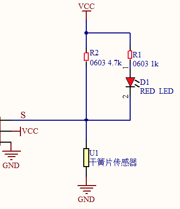平时状态下，玻璃管中的两个由特殊材料制成的簧片是分开的，此时信号端S被R2拉为高电平，LED熄灭。当有磁性物质靠近玻璃管时，在磁场磁力线的作用下，管内的两个簧片被磁化而互相吸引接触，簧片就会吸合在一起，使结点所接的电路连通，即信号端S连通GND，此时LED点亮。外磁力消失后，两个簧片由于本身的弹性而分开，线路也就断开了。该传感器就是利用元件这一特性，搭建电路将磁场信号转换为高低电平变换信号。

实验器材

|||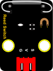|||
|-|-|-|-|-|
|Keyes Uno Plus 开发板*1|传感器扩展板*1|Keyes DIY电子积木 干簧管模块*1|3P XH-2.54mm 黑红蓝硅胶线*1|USB线*1|

接线图

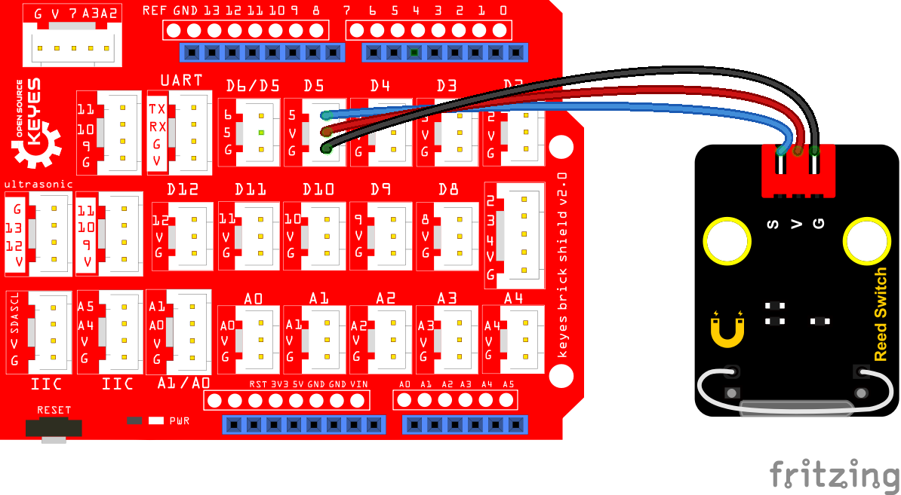

测试代码

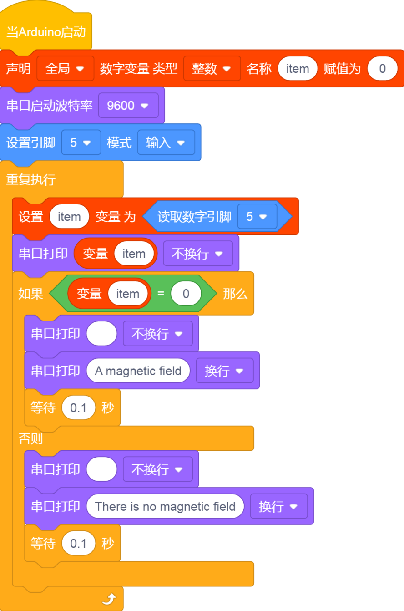

代码说明

我们这里接数字口5，所以我们将管脚设置为5，其余代码设置方法与我们前面学习的一致不必多讲了。

测试结果

上传测试代码成功，利用USB线上电后，串口监视器显示对应数据和字符。实验中，当传感器检测到磁场时，item为0且模块红色LED点亮，串口监视器显示“A magnetic field”字符；没有检测到磁场时，item为1，模块上LED熄灭，串口监视器显示“There is no magnetic field”字符，如下图。

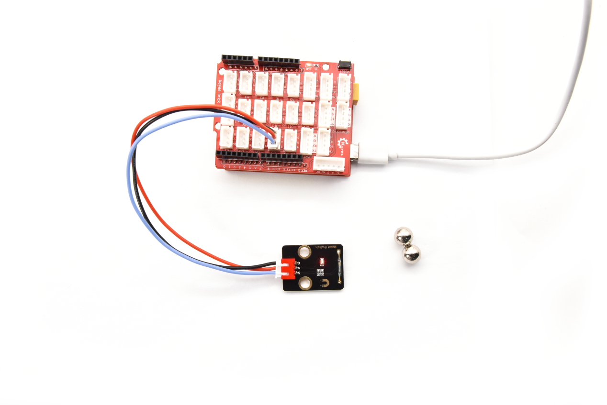

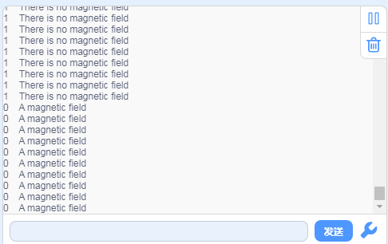

### 实验十二 附近有人吗

实验说明

在这个套件中，有一个Keyes DIY电子积木
人体红外热释传感器，它主要采用RE200B-P传感器元件。它是一款基于热释电效应的人体热释运动传感器，能检测到人体或动物身上发出的红外线，配合菲涅尔透镜能使传感器探测范围更远更广。

实验中，我们通过读取模块上S端高低电平，判断附近是否有人在运动；并且，我们在串口监视器上显示测试结果。

实验原理

这个原理图可能较前面的模块稍复杂，我们一个个来看。左上角那部分是电压转换，5V转3.3V，因为我们模块上用到的传感器工作电压为3.3V，不能直接用5V供电，所以需要一个电压转换电路。当传感器附近没有检测到人即没有接收到红外信号时，传感器1脚输出低电平，此时模块上LED两端有电压就会点亮，此时MOS管Q1导通，信号端S检测到低电平。当传感器附近检测到人即接收到红外信号时，传感器1脚输出高电平，此时模块上LED两端没有电压就会熄灭，此时MOS管Q1不导通，信号端S则检测到被10K上拉电阻R5拉高的高电平。

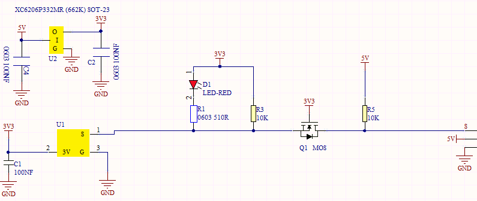

实验器材

|||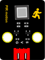|||
|-|-|-|-|-|
|Keyes Uno Plus 开发板*1|传感器扩展板*1|Keyes DIY电子积木 人体红外热释传感器*1|3P XH-2.54mm 黑红蓝硅胶线*1|USB线*1|

接线图

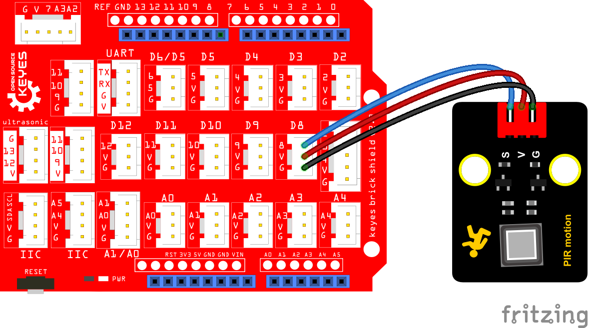

测试代码

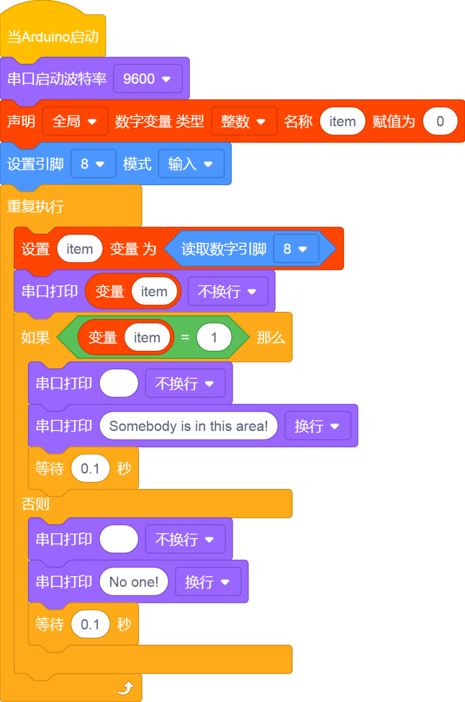

代码说明

1.  我们这里接数字口8，所以我们将管脚设置为8。

2\. 其它设置方法和前面实验类似，这里就不多做介绍了。

测试结果

上传测试代码成功，利用USB线上电后，串口监视器显示对应数据和字符。实验中，传感器检测到附近有人在运动时，item为1，模块上LED熄灭，串口监视器显示“Somebody is in this area!”字符；没有检测到人运动时，item为0，模块上LED点亮，串口监视器显示“No one!”字符，如下图。

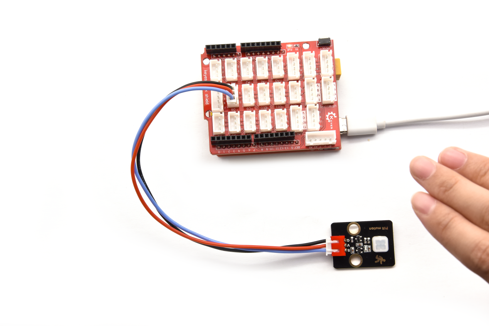

### 实验十三 有源蜂鸣器模块播放声音

实验说明

在这个套件中，包含一个有源蜂鸣器模块，一个无源蜂鸣器模块（功放模块）。这个实验中，我们控制有源蜂鸣器发出声音。有源蜂鸣器元件内部自带震荡电路，控制时，我们只需要给蜂鸣器元件足够的电压，蜂鸣器就自动响起。

实验中，我们只是控制这个模块上有源蜂鸣器的循环响起声音。

实验原理

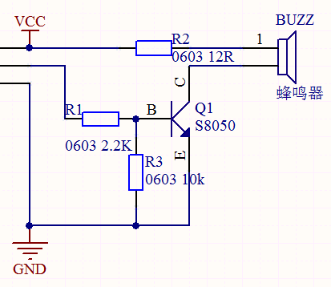从原理图中可以看出来在，蜂鸣器一端通过串联一个电阻R2连接到电压正极，另一端通过一个NPN三极管Q1连接到GND，所以只要导通这个三极管，让蜂鸣器一端连通GND，有缘蜂鸣器就会响起来。三极管控制端基极也就是连接到R1电阻一端为高电平，三极管Q1就导通了，三极管基极被下拉电阻R3拉低，所以常态为不导通，当我们用单片机IO口输出一个高电平到基极三极管就导通了。

即S信号端设置为高电平时，三极管导通，模块上蜂鸣器响起；设置为低电平时，三极管不导通，模块上蜂鸣器没有声音。

实验器材

|||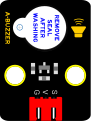|||
|-|-|-|-|-|
|Keyes Uno Plus 开发板*1|传感器扩展板*1|Keyes DIY电子积木 有源蜂鸣器模块*1|3P XH-2.54mm 黑红蓝硅胶线*1|USB线*1|

接线图

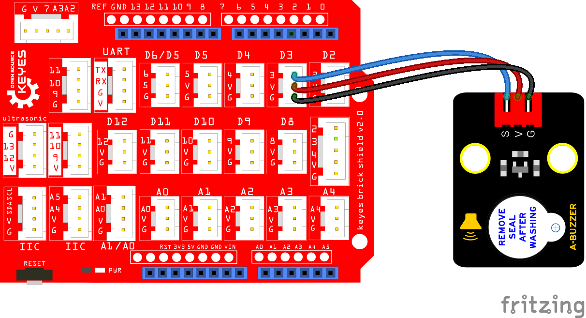

测试代码

代码说明

我们这里接数字口3，所以我们把管脚设置为3，设置为高时，模块上有源蜂鸣器响起；设置为低时，模块上有源蜂鸣器关闭声音。

测试结果

上传测试代码成功，上电后，模块上有源蜂鸣器响起1秒，关闭1秒，循环交替。

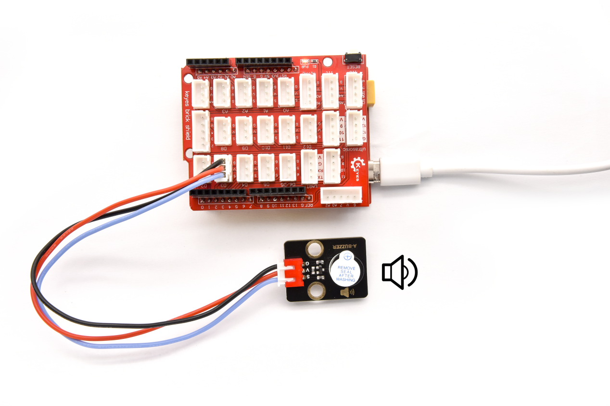

### 实验十四 8002b功放 喇叭模块

实验说明

在这个套件中，有一个Keyes DIY电子积木 8002b功放
喇叭模块，这个模块主要的元件有一个可调电位器，一个喇叭，一个音频放大芯片；前面课程中我们介绍了套件中的有源蜂鸣器模块的使用方法。在这里我们介绍下套件中的8002b功放
喇叭模块，这个模块主要功能是：可以对输出的小音频信号进行放大，大概放大倍数为8.5倍，并且可以通过自带的小功率喇叭播放出来，也可以用来播放音乐，作为一些音乐播放设备的外接扩音设备。

实验中，我们利用8002b功放 喇叭模块上发出各种频率的声音。

实验原理

其实它就类似于于一个无源蜂鸣器，前面我们介绍过，有缘蜂鸣器自带振荡源，只要我们给它足够的电压就能响起来，而无源蜂鸣器元件内部不带震荡电路，控制时我们需要在元件正极输入不同频率的方波（电压5V），负极接地，从而控制蜂鸣器响起不同频率的声音。

实验器材

|||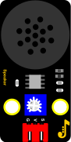|||
|-|-|-|-|-|
|Keyes Uno Plus 开发板*1|传感器扩展板*1|Keyes DIY电子积木 8002b功放 喇叭模块*1|3P XH-2.54mm 黑红蓝硅胶线*1|USB线*1|

接线图

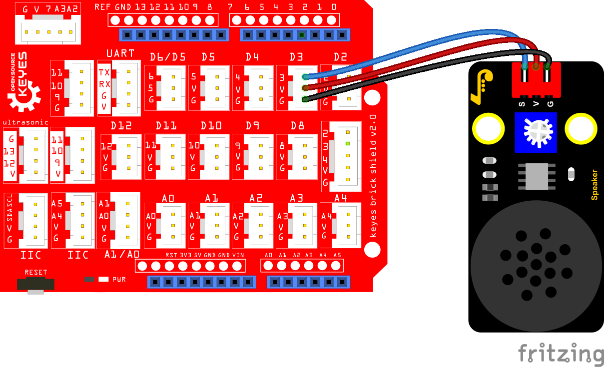

测试代码

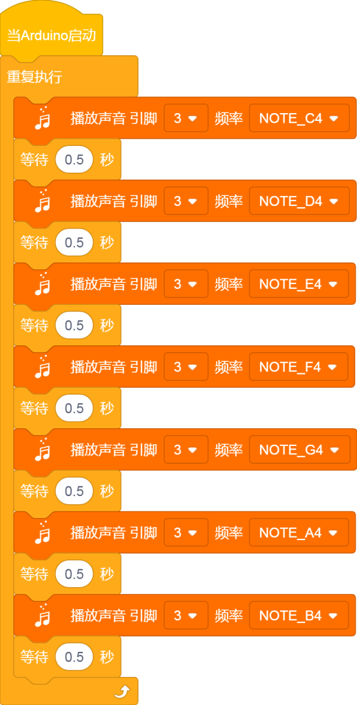

代码说明

1\.
在左下方的添加扩展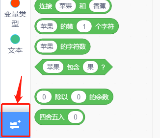，找到无缘蜂鸣器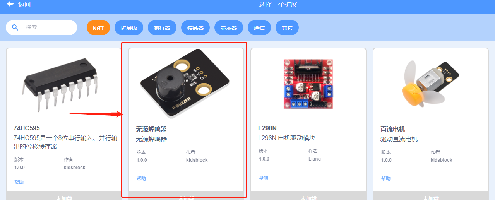，点击加载后会在下方显示出来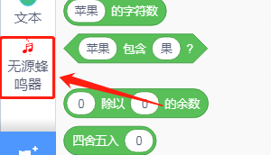，然后我们拖出代码块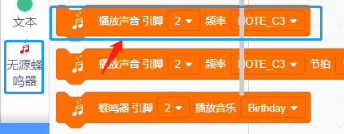，其中管脚是代码模块信号端接口，我们连接的是D3，所以设置为3；音调设置对应的是模块上无源蜂鸣器发出的频率，我们可以查看右边代码，看到对应频率；节拍对应的是各个频率延迟的时间，1个节拍就是延迟1秒。

测试结果

上传测试代码成功，上电后，8002b喇叭功放模块上循环播放对应频率即对应节拍的声音。请注意使用时先把音量逆时针调到最小，再慢慢顺时针增大，以防烧坏喇叭。

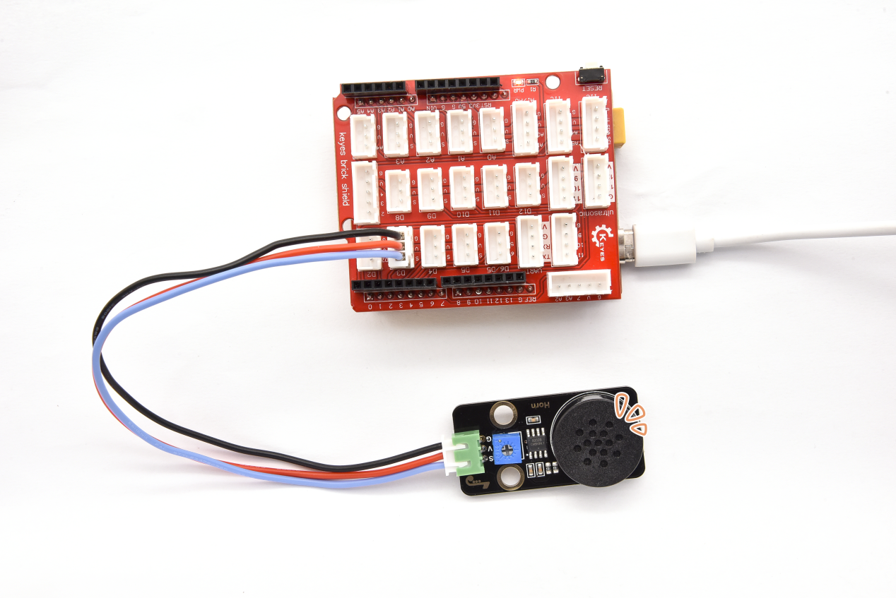

### 实验十五 130电机模块

实验说明

在生活中，我们经常需要驱动一个风扇转动或者或者一个小水泵。为了方便接线，我们特别设计了这个130电机驱动模块。模块设计有两个定位孔，与伺服电机控制兼容。该模块效率高，风扇质量好。

该电机控制模块采用HR1124S电机控制芯片。HR1124S是应用于直流电机方案的单通道H桥驱动器芯片。HR1124S的H桥驱动部分采用低导通电阻的PMOS和NMOS功率管。低导通电阻保证芯片低的功率损耗，使得芯片安全工作更长时间。此外HR1124S拥有低待机电流，低静态工作电流，这些性能使HR1124S易用于玩具方案。

该模块兼容各种单片机控制板，如arduino系列单片机。模块上自带的防反插红色端子间距为2.54mm，实验中，我们可通过输出到两个信号端IN+和IN-的电压方向来控制电机的转动方向，让电机转动起来。

实验原理

芯片是助于驱动电机，电机所需电流较大，我们无法用三极管驱动更无法直接用IO口驱动，让电机转动起来很简单，给电机两端电压即可，不同电压方向电机转向也不相同，额度电压内，电压越大，电机转动得越快；反之电压越低，电机转动得越慢，甚至无法转动。所以我们可以用PWM口来控制电机的转速，我们这里还没有学到PWM，所以先用高低电平来控制电机。

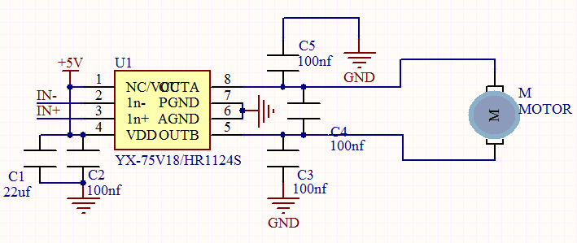

实验器材

||||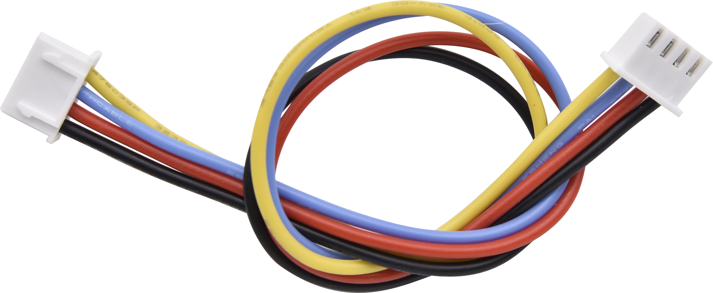||
|-|-|-|-|-|
|Keyes Uno Plus 开发板*1|传感器扩展板*1|Keyes DIY电子积木 130电机模块*1|4P XH-2.54mm 黑红蓝黄硅胶线*1|USB线*1|

接线图

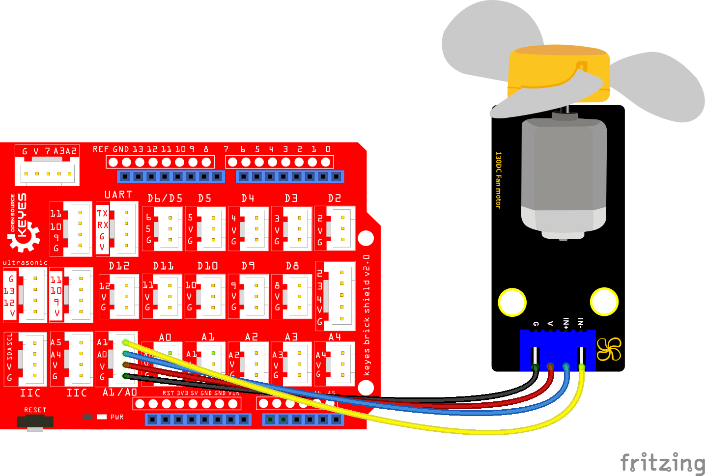

测试代码

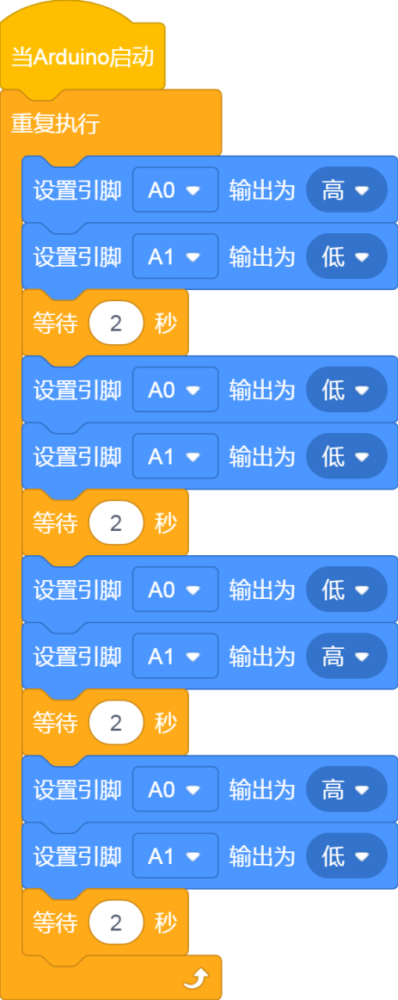

代码说明

实验中，我们130电机接A0和A1，我们这里电机IN+接模拟口A0，IN-接模拟口A1，A0设置为高且A1设置为低时（A0~A7模拟口也可做数字口用），模块上电机逆时针旋转；A0设置为低且A1设置为高时，模块上电机顺时针旋转；A0设置为低且A1设置为低时，模块上电机停止转动。

测试结果

烧录好测试代码，按照接线图连接好线；上电后，风扇逆时针转动2秒；停止2秒；顺时针转动2秒；停止2秒；循环交替。

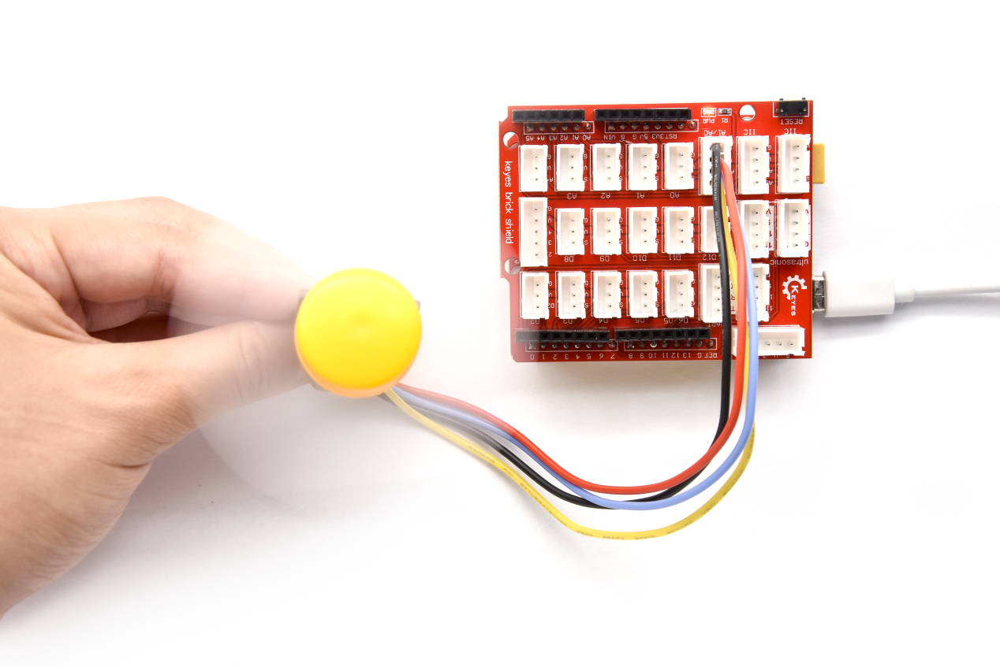

### 实验十六 插件RGB模块调节LED颜色

实验说明

在这个套件中，有一个Keyes DIY电子积木
共阴RGB模块，它采用F10-全彩RGB雾状共阴LED元件。控制时，我们需要将模块R G B连接单片机PWM口，剩下那个管脚接GND（共阳RGB的话剩下那个管脚接VCC）。那么什么是PWM呢？PWM是使用数字手段来控制模拟输出的一种手段。使用数字控制产生占空比不同的方波（一个不停在高电平与低电平之间切换的信号)来控制模拟输出。一般来说端口的输入电压只有两个0V与5V，也就是低电平和高电平。如果想要改变灯的亮度怎么办呢个？有同学说串联电阻，对，这个方法是正确的。但是，如果想要得到不同的亮度，且在不同亮度之间来回变动怎么办呢？不可能不停地切换电阻吧。这种情况下就需要使用PWM了，那它是怎么控制的呢？

对于Arduino的数字端口电压输出只有LOW与HIGH两个，对应的就是0V与5V的电压输出，可以把LOW定义为0，HIGH定义为1，1秒内让Arduino输出500个0或者1的信号。如果这500个全部为1，那就是完整的5V，如果全部为0，那就是0V。如果010101010101这样输出，刚好一半，端口输出的平均电压就为2.5V了。这个和放映电影是一个道理，咱们所看的电影并不是完全连续的，它其实是每秒输出25张图片。在这种情况下，人的肉眼是分辨不出来的，看上去就是连续的了。PWM也是同样的道理，如果想要不同的电压，就控制0与1的输出比例控制就可以了。当然这和真实的连续输出还是有差别的，单位时间内输出的0,1信号越多，控制的就越精确。

实验中，我们通过测试代码，控制模块上RGB LED显示几个常用颜色。

实验原理

那么我们这个实验就是要通过调节3个PWM值，控制LED元件显示红光、绿光和蓝光的比例，从而控制RGB模块上LED显示不同颜色灯光。当设置的PWM值越大，对应显示的颜色比例越重。理论上来说，通过调节这3中颜色光的混合比例，可以模拟出所有颜色的灯光。

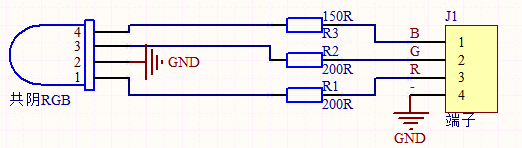

实验器材

|||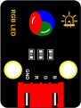|||
|-|-|-|-|-|
|Keyes Uno Plus 开发板*1|传感器扩展板*1|Keyes DIY电子积木 共阴RGB模块*1|4P XH-2.54mm 黑红蓝黄硅胶线*1|USB线*1|

接线图

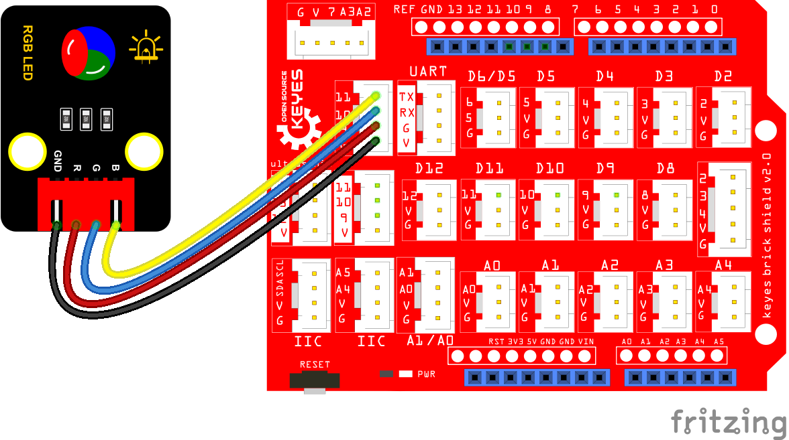

测试代码

代码1：

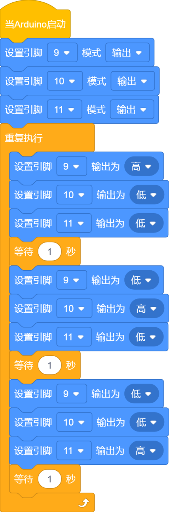

代码2：

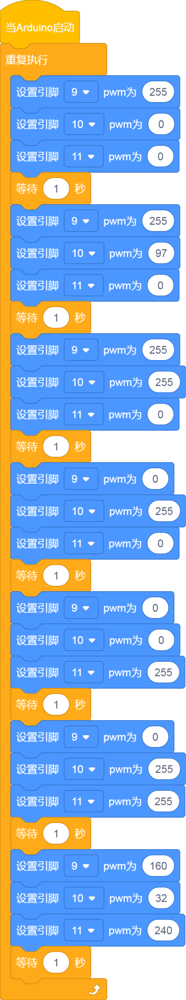

代码说明

代码1说明：

1.  我们这里R接数字口9，G接数字口10，B接数字口11，所以我们将管脚设置为，其中R     G B代表控制模块上
    LED对应的红绿蓝3种颜色对应的端口，根据接线图我们接到了D9 D10     D11，设置为9 10 11，后面设置对应高低，设置RGB     LED中红绿蓝3个灯是否会亮，设置为高（共阴RGB对应数字口为高电平，共阳则相反），对应的颜色就亮。

2.  现在观察代码，这个代码非常简单，只是简单的控制模块上RGB     LED显示红色1秒、 绿色1秒、蓝色1秒，循环交替。

代码2说明：

同样我们这里R接数字口9，G接数字口10，B接数字口11，但是我们这里所用的信号输出代码块为PWM输出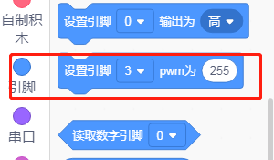，所以我们将管脚设置为。后面设置数据代表设置模块上LED
红绿蓝颜色的比例，设置的数据越大（对应的PWM值越大），设置该颜色的比例越大。

2.实验中我们通过参考下方常用RGB颜色表设置对应数值，调节RGB LED上红绿蓝颜色比例，从而控制RGB LED显示对应颜色。

常用RGB颜色表

| |R|G|B| |R|G|B| |R|G|B|
|-|-|-|-|-|-|-|-|-|-|-|-|
|黑色|0|0|0|黄色|255|255|0|浅灰蓝色|176|224|230|
|象牙黑|41|36|33|香蕉色|227|207|87|品蓝|65|105|225|
|灰色|192|192|192|镉黄|255|153|18|石板蓝|106|90|205|
|冷灰|128|138|135|dougello|235|137|85|天蓝|135|206|235|
|石板灰|112|128|105|forum gold|255|227|132|暖灰色|128|128|105|
|金黄色|255|215|0|青色|0|255|255|黄花色|218|165|105|
|绿土|56|94|15|白色|255|255|255|瓜色|227|168|105|
|靛青|8|46|84|古董白|250|235|215|橙色|255|97|0|
|碧绿色|127|255|212|天蓝色|240|255|255|镉橙|255|97|3|
|青绿色|64|224|208|白烟|245|245|245|胡萝卜色|237|145|33|
|绿色|0|255|0|白杏仁|255|235|205|桔黄|255|128|0|
|黄绿色|127|255|0|cornsilk|255|248|220|淡黄色|245|222|179|
|钴绿色|61|145|64|蛋壳色|252|230|201|翠绿色|0|201|87|
|花白|255|250|240|棕色|128|37|37|森林绿|34|139|34|
|gainsboro|220|220|220|米色|163|148|128|草地绿|124|252|0|
|ghostWhite|248|248|255|锻浓黄土色|138|54|15|酸橙绿|50|205|50|
|蜜露橙|240|255|240|锻棕土色|135|51|36|薄荷色|189|252|201|
|象牙白|250|255|240|巧克力色|210|105|30|草绿色|107|137|35|
|亚麻色|250|240|230|肉色|255|125|64|暗绿色|48|128|20|
|navajoWhite|255|222|173|黄褐色|240|230|140|海绿色|46|139|87|
|old lace|253|245|230|玫瑰红|188|143|143|嫩绿色|0|255|127|
|海贝壳色|255|245|238|肖贡土色|199|97|20|雪白|255|250|250|
|标土棕|115|74|18|紫色|160|32|240|乌贼墨棕|94|38|18|
|紫罗蓝色|138|43|226|红色|255|0|0|赫色|160|82|45|
|jasoa|160|102|211|砖红|156|102|31|马棕色|139|69|19|
|湖紫色|153|51|250|镉红|227|23|13|沙棕色|244|164|96|
|淡紫色|218|112|214|珊瑚色|255|127|80|棕褐色|210|180|140|
|梅红色|221|160|221|耐火砖红|178|34|34|印度红|176|23|31|
|蓝色|0|0|255|栗色|176|48|96|钴色|61|89|171|
|粉红|255|192|203|dodger blue|30|144|255|草莓色|135|38|87|
|jackie blue|11|23|70|橙红色|250|128|114|锰蓝|3|168|158|
|蕃茄红|255|99|71|深蓝色|25|25|112|桔红|255|69|0|
|孔雀蓝|51|161|201|深红色|255|0|255|土耳其玉色|0|199|140|

测试结果

上传测试代码1成功，上电后，模块上RGB LED循环显示红绿蓝3种颜色，间隔时间为1秒。上传测试代码2成功，上电后，模块上RGB LED显示红橙黄绿蓝青紫白7种颜色，循环不止，间隔时间为1秒。

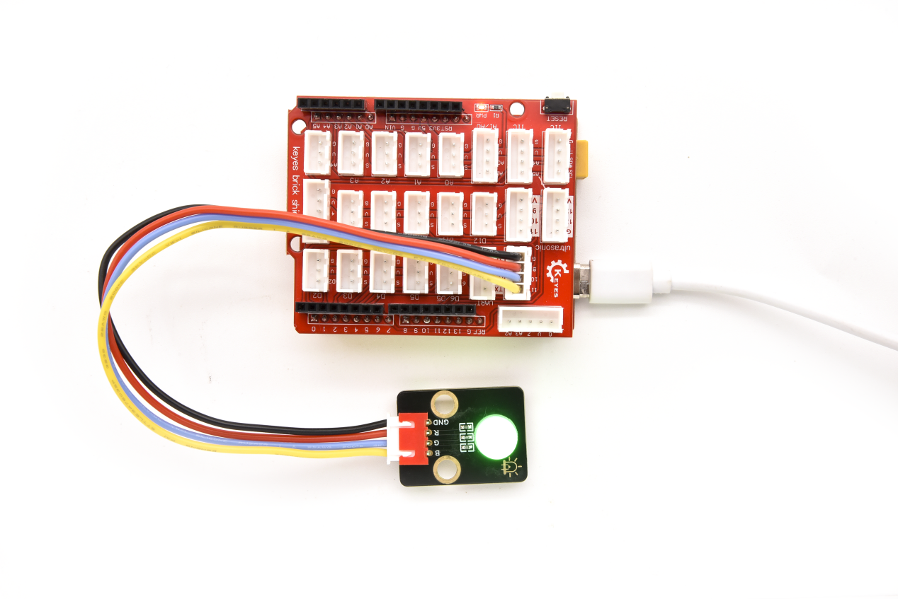

### 实验十七 旋转电位器传感器读取模拟值

实验说明

前面我们学习过的传感器，都是数字传感器，在这个套件中，有一个Keyes DIY电子积木
旋转电位器传感器，它与我们前面学到的传感器不同，它是一个模拟传感器，意思是例如我们前面学习的按键模块，当按键没有按下去时，我们读取到高电平（5V），当按键按下去时，我们读取到低电平（0V），而在0~5V中间的电压值，我们数字IO口无法读取到，当然按键模块也只能输出高低电平。而模拟传感器就可以通过我们plus板上的模拟口（A0~A7）读取。

实验中，我们利用这个模块测试对应的模拟值；并且，我们在串口监视器上显示测试结果。

实验原理

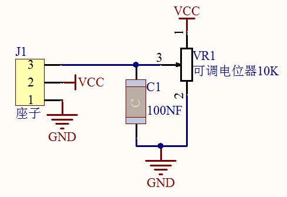我们学过滑动变阻器的就很好理解，随着滑动变阻器上的滑片移动，滑片上的电压随着改变。我们的旋转电位器原理也是如此，它主要采用一个10K可调电阻。通过旋转电位器，我们可以改变电阻大小，信号端S检测到电压变化（0~5V），而这个电压变化是一个连续变化的模拟量，也就是在0~5V内可以取任意值，我们必须先对这个模拟量进行ADC采集，来测量连续的这些模拟量，A/D
是模拟量到数字量的转换，依靠的是模数转换器(Analog to Digital Converter)，简称ADC。我们的plus开发板已经集成了ADC采集，我们直接使用就可以。

我们plus开发板与UNO开发板的ADC位数都是10位，一个 n 位的 ADC 表示这个 ADC
共有 2 的 n 次方个刻度。10 位的 ADC，输出的是从 0～1023 一共 1024
个数字量，也就是 2 的 10
次方个数据刻度，那么每个刻度就是5V/1024=0.0049V，这个也叫分辨率。

实验器材

|||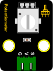|||
|-|-|-|-|-|
|Keyes Uno Plus 开发板*1|传感器扩展板*1|Keyes DIY电子积木 旋转电位器传感器*1|3P XH-2.54mm 黑红蓝硅胶线*1|USB线*1|

接线图

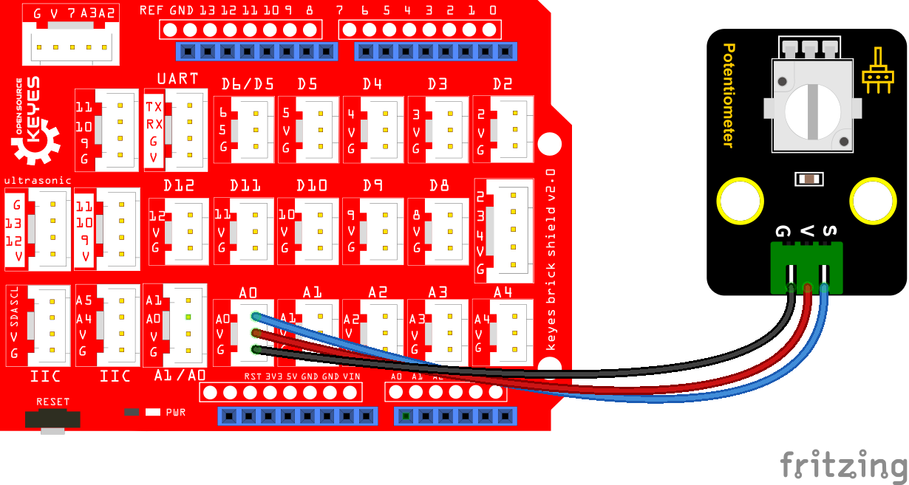

测试代码

代码说明

1\. 在实验中，首先我们需要像前面学习的一样，创建一个整数变量item。

2.与我们前面读取数字传感器的信号不同，我们这里要读取模拟信号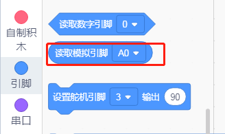。我们这里管脚接模拟口A0，所以我们不用更改。

3\.
读取的模拟值赋给变量item，串口监视器显示item的值。

4\. 延时0.1s

测试结果

上传测试代码成功，利用USB线上电后，串口监视器显示对应模拟值。实验中，顺时针旋转电位器，模拟值增大，逆时针旋转电位器，模拟值减小，范围为0-1023，如下图。

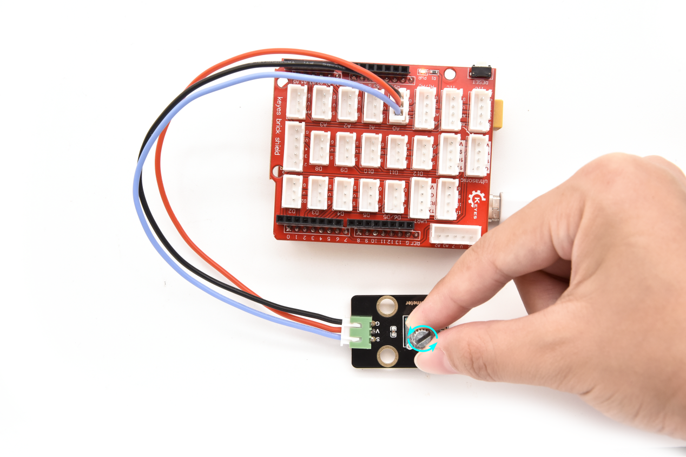

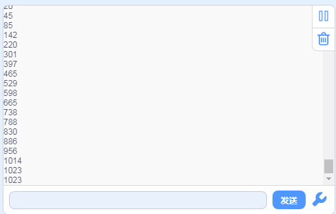

### 实验十八 水滴水蒸气传感器

实验说明

这是一个Keyes DIY电子积木
水滴传感器。它是一个模拟（数字）输入模块，也叫雨水、雨量传感器。可用于各种天气状况的监测，检测是否下雨及雨量的大小，转成数字信号（DO）和模拟信号（AO）输出，并广泛应用于Arduino
机器人套件，雨滴，下雨传感器，可用于各种天气状况的监测，并转成数定信号和
AO 输出，也可用于汽车自动刮水系统、智能灯光系统和智能天窗系统等。

实验中，我们将传感器信号端(S端)输入到plus
开发板的模拟口，感知模拟值的变化，并在串口监视器上显示出对应的模拟值。

实验原理

它的原理是通过电路板上裸露的印刷平行线检测水量的大小。水量越多，就会有更多的导线被联通，随着导电的接触面积增大，2脚输出的电压就会逐步上升。信号端S检测的模拟值就越大。除了可以检测水量的大小，它还可以检测空气中的水蒸气。传感器自带2个直径为4.8mm的定位孔，方便你将传感器固定在其他设备。

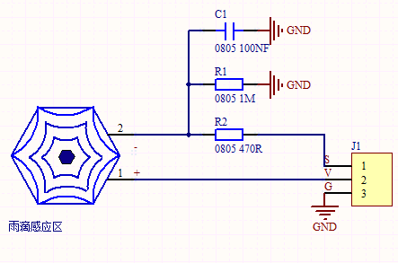

实验器材

|||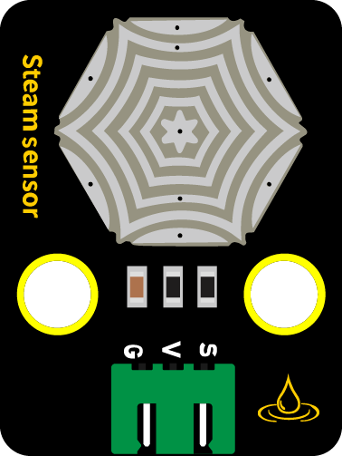|||
|-|-|-|-|-|
|Keyes Uno Plus 开发板*1|传感器扩展板*1|Keyes DIY电子积木 水滴传感器*1|3P XH-2.54mm 黑红蓝硅胶线*1|USB线*1|

接线图

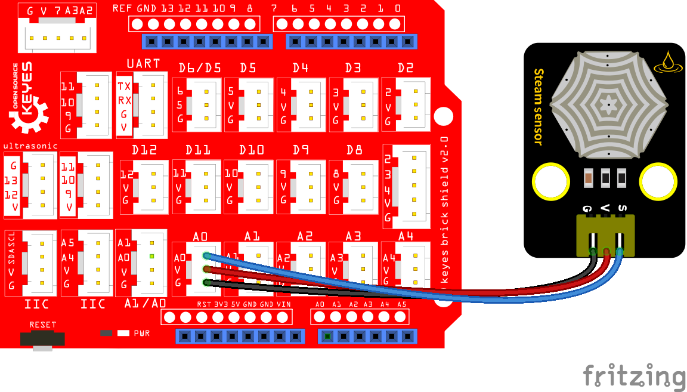

测试代码

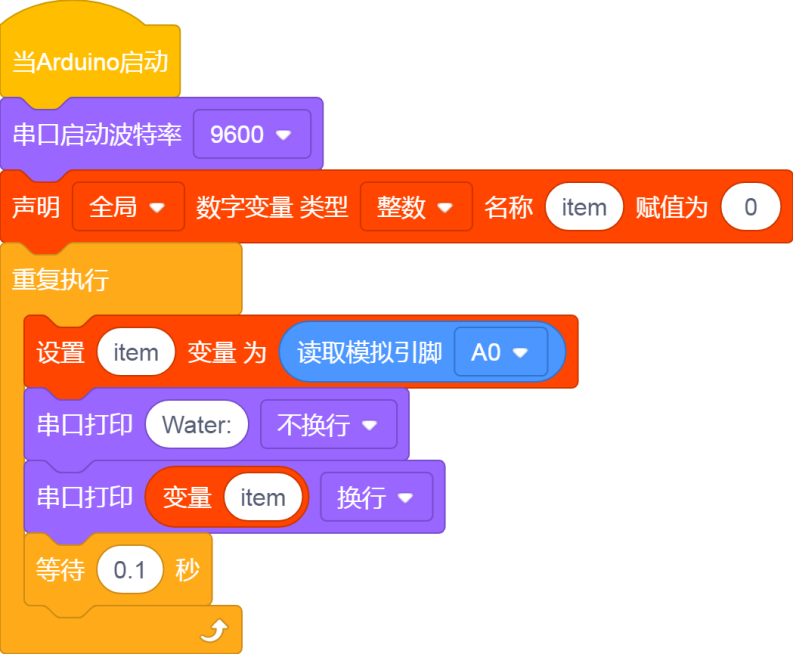

代码说明

1\. 在实验中，我们需要像前面学习的一样，创建一个整数变量item。

2\.
读取的模拟值赋给变量item，串口监视器显示item的值。

测试结果

烧录好测试代码，按照接线图连接好线；利用USB接口上电后，当水蒸气传感器上检测到水分时，输出的模拟值在串口监视器显示出来，水分越多，模拟值越大，如下图。

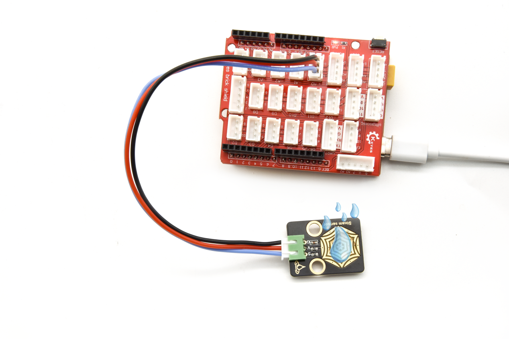

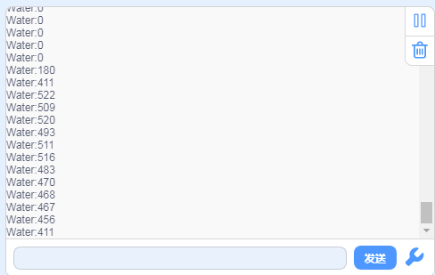

### 实验十九 声音传感器检测声量

实验说明

在这个套件中，有一个Keyes DIY电子积木
声音传感器，实验中，我们利用这个传感器测试当前环境中的声音大小对应的模拟值，声音越大，模拟值越大；并且，我们在串口监视器上显示测试结果。

实验原理

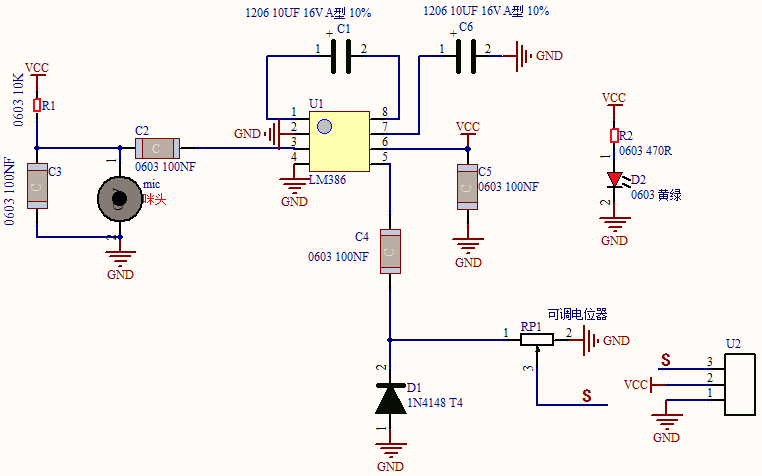它主要采用一个高感度麦克风元件和LM386芯片。高感度麦克风元件用于检测外界的声音。利用LM386芯片搭建合适的电路，我们对高感度麦克风检测到的声音进行放大，最大倍数为200倍。使用时我们可以通过旋转传感器上电位器，调节声音的放大倍数。调节时，顺时针调节电位器到尽头，放大倍数最大。

实验器材

|||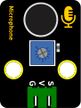|||
|-|-|-|-|-|
|Keyes Uno Plus 开发板*1|传感器扩展板*1|Keyes DIY电子积木 声音传感器*1|3P XH-2.54mm 黑红蓝硅胶线*1|USB线*1|

接线图

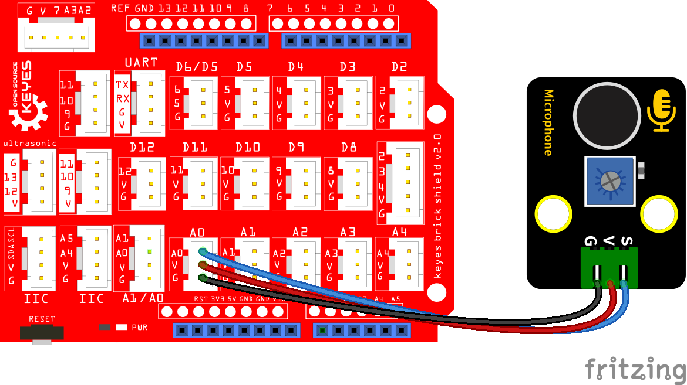

测试代码

代码说明

代码设置方法与前面实验一致，可参考实验十七。

测试结果

上传测试代码成功，利用USB线上电后，串口监视器显示对应模拟值。实验中，我们顺时针旋转电位器和对准MIC头大声说话，可以看到模拟值数据变大，如下图。

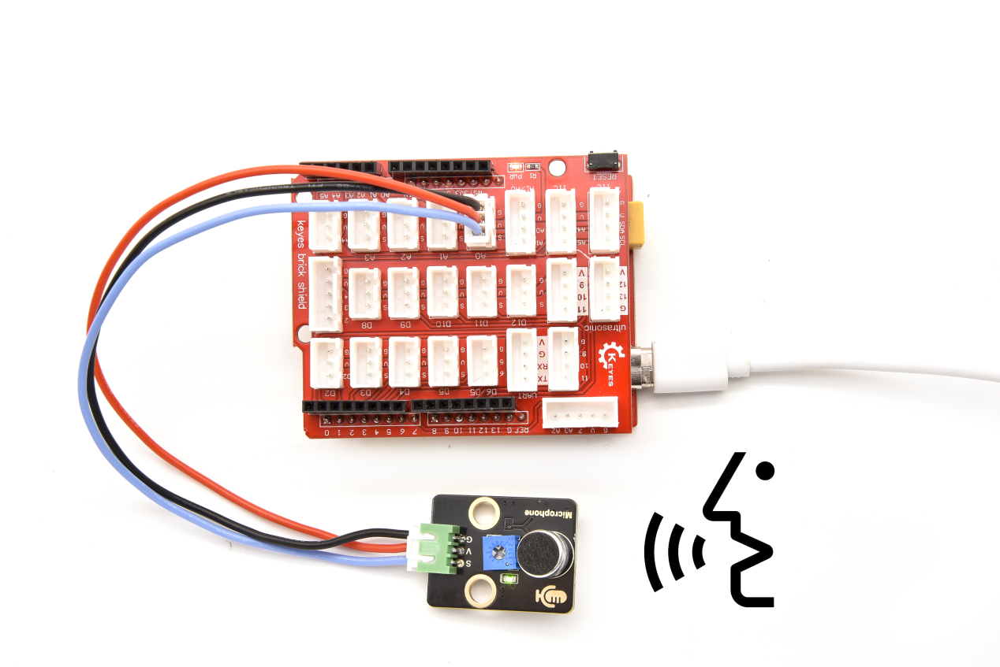

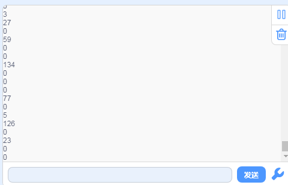

### 实验二十 光敏电阻传感器

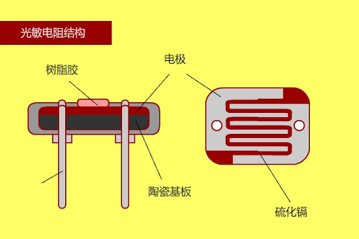

实验说明

在这个套件中，有一个Keyes DIY电子积木
光敏电阻传感器，这是一个常用的光敏电阻传感器，它主要采用光敏电阻元件。该电阻元件电阻大小随着光照强度的变化而变化，该传感器就是利用光敏电阻元件这一特性，搭建电路将电阻变化转换为电压变化。光敏电阻传感器可以模拟人对环境光线的强度的判断，从而方便做出与人友好互动的应用。

接线时，我们将传感器信号端(S端)输入到arduino系列单片机的模拟口，感知模拟值的变化，并在串口监视器上显示出对应的模拟值。

实验原理

当没有亮光时，电阻大小为0.2MΩ，信号端（2点）检测的电压接近0，当随着光照抢度增大，光线传感器的电阻值越来越小，所以信号端检测的电压越来越小。

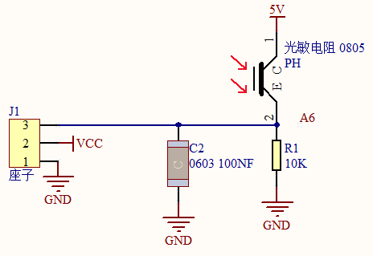

实验器材

|||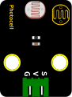|||
|-|-|-|-|-|
|Keyes Uno Plus 开发板*1|传感器扩展板*1|Keyes DIY电子积木 光敏电阻传感器*1|3P XH-2.54mm 黑红蓝硅胶线*1|USB线*1|

接线图

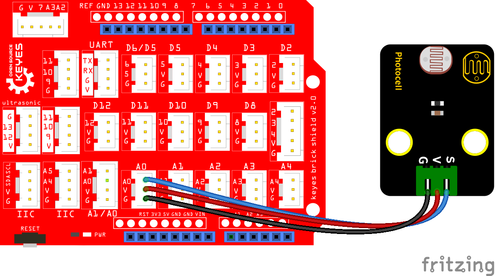

测试代码

代码说明

1\. 在实验中，我们需要像前面学习的一样，创建一个整数变量item。

2
我们这里管脚接模拟口A0，读取的模拟值赋给变量item，串口监视器显示item的值。

测试结果

烧录好测试代码，按照接线图连接好线，利用USB线上电后，我们可以看到对应光照强度的模拟值，光照越强，模拟值越大，如下图。

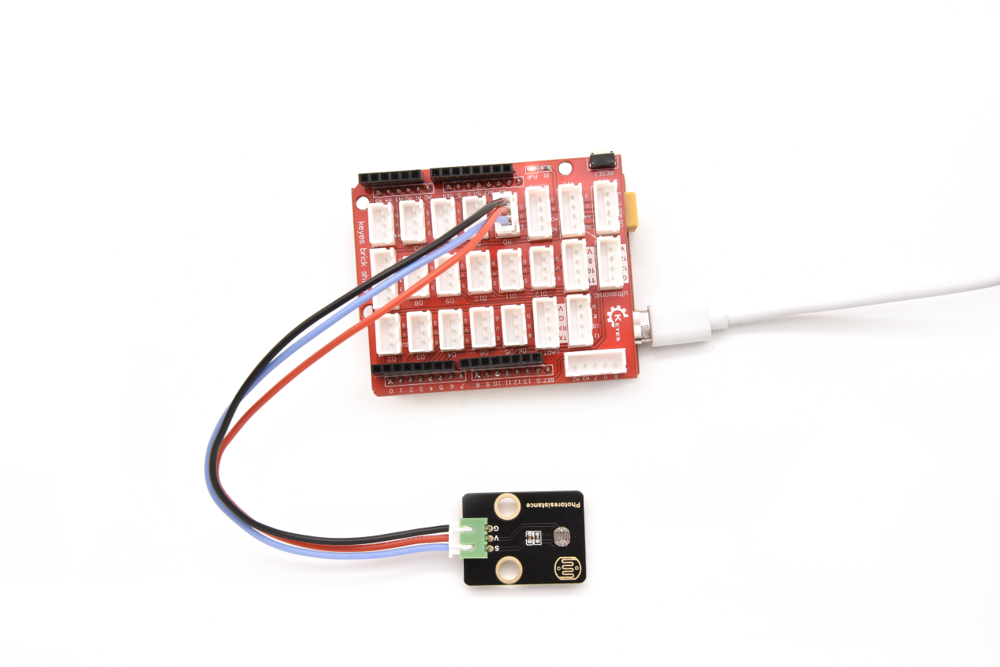

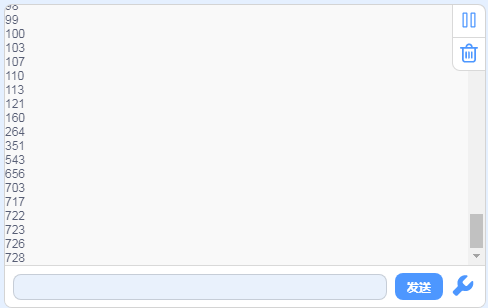

### 实验二十一 NTC-MF52AT模拟温度传感器

实验说明

在这个套件中，有一个Keyes DIY电子积木
NTC-MF52AT模拟温度传感器，它的原理像光敏电阻传感器，只是感应的器件不同，实验中，我们将传感器信号端接到Keyes Uno Plus
开发板模拟口，读出对应的模拟值。我们可以利用模拟值，通过特定公式，计算出当前环境的温度。由于温度计算公式比较复杂，这里就不多介绍了。实验中，我们只是读取对应的模拟值。

实验原理

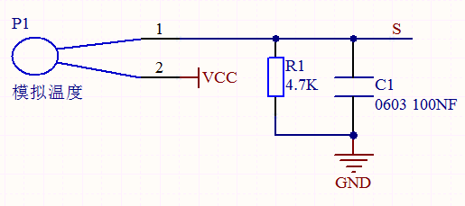这个模块主要采用NTC-MF52AT热敏电阻元件。NTC-MF52AT热敏电阻元件能够时感知周边环境温度的变化，电阻大小随着温度的变化而变化，从而引起信号端S的电压变化。该传感器就是利用NTC-MF52AT热敏电阻元件这一特性，搭建电路将电阻变化转换为电压变化。

实验器材

|||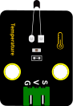|||
|-|-|-|-|-|
|Keyes Uno Plus 开发板*1|传感器扩展板*1|Keyes DIY电子积NTC-MF52AT模拟温度传感器*1|3P XH-2.54mm 黑红蓝硅胶线*1|USB线*1|

接线图

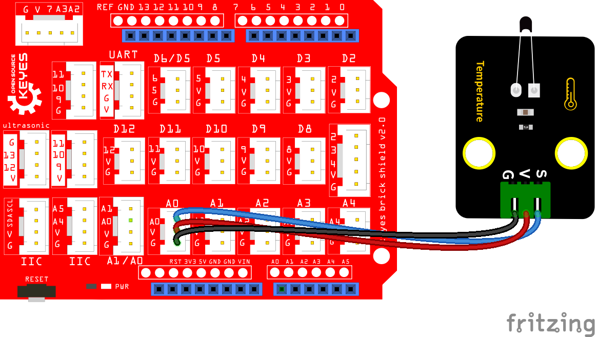

测试代码

代码说明

1\. 在实验中，我们需要像前面学习的一样，创建一个整数变量item。

我们这里管脚接模拟口A0，所以我们不用更改。读取的模拟值赋给变量item，串口监视器显示item的值。

测试结果

上传测试代码成功，利用USB线上电后，打开串口监视器，设置波特率为9600。串口监视器显示对应的模拟值，温度越高，模拟值越大。

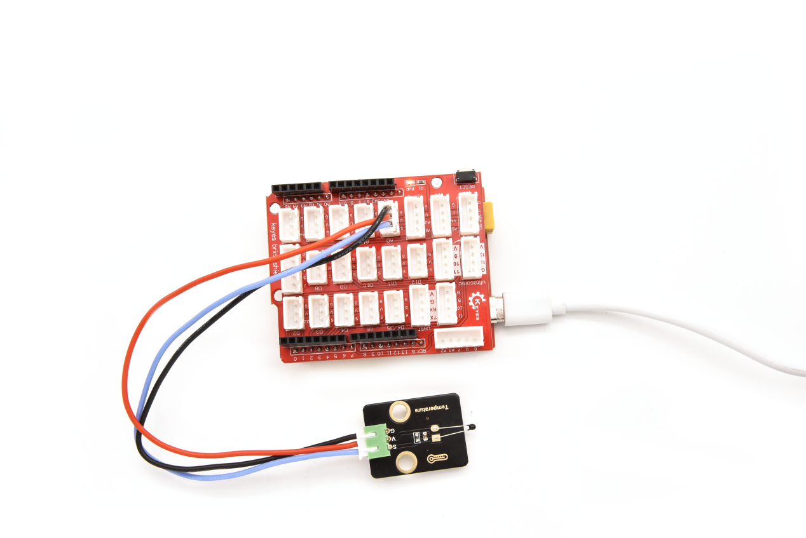

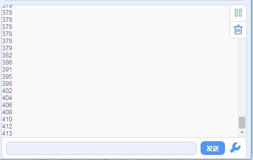

### 实验二十二 薄膜压力传感器

实验说明

在这个套件中，有一个Keyes DIY电子积木
薄膜压力传感器，薄膜压力传感器是基于新型纳米压敏材料辅以舒适杨式模量的超薄薄膜衬底一次性贴片而成，兼具防水和压敏双重功能。

实验中，我们通过采集模块上S端模拟信号，判断压力大小，模拟值越小，压力越大；并且，我们在串口监视器上显示测试结果。

实验原理

当传感器感知到外界压力时，传感器电阻值发生变化，我们采用电路将传感器感知压力变化的压力信号转换成相应变化强度的电信号输出。这样我们就可以通过检测电压信号变化就可以得到压力变化情况。

实验器材

|||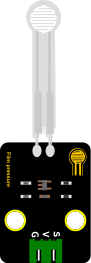|||
|-|-|-|-|-|
|Keyes Uno Plus 开发板*1|传感器扩展板*1|Keyes DIY电子积木 薄膜压力传感器*1|3P XH-2.54mm 黑红蓝硅胶线*1|USB线*1|

接线图

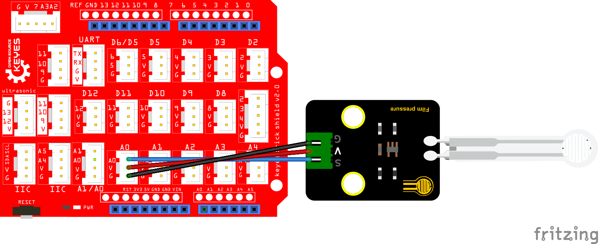

测试代码

代码说明

1\. 在实验中，我们需要像前面学习的一样，创建一个整数变量item。

2
们这里管脚接模拟口A0，所以我们不用更改。读取的模拟值赋给变量item，串口监视器显示item的值。

测试结果

上传测试代码成功，利用USB线上电后，当我们用手挤压薄膜时，可以看到我们在串口监视器打印的模拟值变小，如下图。

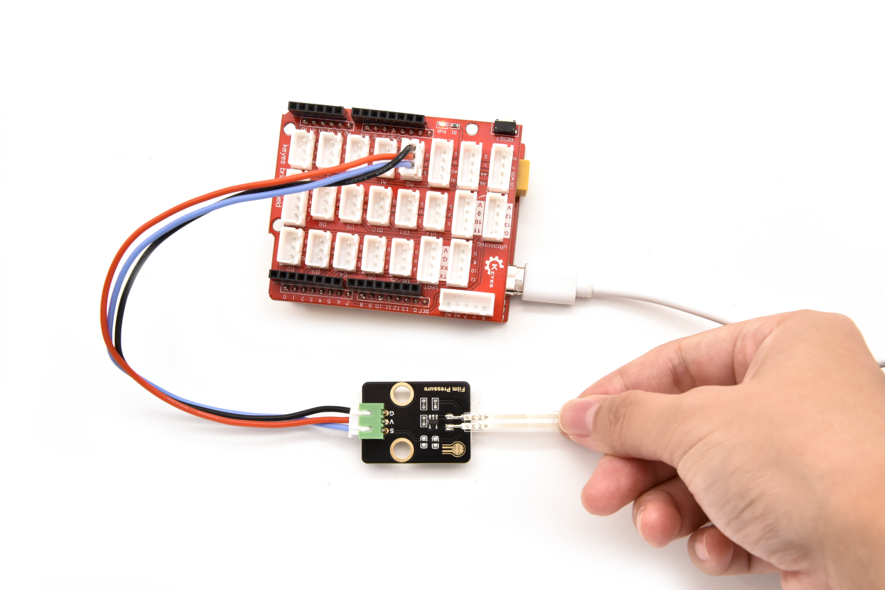

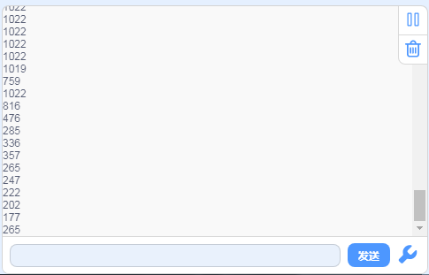

### 实验二十三 火焰传感器

实验说明

在这个套件中，有一个Keyes DIY电子积木
火焰传感器，它对火焰光谱特别灵敏并且灵敏度可调，性能稳定，是救火机器人必备部件，在机器人比赛中，远红外火焰探头起着非常重要的作用，它可以用作机器人的眼睛来寻找火源或足球。利用它可以制作灭火机器人、足球机器人等。

该传感器有两个信号输出端，分别可输出数字信号与模拟信号。实验中，我们分别读取模块传感器数字信号与模拟信号，将测试结果在串口监视器上显示。

实验原理

红外火焰传感器能够探测到波长在700纳米～1000纳米范围内的红外光，探测角度为60，其中红外光波长在880纳米附近时，其灵敏度达到最大。从电路原理图我们可以看到，上电后红色LED2先点亮，红色LED1处于熄灭状态，检测到火焰时，数字信号端D0输出低电平，红色LED1将点亮。红外火焰探头将外界红外光的强弱变化转化为电流的变化，通过A/D转换器反映为0～1023范围内数值的变化。外界红外光越强，数值越小；红外光越弱，数值越大。

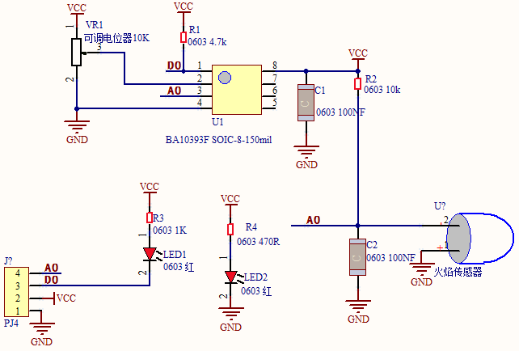

实验器材

|||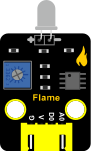|||
|-|-|-|-|-|
|Keyes Uno Plus 开发板*1|传感器扩展板*1|Keyes DIY电子积木 火焰传感器*1|4P XH-2.54mm 黑红蓝黄硅胶线*1|USB线*1|

接线图

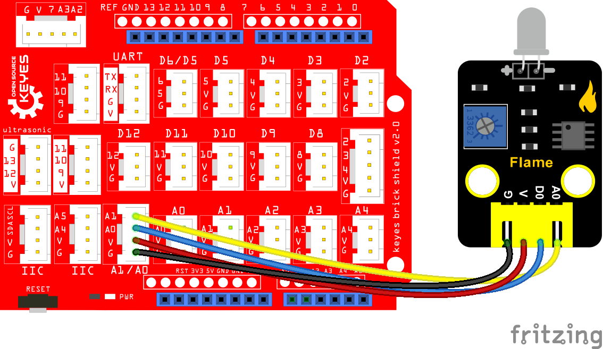

测试代码

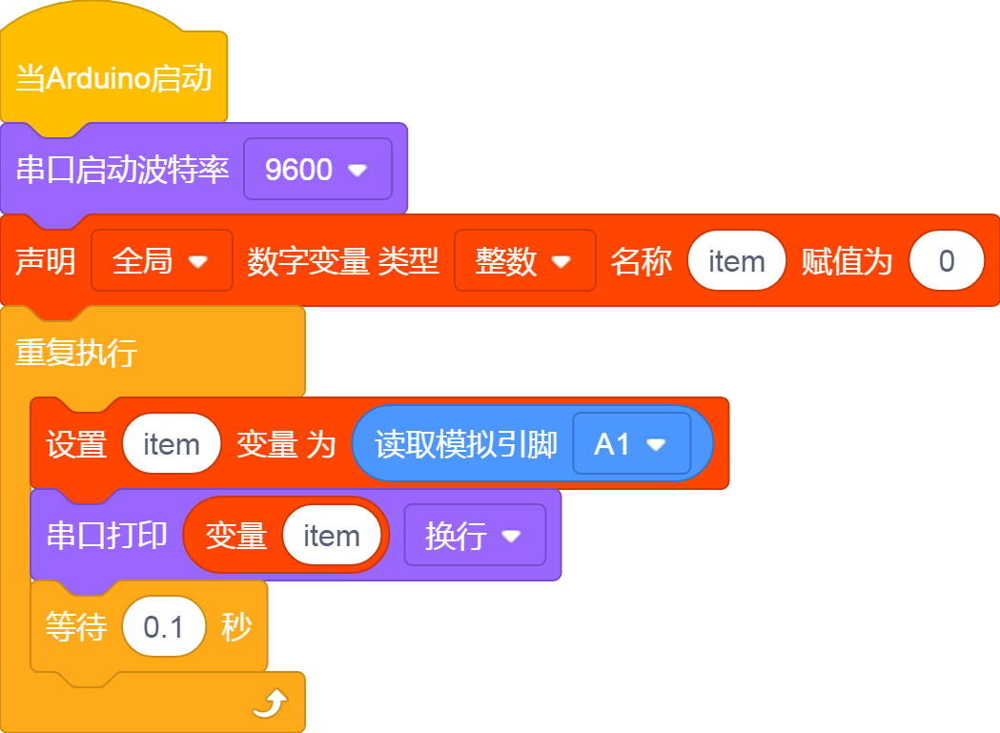

代码说明

1.  在这一实验中，我们分别用到一个数字口和一个模拟口，前面我们讲过，模拟口也可以当数字口用，这里我们把模拟口A0当做数字口来用。

2.我们先像前面学习的一样，创建一个整形变量item用来存放模拟值。

3我们这里管脚接模拟口A1，读取的模拟值赋给变量item，串口监视器显示变量的值。

测试结果

上传测试代码成功，利用USB线上电后，传感器模块上的红色LED2点亮，红色LED1熄灭，观察串口监视器，当传感器检测到火焰时，红色LED1点亮，模拟值变小，如下图。

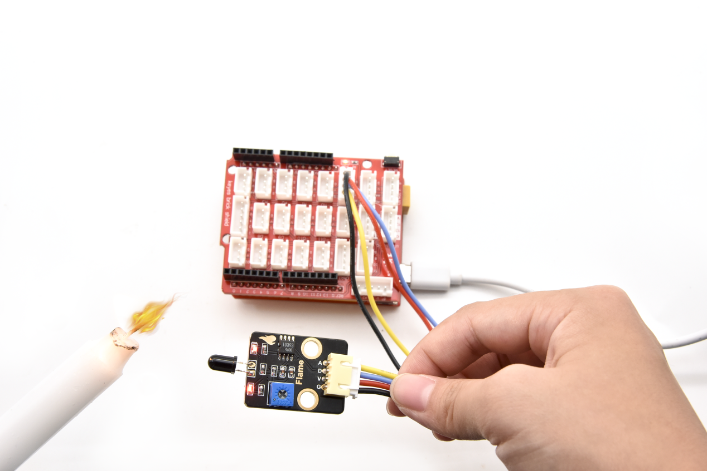

### 实验二十四 MQ-2 烟雾传感器

实验说明

在这个套件中，有一个Keyes DIY电子积木
MQ-2模拟气体传感器，它主要用到了MQ-2
可燃气体、烟雾传感器元件。该元件所使用的气敏材料是在清洁空气中电导率较低的二氧化锡(SnO2)。当传感器所处环境中存在可燃气体时，传感器的电导率随空气中可燃气体浓度的增加而增大。该传感器对液化气、丙烷、氢气的灵敏度高，对天然气和其它可燃蒸汽的检测也很理想。它可检测多种可燃性气体，是一款适合多种应用的低成本传感器。

实验中，我们读取传感器A0端模拟值，和D0端数字值，判断空气中气体的含量，以及它们是否超标。

实验原理

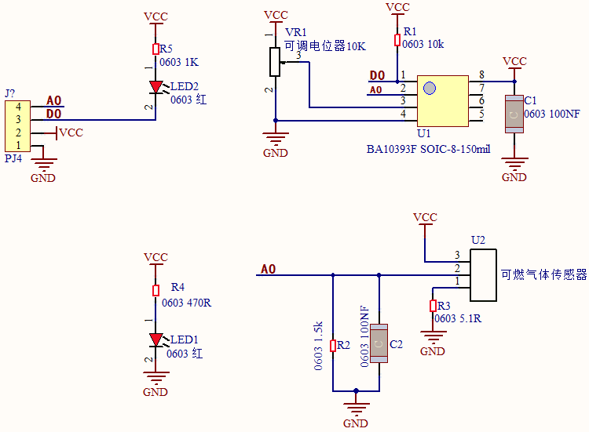MQ-2型烟雾传感器属于二氧化锡半导体气敏材料，属于表面离子式N型半导体。处于200~300摄氏度时，二氧化锡吸附空气中的氧，形成氧的负离子吸附，使半导体中的电子密度减少，从而使其电阻值增加。当与烟雾接触时，如果晶粒间界处的势垒收到烟雾的调至而变化，就会引起表面导电率的变化。利用这一点就可以获得这种烟雾存在的信息，烟雾的浓度越大，导电率越大，输出电阻越低，则输出的模拟信号就越大。

使用时，A0端读取对应气体的模拟值；D0端连接一个LM393芯片（电压比较器），我们可以通过电位器调节测量气体报警临界点，在D0输出数字值。当测量气体含量超过临界点时，D0端输出低电平；测量气体含量没超过临界点时，D0端输出高电平。

实验器材

|||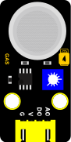|||
|-|-|-|-|-|
|Keyes Uno Plus 开发板*1|传感器扩展板*1|Keyes DIY电子积木 MQ-2模拟气体传感器*1|4P XH-2.54mm 黑红蓝黄硅胶线*1|USB线*1|

接线图

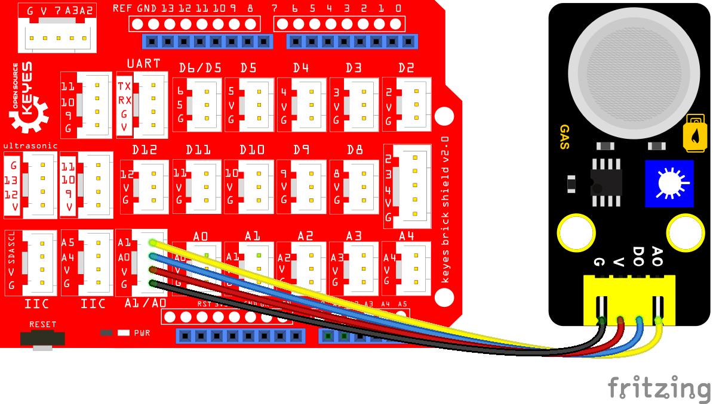

测试代码

代码说明

1.与前面学习的一样，创建整形变量item。用来存放模拟值。我们这里管脚接模拟口A1，所以我们把管脚改为A1。

2\.
读取的模拟值赋给变量item，串口监视器显示变量的值。

测试结果

上传测试代码成功，利用USB线上电后，模块上黄绿色LED点亮。串口监视器显示对应数据和字符。实验中，我们可以看到当测试的模拟值小于等于289时，气体含量没有超过临界点，红色LED处于熄灭状态；当测试的模拟值大于等于327时，气体含量超过临界点，红色LED点亮；那么就代表气体含量临界点对于的模拟值在289-327之间，我们可以通过旋转传感器上电位器，调节临界点。

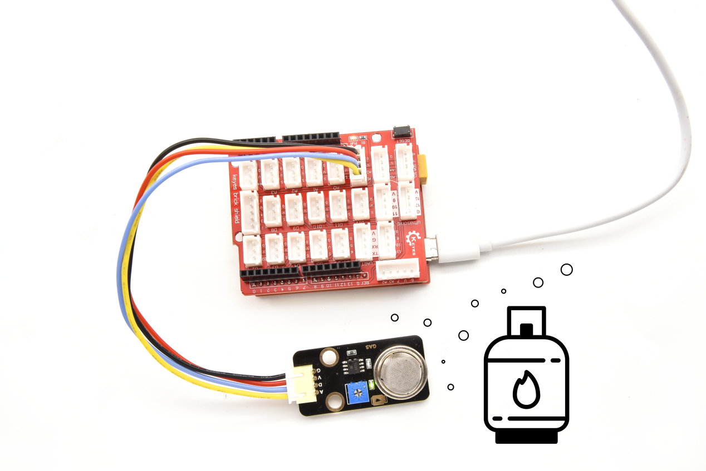

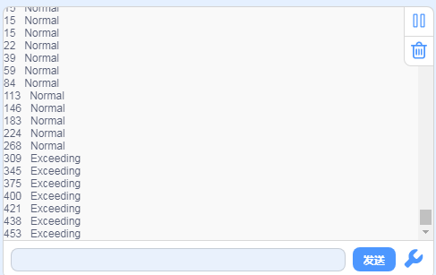

### 实验二十五 摇杆模块

实验说明

大家都应该看过游戏手柄，有些游戏手柄上除了按键，还有摇杆，那摇杆是什么工作原理呢？那么在我们这个套件中，就有一个Keyes DIY电子积木 摇杆模块，它主要采用PS2
手柄摇杆元件。其实它的原理非常简单，内部相当于两个可调电位器（左右和上下）和一个按键，这个按键没被按下时被R1下拉为低电平，按下时接通VCC即为高电平，与我们前面学习过的按键模块是相反的，我们摇动摇杆时内部的电位器就会调节从而输出不同的电压，我们就可以读取到模拟值。控制时，我们需要将模块X Y端口连接单片机模拟口，B端口连接单片机数字口，VCC接单片机电源输出端（3.3-5V），GND接单片机GND。我们可以读取两个模拟值和一个数字口的高低电平情况，判断模块上摇杆的工作状态。

实验中，我们将读取两个模拟值和一个数字值，并在串口监视器上显示测试结果。

实验原理

摇杆电位器在直流电路中作为电流调节使用时，将有电流通过摇杆电位器的滑动臂，此时由于阳极氧化的原因会导致电阻值异常增加。在这种情况下，建议将连接电阻体的端子接负极，滑动臂接正极。如果直流电流直接通过摇杆电位器，摇杆电位器的阳极就会受到氧化损伤，从而让摇杆电位器的阻抗变大，因此最好是将电流的负极接在跟碳膜片接触的端子上，正极接在跟刷子（摇杆电位器接触片）的端子上。摇杆电位器作为可变电阻器时，建议作调整电压的分压器使用，同时摇杆电位器的负载电阻RL应不小于摇杆电位器公称阻值RT的10倍。在稳压器中用来调节输出电压，故设计摇杆电位器应满中顺时针调节时输出电压升高，反时针调节器节时输出电压降低；在可调恒流充电器中摇杆电位器用来调节充电电流折大小，设计摇杆电位器时应满中顺时针调节时，电流增大。

实验器材

|||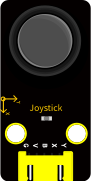|||
|-|-|-|-|-|
|Keyes Uno Plus 开发板*1|传感器扩展板*1|Keyes DIY电子积木 摇杆模块*1|5P XH-2.54mm 黑红蓝黄绿硅胶线*1|USB线*1|

接线图

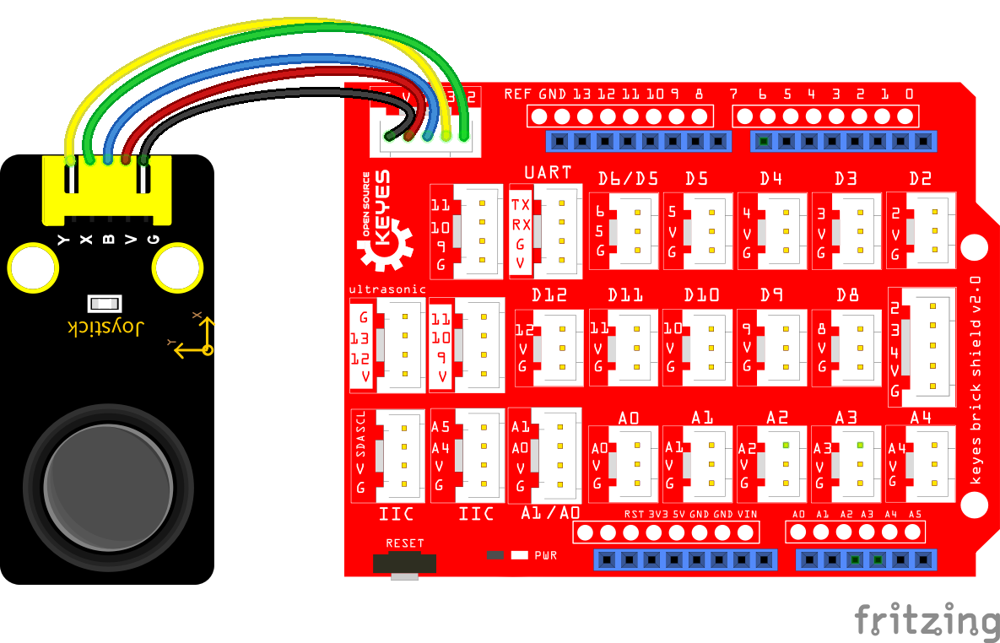

测试代码

代码说明

1.我们先定义三个整形变量X、Y和Button。X用来存放X轴模拟值，Y用来存放Y轴模拟值，Button存储按键值。

2我们这里X轴管脚接模拟口A3，Y轴管脚接模拟口A2，然后按钮我们这里接数字口7，所以，这些读取信号一点要放在循环函数中，我们需要循环读取。

测试结果

上传测试代码成功，利用USB线上电后，串口监视器显示对应数值。摇动摇杆，x轴和y轴对应的模拟值发生改变，按下按钮，读取到的数字值为1，否则为0，如下图。

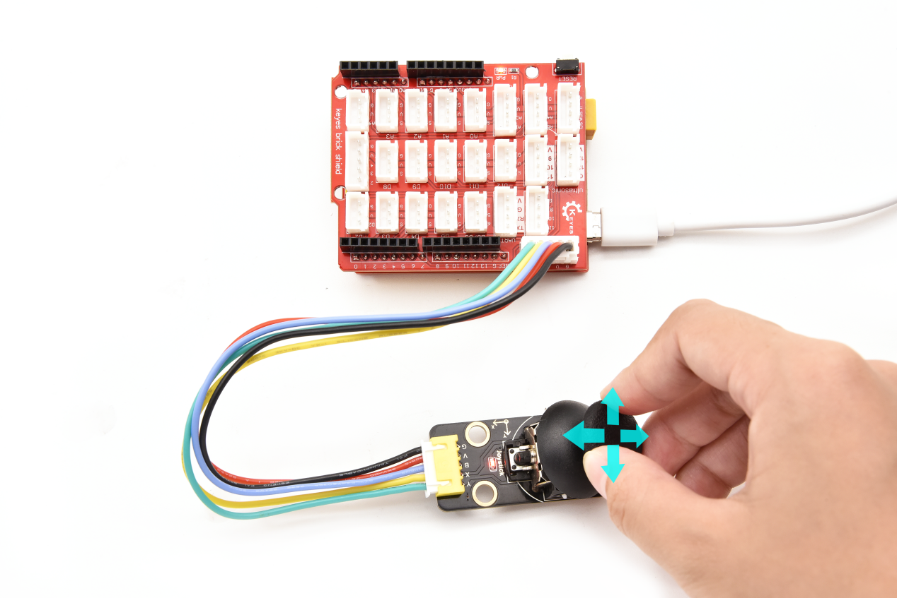

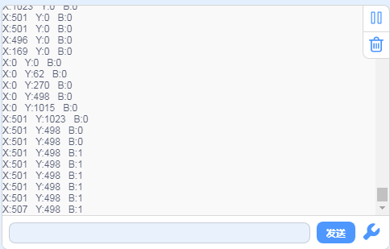

### 实验二十六 太阳光紫外线传感器

实验说明

在这个套件中，有一个Keyes DIY电子积木
太阳光紫外线传感器，GUVA-S12SD紫外线传感器用于检测紫外线。适用于测量智能可穿戴设备的紫外线指数，如手表、智能手机和室外设备的紫外线指数检测。它也可以用来监测紫外线的强度，或者用作紫外线消毒物品时的紫外线火焰探测器。GUVA-S12SD紫外线传感器输出电流与光照强度成正比，产品输出具有非常高的一致性，模块电路已经设置好，我们直接进行ADC采集模拟信号。

传感器都有特定的光谱响应，该产品主要是针对太阳光中紫外线测量以及UVA灯强度测量，特别适合UVI的检测。实验中，模块电路已经设置好，我们直接进行ADC采集模拟信号，并将测试结果在串口监视器上显示出来。

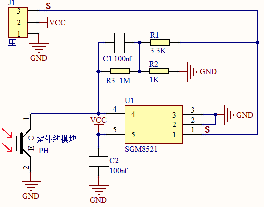实验原理

实验器材

|||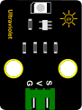|||
|-|-|-|-|-|
|Keyes Uno Plus 开发板*1|传感器扩展板*1|Keyes DIY电子积GUVA-S12SD 3528 太阳光紫外线传感器*1|3P XH-2.54mm 黑红蓝硅胶线*1|USB线*1|

接线图

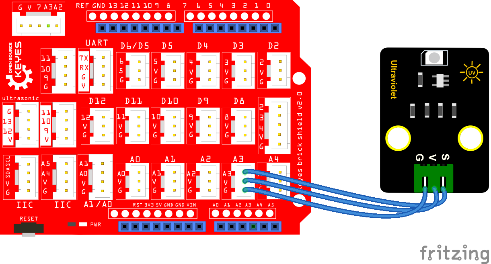

测试代码

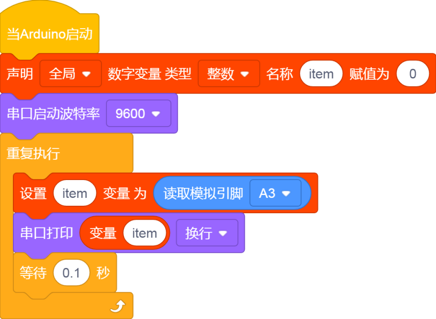

代码说明

代码逻辑设置与前面实验类似，可参考前面实验。

测试结果

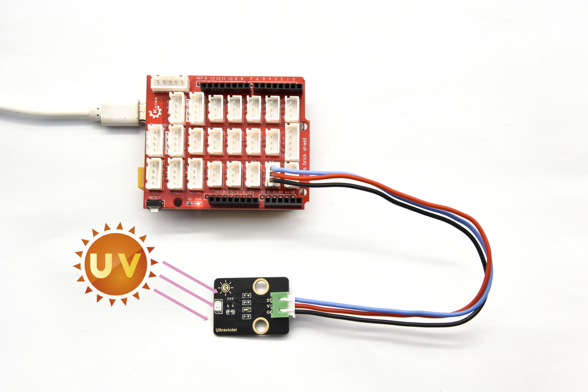

烧录好测试代码，线路连接好后，上传程序代码，串口监视器将显示数据，如下图所示。

将紫外线灯照到传感器上，或者放在太阳底下，串行监视器上的数据正在变化，如下图所示。

### 实验二十七 SK6812 RGB模块

实验说明

前面我们学习了插件RGB模块，利用PWM信号对模块的三个引脚进行调色。我们这个套价中，还有一个Keyes DIY电子积木 6812 RGB模块，但是这个SK6812 RGB
模块驱动原理不与我们前面学习过的插件RGB模块相同，而且只需要一个引脚就能控制，这是一个集控制电路与发光电路于一体的智能外控LED光源。每个LED原件其外型与一个5050LED灯珠相同，每个元件即为一个像素点，我们这个模块上有四个灯珠即四个像素，

实验中，我们分别使不同的灯亮出不同的颜色。

实验原理

从原理图中我们可以看出，这四个像素点灯珠都是串联起来的，其实不论多少个，我们都可以用一个引脚控制任一一个灯，并且让它显示任一种颜色。像素点内部包含了智能数字接口数据锁存信号整形放大驱动电路，还包含有高精度的内部振荡器和12V高压可编程定电流控制部分，有效保证了像素点光的颜色高度一致。

数据协议采用单线归零码的通讯方式，像素点在上电复位以后，S端接受从控制器传输过来的数据，首先送过来的24bit数据被第一个像素点提取后，送到像素点内部的数据锁存器。这个6812RGB通讯协议与驱动已经在底层封装好了，我们直接调用函数的接口就可以使用，简单方便，LED具有低电压驱动，环保节能，亮度高，散射角度大，一致性好，超低功率，超长寿命等优点。

实验器材

|||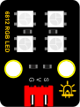|||
|-|-|-|-|-|
|Keyes Uno Plus 开发板*1|传感器扩展板*1|Keyes DIY电子积木 6812 RGB模块*1|3P XH-2.54mm 黑红蓝硅胶线*1|USB线*1|

接线图

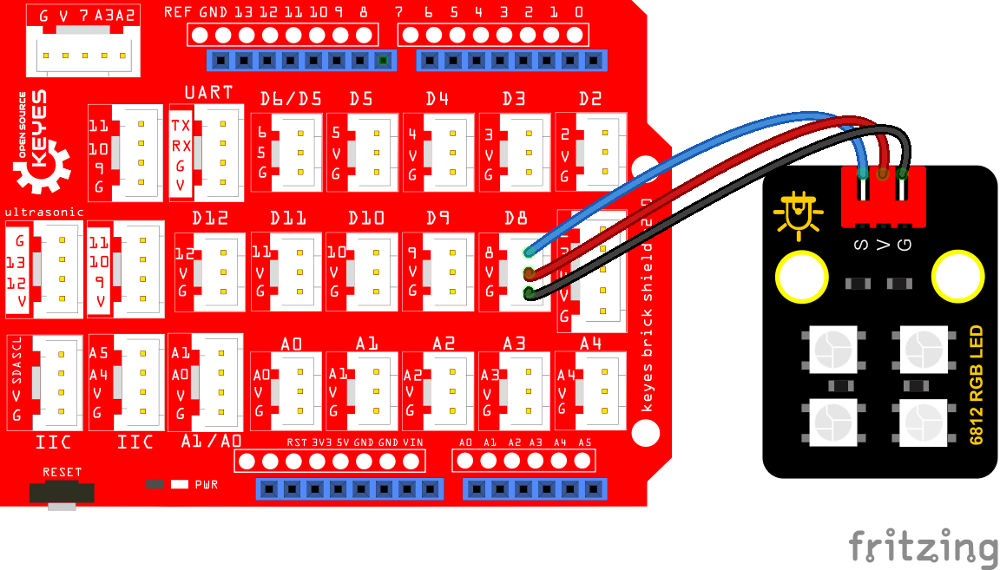

测试代码

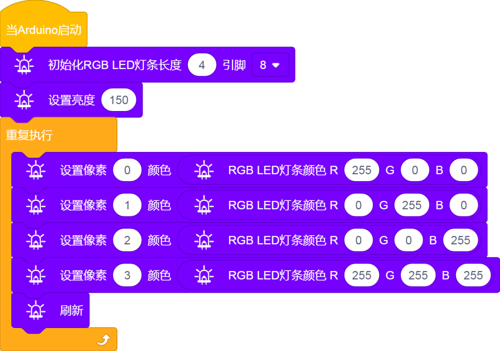

代码说明

1.  首先我们需要添加6812灯扩展，如图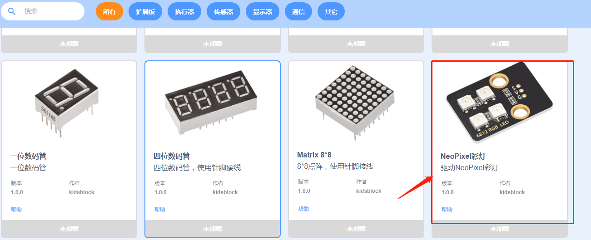，点击加载后会在左下方显示出来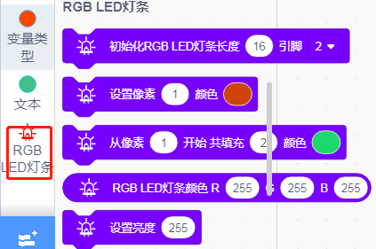，先初始化代码块我们这里管脚接数字口8，在管脚后面下拉选择8就可以了，我们模块上4个灯所以灯条长度设置为4，我们再设置一下亮度150，最大为255。

2.  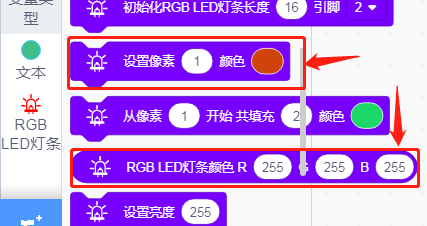这两个代码块一个用于设置灯珠位置，一个用于设置灯珠延时，我们搭配使用时即可设置任一灯珠显示任一延时。

3\.
第一个灯亮红色：

4\.
第二个灯亮绿色：

5\.
第三个灯亮蓝色：

6\.
第四个灯亮白色：

7\.
这条代码块是必不可少的，不然不能刷新显示。

测试结果

烧录好测试代码，按照接线图连接好线，上电后，我们可以看到模块上的四个灯珠分别亮红绿蓝白色，如下图所示。

### 实验二十八 旋转编码器模块计数

实验说明

在这个套件中，有一个Keyes DIY电子积木
旋转编码器模块，也叫开关编码器、旋转编码器，EC11系列编码器有直插编码器、贴片式编码器、沉板式编码器、侧插式编码器，EC11A为直插式编码器。因广泛用于车载DVD、车载导航、汽车影音上，也经常被人称为汽车编码器。EC11编码器在各类仪器设备中用于频率、音量、速度、温度、电压、菜单选择、光线强弱等参数的控制。此款编码器有做20脉冲20定位点、15脉冲30定位点两种。调节轴有金属柄和塑胶柄，轴长区间9-30mm，调节轴有全柄、半柄、螺纹柄等类型供您选择。EC11系列编码器主要用于汽车电子、多媒体音响、仪器仪表、家用电器、智能家居、计算机周边、医疗器械等领域。主要用于频率调节、亮度调节、温度调节、音量调节的参数控制等。

实验中，我们利用Keyes DIY电子积木
旋转编码器模块用于计数，当我们顺时针旋转编码器时，设置数据i加1；逆时针旋转编码器时，设置数据i减1；按下编码器中间按键时，打印按键的值；将测试结果在串口监视器上显示。

实验原理

增量式编码器是将位移转换成周期性的电信号，再把这个电信号转变成计数脉冲，用脉冲的个数表明位移的巨细。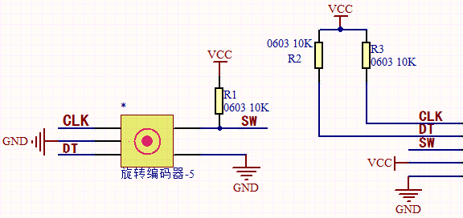它主要采用20脉冲旋转编码器元件。它可通过旋转计数正方向和反方向转动过程中输出脉冲的次数，这种转动计数是没有限制的，复位到初始状态，即从0开始计数。如果我们只计算信号的脉冲，则可以使用两个输出中的任何一个来确定旋转位置。但是，如果我们想要确定旋转方向，我们需要同时考虑两个信号。

旋转增量式编码器以转变时输出脉冲，通过计数设备来晓得其方位，当编码器不动或停电时，依托计数设备的内部回忆来记住方位。这样，当停电后，编码器不能有任何的移动，当来电作业时，编码器输出脉冲进程中，也不能有搅扰而丢掉脉冲，否则，计数设备回忆的零点就会偏移，并且这种偏移的量是无从晓得的，只要过错的出产成果呈现后才晓得。

实验器材

|||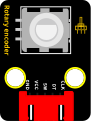|||
|-|-|-|-|-|
|Keyes Uno Plus 开发板*1|传感器扩展板*1|Keyes DIY电子积木 旋转编码器模块*1|5P XH-2.54mm 黑红蓝黄绿硅胶线*1|USB线*1|

接线图

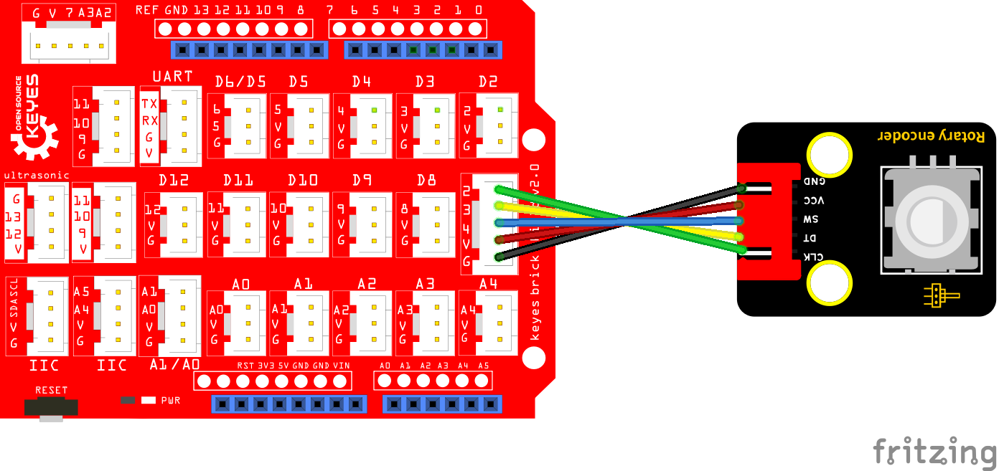

测试代码

代码说明

1.首先添加旋转编码器模块扩展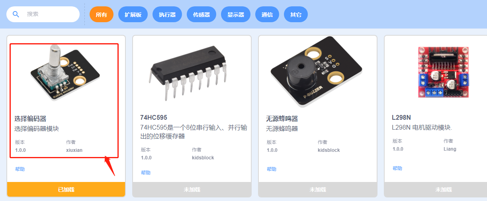

2.定义三个整数变量，启动串口波特率并设置波特率为9600，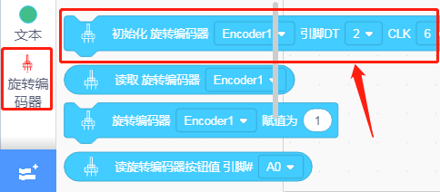我们把CLK管脚设置为数字口2、DAT管脚设置为数字口3，计数变量item就是我们定义了的。该代码在库文件中就已经设置好了，它的意思是中断2（CLK）一个下降沿（从高电平变为低电平）后，读取数字口3（DAT）电压，当DAT电压为高电平时，旋转编码器的值加1；当DAT电压为低电平时，转编码器的值减1。

3\.
找到，并把管脚设置为4，这个值我们存储到我们定义的button变量中。

5.然后循环程序中设置按钮管脚（D4）为低电平时即按下按钮时，将计数变量i的值清0，。

6\.
代码块的编程方法其实我们在前面的实验中有讲过，在光折断计数实验中，忘记了可以回顾一下哦。

测试结果

上传测试代码成功，利用USB线上电后，观察串口监视器，顺时针旋转编码器，显示数据增加；逆时针旋转编码器，显示数据减小；按下编码器中间按键，显示数据为0，如下图。

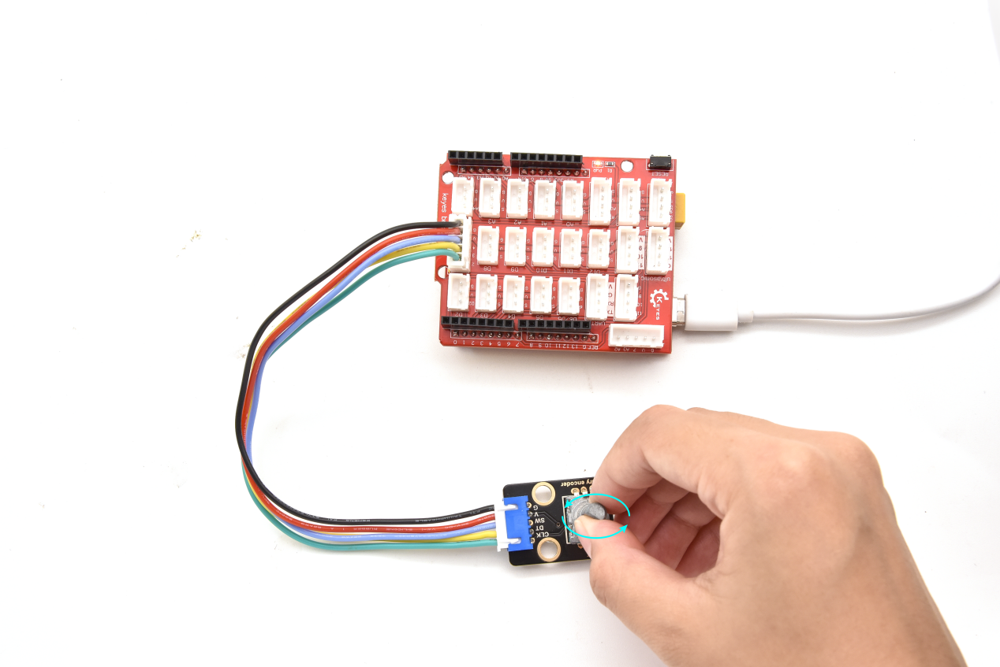

### 实验二十九 舵机的控制原理

实验说明

舵机是一种位置伺服的驱动器，主要是由外壳、电路板、无核心马达、齿轮与位置检测

器所构成。舵机有很多规格，但所有的舵机都有外接三根线，分别用棕、红、橙三种颜

色进行区分，由于舵机品牌不同，颜色也会有所差异，棕色为接地线，红色为电源正极

线，橙色为信号线。

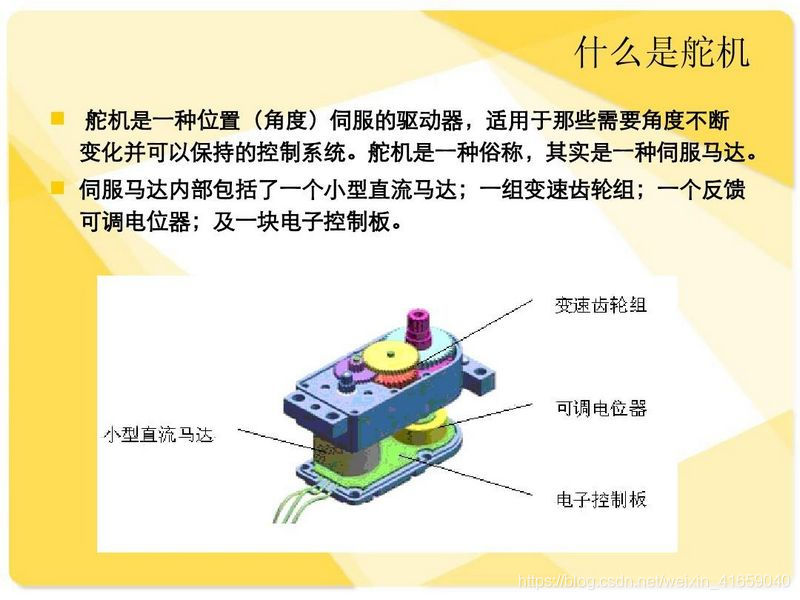

实验原理

舵机的转动的角度是通过调节PWM（脉冲宽度调制）信号的占空比来实现的，标准PWM

（脉冲宽度调制）信号的周期固定为20ms（50Hz），理论上脉宽分布应在1ms到2ms

之间，但是，事实上脉宽可由0.5ms 到2.5ms 之间，脉宽和舵机的转角0°～180°相

对应。有一点值得注意的地方，由于舵机牌子不同，对于同一信号，不同牌子的舵机旋

转的角度也会有所不同。

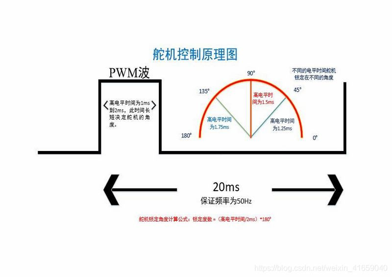

实验器材

|||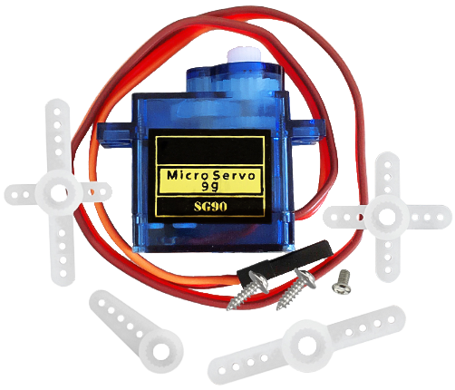||
|-|-|-|-|
|Keyes Uno Plus 开发板*1|传感器扩展板*1|keyes 伺服舵机*1|USB线*1|

接线图

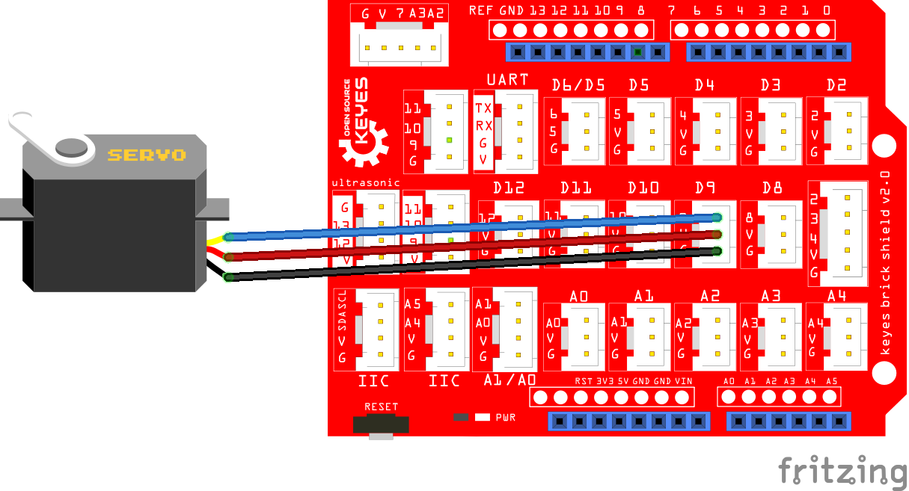

测试代码

代码1：

代码2：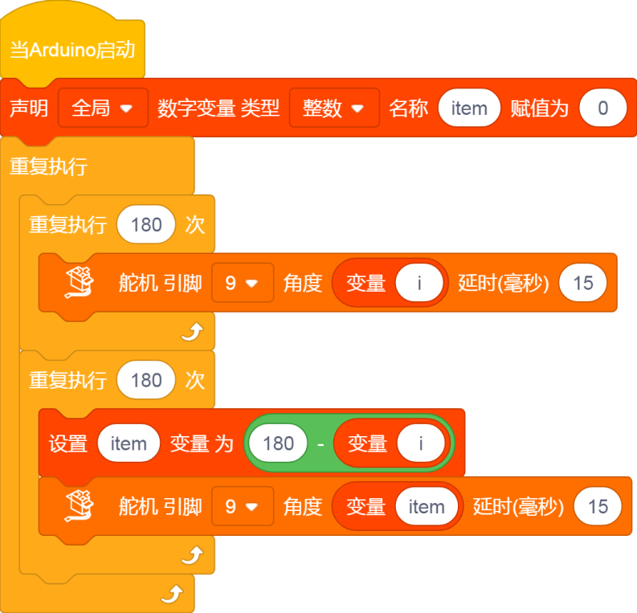

代码说明

代码1说明：

首先加载舵机扩展，找到这条代码块，由接线图我们这里管脚接D9，角度就是我们要让舵机转动到多少度，范围是0~180度，延时即转动角度后等待的时间，单位毫秒。例如，意思就是舵机管脚连接数字口9，转动到90度的位置再等待1000毫秒。

代码2说明：

1.  跟前面一样，先添加舵机扩展并设置管脚9；

2.  在控制单元找到for()循环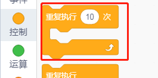，我们使用到这个函数时，已经自动定义了一个局部变量i，这个变量每次循环加1，所以我们上面没有什么变量i直接使用了。我们想让舵机一度一度的转动，我们就循环180次：，延时15ms，不让它转动得太快。

3.  我们再定义个变量item，item为180-i，因为i是从0到180每次加1，这样一减后得到的item的值就为180到0每次减一，这样我们就可以使舵机又从180度转回0度。

测试结果

实验1 结果：

上传测试代码成功，利用USB线上电后，舵机由0度，90度，180度三个角度来回转动。

实验2 结果：

上传测试代码成功，利用USB线上电后，舵机由0~180度来回转动，并且每15ms转动一度。

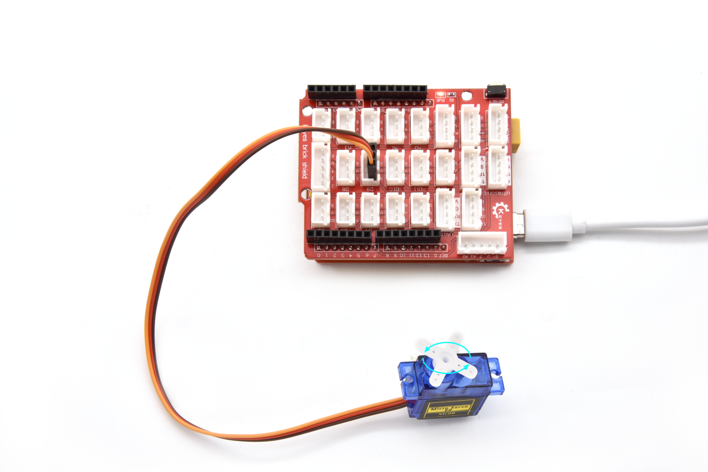

### 实验三十 超声波传感器的原理

眼镜猴。它们大多时候都是“沉默寡言”的形象。但来自加利福尼亚洪堡加州州立大学的科学家近日研究发现，其实眼镜猴是不折不扣的“话匣子”，它们时刻都在发出一种超声波，只不过捕食者无法听到而已。据了解，研究人员发现这种眼镜猴发出声音的“最小频率”可达到67千赫，比陆地上任何一种啮齿动物和蝙蝠发出的音量都要高很多，甚至偶尔还能飙升到70千赫。众所周知，任何声音只要达到20千赫以上，就很难被人们所听见，就连听力一向很敏锐的狗，也只能听到23千赫的声音。而眼镜猴甚至可以直接听到90千赫的声音。最为特别的是，在眼镜猴的群体中彼此传递着一种秘密的语言，这种语言会提醒对方注意捕食者的危险。

蝙蝠和某些海洋动物都能够利用高频率的声音进行回声定位或信息交流。它们能通过口腔或鼻腔把从喉部产生的超声波发射出去，利用折回的声波来定向，并判定附近物体的位置、大小以及是否在移动。超声波是一种频率高于20000赫兹的声波，它的方向性好，穿透能力强，易于获得较集中的声能，在水中传播距离远，可用于测距、测速、清洗、焊接、碎石、杀菌消毒等。在医学、军事、工业、农业上有很多的应用。超声波因其频率下限大于人的听觉上限而得名。科学家们将每秒钟振动的次数称为声音的频率，它的单位是赫兹(Hz)。

实验说明

在这个套件中，有一个keyes HC-SR04超声波传感器，它可以检测前方是否存在障碍物，并且检测出传感器与障碍物的详细距离。它的原理和蝙蝠飞行的原理一样，就是超声波模块发送出一种频率很高的超声波信号，通常正常人耳朵的听力的声波范围是20Hz~20kHz，人类无法听到。这些超声波的信号若是碰到障碍物，就会立刻反射回来，在接收到返回的信息之后，通过判断发射信号和接收信号的时间差，计算出传感器和障碍物的距离。

实验中，我们利用传感器检测传感器和障碍物之间的距离，将测试结果在串口监视器上显示。

实验原理

最常用的超声测距的方法是回声探测法，如图，超声波发射器向某一方向发射超声波，在发射时刻的同时计数器开始计时，超声波在空气中传播，途中碰到障碍物面阻挡就立即反射回来，超声波接收器收到反射回的超声波就立即停止计时。超声波也是一种声波，其声速V与温度有关。一般情况下超声波在空气中的传播速度为340m/s，根据计时器记录的时间t，就可以计算出发射点距障碍物面的距离s，即：s=340t/2

HC-SR04超声波测距模块可提供2cm-400cm的非接触式距离感测功能，
测距精度可达高到3mm；模块包括超声波发射器、接收器与控制电路。基本工作原理：

(1)采用IO口TRIG触发测距，给至少10us的高电平信号;

(2)模块自动发送8个40khz的方波，自动检测是否有信号返回；

(3)有信号返回，通过IO口ECHO输出一个高电平，高电平持续的时间就是超声波从发射到返回的时间。

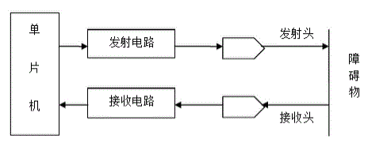

实验器材

|||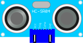|||
|-|-|-|-|-|
|Keyes Uno Plus 开发板*1|传感器扩展板*1|keyes brick HC-SR04超声波传感器*1|4P XH-2.54mm 黑红蓝黄硅胶线*1|USB线*1|

接线图

测试代码

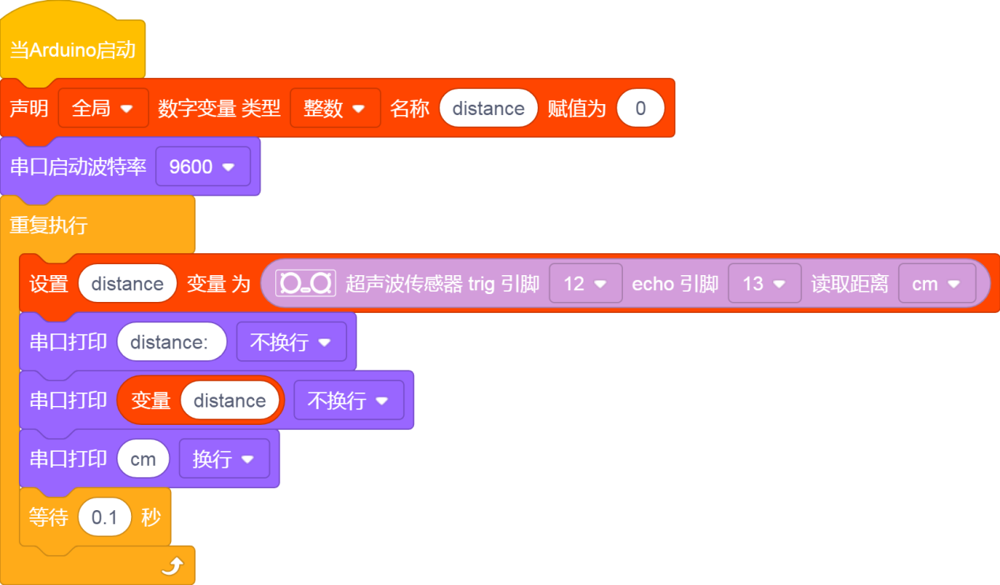

代码说明

1.  与之前一样，我们先声明一个整数变量，并把变量名改为：“distance”，赋初值为0.

2\.
添加扩展超声波传感器模块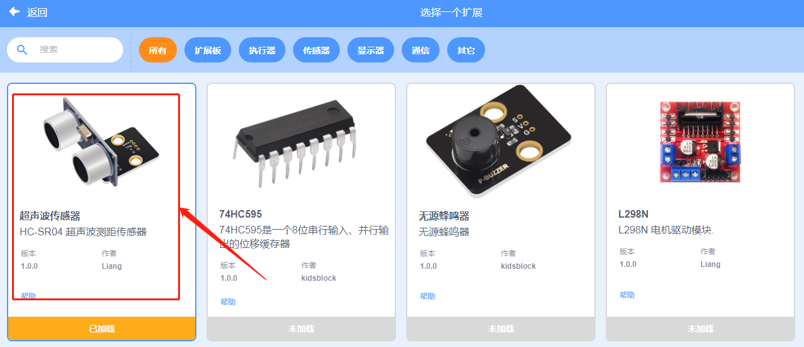。根据接线，将Trig设置为12，Echo设置为13。

3\.
然后我们把距离赋给变量distance

4\. 我们在电脑的串口监视器中显示除传感器和障碍物之间的距离。

测试结果

上传测试代码成功，利用USB线上电后，串口监视器显示超声波传感器和前方障碍物之间的距离，单位为cm，如下图。

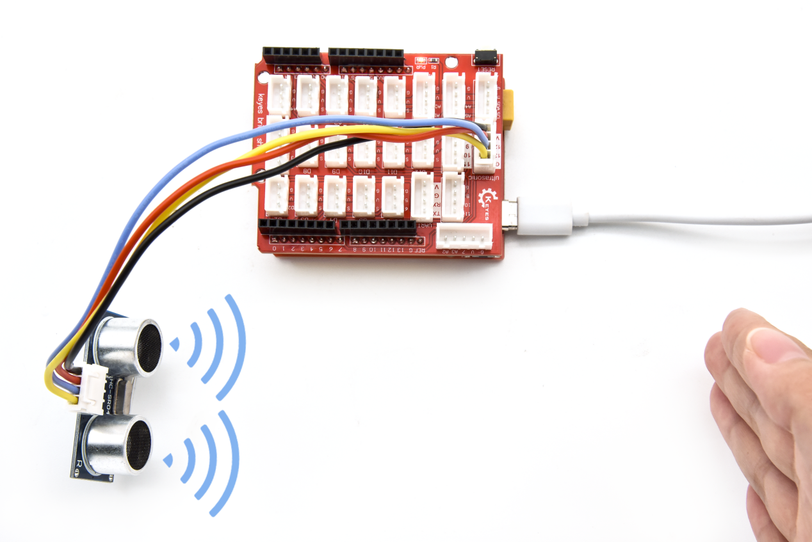

### 实验三十一 红外遥控与接收

实验说明

我们前面也接触了红外信号了，红外线是波长介于微波和可见光之间的电磁波，波长在
760 纳米到 1
毫米之间，是波形比红光长的非可见光。自然界中的一切物体，只要它的温度高于绝对零度(-273)就存在分子和原子的无规则运动，其表面就会不停的辐射红外线。当然了，虽然是都辐射红外线，但是不同的物体辐射的强度是不一样的，而我们正是利用了这一点把红外技术应用到我们的实际开发中。

红外线遥控是目前使用最广泛的一种通信和遥控手段。由于红外线遥控装置具有体积小、功耗低、功能强、成本低等特点，因而，继彩电、录像机之后，在录音机、音响设备、
空凋机以及玩具等其它小型电器装置上也纷纷采用红外线遥控。工业设备中，在高压、
辐射、 有毒气体、 粉尘等环境下，
采用红外线遥控不仅完全可靠而且能有效地隔离电气干扰。红外遥控的发射电路是采用红外发光二极管来发出经过调制的红外光波；红外接收电路由红外接收二极管、三极管或硅光电池组成，它们将红外发射器发射的红外光转换为相应的电信号，再送后置放大器。

这一实验中，我们了解下红外接收传感器的使用方法。红外接收传感器主要采用VS1838B红外接收传感器元件。该元件是集接收、放大、解调一体的器件，内部IC就已经完成了解调，输出的就是数字信号。它可接收标准38KHz调制的遥控器信号。

实验中，我们利用红外接收传感器接收外部红外发射设备发射的红外信号，并将接收信号在串口监视器上显示。

实验原理

在实际的通信领域，发出来的信号一般有较宽的频谱，而且都是在比较低的频率段分布大量的能量，所以称之为基带信号，这种信号是不适合直接在信道中传输的。为便于传输、提高抗干扰能力和有效的利用带宽，通常需要将信号调制到适合信道和噪声特性的频率范围内进行传输，这就叫做信号调制。在通信系统的接收端要对接收到的信号进行解调，恢复出原来的基带信号。这部分通信原理的内容，大家了解一下即可。我们用到的红外遥控器里的红外通信，通常是使用
38K 左右的载波进行调制的。

红外遥控系统的主要部分为调制、发射和接收。红外遥控是以调制的方式发射数据，就是把数据和一定频率的载波进行“与”操作，这样既可以提高发射效率又可以降低电源功耗。调制载波频率一般在30khz到60khz之间，大多数使用的是38kHz，占空比1/3的方波，如图2所示，这是由发射端所使用的455kHz晶振决定的。在发射端要对晶振进行整数分频，分频系数一般取12，所以455kHz÷12≈37.9kHz≈38kHz。38KH载波发射（完整的发射）如下图。

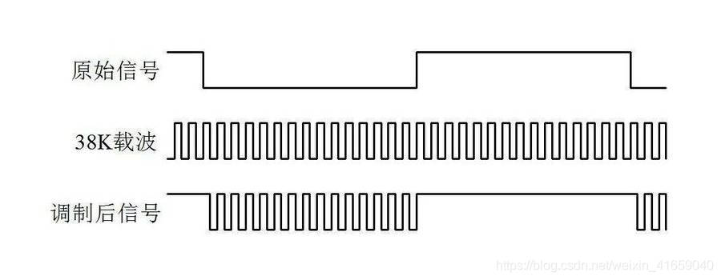

实验器材

<table >

|||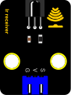|||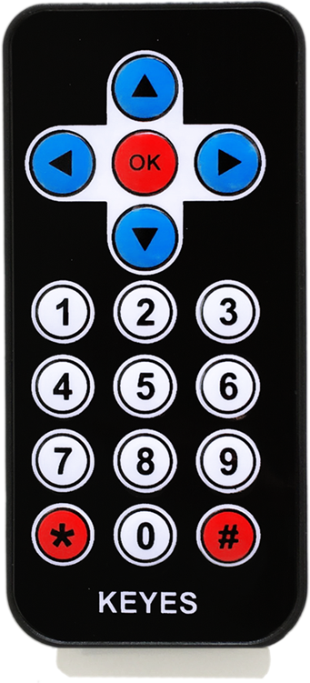|
|-|-|-|-|-|-|
|Keyes Uno Plus 开发板*1|传感器扩展板*1|keyes DIY电子积木 红外接收模块*1|3P XH-2.54mm 黑红蓝硅胶线*1|USB线*1|遥控器*1|

接线图

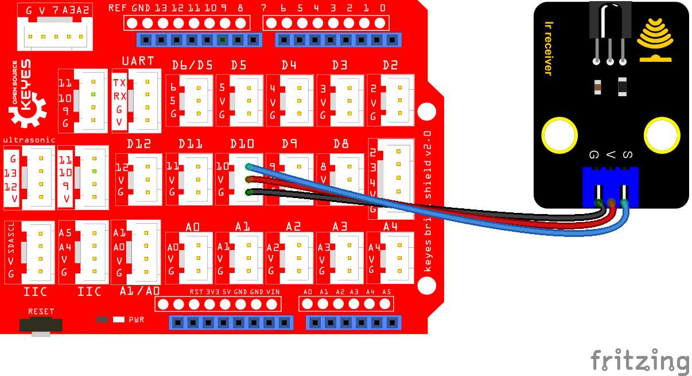

测试代码

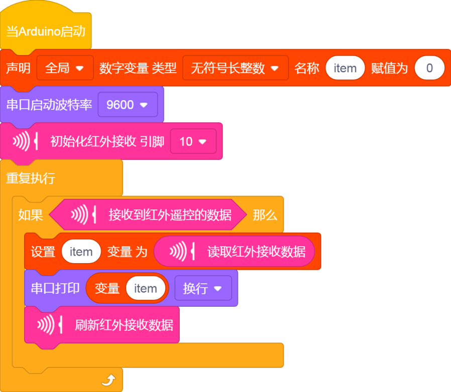

代码说明

1\.
首先添加扩展红外接收模块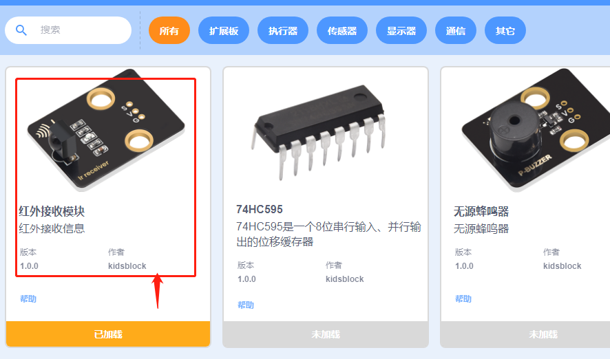。根据接线，我们将管脚设置为10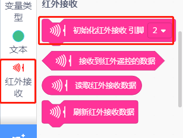。我们需要串口显示信息，得设置波特率及一个变量存储红外信号，这个信号比较大，我们用无符号长整数。

2\.
设置后，当我们接收到数据，串口就会以换行打印出来，没有接收到数据则不打印。

3.用于下次接收。

测试结果

按照接线图接线，上传测试代码成功，找到红外遥控器，拔出绝缘片，对准红外接收传感器的接收头按下按键。接收到信号后，红外接收传感器上的红色LED也开始闪烁，串口监视器显示如下图（按下时间过长会产生乱码）。

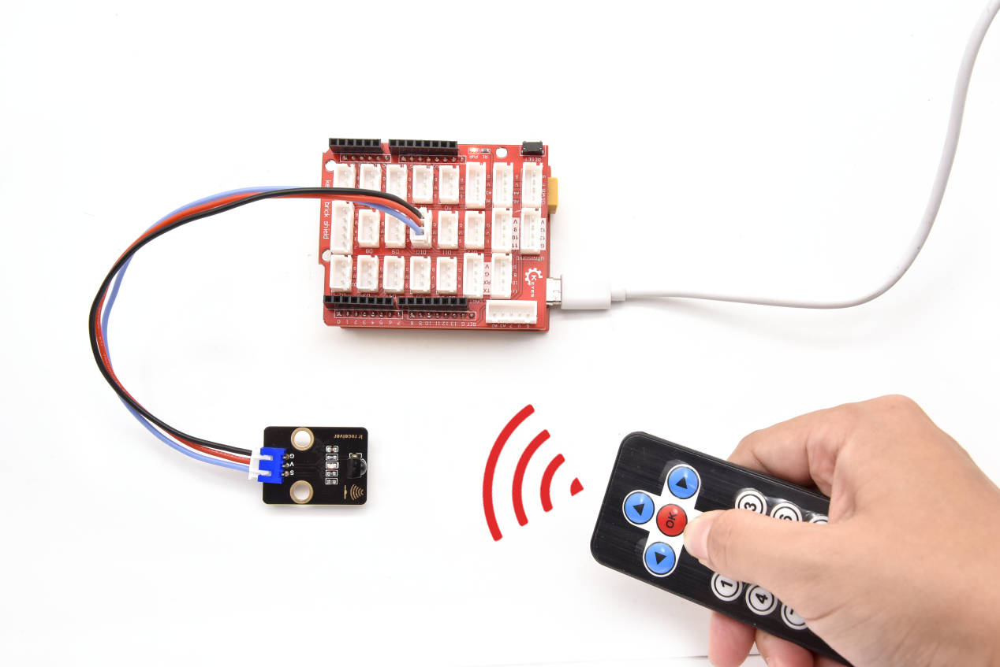

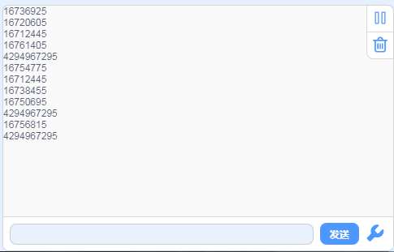

### 实验三十二 DS18B20温度传感器检测温度

实验说明

在这个套件中，有一个Keyes DIY电子积木 DS18B20温度传感器，DS18B20
是美信公司的一款温度传感器，单片机可以通过 1-Wire 协议与 DS18B20
进行通信，最终将温度读出。DS18B20是世界第一片支持"一线总线"接口的温度传感器，一线总线独特而且经济的特点，使用户可轻松组建传感器网络，为测量系统构建系统引入全新概念。

实验中，我们利用这个温度传感器测试当前环境中的温度，测试结果分为℃和℉两种；并且，我们在串口监视器上显示测试结果。

实验原理

1-Wire 总线的硬件接口很简单，只需要把 DS18B20
的数据引脚和单片机的一个 IO
口接上就可以了。硬件的简单，随之而来的，就是软件时序的复杂。1-Wire总线的时序比较复杂，很多同学在这里独立看时序图都看不明白，我们在库里面已经把复杂的时序操作封装好了，直接使用库函数就可以。我们来看一下
DS18B20 的硬件原理图，如图所示。

DS18B20 通过编程，可以实现最高 12
位的温度存储值，在寄存器中，以补码的格式存储，如下图所示。

一共 2 个字节，LSB 是低字节，MSB 是高字节，其中 MSb 是字节的高位，LSb
是字节的低位。大家可以看出来，二进制数字，每一位代表的温度的含义，都表示出来了。其中
S表示的是符号位，低 11 位都是 2 的幂，用来表示最终的温度。DS18B20
的温度测量范围是从-55 度到+125
度，而温度数据的表现形式，有正负温度，寄存器中每个数字如同卡尺的刻度一样分布，如图下所示。

实验器材

|||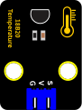|||
|-|-|-|-|-|
|Keyes Uno Plus 开发板*1|传感器扩展板*1|Keyes DIY电子积木 DS18B20温度传感器*1|3P XH-2.54mm 黑红蓝硅胶线*1|USB线*1|

接线图

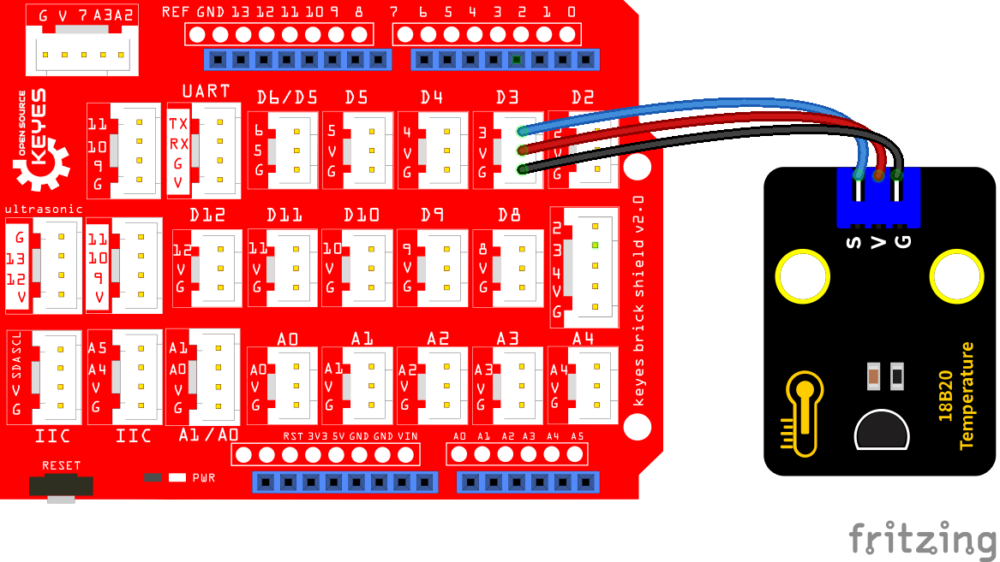

测试代码

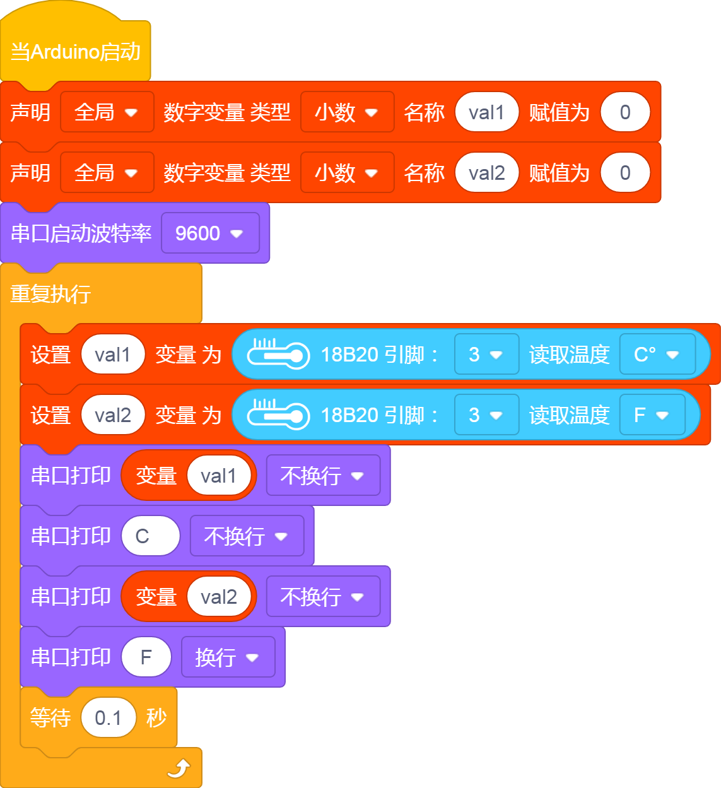

代码说明

1\.
首先添加扩展18B20温度传感器模块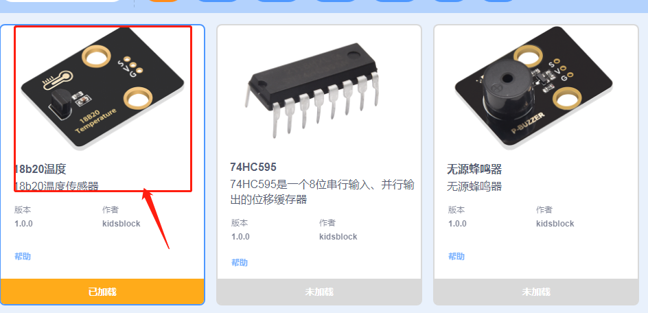找到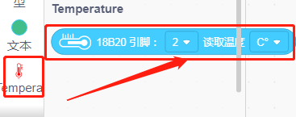。

2\.
根据接线，我们将管脚设置为3，获取温度的单位分别设置为℃和℉，存放再我们定义的两个整数变量中。

3\.
与之前设置整数变量不同，这里设置两个小数变量，分别为val1和val2，将所测结果赋值给val1和val2。

4\.
串口监视器显示val1和val2的值，显示时，我们在数据后面添加单位，如果单位直接设置为℃和℉，测试结果会出现乱码。所以我们直接用C代替℃，F代替℉。

测试结果

上传测试代码成功，利用USB线上电后，串口监视器显示当前环境的温度，如下图。

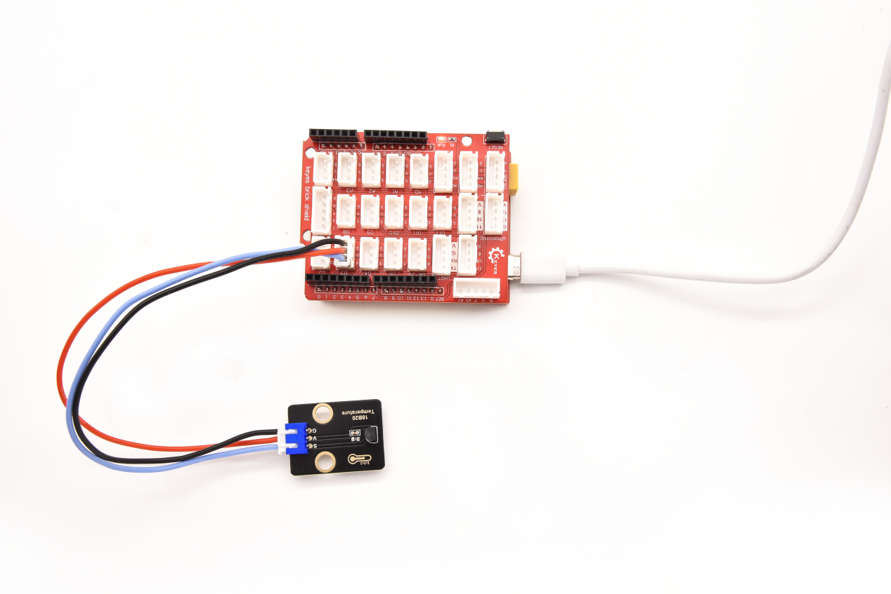

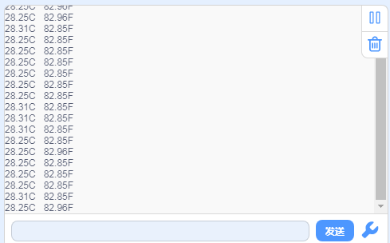

### 实验三十三 XHT11温湿度传感器检测温湿度

实验说明

温湿度与人们生活的关系，如：冬天温度为18至25℃，湿度为30%至80%；夏天温度为23至28℃，湿度为30%至60%。在此范围内感到舒适的人占95%以上。在装有空调的室内，室温为19至24℃，湿度为40%至50%时，人会感到最舒适。如果考虑到温、湿度对人思维活动的影响，最适宜的室温度应是工作效率高。18℃，湿度应是40%至60%，此时，人的精神状态好，思维最敏捷。

在这个套件中，有一个Keyes DIY电子积木
XHT11温湿度传感器，XHT11作为一款低价、入门级的温湿度传感器，常用于我们的单片机设计实例中;它应用专用的数字模块采集技术和温湿度传感技术，确保产品具有极高的可靠性与卓越的长期稳定性。传感器包括一个电阻式感湿元件和一个NTC测温元件，XHT11为4针单排引脚封装，如下图，采用单线制串行接口，只需加适当的上拉电阻，信号传输距离可达20米以上，使其成为各类应用甚至最为苛刻的应用场合的最佳选择。该产品具有品质卓越、超快响应、抗干扰能力强、性价比极高等优点。

实验中，我们用已经封装好底层函数的代码库，利用这个传感器测试当前环境中的温湿度，并且我们在串口监视器上显示测试结果。

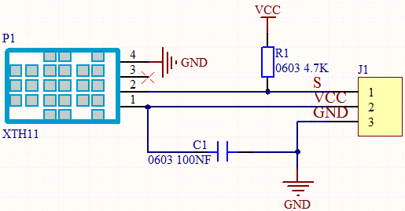实验原理

微处理器与
XHT11之间的通讯和同步,采用单总线数据格式,一次通讯时间4ms左右,数据分小数部分和整数部分,具体格式在下面说明,当前小数部分用于以后扩展,现读出为零，操作流程：一次完整的数据传输为40bit，高位先出。

数据格式：8bit湿度整数数据+8bit湿度小数数据+8bi温度整数数据+8bit温度小数数据+8bit校验和

8位校验和：8bit湿度整数数据+8bit湿度小数数据+8bi温度整数数据+8bit温度小数数据"相加所得结果的末8位。

实验器材

|||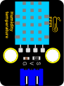|||
|-|-|-|-|-|
|Keyes Uno Plus 开发板*1|传感器扩展板*1|Keyes DIY电子积木 XHT11温湿度传感器*1|3P XH-2.54mm 黑红蓝硅胶线*1|USB线*1|

接线图

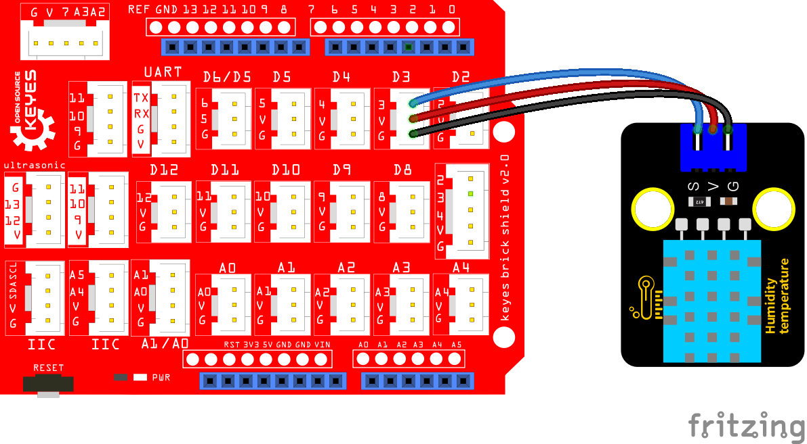

测试代码

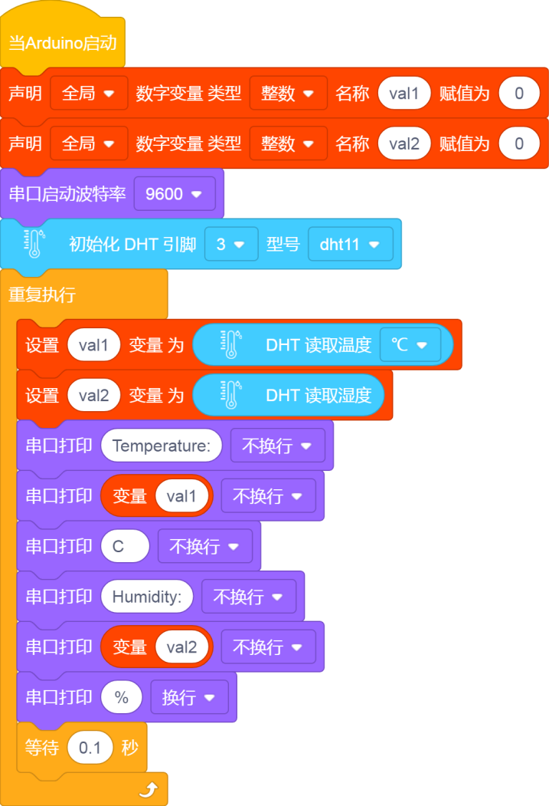

代码说明

1\.
首先添加扩展DHT11模块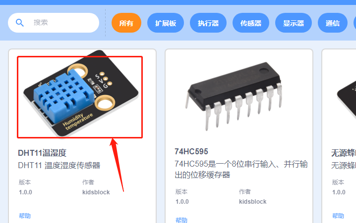。

2\.
我们定义两个变量分别用于存放温度值和湿度值，把管脚设置为3，选择获取温度和获取湿度。

3\.
串口监视器显示val1和val2的值，显示时，我们在数据后面添加单位。如果温度单位直接设置为℃，测试结果会出现乱码，所以我们直接用C代替℃；湿度单位直接设置为%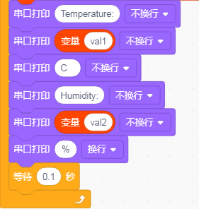。

测试结果

上传测试代码成功，利用USB线上电后，串口监视器显示当前环境中的温湿度数据，如下图。

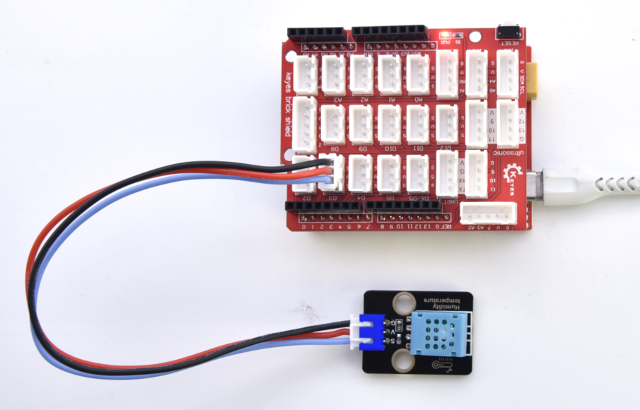

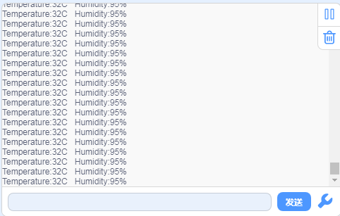

### 实验三十四 DS1307时钟模块

实验说明

这个模块主要用到实时时钟芯片DS1307。是美国DALLAS公司推出的I2C总线接口实时时钟芯片，它可独立于
CPU工作，不受CPU主晶振及其电容的影响，且计时准确，月累积误差一般小于10秒。芯片还具有主电源掉电情况下的时钟保护电路，DS1307的时钟靠后备电池维持工作，拒绝CPU对其读出和写入访问。同时还具有备用电源自动切换控制电路，因而可在主电源掉电和其它一些恶劣环境场合中保证系统时钟的定时准确性。DS1307具有产生秒、分、时、日、月、年等功能，且具有闰年自动调整功能。同时，DS1307芯片内部还集成有一定容量、具有掉电保护特性的静态RAM，可用于保存一些关键数据。

实验中，我们利用DS1307时钟模块获取系统时间，将测试结果在串口监视器上显示出来。

实验原理

DS1307 把8 个寄存器和56 字节的RAM
进行了统一编址，具体地址和寄器数据组织格式如下表：

串行实时时钟记录年、月、日、时、分、秒及星期; AM、PM 分别表示上午和下午;
56 个字节的NVRAM存放数据; 2线串口;
可编程的方波输出;电源故障检测及自动切换电路;电池电流小于500nA。

主要引脚定义如下： X1、32.768kHz 晶振接入端;

VBAT:X2：+3V 电池电压输入;

SDA：串行数据;

SCL：串行时钟;

SQW/OUT：方波/输出驱动器。

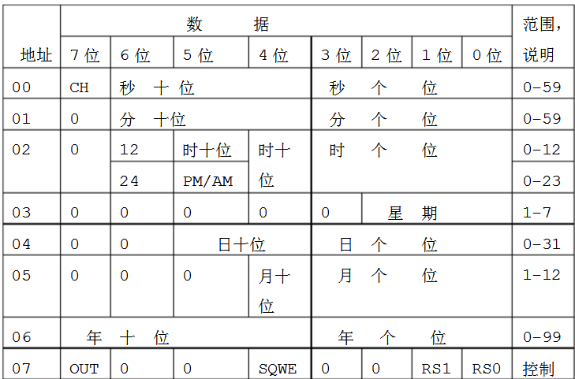

实验器材

|||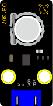|||
|-|-|-|-|-|
|Keyes Uno Plus 开发板*1|传感器扩展板*1|Keyes DIY电子积木DS1307传感器模块*1|4P XH-2.54mm 黑红蓝黄硅胶线*1|USB线*1|

接线图

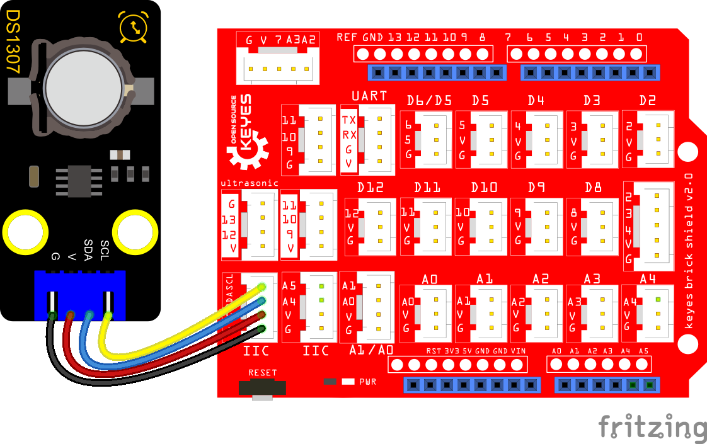

测试代码

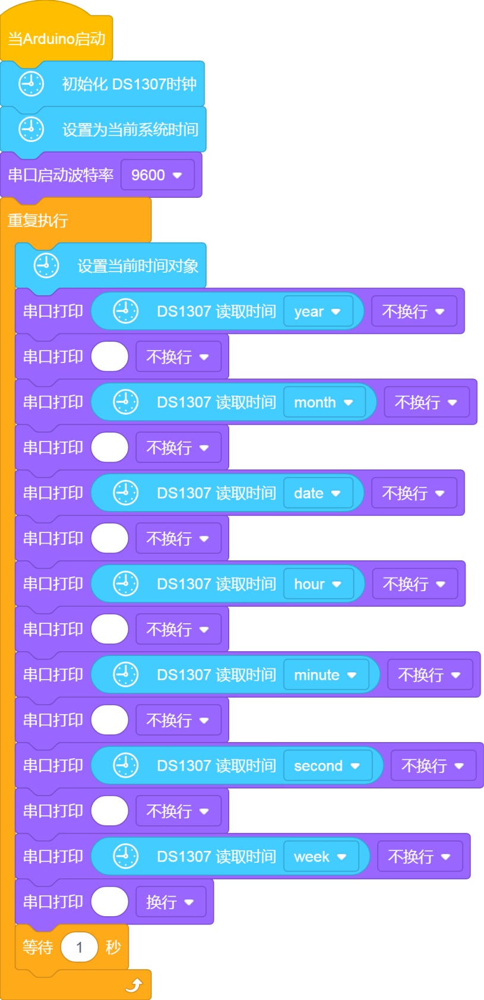

代码说明

1\.
我们首先添加扩展DS1307模块,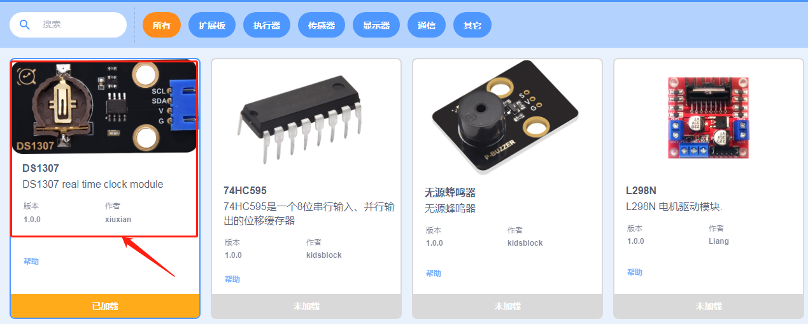，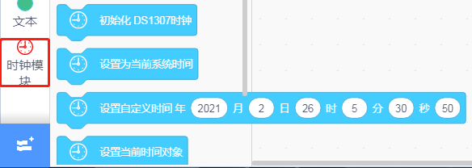如然后代码开始的时候初始化DS1307时钟模块，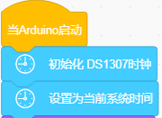设置系统时间即当前时间。同样方式再找到，这个代码块是用于读取系统的时间，有年月日时分秒周，然后我们吧时间显示在串口监视器上。

测试结果

烧录好测试代码，按照接线图连接好线；利用USB接口上电后，我们可在软件串口监视器中看到设置时间日期（年、月、日、时、分、秒、周），如下图。

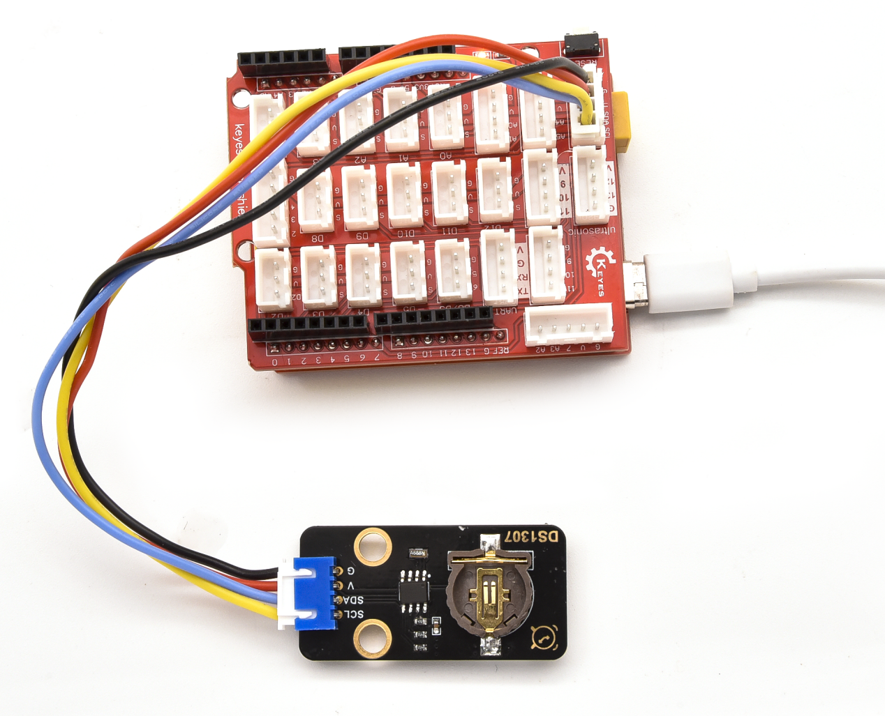

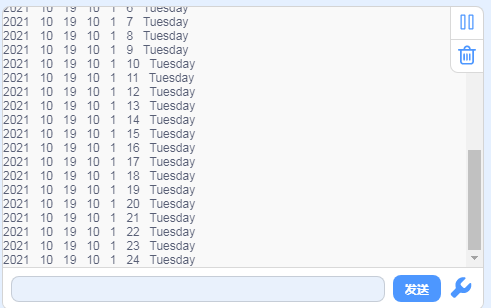

### 实验三十五 TM1650四位数码管模块

实验说明

这个模块主要由一个0.36英寸红色共阳
4位数码管组成，它的驱动芯片是TM1650。使用时，我们只需要2根信号线即可使单片机控制4位8数码管，大大节约了控制板IO口资源。TM1650
是一种带键盘扫描接口的
LED（发光二极管显示器）驱动控制专用电路。内部集成有
MCU输入输出控制数字接口、数据锁存器、LED
驱动、键盘扫描、辉度调节等电路。TM1650
性能稳定、质量可靠、抗干扰能力强，可适用于 24
小时长期连续工作的应用场合。TM1650 采用 2
线串行传输协议通讯（注意该数据传输协议不是标准的I2C协议）。该芯片只需要通过二个引脚与MCU通讯就可以完成数码管的驱动，可以节省MCU引脚资源。

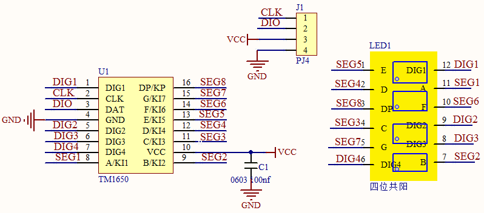实验中，我们使用封装好的库函数直接驱动，当然大家有兴趣也可以去了解底层的库函数是如何实现的。我们利用四位数码管从0到9999累加显示出来，并刷新时间为0.01秒。

实验原理

TM1650采用的是IIC协议。使用SDA、SCL两条总线。

数据命令设置：0x48，这个是告诉TM1650，我们要用点亮数码管的功能，而不是按键扫描的功能

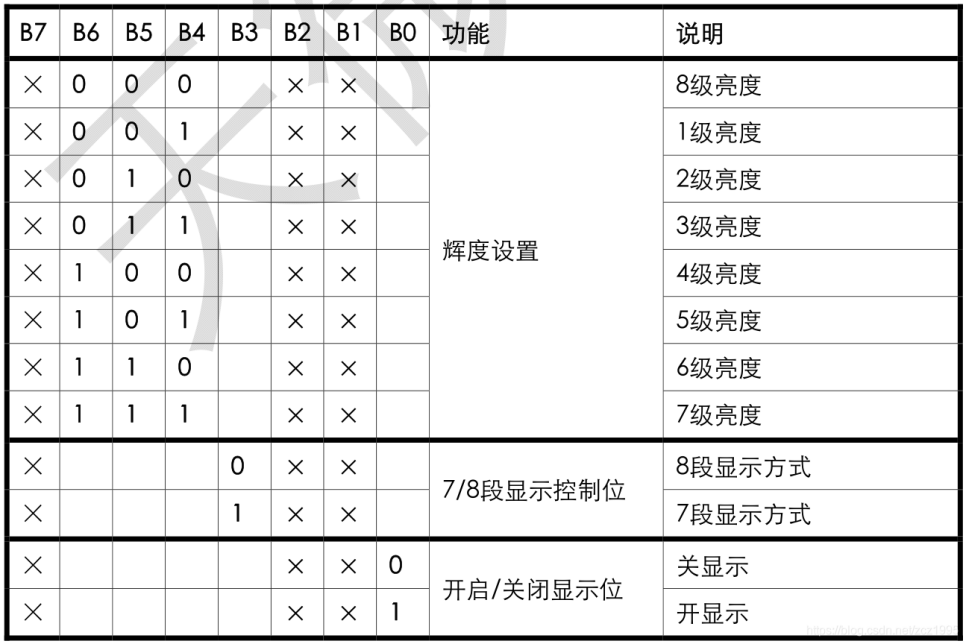显示命令设置：

这里实际是一个字节数据，只是不同位部分代表不同功能。   bit\[6:4\]：设置数码管亮度，注意，000是最亮哦。   bit\[3\]：设置要不要显示小数点   bit\[0\]：是不是要开启数码管的显示

数码管显示

比如说，8级亮度，不显示小数点，那就是0x05

起始信号 — 发送数据0x48 — 判断丛机应答 — 发送 数据0x05 — 判断丛机应答 —
终止信号

这样，数码管就打开显示了。

打开之后，在后面显示数字的时候，就不用重复发送数据0x48了，因为我们已经选好了数码管功能。

亮度和显示方式可以做成枚举，清晰，而且多个数据占一个地方，很节省空间

数码管关闭

起始信号 — 发送数据0x48 — 判断丛机应答 — 发送 数据0x00 — 判断丛机应答 —
终止信号

这样，数码管就关闭显示了。

数码管显示数字

我们要显示数字，首先得告诉TM1650，显示的是哪个数码管的数字，下面的数据就对应好了哪个数码管：

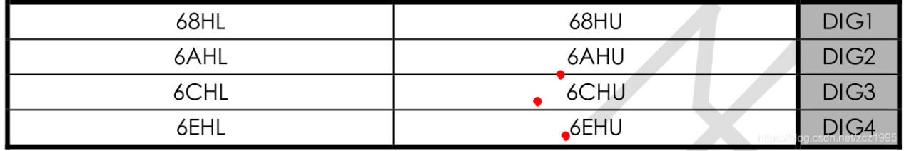

然后我们就可以显示数字了，一个数据8个位，刚好对应8个段，1就是亮，0就是灭。

我的话，因为分不清哪个位对那个段，哈哈哈，所以我是循环按位点亮来理清哪个位对哪个段的。

比如点亮数码1显示8，那就是0x68，假设0x7f是8，因为还有个位是小数点。

那就是：

起始信号 — 发送数据0x68 — 判断丛机应答 — 发送 数据0x7f — 判断丛机应答 —
终止信号

然后，顺利的话，就会在数码管1亮起一个8。

将0~9对应的值，做成一个数组，通过数组下标确定就比较方便了。之后就可以将其完善成一个个小功能，用来显示数字、调节亮度、切换小数点、数码管切换了。

实验器材

|||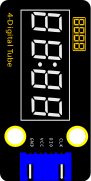|||
|-|-|-|-|-|
|Keyes Uno Plus 开发板*1|传感器扩展板*1|Keyes DIY电子积木 TM1650四位数码管模块*1|4P XH-2.54mm 黑红蓝黄硅胶线*1|USB线*1|

接线图

测试代码

代码说明

1.首先添加扩展四位数码管模块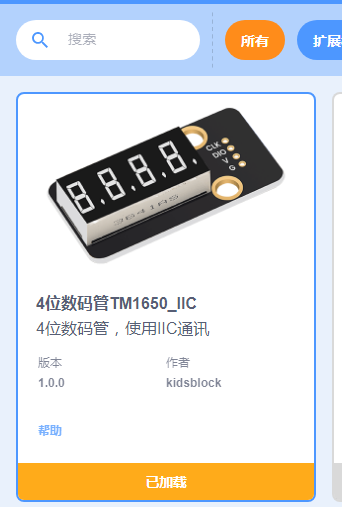我们这里CLK管脚接模拟口SCL（也就是A5)，DIO管脚接模拟口SDA(也就是A4)，使用扩展库时自动默认IIC接口，我们可以不用管它。

2.注意四位数码管的库文件采用的是显示字符串，不可以直接显示数字，所以整个代码设置两个变量，其中

为整型，用于计数，语句作用是将数字转换为字符串用于数码管的显示。

测试结果

烧录好测试代码，按照接线图连接好线,上电后，4位数码管从0开始显示的数字每10毫秒加1，直到大于9999又从0开始。

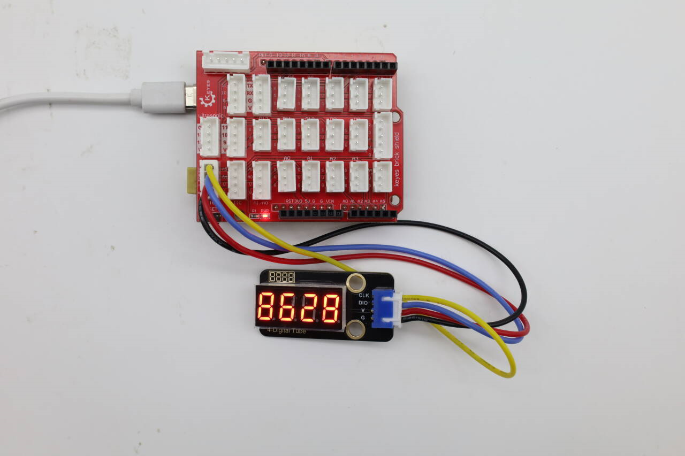

### 实验三十六 HT16K33_8X8点阵模块

实验说明

什么是点阵？我们用之前的方法一个IO口只能控制一个led，如果需要用更少的IO口控制更多的led怎么办呢，于是就有了点阵。

8X8点阵共由64个发光二极管组成，且每个发光二极管是放置在行线和列线的交叉点上，当对应的某一行置1电平，某一列置0电平，则相应的二极管就亮；如要将第一个点点亮，则1脚接高电平a脚接低电平，则第一个点就亮了。实验中我们用点阵显示一个心形图案。

实验原理

如原理图所示，我们如果想要点亮第一行第一列的那个LED灯，只需要把C1置高电平，R1置电平它就亮了，如果我们想让第一行led全部点亮，那么我们让R1为低电平，C1~C8全部为高电平就可以了，原理非常简单。但是这样的话我们总共需要用到16个IO口，这样就极大的浪费单片机资源。为此，我们特别设计了这个模块，利用HT16K33芯片驱动1个8\*8点阵，只需要利用单片机的I2C通信端口控制点阵，大大的节约了单片机资源。

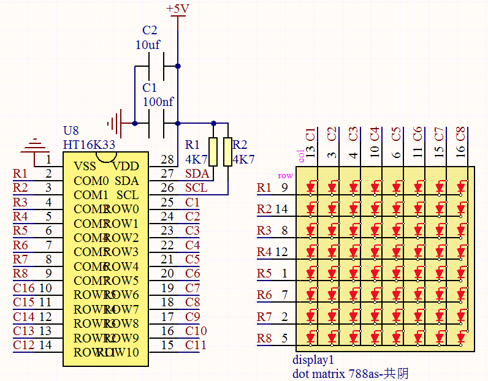有些模块上自带3个拨码开关，可以让你随意拨动开关，这是用来设置I2C通信地址的。设置方法如下表格。我们的这个模块中，模块已经固定了通信地址，A0，A1，A2全部接地，即地址为0x70.

实验器材

|||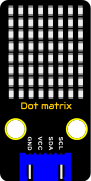|||
|-|-|-|-|-|
|Keyes Uno Plus 开发板*1|传感器扩展板*1|Keyes DIY电子积木 HT16K33_8X8点阵模块*1|4P XH-2.54mm 黑红蓝黄硅胶线*1|USB线*1|

接线图

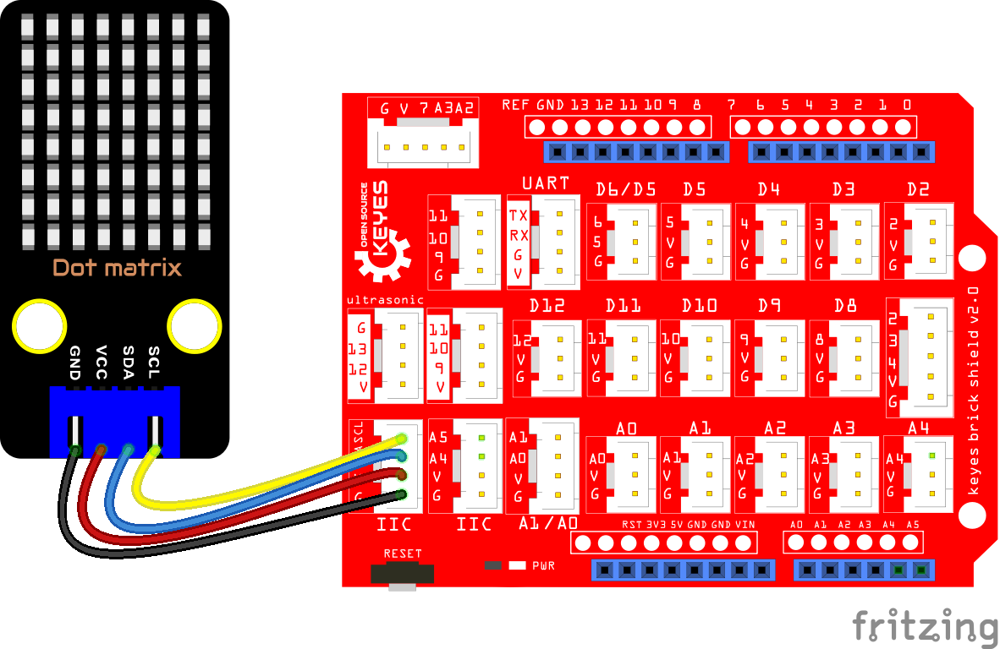

测试代码

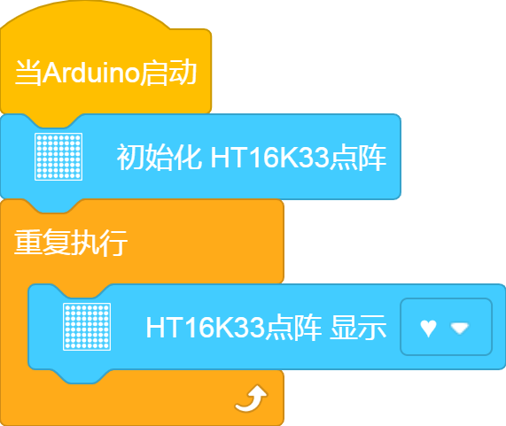

代码说明

1.  首先添加扩展HT16K33点阵模块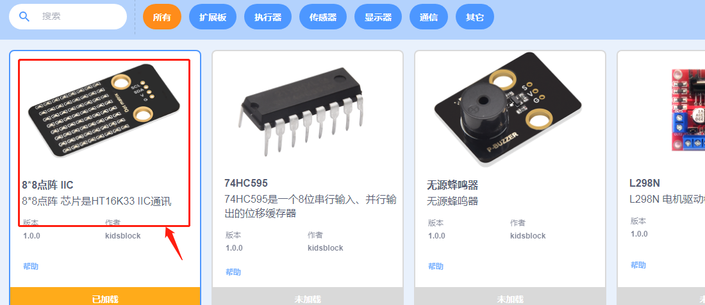。我们说了IIC通讯地址固定了为0X70（112），所以地址不用改，，IIC接口引脚也不用改，所以默认就行、

2.  点阵单元下再找到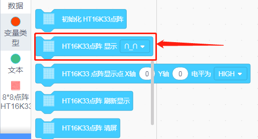，我们用选择心形图案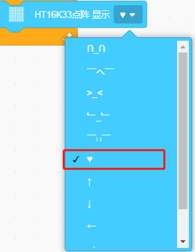。

测试结果

烧录好测试代码，按照接线图连接好线；上电后，点阵显示一个心形图案。

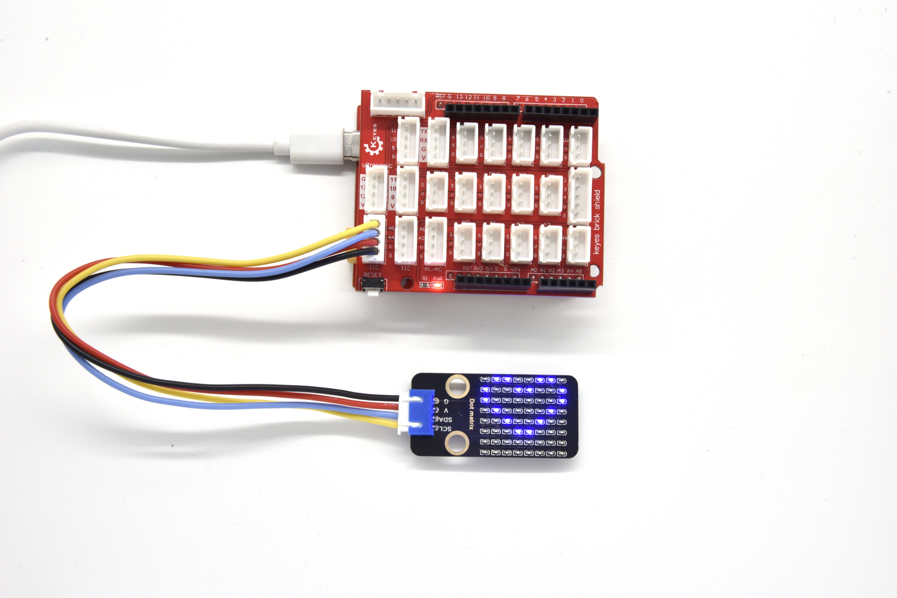

### 实验三十七 RFID刷卡模块

实验说明

这是一个Keyes DIY电子积木
RFID刷卡模块。RFIDRFID-RC522射频模块采用Philips MFRC522原装芯片设计读卡电路，使用方便，成本低廉，适用于设备开发、读卡器开发等高级应用的用户、需要进行射频卡终端设计/生产的用户。本模块可直接装入各种读卡器模具。模块采用电压为5V,通过IIC接口简单的2条线就可以直接与用户任何CPU主板或单片机相连接通信。

实验中我们刷卡模块读取到的数据是4个16进制数，我们把这四个16进制数串为字符串打印出来。例如我们下面读取IC卡的数据为：0x73、0x39、0xa3、0x07，在串口监视器显示出信息字符串就是7339a37；读取钥匙扣的数据为：0x63、0x3d、0x0a、0x54，在串口监视器显示出信息字符串就是633da54。有时候看到的是只有7位是因为前面有个0省略了，如0a它就是a.

实验原理

RFID（Radio Frequency Identification）：无线射频识别，读卡器由频射模块及高平磁场组成。Tag应答器为待感应设备，此设备不包含电池。他只包含微型集成电路芯片及存储数据的介质以及接收和发送信号的天线。读取tag中的数据，首先要放到读卡器的读取范围内。读卡器会产生一个磁场，因为磁能生电由楞次定律，RFID Tag就会供电，从而激活设备。

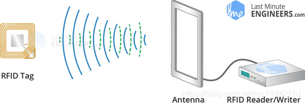

实验器材

|||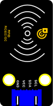||
|-|-|-|-|
|Keyes Uno Plus 开发板*1|传感器扩展板*1|Keyes DIY电子积木 RFID刷卡模块*1|4P XH-2.54mm 黑红蓝黄硅胶线*1|
||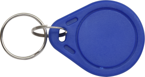|||
|USB线*1|钥匙扣*1|IC卡*1||

接线图

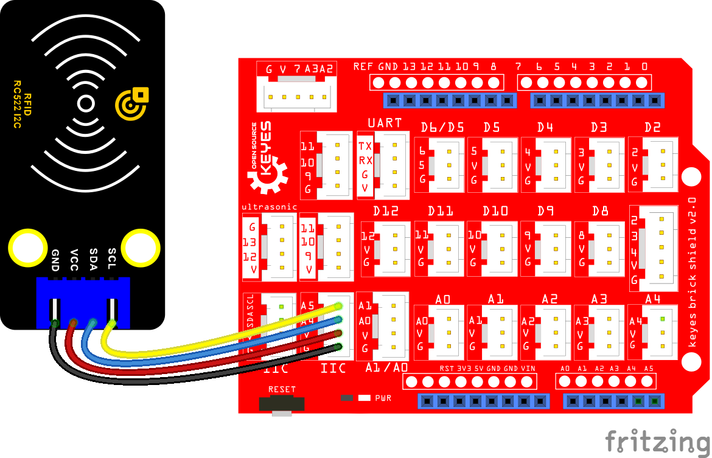

测试代码

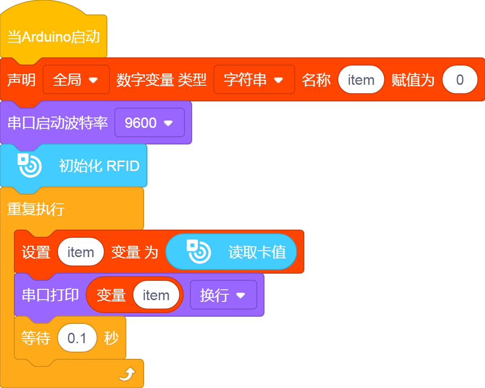

代码说明

1.  首先声明字符串变量str。

2.  初始化RFID模块和启动串口监视器。

3.  读取的数据为字符串，我们赋给前面定义的变量item。

4.  当我们没刷卡的时候，字符串为“0”。

测试结果

烧录好测试代码，按照接线图连接好线；上电后，观察串口监视器。当我们用IC卡和钥匙扣靠近RFID模块时，模块读取到的信息打印出来，如下图。

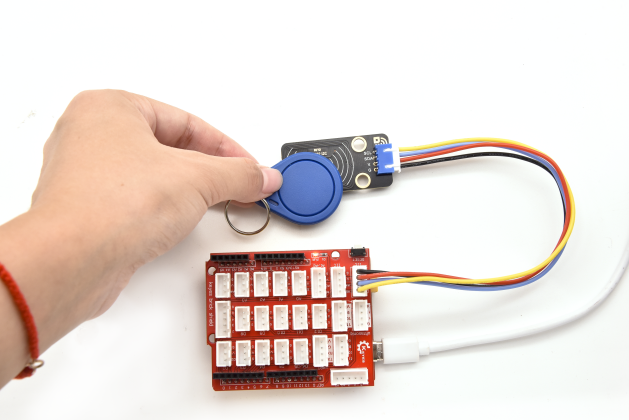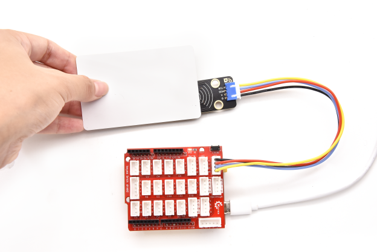

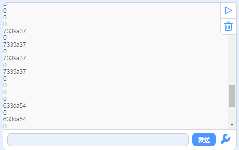

## 传感器/模块组合扩展实验

前面课程中，我们单独测试了传感器/模块的功能，功能比较单一。在此，我们可以将多个传感器/模块搭配使用，组合出各种各样的功能。传感器/模块种类比较多，我们只是选择几款比较经典的组合实验。大家也可以根据自己的想法，自己设置代码，组合出自己想要的特别的功能。

### 实验三十八 呼吸灯

实验说明

在第一课我们就学习了如何点亮LED灯及让LED闪烁。但是LED的玩法远不仅如此，例如有时候我们看到灯光的慢慢变亮或者慢慢变暗，这个就叫呼吸灯。所谓呼吸灯，就是控制LED首先逐渐变亮，然后逐渐变暗，循环交替，如人体呼吸一样。我们前面是直接用高电平点亮LED,用低电平熄灭LED，如果要让LED不那么亮但又不完全熄灭，那怎么办呢?这个也很简单，我们控制流过LED的电流就可以，电流小了，LED自然就暗了，也就是LED两端的电压小了LED就暗了。如何控制电压呢？前面我们已经学习的插件RGB就是利用PWM原理进行调色，所以我们使用PWM口就可以了，我们PLUS板的PWM口与UNO R3板的PWM口是相同的（D3,D5, D6, D9, D10, D11）。

实验器材

|||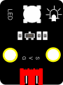|||
|-|-|-|-|-|
|Keyes Uno Plus 开发板*1|传感器扩展板*1|Keyes DIY电子积木 白色LED模块*1|3P XH-2.54mm 黑红蓝硅胶线*1|USB线*1|

接线图

测试代码

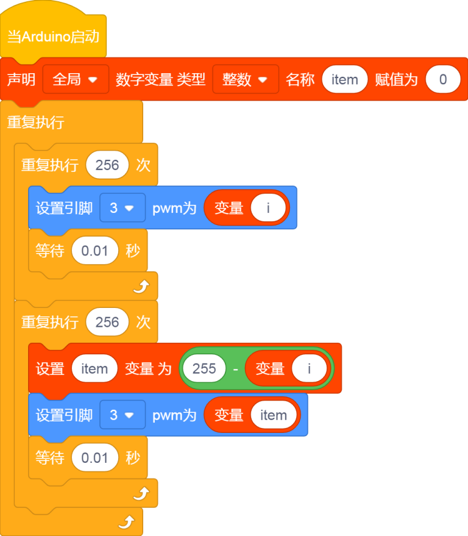

代码说明

1\.
实验中，我们将模块信号端接在D3脚，属于PWM口。设置时我们设置PWM数值越小，模块上LED越暗，数值越大，模块上LED越亮，范围为0-255。

2\.
代表设置一个变量i，前面我们说过了这个变量i不需要我们声明或定义，这个代码块内部自动声明了。i从0直接增加到255，每一次都加1，总共运行了256次。然后把i设置为管脚3输出的PWM值，再设置延时0.01秒，通过设置延时时间，可以让呼吸灯变化得更快或更慢。

3\.
与前面相反，代表设置一个变量item，item=255-i，相当于item从255直接减小到0，每一次都-1。

4\.
通过整合前面知识，我们再来看代码，就清楚多了。循环将D3的PWM值设置为i，i刚开始由0增加到255，每次加1，每加一次延迟0.01秒，模块上LED逐渐变亮。之后item由255减小到0，每次减1，每减一次延迟0.01秒。

测试结果

上传测试代码成功，上电后，模块上LED逐渐变暗。然后又逐渐变亮，循环交替，如人体呼吸一样。

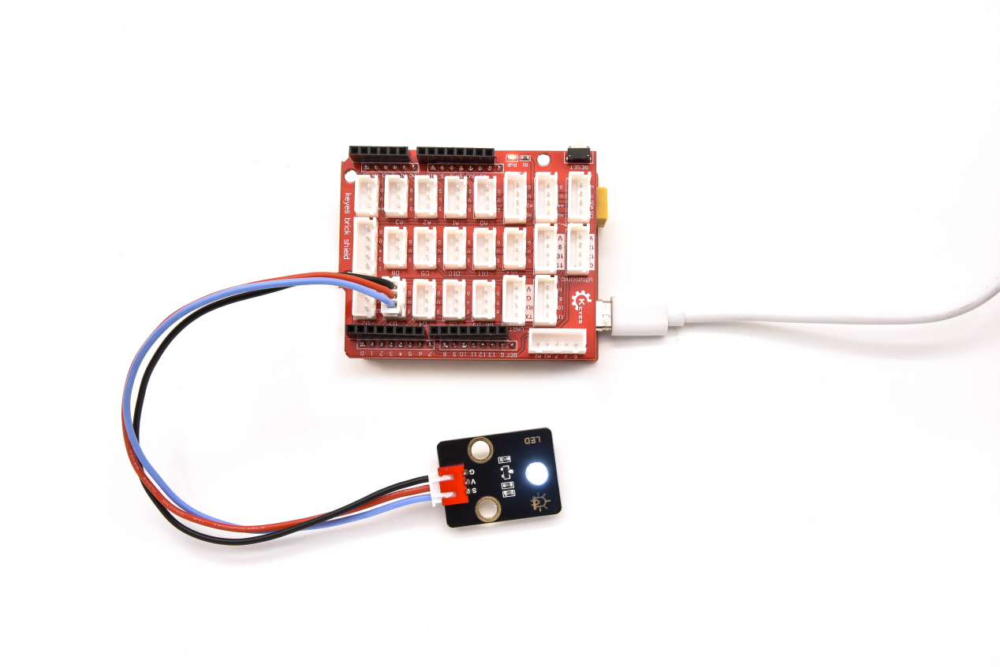

### 实验三十九 按键控制LED灯

实验说明

从前面的实验课程中我们了解到按键模块按下我们的单片机读取到低电平，松开读取到高电平。在这一实验课程中，我们利用按键和LED做一个扩展，当按键按下时即读取到低电平时我们点亮LED，松开按键时即读取到高电平时我们熄灭LED，这样就可以通过一个模块控制另一个模块了。

实验器材

<table >

|||||||
|-|-|-|-|-|-|
|Keyes Uno Plus 开发板*1|传感器扩展板*1|Keyes DIY电子积木 白色LED模块*1|Keyes DIY电子积木 单路按键模块*1|3P XH-2.54mm 黑红蓝硅胶线*2|USB线*1|

接线图

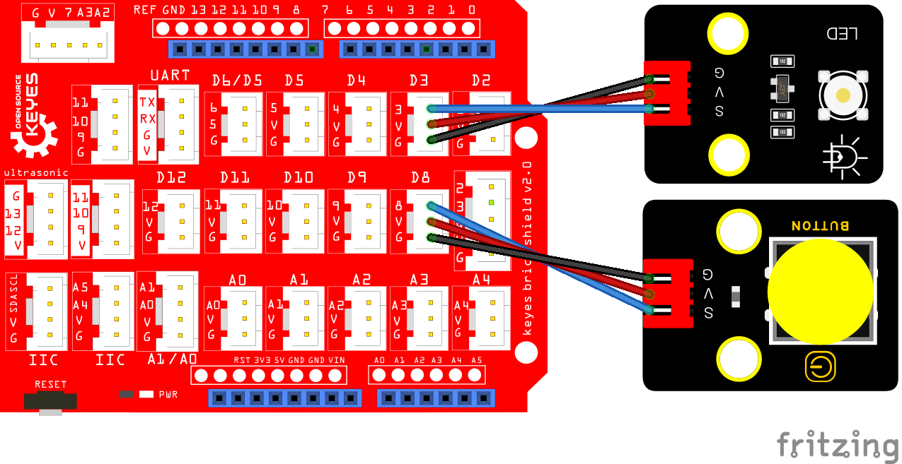

测试代码

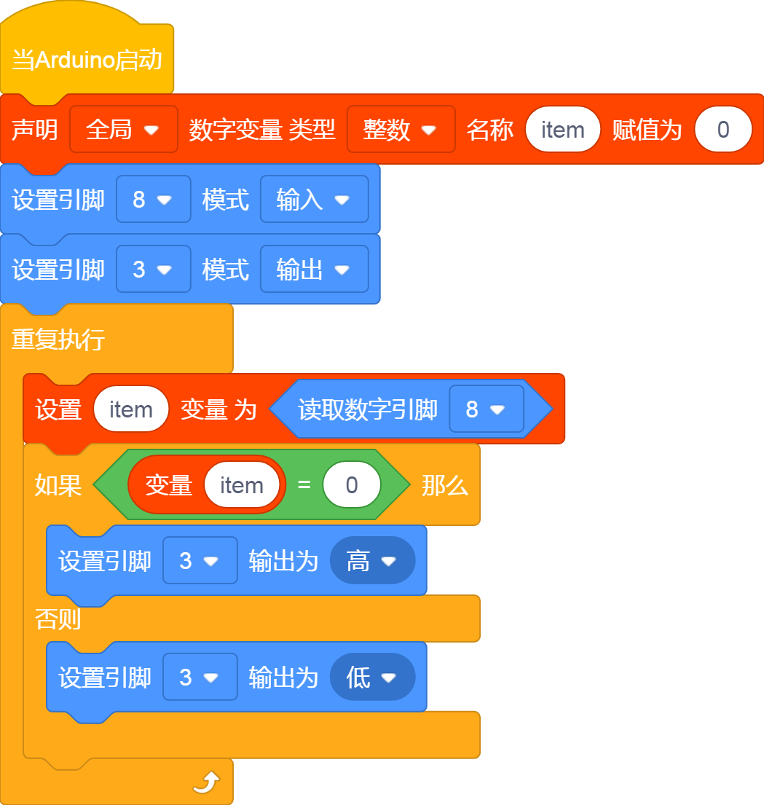

代码说明

我们需要跟前面学习的课程一样，我们需要先设置引脚输入输出模式，由接线图可知，我们LED接D3，按键接D8，前面我们知道，当我们按键按下时输出低电平，也就是单片机读取到数字信号0，我们就可以这样设置，当读取到信号为低电平时即0时，使LED所接管脚输出高电平,点亮LED，否则熄灭LED。

测试结果

上传测试代码成功，按照接线图接好线，利用USB上电后，当我们按下按键，LED被点亮，松开按键，LED熄灭。

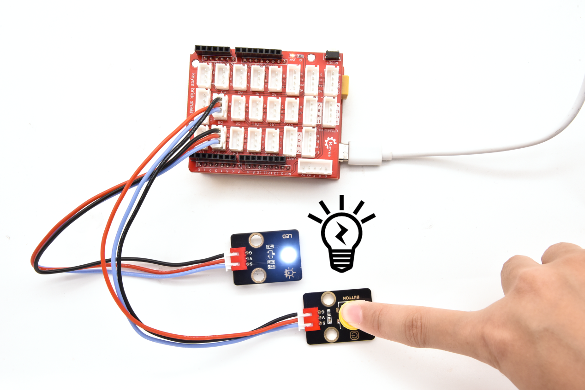

### 实验四十 障碍物报警实验

实验说明

在前面实验课程中中，我们利用一个输入模块控制另一个输出模块。在这一实验中，我们还是用一个模块控制另一个模块，当避障传感器检测到障碍物时有源蜂鸣器响起。

生活中，我们可以利用一个检测传感器控制一个有源蜂鸣器响起或者LED点亮，做声光报警设备，如检测磁场（霍尔传感器）、检测倾斜（倾斜模块）等等。

实验器材

<table >

|||||||
|-|-|-|-|-|-|
|Keyes Uno Plus 开发板*1|传感器扩展板*1|Keyes DIY电子积木 避障传感器*1|Keyes DIY电子积木 有源蜂鸣器模块*1|3P XH-2.54mm 黑红蓝硅胶线*2|USB线*1|

接线图

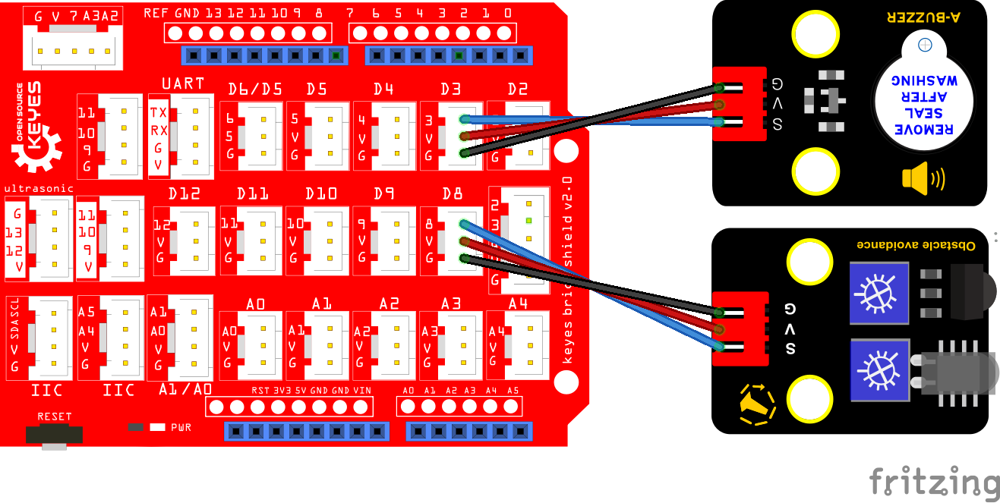

测试代码

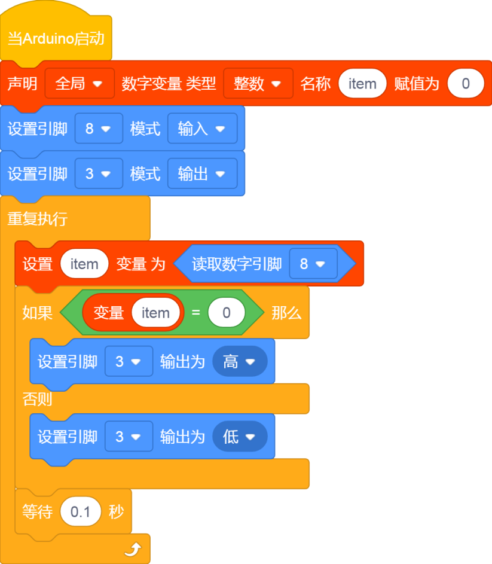

代码说明

实验中代码设置和上一课中实验类似，只是将按键控制LED换成了避障传感器控制有源蜂鸣器。

测试结果

上传测试代码成功，按照接线图接好线，上电后，检测到障碍物时，外接的有源蜂鸣器响起声音，否则有源蜂鸣器不响。

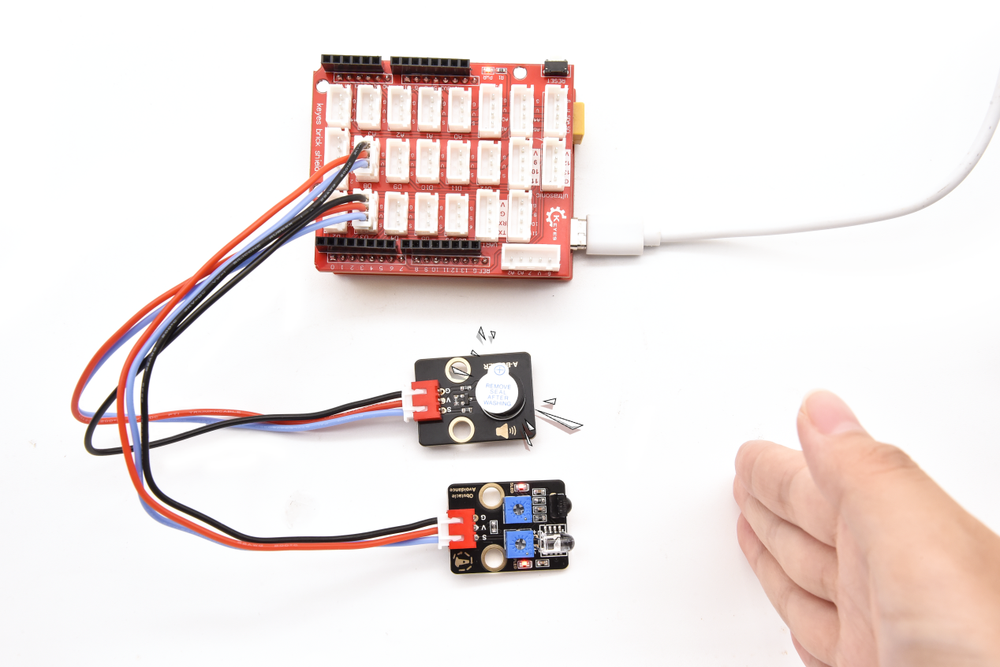

### 实验四十一 紫外线报警

实验说明

想一想，我们出门在外难免有紫外线伤害，有些智能穿戴设备上就有紫外线提示，我们也可以利用我们学习到的模块做一个紫外线报警设备。在前面实验中，我们利用避障传感器检测前方障碍物控制一个有源蜂鸣器响起。那么我们这个实验就使用一个紫外线传感器来控制有缘蜂鸣器，达到紫外线报警的效果。

实验器材

<table >

|||||||
|-|-|-|-|-|-|
|Keyes Uno Plus 开发板*1|传感器扩展板*1|Keyes DIY电子积木 GUVA-S12SD 3528 太阳光紫外线传感器*1|Keyes DIY电子积木 有源蜂鸣器模块*1|3P XH-2.54mm 黑红蓝硅胶线*2|USB线*1|

接线图

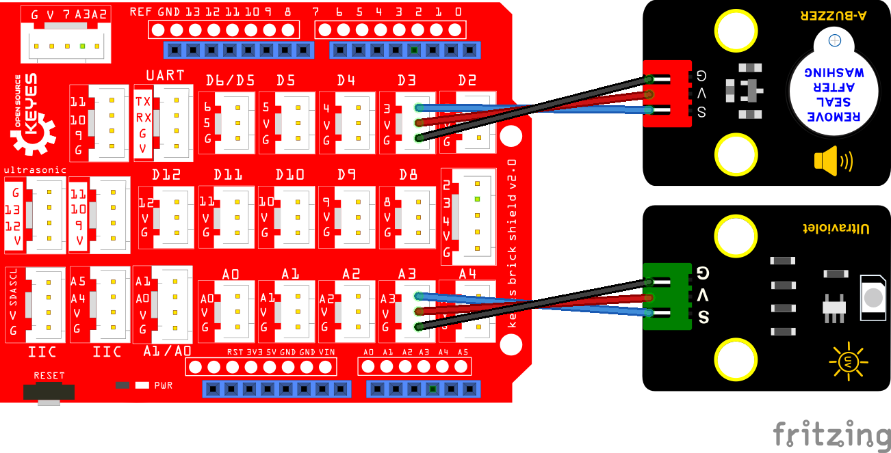

测试代码

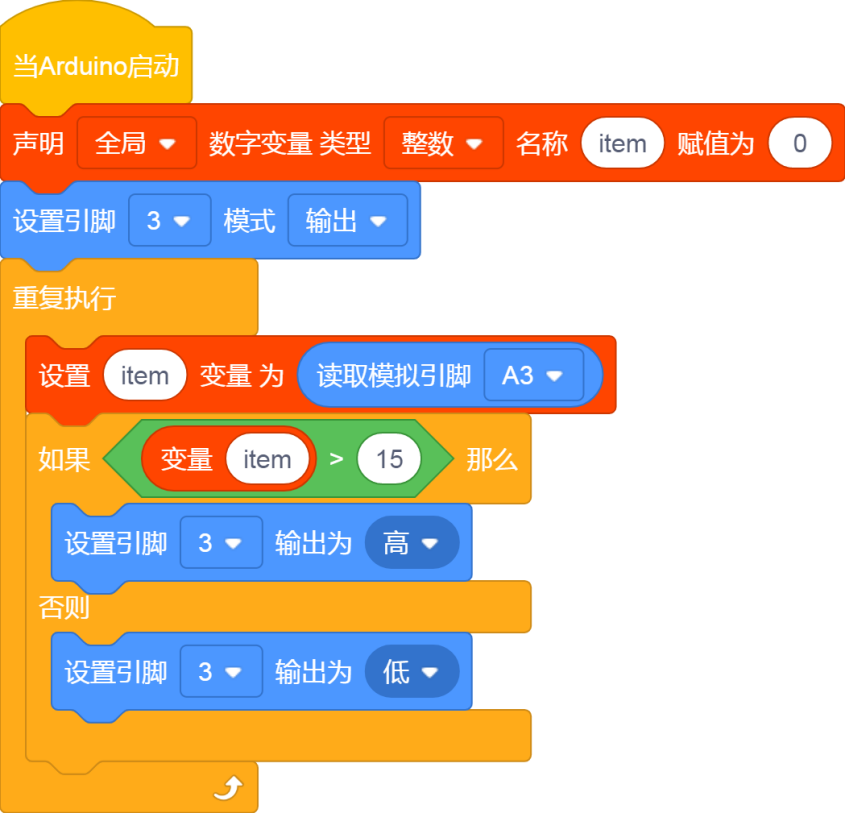

代码说明

实验中代码设置和前面实验四十类似，这次我们输入的模块用成了模拟传感器，通过设置一个阈值，超过阈值报警，这里是与前面不同的地方。

测试结果

上传测试代码成功，按照接线图接好线，上电后，我们用紫外线传感器模块检测紫外线，当紫外线达到我们设置的强度时，有源蜂鸣器响起声音。

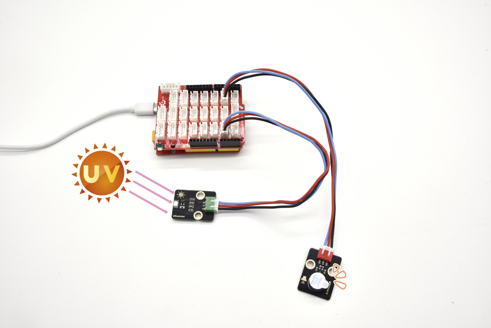

### 实验四十二 人体红外报警

实验说明

在上一课实验中，我们利用紫外线传感器检测紫外线强度进行报警，在这一实验中，我们利用人体红外热释传感器检测结果控制一个有源蜂鸣器响起。

实验器材

<table >

|||||||
|-|-|-|-|-|-|
|Keyes Uno Plus 开发板*1|传感器扩展板*1|Keyes DIY电子积木 人体红外热释传感器*1|Keyes DIY电子积木 有源蜂鸣器模块*1|3P XH-2.54mm 黑红蓝硅胶线*2|USB线*1|

接线图

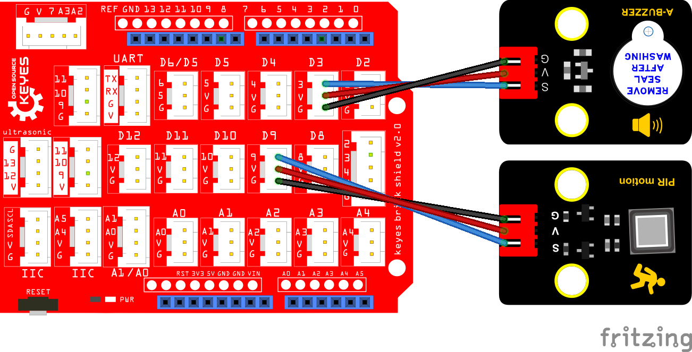

测试代码

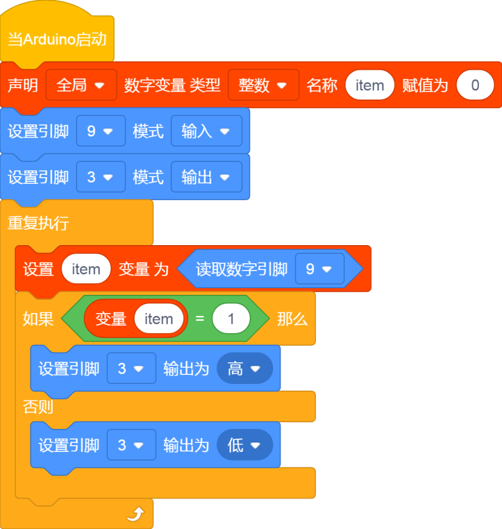

代码说明

实验中代码设置前面实验，这里就不多说了。

测试结果

上传测试代码成功，按照接线图接好线，上电后，传感器检测到附近有人运动时，外接的有源蜂鸣器响起声音，否则有源蜂鸣器停止响起声音。

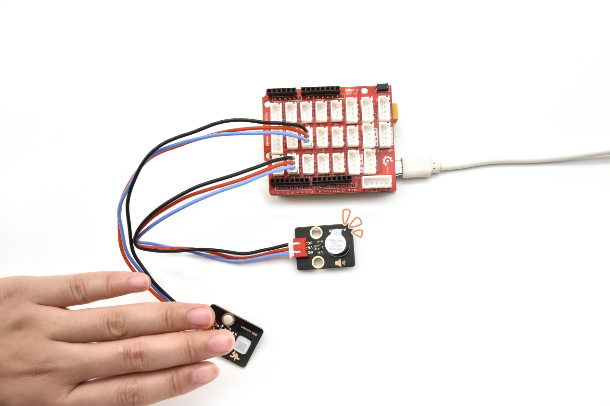

### 实验四十三 音乐播放

实验说明

在前面的单个模块是学校中，我们学习了让8002b功放
喇叭模块发出特定频率的声音、播放的节拍以及调节喇叭的声音大小，其实每首音乐就是由一个个特定的节拍与音调（频率）组合而成的。在这一实验中，我们利用这个喇叭模块播放一首音乐。

要演奏出音乐，我们首先需要搞清楚各音调的频率，具体见下表：

低音：

|音调音符|1|2|3|4|5|6|7|
|-|-|-|-|-|-|-|-|
|A|221|248|278|294|330|371|416|
|B|248|278|294|330|371|416|467|
|C|131|147|165|175|196|221|248|
|D|147|165|175|196|221|248|278|
|E|165|175|196|221|248|278|312|
|F|175|196|221|234|262|294|330|
|G|196|221|234|262|294|330|371|

中音：

|音调音符|1|2|3|4|5|6|7|
|-|-|-|-|-|-|-|-|
|A|441|495|556|589|661|742|833|
|B|495|556|624|661|742|833|935|
|C|262|294|330|350|393|441|495|
|D|294|330|350|393|441|495|556|
|E|330|350|393|441|495|556|624|
|F|350|393|441|495|556|624|661|
|G|393|441|495|556|624|661|742|

高音：

|音调音符|1|2|3|4|5|6|7|
|-|-|-|-|-|-|-|-|
|A|882|990|1112|1178|1322|1484|1665|
|B|990|1112|1178|1322|1484|1665|1869|
|C|525|589|661|700|786|882|990|
|D|589|661|700|786|882|990|1112|
|E|661|700|786|882|990|1112|1248|
|F|700|786|882|935|1049|1178|1322|
|G|786|882|990|1049|1178|1322|1484|

我们知道了音调的频率后，下一步就是控制音符的演奏时间。每个音符都会播放一定的时间，这样才能构成一首优美的曲子，而不是生硬的一个调的把所有的音符一股脑的都播放出来。音符节奏分为一拍、半拍、1/4拍、1/8拍，我们规定一拍音符的时间为1；半拍为0.5；1/4拍为0.25；1/8拍为0.125……，所以我们可以为每个音符赋予这样的拍子播放出来，音乐就成了。

这里我们具体以《生日快乐》为例：

实验器材

||||||
|-|-|-|-|-|
|Keyes Uno Plus 开发板*1|传感器扩展板*1|Keyes DIY电子积木 8002b功放 喇叭模块*1|3P XH-2.54mm 黑红蓝硅胶线*1|USB线*1|

接线图

测试代码

代码说明

找到音乐对应的频率及节拍连接起来接可以了，我们还有个简便的方法，从无源蜂鸣器扩展库下找到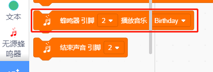，选择管脚3，歌曲可选圣诞歌和生日快乐，例如我们选择生日快乐，库中只提供了6首歌曲，但是我们根据音乐的乐谱，能设置出很多首动听的音乐，所以我们不必拘束于库。

测试结果

上传测试代码成功，按照接线图接好线，功放喇叭模块播放出生日快乐歌曲。

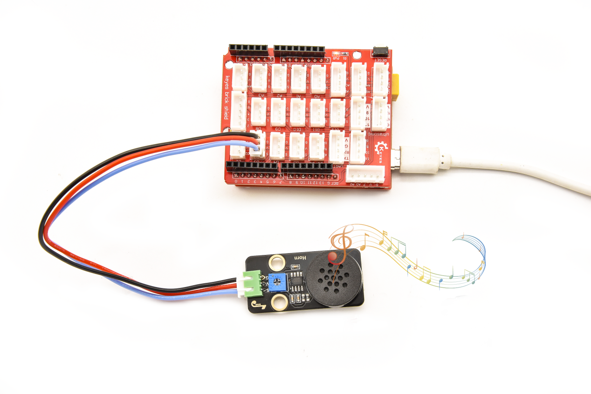

### 实验四十四 旋转编码器模块控制RGB模块

实验说明

在前面课程的实验二十八中，我们利用旋转编码器计数。在这里我们将它扩展一下，通过得出的计数，我们用来控制RGB模块上LED显示不同颜色。

设计代码时，我们需要对所得数据取绝对值。然后我们将数据除以3，得到余数，余数为0控制插件RGB模块上LED亮红光，余数为1，RGB模块上LED亮绿光，余数为2，RGB模块上LED亮蓝光。

实验器材

|||||
|-|-|-|-|
|Keyes Uno Plus 开发板*1|传感器扩展板*1|Keyes DIY电子积木 共阴RGB模块*1|Keyes DIY电子积木 旋转编码器模块*1|
|||||
|4P XH-2.54mm 黑红蓝黄硅胶线*1|5P XH-2.54mm 黑红蓝黄绿硅胶线*1|USB线*1||

接线图

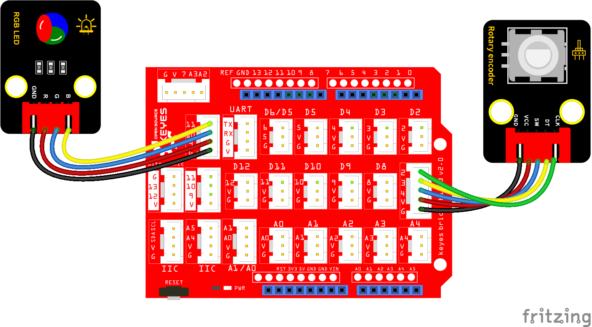

测试代码

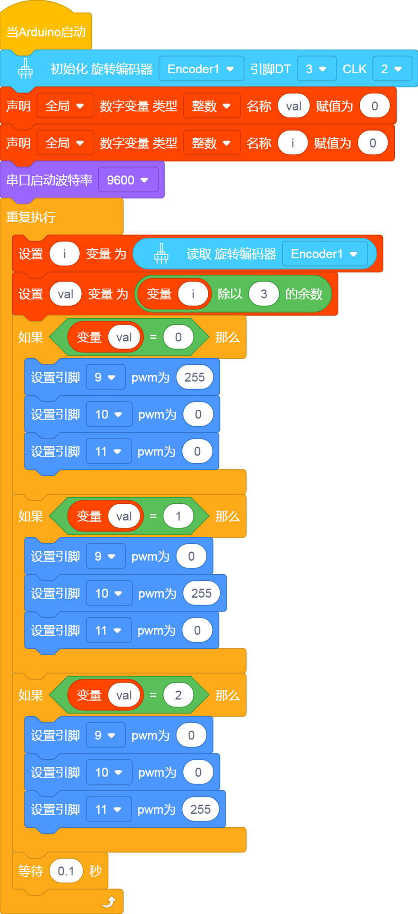

代码说明

1.  在实验中我们我们在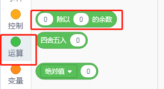找到取余运算，将，即将val设置为i除以3的余数，i为编码器的读数。对3取余数后，余数只有三个，分别为0、1、2，我们根据余数不同让RGB亮不同颜色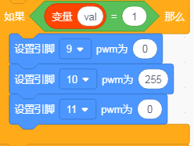根据接线设置管脚为9（红灯）、10（绿灯）和11（蓝灯）。

参考前面实验学习的控制方法，利用余数控制模块上LED显示对应灯光颜色，任何数对3进行取余得到的值都是0或1或2，我们就利用这三个值来判断，并显示对应的颜色。

测试结果

上传测试代码成功，按照接线图接好线，上电后，旋转编码器，即可控制外接的RGB模块上的LED的颜色（红绿蓝）。

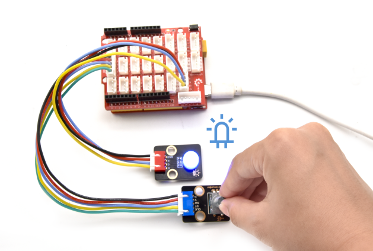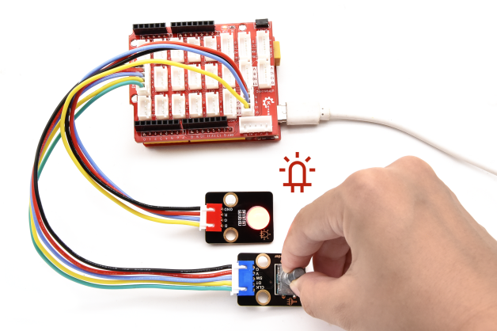

### 实验四十五 电位器调节灯光亮度

实验说明

在前面课程中，我们学习了呼吸灯、按键控制LED灯，我们可不可以把这两个实验现象结合起来呢？答案是肯定的。学习利用可调电位器读取模拟值的方法，我们利用从可调电位器读取到的模拟值控制LED的亮度。设计代码时，模拟值的范围是0-1023；LED的亮度是由PWM值控制，范围为0-255。在这里，我们就需要用到映射功能，将0-1023数值映射到0-255。例如我们读取到模拟值为512，那么通过映射后输出到PWM值就为128。

设置成功后，我们就可以通过旋转电位器，控制模块上LED的亮度。

实验器材

<table >

|||||||
|-|-|-|-|-|-|
|Keyes Uno Plus 开发板*1|传感器扩展板*1|Keyes DIY电子积木 白色LED模块*1|Keyes DIY电子积木 旋转电位器传感器*1|3P XH-2.54mm 黑红蓝硅胶线*2|USB线*1|

接线图

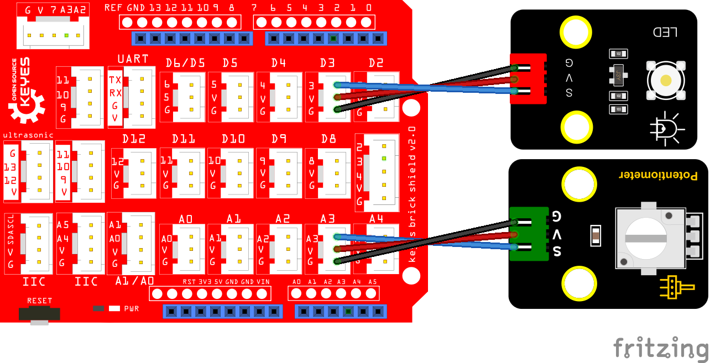

测试代码

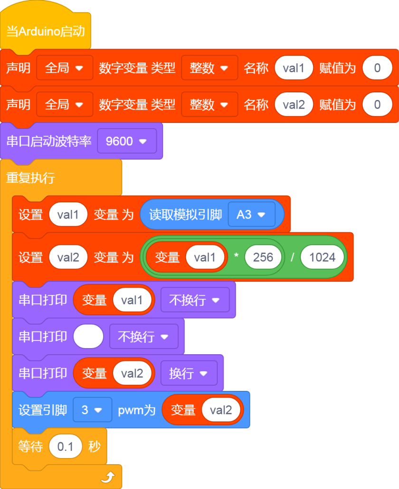

代码说明

在实验中，我们需要定义两个变量val1和val2，val1存放电位器输出到模拟值，val2存放由模拟值val1转换的PWM值。

设置变量，控制设置，以及串口通信，我们都在前面课程中介绍了。实验中，主要新增的知识点就是映射功能

将val1从范围0-1023映射到0-255，并赋值给val2，然后我们分别在串口输出val1与val2的值可有进行直接对比。

测试结果

上传测试代码成功，上电后，旋转模块上电位器，就可以调节LED模块上的LED的亮度，并且在串口监视器上可以看到左边的模拟值对应右边的PWM值。

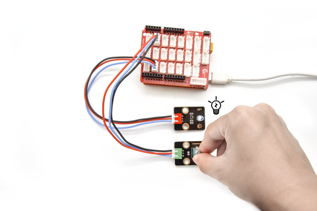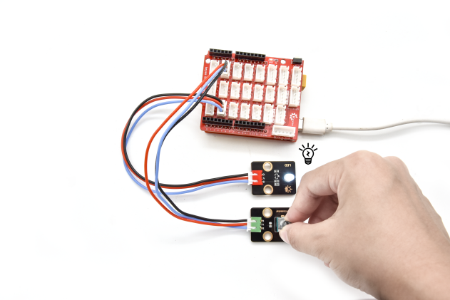

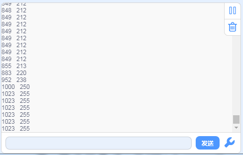

### 实验四十六 智能窗户

实验说明

生活中，我们可以看到各种各样的智能产品，例如智能家居。智能家居里面就有智能窗帘、智能窗户、智能电视、智能灯光啊等等。我们这一实验中要做的就是智能窗帘，原理就是利用水滴水蒸气传感器模块检测雨水，然后通过设置舵机的角度来达到关窗和开窗的效果。

当然这是我们搭模拟的一个场景，主要用于加深我们的印象，达到学以致用的一个效果，在现实中，我们窗户不是使用舵机来关的哦。

实验器材

<table >

|||||||
|-|-|-|-|-|-|
|Keyes Uno Plus 开发板*1|传感器扩展板*1|Keyes DIY电子积木 水滴传感器*1|舵机*1|3P XH-2.54mm 黑红蓝硅胶线*1|USB线*1|

接线图

测试代码

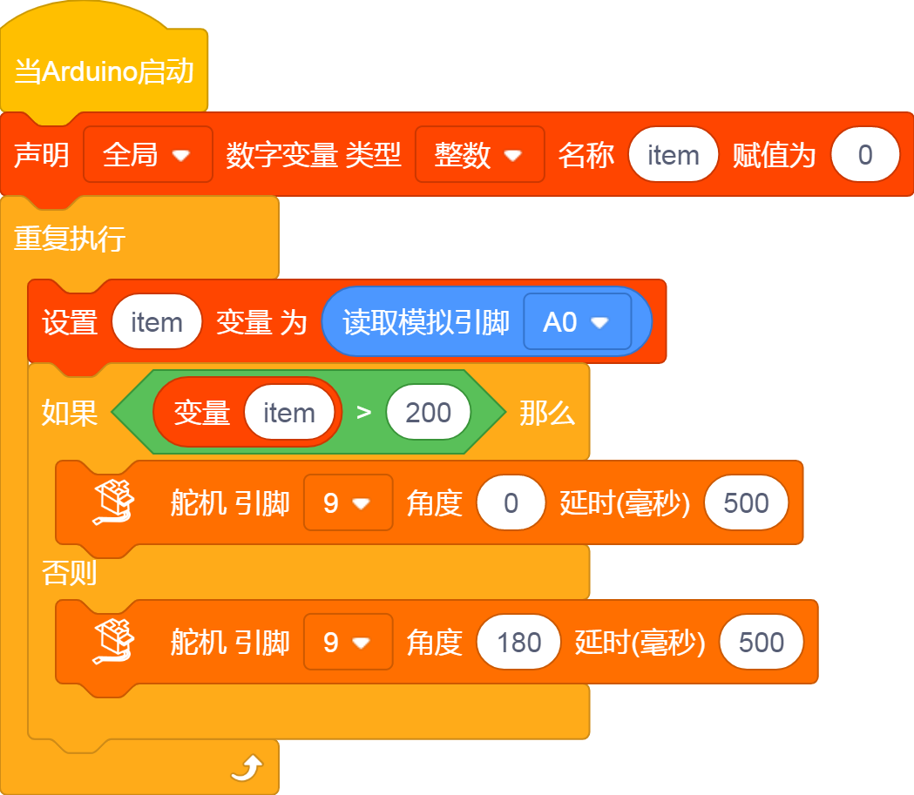

代码说明

实验中代码设置和前面实验类似，通过设置一个阈值，超过这个阈值就将转动舵机。

测试结果

上传测试代码成功，按照接线图接好线，上电后，当水滴传感器检测到一定水量，舵机转动达到关窗的效果，否则舵机转动到另一个角度也就是开窗。

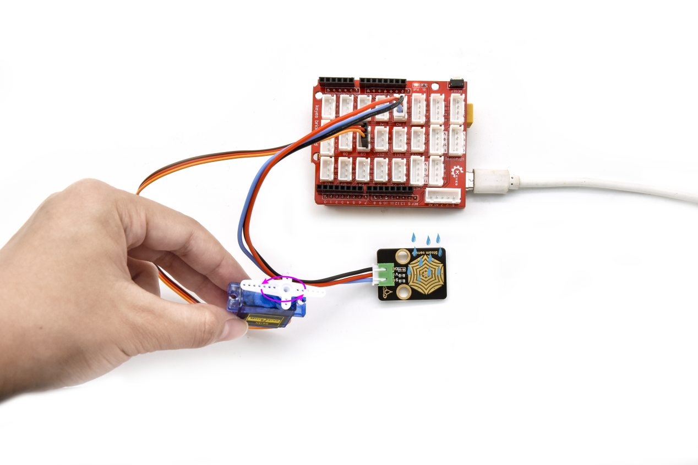

### 实验四十七 声控灯

实验说明

如今智能家居发展迅速，很多人都想自己制作一个可以根据温度和湿度发生变换的智能感光声控灯，在这里我就教大家做一个最简单的智能声控灯。这些灯平时不亮，当我们吼一句或者拍拍手，LED自动亮起；当没有声音时，这些灯就自动关闭。难道是有人在手动控制这些灯光？实际上不是的，实际上这些灯光上都安装有声音探测原价，这些传感器将外界声音的大小，转换成对应数值。然后设置一个临界点，当超过临界点时，控制灯光熄灭，没有超过时，控制灯光亮起。

在这个实验中，我们利用套件中自带的声音电阻传感器和LED模块模拟这一现象。

实验器材

<table >

|||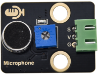||||
|-|-|-|-|-|-|
|Keyes Uno Plus 开发板*1|传感器扩展板*1|Keyes DIY电子积木 声音传感器*1|Keyes DIY电子积木 白色LED模块*1|3P XH-2.54mm 黑红蓝硅胶线*2|USB线*1|

接线图

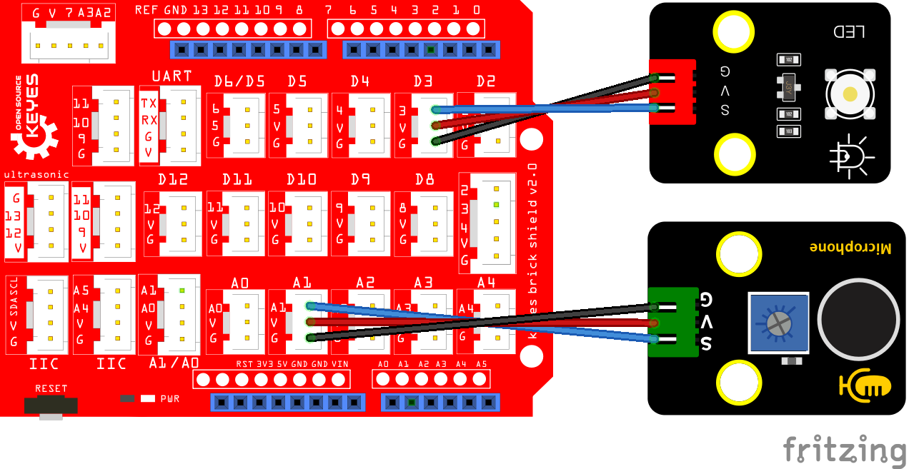

测试代码

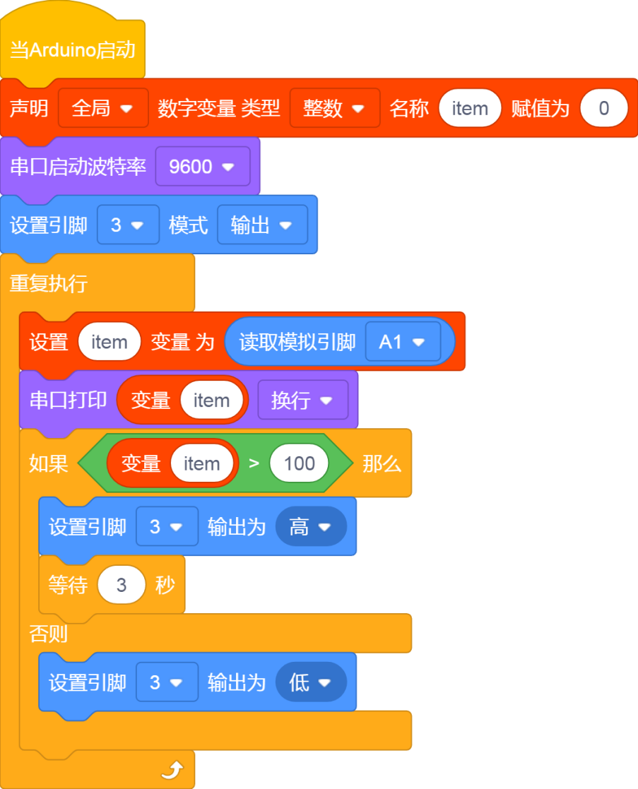

代码说明

设置变量，控制设置，以及串口通信，我们都在前面课程中介绍了。实验中，我们设置了当模拟值高于100时LED亮起，否则熄灭。

测试结果

上传测试代码成功，利用USB线上电后，我们制造声音，数据变大，大于100时，LED模块上LED亮起，否则熄灭。

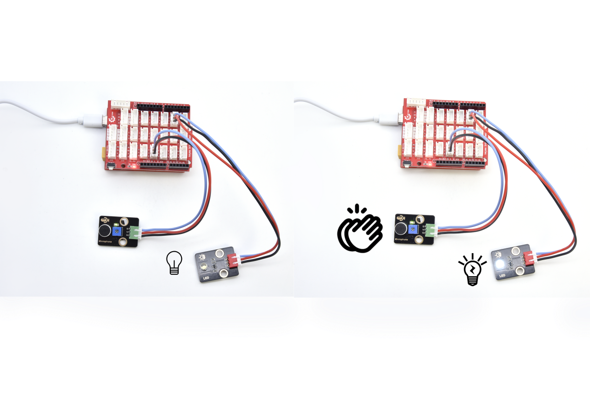

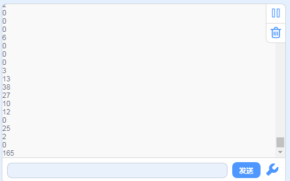

### 实验四十八 火焰报警

实验说明

在前面实验四十一中，我们制作了一个利用紫外线传感器检测紫外线强度来提醒我们的一个场景。在这一实验中，我们制作一个火灾报警系统。同样原理很简单，利用火焰传感器检测结果控制一个有源蜂鸣器响起。

生活中，火灾的危害是相当大的，这个实验虽然简单，但是它是非常具有意义的。

实验器材

|||||
|-|-|-|-|
|Keyes Uno Plus 开发板*1|传感器扩展板*1|Keyes DIY电子积木 火焰传感器*1|Keyes DIY电子积木 有源蜂鸣器模块*1|
|||||
|3P XH-2.54mm 黑红蓝硅胶线*1|4P XH-2.54mm 黑红蓝黄硅胶线*1|USB线*1||

接线图

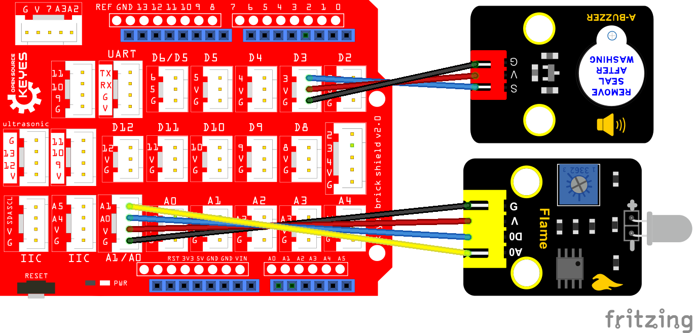

测试代码

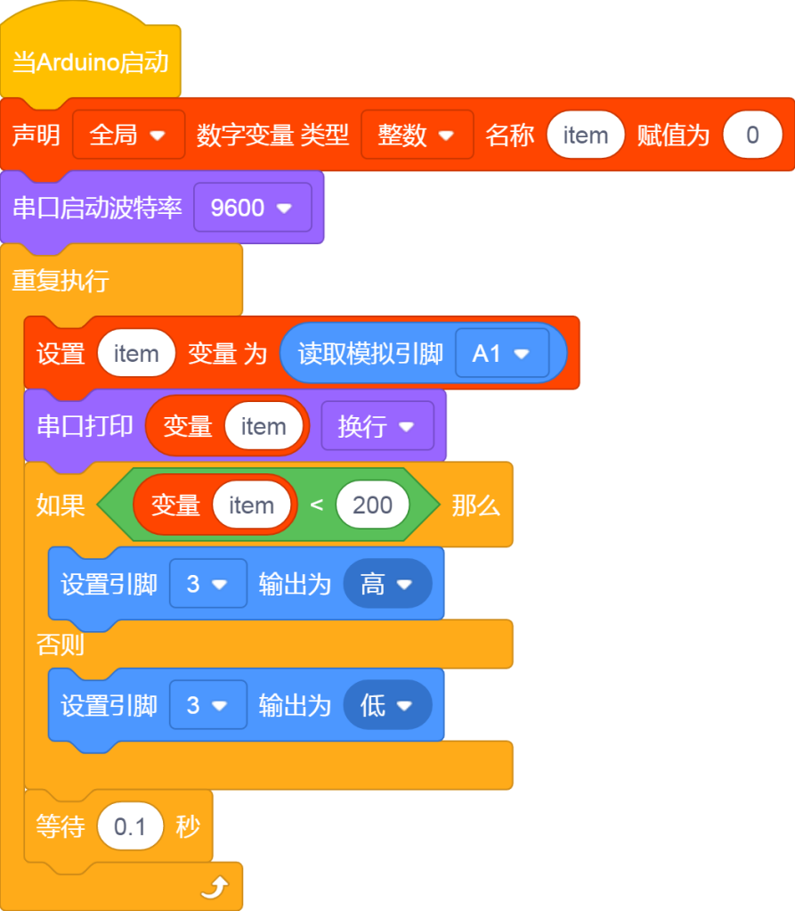

代码说明

实验中代码设置和实验四十七类似，四十七是设置一个模拟值的阈值，达到这个阈值进行点亮或者熄灭LED，在前面单个传感器模块中我们学到，这个火焰传感器有使用到一个模拟管脚和一个数字管脚，当检测到火焰时，数字管脚输出低电平。前面我们使用到模拟口，这个实验我们就使用数字口。

测试结果

上传测试代码成功，按照接线图接好线，上电后，传感器检测到火焰，外接的有源蜂鸣器响起声音，否则有源蜂鸣器不响。

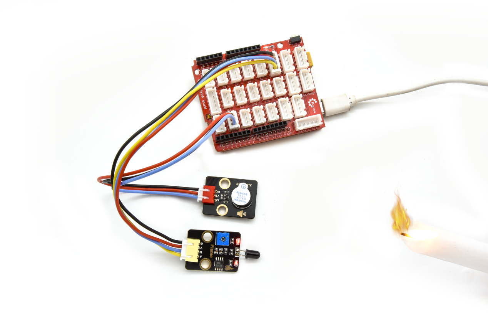

### 实验四十九 烟雾报警器

实验说明

在前面章节中，实验十三，我们学会了利用有源蜂鸣器模块；实验二十四，我们学会了利用MQ-2
烟雾传感器检测可燃气体；实验三十五，我们学会了控制四位数码管，让四位数码管显示我们想让它显示的数字或字符。我们可以将三个实验结合在一起。设置时，我们通过烟雾传感器测试出可燃气体的浓度。然后，我们利用浓度大小控制有源蜂鸣器报警和四位数码管显示浓度来制作一个简单的烟雾报警器。

实验器材

|||||
|-|-|-|-|
|Keyes Uno Plus 开发板*1|传感器扩展板*1|Keyes DIY电子积木 MQ-2模拟气体传感器*1|Keyes DIY电子积木 有源蜂鸣器模块*1|
|||||
|Keyes DIY电子积木 TM1650四位数码管模块*1|3P XH-2.54mm 黑红蓝硅胶线*1|4P XH-2.54mm 黑红蓝黄硅胶线*2|USB线*1|

接线图

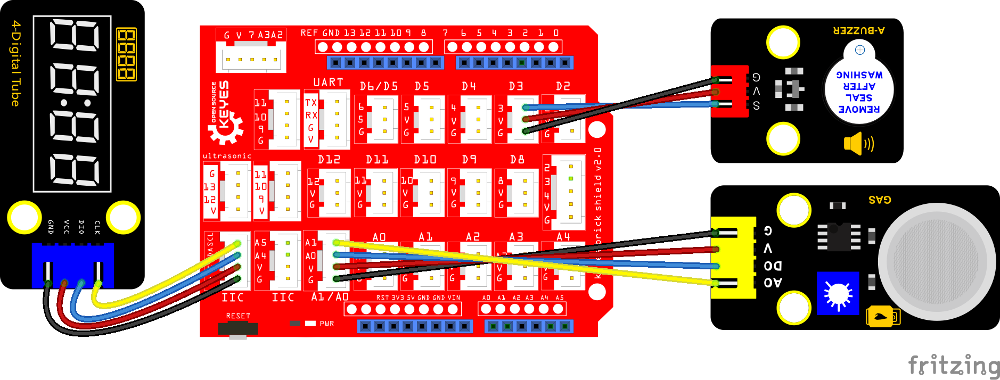

测试代码

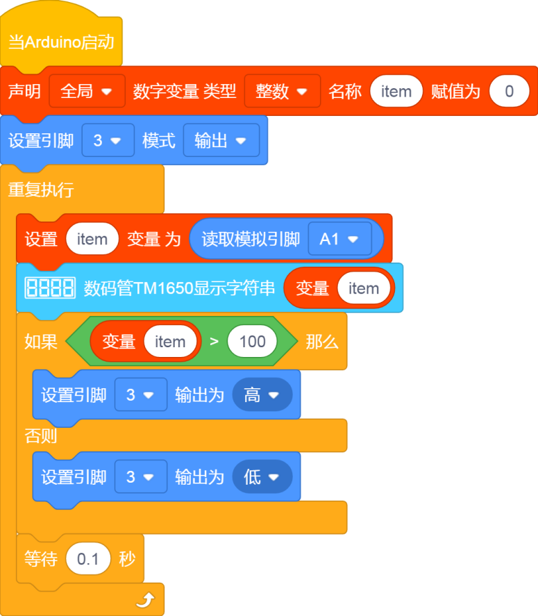

代码说明

定义一个整数变量val，用于存储烟雾传感器的模拟值，然后我们把这个模拟值显示在四位数码管中，再设置一个阈值，达到这个阈值让有缘蜂鸣器响起来。

测试结果

上传测试代码成功，按照接线图接好线，上电后，检测到可燃气体浓度超标时，外接有源蜂鸣器模块上蜂鸣器报警，四位数码管显示浓度值。

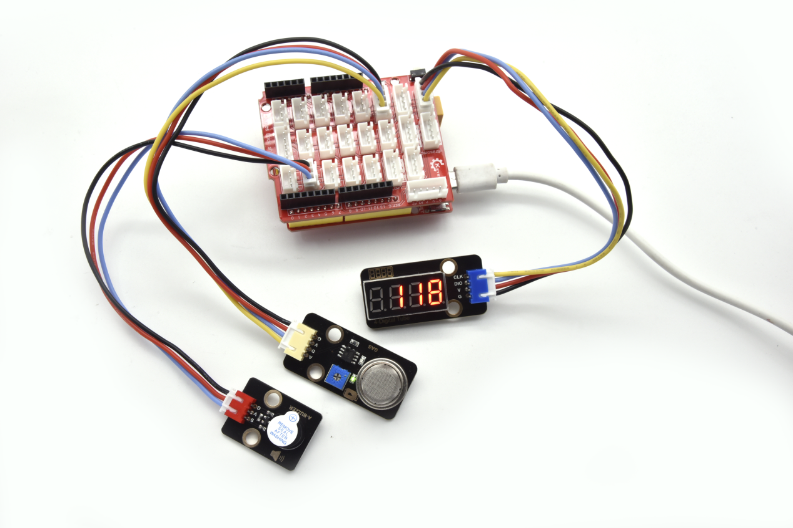

### 实验五十 6812花样彩灯

实验说明

晚上的时候，我们可以看到各种各样的非常漂亮，炫目的灯光。城市的夜景也是是一个个霓虹灯组成，其实这么美丽炫目的灯光，我们也可以用我们的模块来完成。在前面实验二十七，我们学会了使用6812RGB模块，我们知道这个模块只用到一个管脚便可点亮任何一个灯的任何一种颜色；我们这个实验就通过制作一个炫目的灯光来加深对这个灯的印象。（注意，灯光的亮度可能过高，避免用眼睛长时间直视灯珠！以免损害我们的眼睛。）

实验器材

||||||
|-|-|-|-|-|
|Keyes Uno Plus 开发板*1|传感器扩展板*1|Keyes DIY电子积木 6812 RGB模块*1|3P XH-2.54mm 黑红蓝硅胶线*1|USB线*1|

接线图

测试代码

代码说明

1.  实验中，我们定义了4个整数变量，R、G、B分别用于存放0~255的随机值，这个数学代码块用于取随机数，0~255是我们要取的范围，因为RGB的值在0到255直接，num变量用于存放像素灯号，也就是四颗灯珠的位置。初始设置为0，每次加1，当变量num大于3时，我们使num重新为0，因为我们这个模块只有4个灯珠，再把变量放入到对应的位置，也就是让num灯号的灯显示随机的颜色。150ms过后我们再把它熄灭，也就是使RGB三个颜色值都为0，这样就形成了流水灯。

测试结果

上传代码成功后，按照接线图接好线，上电，我们就能看到我们6812RGB模块。四个灯珠以随机颜色显示流水灯。

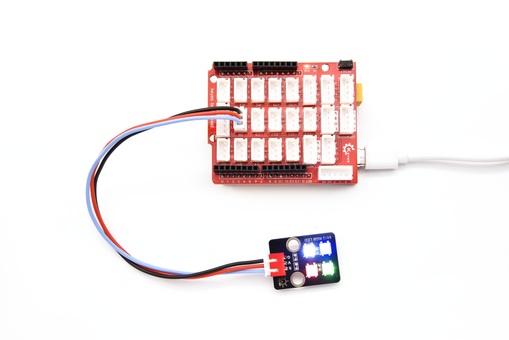

### 实验五十一 超声波雷达

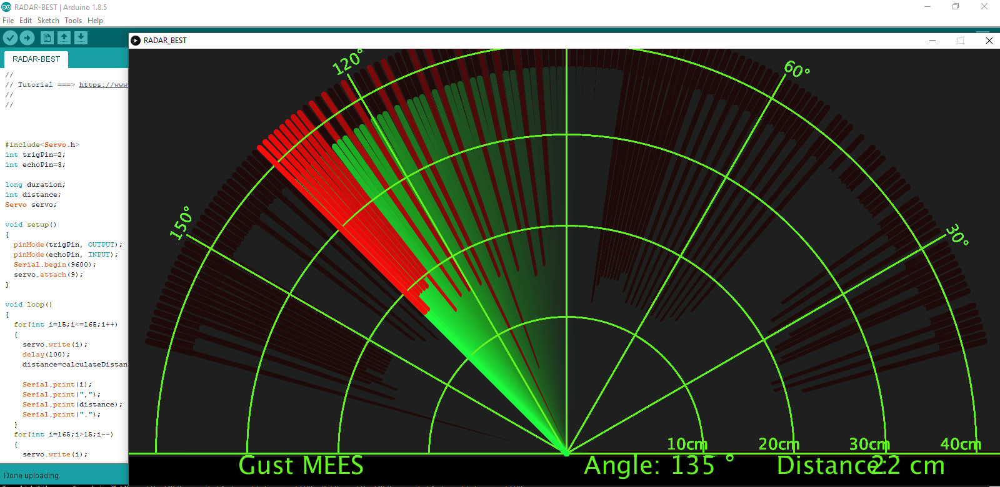

实验说明

我们知道，蝙蝠飞行与获取猎物是通过回声定位的。在现实生活中有种在水里专用的电子设备：声呐，一种声学探测设备，由于
电磁波在水中衰减的速率非常的高，无法做为侦测的讯号来源，因此以声波探测水面下的人造物体成为运用最广泛的手段在水中进行观察和测量，具有得天独厚条件的只有声波。这是由于其他探测手段的作用距离都很短，光在水中的穿透能力很有限，即使在最清澈的海水中，人们也只能看到十几米到几十米内的物体；
电磁波在水中也衰减太快，而且波长越短，损失越大，即使用大功率的低频电磁波，也只能传播几十米。然而，声波在水中传播的衰减就小得多，在[深海声道](https://baike.sogou.com/lemma/ShowInnerLink.htm?lemmaId=73004794&ss_c=ssc.citiao.link)中爆炸一个几公斤的炸弹，在两万公里外还可以收到
信号，低频的声波还可以穿透海底几千米的地层，并且得到地层中的信息。在水中进行测量和观察，至今还没有发现比声波更有效的手段。

在前面实验中，我们学会了控制RGB模块发出彩色光；也学会了利用功放喇叭模块发出不同频率的声音及播放音乐，我们也学会了利用超声波传感器检测前方障碍物的距离，也会用四位数码管来显示检测数据；如果说，我们把这几个模块结合起来呢？我们利用距离大小控制功放喇叭模块模块响起对应频率的声音和RGB亮起对应颜色，然后把这个距离显示在四位数码管上。这就搭建好了一个简易的超声波雷达系统。

实验器材

||||||
|-|-|-|-|-|
|Keyes Uno Plus 开发板*1|传感器扩展板*1|keyes brick HC-SR04超声波传感器*1|Keyes DIY电子积木 8002b功放 喇叭模块*1|Keyes DIY电子积木 共阴RGB模块*1|
||||||
|Keyes DIY电子积木 TM1650四位数码管模块*1|3P XH-2.54mm 黑红蓝硅胶线*1|4P XH-2.54mm 黑红蓝黄硅胶线*3|USB线*1||

接线图

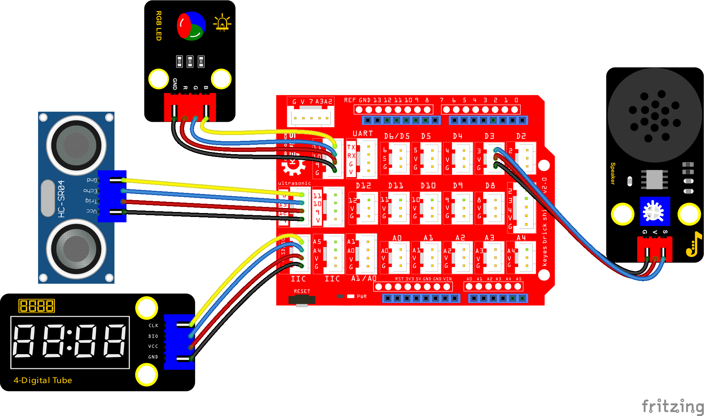

测试代码

代码说明

1.  首先从我们扩展拖出所需要的的传感器库。设置时，我们通过调节不同距离范围，设置声音频率和灯光颜色，具体声音频率我们可以从软件右边的代码区的处看到。

2.  为方便控制障碍物距离，我们可以在上面代码中，根据实际情况，在控制逻辑里调节距离范围。

测试结果

上传测试代码成功，按照接线图接好线，上电后，超声波传感器检测到障碍物不同距离时，外接功放喇叭模块（无源蜂鸣器模块）上蜂鸣器响起不同频率的声音、RGB亮起不同的颜色，并且测得的距离显示在四位数码管上。

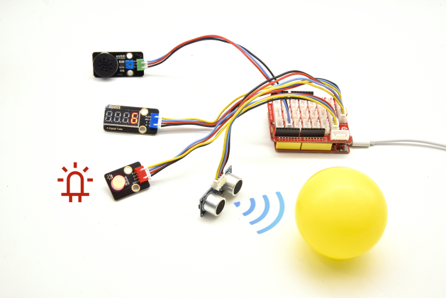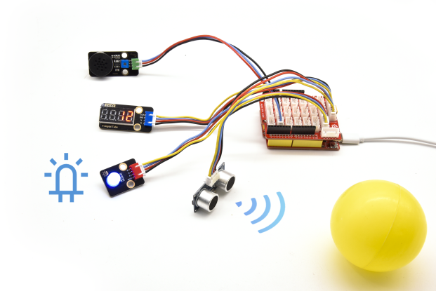

### 实验五十二 红外遥控灯

实验说明

大家生活中不知道有没有这个场景，当我们快要入睡的时候，还没有关灯，然而灯的开关又比较远，当我们起床去关灯，又影响了我们入睡，这个时候大家是不是希望有个遥控器能遥控电视一样来控制灯光，这样就方便多了。在前面实验中，我们学会了点亮或熄灭LED、利用PWM技术调节灯光的亮度；实验三十一，我们学会了使用红外接收模块，并把接收到的遥控器的信息打印了出来。那么在这个实验中，我们就用红外遥控接控制我们的LED模块亮灭和亮度。

当我们接收到一个按键值时，我们通过对应按键值来设置输出的PWM值，这样就可以设置亮度了，控制LED亮灭也一样，但是如果说，在控制LED亮灭这里，我们用同一个按键来控制LED的亮与灭，就需要一个灵活的编程技巧了。我们可以先自己思考，再来看程序。

实验器材

|||||
|-|-|-|-|
|Keyes Uno Plus 开发板*1|传感器扩展板*1|Keyes DIY电子积木 白色LED模块*1|Keyes DIY电子积木 红外接收模块*1|
|||||
|3P XH-2.54mm 黑红蓝硅胶线*2|遥控器*1|USB线*1||

接线图

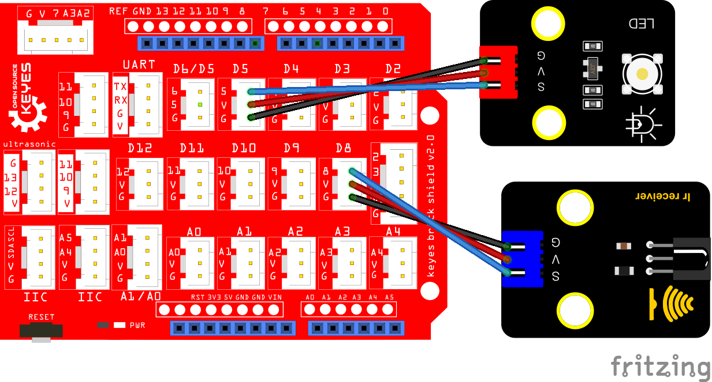

测试代码

代码说明

1\.
与前面定义变量不同，这里我们定义一个布尔变量，布尔变量的值只有两个，1真（true）或者0假（false），。

2\.
我们按下OK键时，红外接收的值为16712445，此时我们需要设置一个布尔变量flag，flag为真的时候点亮LED，为假的时候熄灭LED，点亮LED后我们又把它设置为假，这样当下次按下OK键时，LED将熄灭。

3\. 通过按“1”，“2”，“3”来设置输出PWM值，这个很好理解。

测试结果

上传测试代码成功，按照接线图接好线，上电后，按下遥控器按钮，串口监视器显示我们按下的值，按下ok键点亮LED，再次按下LED熄灭LED，按下按键“1”，LED较暗，按下按下按键“2”，LED中等亮度，按下按键“3”，LED较亮。

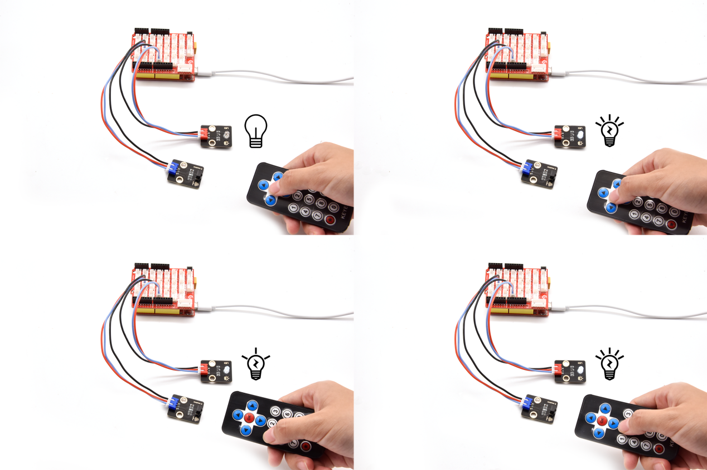

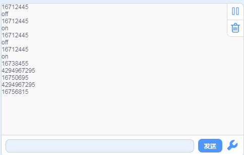

### 实验五十三 温度散热装置

实验说明

生活中，我们的电脑或者电路板芯片等等经常会由于工作时间或者功耗问题而发热严重，所以我们常常需要一个散热装置。

在前面我们学会使用18B20温度传感器和风扇模块，所以我们这节实验可以把它们结合起来做成一个智能散热装置。当检测到环境温度高于某一个值时的时候，电机开启，从而降低环境温度，达到散热效果，再把温度值显示在四位数码管中。

实验器材

|||||
|-|-|-|-|
|Keyes Uno Plus 开发板*1|传感器扩展板*1|Keyes DIY电子积木 DS18B20温度传感器*1|Keyes DIY电子积木 130电机模块*1|
|||||
|Keyes DIY电子积木 TM1650四位数码管模块*1|3P XH-2.54mm 黑红蓝硅胶线*1|4P XH-2.54mm 黑红蓝黄硅胶线*2|USB线*1|

接线图

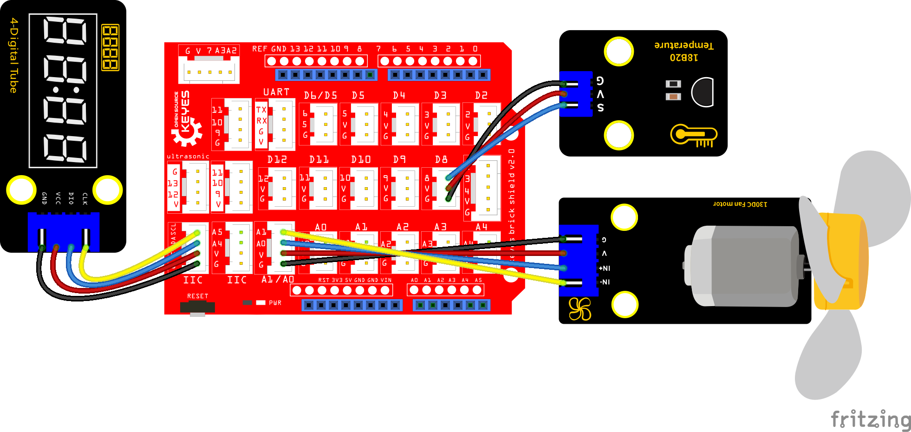

测试代码

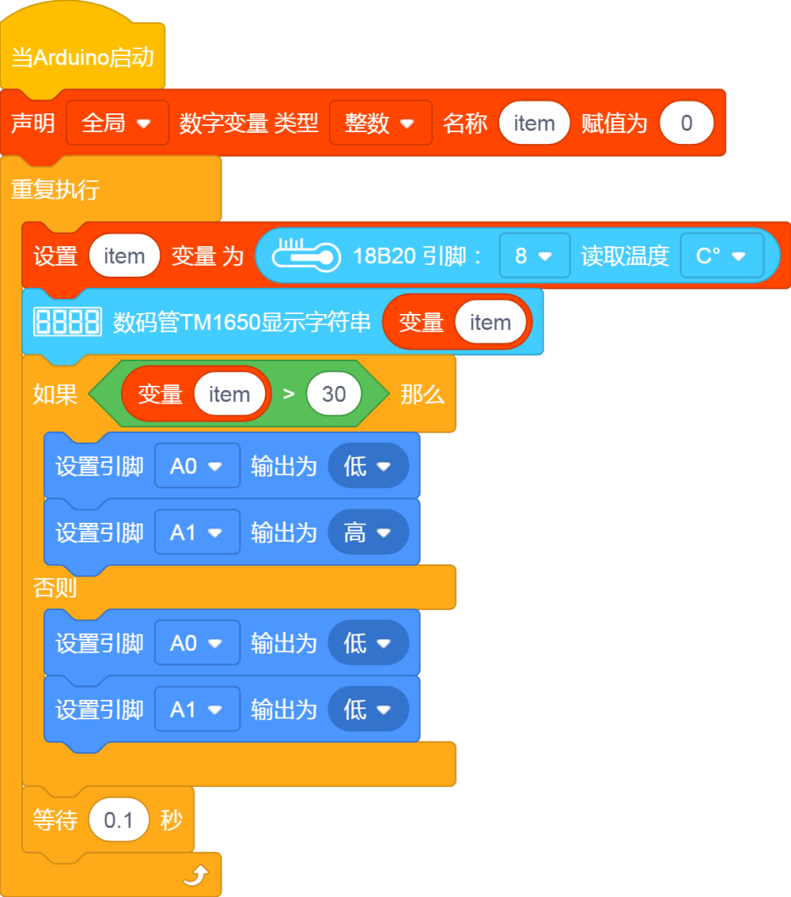

代码说明

变量的设置与存储检测值，与前面我们学习的一样，也是通过设置一个温度的阈值，超过这个阈值进行控制电机转动，然后我们用数码管显示这个温度值。

测试结果

烧录好测试代码，按照接线图连接好线，利用USB线上电后，我们可以在四位数码管中看到当前环境的温度（单位是摄氏度），如下图。当这个值超过我们设定的值时，风扇转动进行散热。

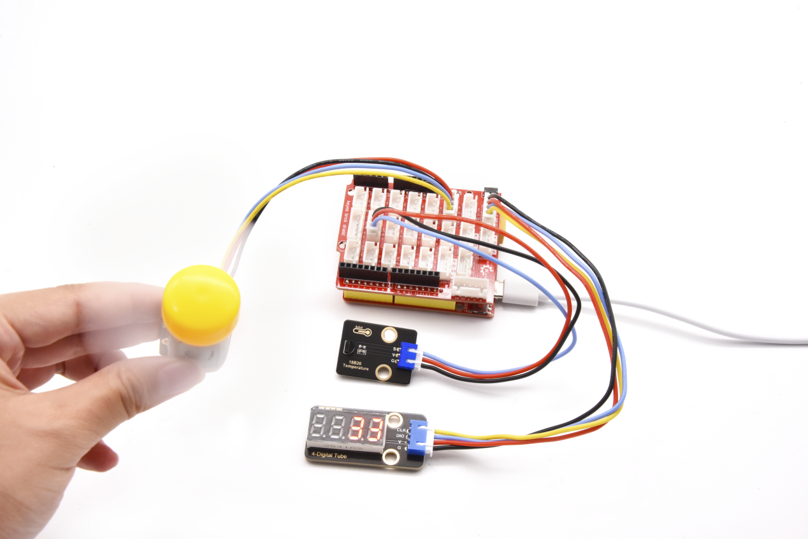

### 实验五十四 智能门禁系统

实验说明

生活中，我们很多门禁系统都是使用射频模块进行开锁了，这样既方便又安全。我们这个套件中就有个射频模块，那就是RFID522刷卡模块，这个实验，我们就利用RFID522刷卡模块和舵机设置一个智能门禁系统。

原理很简单，我们使用RFID522刷卡模块感应，使用IC卡或者钥匙卡来开锁，舵机的作用即门禁锁。

实验器材

|||||
|-|-|-|-|
|Keyes Uno Plus 开发板*1|传感器扩展板*1|Keyes DIY电子积木 RFID刷卡模块*1|舵机*1|
||||
|4P XH-2.54mm 黑红蓝黄硅胶线*1|USB线*1|钥匙扣*1|IC卡*1|

接线图

测试代码

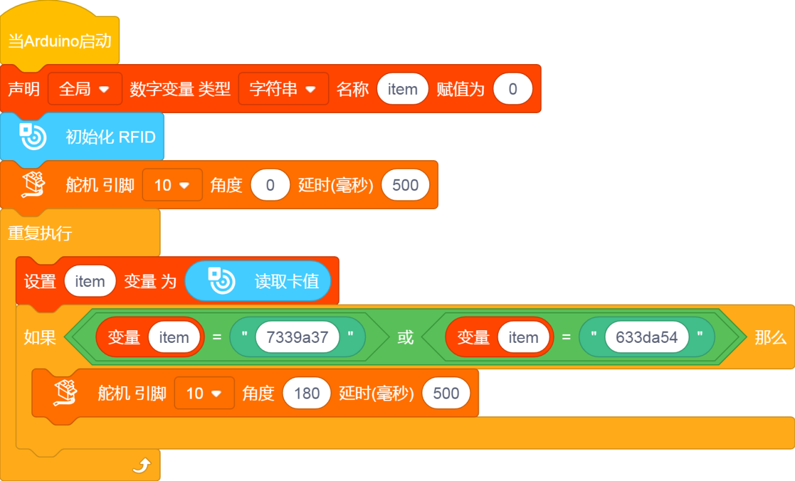

代码说明

前面实验中，我们刷卡模块已经测试出来了IC卡和钥匙扣的信息，我们就利用这个对应的信息来控制舵机转动对应的角度，从而实现开锁门。

测试结果

上传测试代码成功，按照接线图接好线，利用USB上电后，串口监视器显示刷卡信息。当我们使用IC卡或者钥匙卡刷卡时，串口监视器显示出“open the door”，如下图，舵机转动到对应的角度模拟开门。

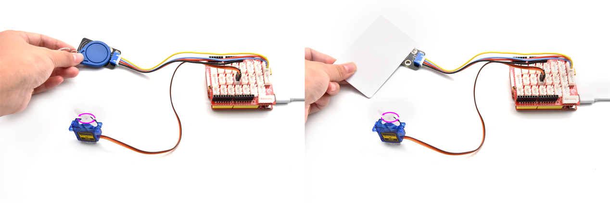

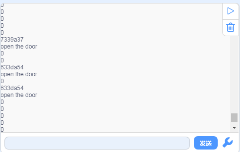

### 实验五十五 综合实验

实验说明

在前面我们做了很多实验，也做了多个传感器模块扩展实验。可能有些同学就会觉得太过简单？不妨，在这一实验中，我们将搭配更多个传感器模块组合在一起。我们已经做过很多个实验，编程方法也有多种，我们这个实验设置时，参考前一章节实验八和本章节实验四十四编程的方法。我们利用外接按键模块，每按一次按键，功能变换一次，实验功能循环交替。其实搭配的实验多种多样，大家可以发挥我们的想象力，做出更多具有意义的实验。

实验器材

||||||
|-|-|-|-|-|
|Keyes Uno Plus 开发板*1|传感器扩展板*1|Keyes DIY电子积木 白色LED模块*1|Keyes DIY电子积木 单路按键模块*1|Keyes DIY电子积木 XHT11温湿度传感器*1|
||||||
|Keyes DIY电子积木 6812 RGB模块*1|Keyes DIY电子积木 红外接收模块*1|Keyes DIY电子积木 摇杆模块*1|keyes brick HC-SR04超声波传感器*1|Keyes DIY电子积木 光敏电阻传感器*1|
||||||
|Keyes DIY电子积木 旋转电位器传感器*1|USB线*1|3P XH-2.54mm 黑红蓝硅胶线*7|4P XH-2.54mm 黑红蓝黄硅胶线*1|5P XH-2.54mm 黑红蓝黄绿硅胶线*1|
||||||
|JMP-1 17键 红外遥控器*1|||||

接线图

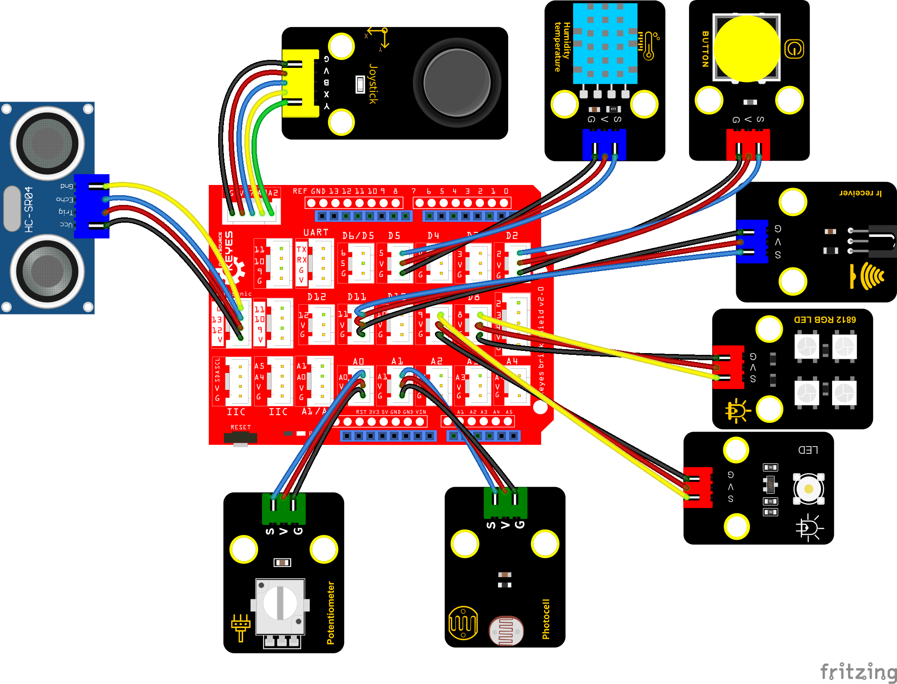

测试代码

代码说明

1.  注意：我们上传代码时，请选择我们前面说过的方法2，从电脑中上传，代码块较多时，需要多上传几次。

2.  设置时，我们参考本章节实验五十方法。计算出按下按键的次数，除以7，得到余数，为0     1 2 3 4 5     6，根据不同的余数，构造7个独一的函数来控制实验实现不同功能，构造函数时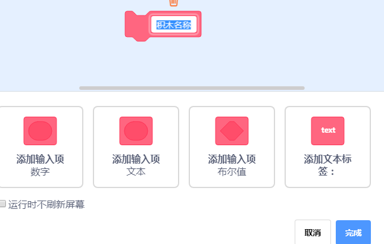输入函数名即可。

3.  参照介绍方法，我们可以在接线中添加或减少传感器/模块，然后在代码中更改实验功能。

测试结果

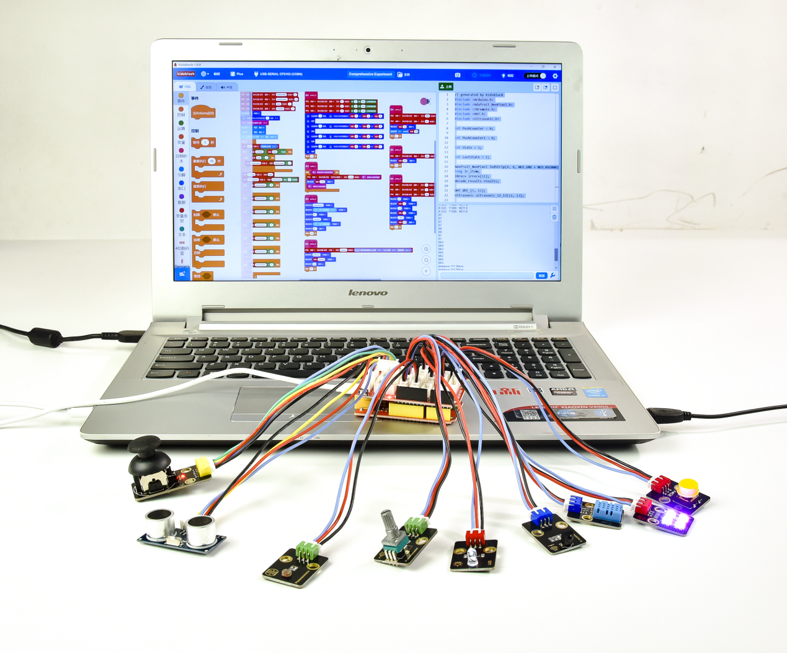

上传测试代码成功，按照接线图接好线，利用USB上电。

刚开始时，按键次数为0，余数为0，6812RGB模块上四个灯珠循环闪烁随机颜色。

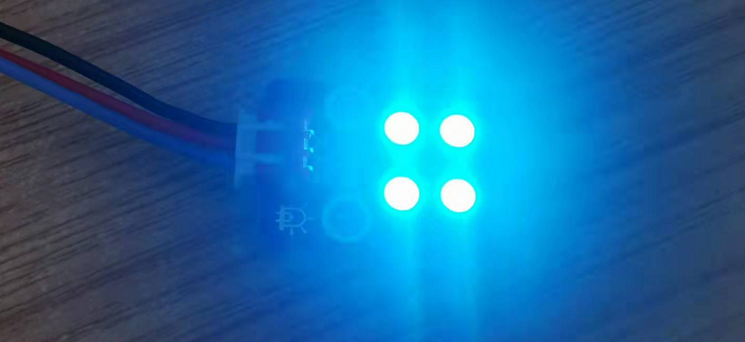观察串口监视器，按一下按键（时间长些），6812灯停止闪烁，按键次数为1，余数为1，实验实现的功能是红外接收模块红外发射信息。如果我们利用红外遥控对准接收模块接收头，按下按键，红外接收头接收到信息，串口监视器显示如下。

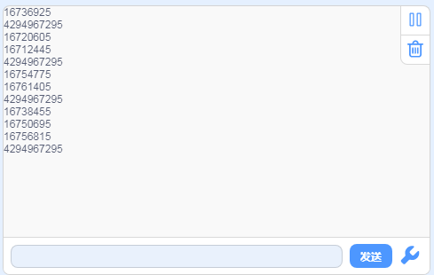

特别注意：如果先按下按键，按键次数变为1，再打开串口监视器时，程序会复位，按键成次数会变为0，需要再按下按键重新设置按键次数。

再按一下按键，按键次数为2，余数为2，实验实现的功能是利用XHT11温湿度传感器读取环境中的温湿度数值，每0.1秒读取一次，串口监视器显示数据如下图。

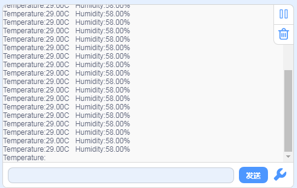

再按一下按键，按键次数为3，余数为3，实验实现的功能是读取摇杆模块传感器X轴和Y轴对应的模拟值，B（Z轴）接口对应的数字值，串口监视器显示如下图。

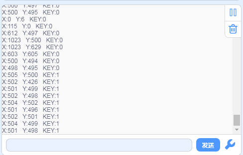

再按一下按键，按键次数为4，余数为4，实验实现的功能是利用外接可调电位器模块调节D5接口的PWM值，从而调节外接的白色LED模块上LED的亮度。串口监视器显示图下图。

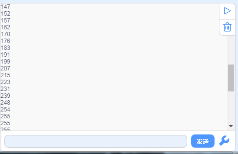

再按一下按键，按键次数为5，余数为5，实验实现的功能是利用外接光敏电阻传感器输出模拟值。串口监视器显示图下图。

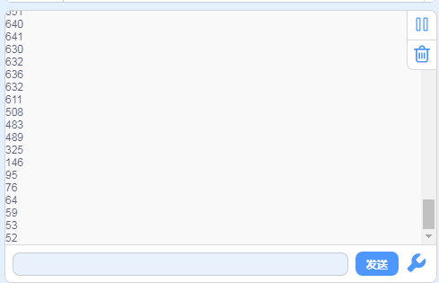

再按一下按键，按键次数为6，余数为6，实验实现的功能是利用超声波模块检测距离并在串口打印出来，串口监视器显示图下图。

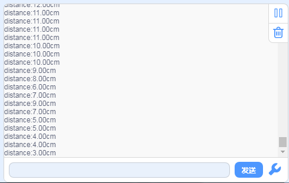

再按一下按键，按键次数为7，余数为0，实现初始时的现象，6812RGB再次闪烁。不断按下按键，余数循环变化，实验功能也循环变化。

